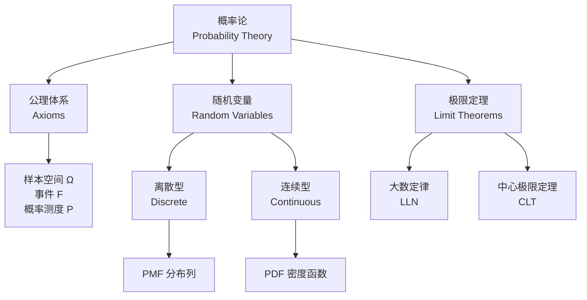

---
aliases: [ProbabilityTheory, 概率论, 概率, Probability]
tags: ['11_ManagementSciences', 'ManagementScienceAndEngineering', 'Mathematics', 'Statistics']
created: 2026-05-17
updated: 2026-05-17
---

# 概率论 (Probability Theory)

## 概述

概率论为管理科学中处理不确定性和风险提供了严密的数学语言与推理工具。从保险精算到金融工程，从供应链风险管理到质量统计控制，概率论是现代管理决策科学不可或缺的基石。



## 基本概念与公理

### 概率空间

概率空间由三元组 $(\Omega, \mathcal{F}, P)$ 定义：

- **样本空间** $\Omega$ (Sample Space)：所有可能结果的集合
- **事件域** $\mathcal{F}$ (Event Space)：$\Omega$ 的子集构成的 $\sigma$-代数
- **概率测度** $P$ (Probability Measure)：满足 Kolmogorov 公理的映射

### Kolmogorov 概率公理

| 公理 | 内容 | 数学表达 |
|------|------|----------|
| 非负性 | 任何事件的概率不小于零 | $P(A) \geq 0$ |
| 规范性 | 全样本空间的概率为 1 | $P(\Omega) = 1$ |
| 可列可加性 | 互斥事件的概率可加 | $P(\bigcup_{i=1}^\infty A_i) = \sum P(A_i)$ |

### 条件概率与独立性

条件概率公式：

$$
P(A|B) = \frac{P(A \cap B)}{P(B)}, \quad P(B) > 0
$$

事件 $A$ 和 $B$ 独立当且仅当：

$$
P(A \cap B) = P(A) \cdot P(B)
$$

## 贝叶斯定理 (Bayes' Theorem)

贝叶斯定理将先验信息与样本数据结合，实现后验概率的更新：

$$
P(A_k | B) = \frac{P(B | A_k) P(A_k)}{\sum_{i=1}^n P(B | A_i) P(A_i)}
$$

其中 $P(A_k)$ 为先验概率（prior probability），$P(B|A_k)$ 为似然（likelihood），$P(A_k|B)$ 为后验概率（posterior probability）。

贝叶斯推断的基本框架：

```mermaid
graph LR
  A[先验分布<br/>Prior P(θ)] --> C[后验分布<br/>Posterior P(θ|D)]
  B[观测数据 D<br/>Data Likelihood P(D|θ)] --> C
  C --> D[后验预测<br/>Posterior Predictive]
  C --> E[贝叶斯决策<br/>Bayesian Decision]
```

## 随机变量与概率分布

### 离散型随机变量

概率质量函数 (PMF)：$p(x) = P(X = x)$

| 分布 | 参数 | PMF | 期望 | 方差 |
|------|------|-----|------|------|
| 伯努利分布 | $p$ | $p(x) = p^x(1-p)^{1-x}$ | $p$ | $p(1-p)$ |
| 二项分布 | $n, p$ | $\binom{n}{x}p^x(1-p)^{n-x}$ | $np$ | $np(1-p)$ |
| 泊松分布 | $\lambda$ | $\frac{\lambda^x e^{-\lambda}}{x!}$ | $\lambda$ | $\lambda$ |
| 几何分布 | $p$ | $(1-p)^{x-1}p$ | $1/p$ | $(1-p)/p^2$ |

### 连续型随机变量

概率密度函数 (PDF)：$f(x)$，满足 $\int_{-\infty}^{\infty} f(x) dx = 1$

| 分布 | 参数 | PDF | 期望 | 方差 |
|------|------|-----|------|------|
| 均匀分布 | $a, b$ | $\frac{1}{b-a}$ | $\frac{a+b}{2}$ | $\frac{(b-a)^2}{12}$ |
| 正态分布 | $\mu, \sigma^2$ | $\frac{1}{\sigma\sqrt{2\pi}}e^{-\frac{(x-\mu)^2}{2\sigma^2}}$ | $\mu$ | $\sigma^2$ |
| 指数分布 | $\lambda$ | $\lambda e^{-\lambda x}$ | $1/\lambda$ | $1/\lambda^2$ |
| Gamma 分布 | $\alpha, \beta$ | $\frac{\beta^\alpha}{\Gamma(\alpha)}x^{\alpha-1}e^{-\beta x}$ | $\alpha/\beta$ | $\alpha/\beta^2$ |

正态分布的标准化（Z-score）：

$$
Z = \frac{X - \mu}{\sigma} \sim N(0, 1)
$$

## 数字特征

### 期望与方差

期望（expected value）的线性性质：

$$
\mathbb{E}[aX + bY] = a\mathbb{E}[X] + b\mathbb{E}[Y]
$$

方差（variance）：

$$
\text{Var}(X) = \mathbb{E}[(X - \mu)^2] = \mathbb{E}[X^2] - (\mathbb{E}[X])^2
$$

### 协方差与相关系数

协方差：

$$
\text{Cov}(X, Y) = \mathbb{E}[(X - \mu_X)(Y - \mu_Y)]
$$

相关系数：

$$
\rho_{XY} = \frac{\text{Cov}(X, Y)}{\sigma_X \sigma_Y}, \quad -1 \leq \rho \leq 1
$$

### 矩生成函数

矩生成函数（MGF, Moment Generating Function）：

$$
M_X(t) = \mathbb{E}[e^{tX}]
$$

MGF 的 $k$ 阶导数在 $t=0$ 处的值即为 $k$ 阶矩：$\mathbb{E}[X^k] = M_X^{(k)}(0)$。

## 大数定律 (Law of Large Numbers)

### 弱大数定律

设 $X_1, X_2, \dots$ 为 i.i.d. 随机变量，$\mathbb{E}[X_i] = \mu$，则：

$$
\bar{X}_n = \frac{1}{n}\sum_{i=1}^n X_i \xrightarrow{p} \mu
$$

即样本均值依概率收敛于总体期望。

### 强大数定律

$$
\bar{X}_n \xrightarrow{a.s.} \mu
$$

强大数定律保证了样本均值以概率 1 收敛到总体期望，是统计推断（statistical inference）的基础。

## 中心极限定理 (Central Limit Theorem)

中心极限定理表明独立同分布随机变量的和趋近于正态分布：

$$
\frac{\bar{X}_n - \mu}{\sigma / \sqrt{n}} \xrightarrow{d} N(0, 1), \quad n \to \infty
$$

或写作：

$$
\sum_{i=1}^n X_i \xrightarrow{d} N(n\mu, n\sigma^2)
$$

CLT 支撑了参数检验（t-test, z-test）和置信区间（confidence interval）构造的合理性。

```mermaid
graph TD
  A[任意分布的 i.i.d. 样本<br/>X₁, X₂, ..., Xₙ] --> B[样本均值 X̄ₙ]
  B --> C[标准化 Z = (X̄ₙ-μ)/(σ/√n)]
  C --> D[当 n → ∞<br/>Z → N(0,1)]
  D --> E[假设检验<br/>Hypothesis Testing]
  D --> F[置信区间<br/>Confidence Intervals]
  D --> G[蒙特卡洛模拟<br/>Monte Carlo]
```

## 随机过程 (Stochastic Processes)

### 马尔可夫链 (Markov Chain)

马尔可夫性（无记忆性）：

$$
P(X_{t+1} = j | X_t = i, X_{t-1} = i_{t-1}, \dots) = P(X_{t+1} = j | X_t = i)
$$

稳态分布满足 $\boldsymbol{\pi} = \boldsymbol{\pi} \mathbf{P}$，其中 $\mathbf{P}$ 为转移概率矩阵。

### 泊松过程 (Poisson Process)

计数过程 $N(t)$ 满足：

$$
P(N(t) = k) = \frac{(\lambda t)^k e^{-\lambda t}}{k!}
$$

相邻事件时间间隔服从指数分布 $Exp(\lambda)$。

## 管理科学中的应用

| 应用领域 | 概率论工具 | 典型问题 |
|----------|------------|----------|
| 风险分析 | 概率分布、VaR | 金融风险度量 |
| 蒙特卡洛模拟 | 随机数生成、LLN | 项目进度评估 |
| 质量控制 | 正态分布、假设检验 | 控制图 |
| 需求预测 | 贝叶斯更新 | 库存管理 |
| 排队论 | 泊松过程、指数分布 | 服务系统设计 |
| 可靠性工程 | Weibull 分布 | 系统寿命分析 |

## 相关条目

- [[LinearAlgebra|线性代数]]
- [[OptimizationMethods|优化方法]]
- [[DecisionTheory|决策理论]]
- [[GameTheory|博弈论]]
- [[StatisticalInference|统计推断]]
- [[StochasticProcesses|随机过程]]
- [[11_ManagementSciences/BusinessAdministration/Finance/RiskManagement|风险管理]]
- [[INDEX|ManagementScienceAndEngineering 索引]]
- [[../../INDEX|TianshangKnowledgeBase 索引]]


