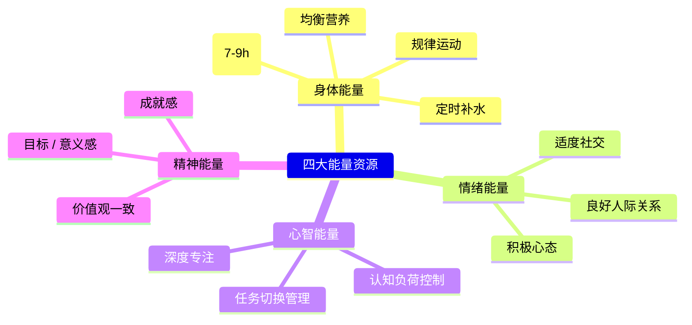

# Productivity

生产力（Productivity）是单位时间内产出的价值量。在个人层面，它体现为"在相同时间内完成更多有价值的工作"；在组织层面，它体现为"用更少的资源创造更多的经济价值"。

## 生产力的基本公式

$$ \text{个人生产力} = \frac{\text{完成的有价值的产出}}{\text{投入的时间 + 精力}} $$

$$ \text{组织生产力} = \frac{\text{产品/服务总价值}}{\text{劳动力成本 + 资本 + 资源消耗}} $$

## 影响生产力的四大资源

## 时间管理方法

### 优先级管理的核心原则

$$ \text{重要（Importance）} \times \text{紧急（Urgency）} = \text{执行顺序} $$

$$ \text{80/20 法则（Pareto Principle）: 80% 的成果来自 20% 的关键任务} $$

### 主流时间管理方法对比

| 方法 | 核心理念 | 适合场景 |
|------|---------|---------|
| Time Blocking | 把日程分成专属时间块 | 结构化工作日 |
| Pomodoro 工作法 | 25 分专注 + 5 分休息 | 短时高度集中 |
| 任务批量（Batching） | 同类任务集中处理 | 邮件、行政、电话 |
| 吃青蛙（Eat That Frog） | 先做最难的任务 | 拖延倾向严重时 |
| GTD | 把一切赶出大脑 | 事务繁杂的管理者 |

## 精力管理（Energy Management）

管理精力而非管理时间是高效能的关键——Jim Loehr & Tony Schwartz

### 精力周期

识别你的生理能量规律（Chronotype）：

| 类型 | 特征 | 高效时段 |
|------|------|---------|
| 晨型人（Lark） | 醒来即清醒，晚上早困 | 6:00-12:00 |
| 夜型人（Owl） | 上午迷糊，晚上精神好 | 14:00-22:00 |
| 中间型（Hummingbird） | 全天相对均衡 | 上午 + 傍晚 |

$$ \text{策略: 高价值任务 \rightarrow 安排在高能量时段} $$

### 心流（Flow）状态

Mihaly Csikszentmihalyi 定义的最佳体验状态：

$$ \text{Flow 条件: } \frac{\text{任务挑战}}{\text{个人技能}} \approx 1 $$

当挑战远高于技能 → 焦虑
当挑战略高于技能 → **心流**
当挑战与技能匹配 → **心流**
当挑战远低于技能 → 无聊

## 常见生产力陷阱

| 陷阱 | 表现 | 矫正策略 |
|------|------|---------|
| 多任务处理（Multitasking） | 同时做多件事，频繁切换 | 单任务处理，任务批量 |
| 完美主义 | 过度追求完美，拖延产出 | "完成优于完美"（Done > Perfect） |
| 工具迷恋 | 花大量时间配置工具 | 用最简单的工具开始 |
| 忽视休息 | 持续拼搏，耗尽能量 | 规律休息，遵循精力周期 |
| 不设边界 | 来者不拒，过度承诺 | 学会说"不"，保护时间 |

## 生产力习惯养成

习惯养成的一般公式（James Clear, *Atomic Habits*）：

$$ \text{Habit Formation} = \text{Cue} + \text{Craving} + \text{Response} + \text{Reward} $$

### 习惯养成的四个法则

1. **让它显而易见（Make It Obvious）**：将新习惯与已有习惯绑定
2. **让它有吸引力（Make It Attractive）**：将习惯与积极的体验关联
3. **让它简便易行（Make It Easy）**：将启动成本降到最低
4. **让它令人愉悦（Make It Satisfying）**：立即奖励完成行为

### 生产力习惯的微启动

| 目标习惯 | 微启动（2 分钟版本） |
|---------|-------------------|
| 每天阅读 | 读一页书 |
| 每天写作 | 写一句话 |
| 每天锻炼 | 穿上运动鞋 |
| 每天冥想 | 深呼吸三次 |

## 科技与生产力

### 数字极简主义（Digital Minimalism）

Cal Newport 提出的理念——有意识地限制数字工具的使用，聚焦于高价值活动：

1. **社交媒体戒断**：定期"数字排毒"（Digital Detox）
2. **通知管理**：关闭所有非必要的推送通知
3. **单任务模式**：关闭浏览器标签、使用全屏写作工具
4. **批量处理**：每天只在固定时段处理邮件和消息

## 相关条目

- [[ProductivityTools]]
- [[TimeBlocking]]
- [[ProductivitySystems]]
- [[DecisionMaking]]
- [[INDEX|当前目录索引]]
