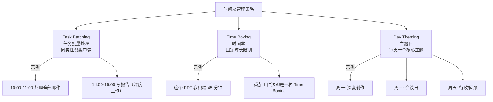

# 时间块管理 (Time Blocking)

时间块管理是一种将日程划分为固定时间块的时间管理方法。每个时间块中专注于一项特定任务或一类任务。这是当前最高效的时间管理策略之一。

## 核心理念

$$ \text{时间块管理} = \text{主动规划日程} \neq \text{被动响应待办清单} $$

不是"待办清单"（To-Do List），而是把任务分配到日历上具体的时段，使"想做什么"变成"何时做什么"。

## 三种主要策略

### 任务批量处理（Task Batching）

将相似的任务集中到一个时间块中完成，减少任务切换带来的效率损失：

$$ \text{切换成本} = \text{时间损失} + \text{注意力残留} $$

### 时间盒（Time Boxing）

给任务设固定的时间上限，时间到了就停止：

$$ \text{时间盒: 时间固定, 范围可调} $$

### 主题日（Day Theming）

给每周的每一天指定一个宏观主题：

| 示例 | 内容 |
|------|------|
| 周一：深度工作 | 专注模式——编程、写作 |
| 周二：会议与协作 | Team 沟通、1-on-1 |
| 周三：综合日 | 灵活处理各类事务 |
| 周四：创意日 | 构思、规划、设计 |
| 周五：行政与回顾 | 邮件清理、下周规划 |

## 实施方法

### 第一步：识别任务类型

$$ \text{深度工作（Deep Work）: 需要高度集中注意力的创造性/分析性任务} $$

$$ \text{浅层工作（Shallow Work）: 不需要高度集中的常规行政事务} $$

$$ \text{弹性缓冲（Buffer Time）: 为突发和意外预留的时间} $$

### 第二步：按精力分类

| 能量水平 | 适合的任务类型 | 时间块长度 |
|---------|--------------|-----------|
| 高能量 | 深度工作（写作、编程、分析） | 90-120 分钟 |
| 中等能量 | 浅层工作（邮件、沟通） | 30-60 分钟 |
| 低能量 | 行政事务（报销、整理） | 15-30 分钟 |

### 第三步：示例日程模板

| 时间 | 内容 |
|--------|------|
| 7:00-8:00 | 晨间例程（运动、早餐、规划） |
| 8:00-10:00 | 深度工作块 A（高优先项目） |
| 10:00-10:30 | 缓冲（休息、邮件检查） |
| 10:30-12:00 | 会议块 |
| 12:00-13:00 | 午餐 + 休息 |
| 13:00-14:30 | 深度工作块 B（次优先项目） |
| 14:30-15:00 | 缓冲 |
| 15:00-16:30 | 浅层工作块（回复、行政） |
| 16:30-17:00 | 今日回顾 + 明日规划 |

## 与番茄工作法的结合

$$ \text{Time Blocking（宏观调度）} + \text{Pomodoro（微观执行）} = \text{专注工作系统} $$

- **时间块管理**：决定在何时做什么（宏观层面）
- **番茄工作法**：决定怎么做（在时间块内使用番茄模式提升专注力）

## 常见挑战与应对

| 挑战 | 应对方法 |
|------|---------|
| 任务耗时长于预期 | 安排足够的缓冲时间（占总计划时间的 20-30%） |
| 频繁被打断 | 在日历上将深度工作时间标注为"不可打扰" |
| 过度规划 | 只计划 60-70% 的时间，留出弹性空间 |
| 难以坚持 | 从每天 3 个时间块开始逐步适应 |

## 时间块的变体

### 时间段阻塞（Time Boxing）

适合短期高密度的任务，如考试复习、项目冲刺：
- 设定明确开始和结束时间
- 时间一到立即停止（不论进度）
- 更适合有明确截止时间的外部约束任务

### 弹性阻塞（Time Buffering）

适合不确定性高的任务：
- 块与块之间预留 15-30 分钟缓冲
- 接受计划可能被打断
- 每天结束时重新调整次日计划

### 理想周模板（Ideal Week）

固定每周的关键时间块，形成稳定的节奏：
- 每周一早晨 30 分钟周规划
- 每天上午 90 分钟深度工作
- 每天下午 30 分钟邮件/沟通
- 每周五下午：60 分钟回顾 + 下周准备

## 推荐工具

| 工具 | 适合 | 特点 |
|------|------|------|
| Google Calendar | 普遍 | 免费、可共享、多端同步 |
| Fantastical | Apple 用户 | 自然语言输入、日历美化 |
| Notion Calendar | 知识工作者 | 日历 + 数据库集成 |
| 纸质时间轴笔记本 | 喜欢手写规划 | 灵活、零学习成本 |

## 相关条目

- [[Productivity]]
- [[ProductivitySystems]]
- [[PomodoroTechnique]]
- [[ProductivityTools]]
- [[INDEX|当前目录索引]]
