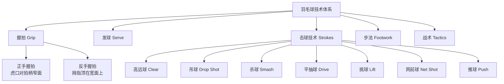

# BadmintonTechniques

羽毛球技术（Badminton Techniques）是羽毛球运动的技术体系，包括握拍、发球、击球和步法等基本技术及其组合运用。掌握正确的技术是提高运动水平的关键。

## 羽毛球技术体系

## 握拍法（Grip）

### 正手握拍

- 食指和拇指形成"V"形，虎口对准拍柄的窄面
- 其他三指环绕握柄，手掌与拍柄之间留有空隙（不紧贴）
- 优势：发力空间大，适合后场高远球、杀球

### 反手握拍

- 拇指顶在拍柄的宽面上（增加反手发力）
- 食指和其他手指自然握持
- 优势：反手区域更灵活

$$ \text{握拍原则: 松紧有度——准备时轻握, 击球瞬间拇指和食指加力} $$

## 主要击球技术

### 高远球（Clear）

将球打到底线附近，弧度高，为自己争取防守时间。

$$ \text{发力链: 转体(核心) → 大臂 → 前臂(加速) → 手腕(内旋发力)} $$

### 吊球（Drop Shot）

使球刚好越过球网后快速下落的进攻性技术：

$$ \text{吊球质量} \propto \frac{\text{贴网程度} \times \text{速度落差}}{\text{动作一致性}} $$

关键：高远球和吊球的准备动作要一致（一致性），让对手无法提前预判。

### 杀球（Smash）

羽毛球最具攻击性的技术——竞技男单的最高杀球速度可达 400+ km/h。

$$ \text{杀球力量} \propto \text{转体速度} \times \text{前臂旋内速度} \times \text{核心力量} $$

| 杀球类型 | 特点 | 适用场景 |
|---------|------|---------|
| 重杀 | 全力下压，势大力沉 | 中后场高球 |
| 点杀 | 动作小、落点精准 | 快速突击 |
| 劈杀 | 斜线切击球头侧面 | 路线变化 |

### 网前技术（Net Play）

$$ \text{网前要求: 稳 + 准 + 变} $$

- **搓球（Net Shot）**：手指控网拍轻切球托，使球旋转过网
- **推球（Push）**：快速推送球到对手后场
- **扑球（Net Kill）**：高点直接下压封网
- **挑球（Lift）**：从低点将球挑到后场底线

## 步法（Footwork）

### 核心原则

$$ \text{步法效率} = \frac{\text{球场覆盖范围}}{\text{步数} \times \text{移动时间}} $$

### 基本步法类型

| 步法 | 使用场景 | 要点 |
|------|---------|------|
| 并步（Side Step） | 左右平移 | 身体面向球网，重心稳定 |
| 交叉步（Cross Step） | 长距离快速移动 | 幅度大，适合后场两角 |
| 垫步（Chasse Step） | 调整距离 | 最后一步小垫步对准击球点 |
| 蹬跨步（Lunge） | 最后一步 | 后脚蹬地、前脚迈出大跨步 |

## 基本战术

### 单打战术

- **四方球**：四个角调动对手，消耗体力
- **拉吊突击**：高远球 + 吊球结合，寻找突击杀球机会
- **控网抢攻**：以高质量的网前球迫使对手起高球，制造杀球机会
- **压反手**：持续攻击对手的反手区域

### 双打战术

- **轮转配合**：进攻时前后站位、防守时平行站位
- **攻中路**：攻击两名对手的结合部
- **封网**：前场选手保持举拍，随时封网

## 训练建议

1. **基础训练**：每天练习原地高远球和多球训练
2. **步法训练**：六点米字步法 + 绳梯训练
3. **体能训练**：下肢爆发力 + 核心力量 + 心肺耐力
4. **实战训练**：每周至少 2-3 次对抗

## 常见错误纠正

| 错误 | 现象 | 纠正方法 |
|------|------|---------|
| 握拍过紧 | 手腕不灵活，发力困难 | 准备时放松，击球瞬间才抓紧 |
| 击球点偏后 | 回球不到位，容易被扑 | 提前到位，在身体前方高点击球 |
| 步法混乱 | 来不及到位，回球质量差 | 练习米字步法，养成回中习惯 |
| 反手无力 | 反手区域成为明显短板 | 强化反手握拍转换，多球练习反手高远球 |
| 杀球后失衡 | 杀球后重心不稳，无法连续 | 杀球时注意收腹，保持身体平衡 |

## 体能训练专项

| 训练内容 | 方法 | 频率 |
|---------|------|------|
| 下肢爆发力 | 深蹲跳、弓步跳、跳台阶 | 每周 2 次 |
| 核心稳定性 | 平板支撑、俄罗斯转体、悬垂举腿 | 每次训练后 |
| 心肺耐力 | 间歇跑、跳绳 | 每周 3 次 |
| 手腕力量 | 哑铃腕屈伸、握力器 | 每周 2 次 |
| 灵活性 | 动态拉伸、泡沫轴放松 | 每次训练前后 |

## 相关条目

- [[IntervalTraining]]
- [[GaitAnalysis]]
- [[Physiotherapy]]
- [[INDEX|当前目录索引]]
