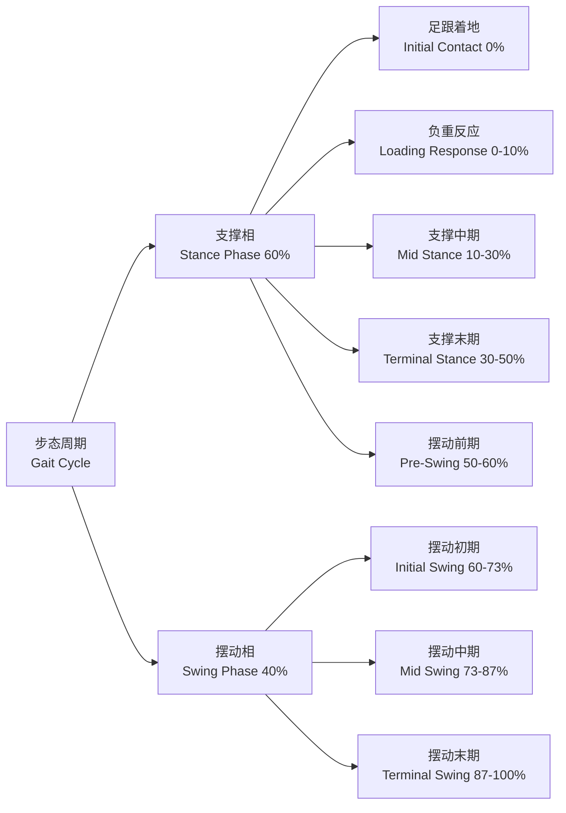

# 步态分析

## 概述

步态分析（Gait Analysis）
是通过定量测量和定性评估人体行走模式
（Walking Pattern / Gait Pattern）
来研究运动功能的一门学科。

它融合了生物力学（Biomechanics）。
运动控制（Motor Control）。
临床医学等多学科方法。
广泛应用于康复医学（Rehabilitation Medicine）。
运动科学（Sports Science）。
矫形外科（Orthopedics）。
假肢矫形器设计（Prosthetics and Orthotics）。

正常步态需要神经系统、骨骼肌肉系统
与感觉系统的高度协调。

步态分析的核心目标是：
识别异常运动模式。
量化运动功能障碍。
评估治疗与康复干预的效果。

近年来，可穿戴传感器（Wearable Sensors）。
机器学习。
计算机视觉（Computer Vision）的进步。
使步态分析的精度与应用场景大幅扩展。

## 步态周期的阶段划分

一个完整的步态周期
从一侧足跟首次触地（Initial Contact）开始。
到同侧足跟再次触地结束。
支撑相占周期的约60%。
摆动相占约40%。

行走时存在双支撑期（Double Support Period）。
双足同时着地的时段。
跑步则无此特征。

## 关键参数速查

| 参数类别 | 参数名称 | 英文 | 定义 | 正常参考值 |
|---------|---------|------|------|-----------|
| 时空参数 | 步长 | Step Length | 左右足相继着地点间纵向距离 | 50-80 cm |
| 时空参数 | 步幅 | Stride Length | 同侧足两次着地间纵向距离 | 100-160 cm |
| 时空参数 | 步频 | Cadence | 每分钟步数 | 100-120 步/min |
| 时空参数 | 步速 | Gait Velocity | 整体行进速度 | 1.2-1.5 m/s |
| 时空参数 | 步宽 | Step Width | 双足中心横向距离 | 5-10 cm |
| 运动学 | 髋屈曲 | Hip Flexion | 摆动相最大屈髋角度 | 25-35° |
| 运动学 | 膝屈曲 | Knee Flexion | 摆动相最大屈膝角度 | 55-70° |
| 运动学 | 踝背屈 | Ankle Dorsiflexion | 支撑中期踝关节角度 | 5-10° |
| 动力学 | 垂直 GRF 峰值 | Vertical GRF Peak | 体重归一化受力 | 1.0-1.2 BW |
| 肌电 | 胫骨前肌 | Tibialis Anterior | 足跟着地前激活 | 摆动末期 |

## 时空参数

步速是最常用的综合步态指标。
步速降低是老年人跌倒风险（Fall Risk）的敏感预测因子。

时空参数的关系公式：

$$\text{步速 (m/s)} = \text{步长 (m)} \times \frac{\text{步频 (steps/min)}}{60}$$

步长和步频呈非线性关系。
自然行走时，人倾向于选择能耗最优的组合。
约1.2~1.5 m/s 的步速使单位距离能耗最低。

步宽的变异系数（Step Width Variability）
是平衡控制的重要指标。
正常人约30~40%。
老年人和神经系统疾病患者显著增大。

步态对称性（Gait Symmetry）是重要评价指标。
常用对称性指数（Symmetry Index, SI）量化：

$$SI = \frac{2(X_R - X_L)}{X_R + X_L} \times 100\%$$

其中 $X_R$ 和 $X_L$ 分别为右左参数值。
SI 越接近0表示对称性越好。

## 运动学参数

运动学（Kinematics）
研究身体各节段的位移、速度和加速度。
不涉及力的作用。

常用运动学参数：
关节角度时间序列（Joint Angle Trajectory）。
角速度。
角加速度。
相位图（Phase Portrait）。

矢状面（Sagittal Plane）的关节角变化
是步态分析的重点。
支撑相膝关节屈曲约15~20°（支撑中期）。
摆动相屈膝峰值约60°。

踝关节在支撑末期由背屈转为跖屈。
产生推进力。
骨盆水平面旋转约±4°。
这有助于减小质心垂直位移。

人体的质心（Center of Mass, COM）
在行走过程中呈正弦轨迹。
垂直位移约4~5cm。
水平位移约3~4cm。

能量转换效率可用倒立摆模型
（Inverted Pendulum Model）描述：
支撑相时将重力势能转化为动能。
摆动相时反之。

## 动力学参数

动力学（Kinetics）
研究作用人体上的力与力矩。

地面反作用力（Ground Reaction Force, GRF）
是最重要的动力学参数。
分为垂直力、前后剪切力
（Anterior-Posterior Shear）
和内外侧剪切力（Medial-Lateral Shear）。

垂直 GRF 呈特征性双峰曲线：

$$F_{z1} \approx 1.1 \times BW \quad (\text{负重响应峰值})$$

$$F_{z2} \approx 0.8 \times BW \quad (\text{支撑中期谷值})$$

$$F_{z3} \approx 1.1 \times BW \quad (\text{蹬地推进峰值})$$

前后剪切力：
推进期产生向前推进力。
制动期产生向后制动力。
内外侧剪切力通常比前后向小。

关节力矩（Joint Moment）
通过逆动力学（Inverse Dynamics）计算。
结合 GRF 和运动学数据。
踝关节在支撑末期产生最大跖屈力矩。
约1.5 Nm/kg，是行走最主要的动力来源。

## 步态分析方法学

### 主观评估方法

临床目视观察（Visual Observation）
是最基础的步态评估方法。
使用 Rancho Los Amigos 步态观察清单。
系统评估各关节的异常表现。

功能性评估量表：
Tinetti 平衡与步态量表。
计时起走测试（Timed Up and Go, TUG）。
6分钟步行测试（6MWT）。
Berg 平衡量表（BBS）。

### 客观评估方法

| 方法 | 主要设备 | 测量内容 | 优势 | 局限 |
|------|---------|---------|------|------|
| 三维运动捕捉 | 红外摄像机+反光标记 | 关节角度/位移 | 精度高（<1mm） | 设备昂贵 |
| 测力台 | 压电/应变式力板 | GRF 三方向分量 | 力数据精确 | 单步限制 |
| 压力分布 | 压感鞋垫/走道 | 足底区域压力 | 便携、直观 | 校准频繁 |
| 表面肌电图 | 表面电极 | 肌肉激活时序 | 实时肌肉活动 | 串扰问题 |
| 惯性传感器 | IMU | 运动学参数 | 便携、户外可用 | 漂移问题 |
| 计算机视觉 | 深度相机 | 无标记点运动 | 无接触、便捷 | 遮挡问题 |
| 测力跑步机 | 集成力传感器 | 连续步 GRF | 多步数据 | 自然度降低 |

### 时空参数计算公式

步态周期时间与步速的关系：

$$T_{GC} = \frac{2 \times \text{Step Length}}{\text{Gait Velocity}}$$

双支撑期时间（Double Support Time, DST）：
慢速行走时增加（占周期约20%）。
快速行走时减少。
跑步时消失为零。

## 异常步态

| 步态类型 | 临床表现 | 典型病因 | 代偿机制 |
|---------|---------|---------|---------|
| 抗痛步态 | 患肢支撑相缩短 | 骨关节疼痛 | 健侧步长增大 |
| Trendelenburg | 支撑相骨盆向对侧倾斜 | 臀中肌无力 | 躯干向患侧倾斜 |
| 跨阈步态 | 垂足、屈髋屈膝增大 | 腓总神经损伤 | 抬膝避免拖地 |
| 剪刀步态 | 双下肢内收交叉 | 脑瘫/上运动神经元损伤 | 躯干扭转代偿 |
| 帕金森步态 | 小碎步、前倾、起步困难 | 帕金森病 | 视觉/听觉提示 |
| 共济失调步态 | 步基增宽、不稳 | 小脑病变 | 上肢外展平衡 |
| 额叶步态 | 起步困难、冻结 | 额叶病变/脑积水 | 步基增宽 |
| 短腿步态 | 骨盆倾斜、肩部下沉 | 下肢不等长 | 足尖着地代偿 |

## 在运动科学中的应用

跑步姿势分析是运动生物力学的重要应用。
过度内旋（Overpronation）和足外翻
与以下损伤密切相关：
胫骨内侧应力综合征（MTSS）。
髌股疼痛综合征（PFPS）。
足底筋膜炎。

步态分析为跑鞋选型和矫正训练提供依据。
高足弓适合缓冲型跑鞋。
扁平足适合稳定型跑鞋。

运动损伤预防方面：
步态异常是前交叉韧带（ACL）损伤的独立危险因素。
女性运动员的膝关节外展力矩较高。
这是其 ACL 损伤率高于男性的原因之一。

假肢与矫形器（Prostheses and Orthoses）的效果评估：
通过佩戴前后的时空参数对比。
对称性指数（Symmetry Index）。
能耗指标（Oxygen Cost）。
为康复方案调整提供定量依据。

## 跑步步态的特殊性

$$ \text{步行}：\text{始终存在双支撑期} $$

$$ \text{跑步}：\text{存在腾空期——双足均离地} $$

跑步步态中：
垂直 GRF 峰值可达体重的2.5~3倍。
步行仅1.1倍。
触地时间（Ground Contact Time, GCT）缩短。
步行约0.6s，跑步约0.2~0.3s。

足着地方式直接影响下肢受力模式：
后足着地（Rearfoot Strike）对膝关节负荷较大。
前足着地（Forefoot Strike）可充分利用跟腱弹性储能。
中足着地（Midfoot Strike）受力分布较均匀。

跑步经济性（Running Economy）是评价跑步效率的重要指标。
单位体重单位距离的耗氧量。
步频增加可降低垂直振幅。
有助于提高经济性。

## 相关条目

- [[Physiotherapy]]
- [[BadmintonTechniques]]
- [[IntervalTraining]]
- [[BiomechanicalAnalysis]]
- [[Biomechanics]]
- [[SportsInjury]]
- [[FunctionalAnatomy]]
