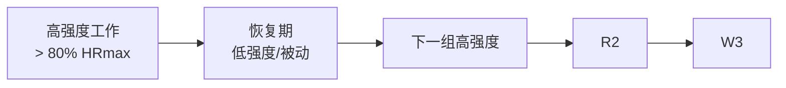
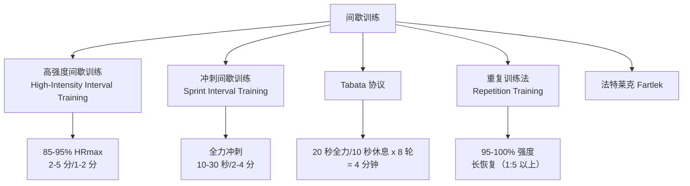

# IntervalTraining

间歇训练（Interval Training）指在运动中交替穿插高强度爆发期和低强度恢复期的训练方法。相比传统的持续中低强度训练，间歇训练在更短时间内产生更大的生理适应。

## 间歇训练的基本原理

$$ \text{Interval Training} = \text{高强度工作期（Work Interval）} + \text{恢复期（Rest Period）} $$

## 间歇训练的主要类型

### HIIT（高强度间歇训练）

最经典的间歇形式，适用于提升 VO₂max 和代谢适应。

$$ \text{典型 HIIT 方案: 3-5 分钟 @ 85-95% HRmax / 1-3 分钟 @ 50-60% HRmax} $$

### Tabata 协议

日本科学家田畑泉（Izumi Tabata）开发的 4 分钟极强训练法：

$$ \text{20 秒全力 + 10 秒休息} \times 8 = 4 \text{ 分钟} $$

Tabata 实验结论：Tabata 训练使 VO₂max 提升 14%，无氧能力提升 28%。

### 冲刺间歇训练（SIT）

$$ \text{30 秒 Wingate 全力冲刺 + 4 分钟被动恢复} \times 4-6 \text{ 轮} $$

## 核心训练参数

$$ \text{训练效果} = f(\text{强度}, \text{持续时间}, \text{休息}, \text{轮数}, \text{总容量}) $$

### 工作:休息比例

| 比例 | 生理刺激 | 典型应用 |
|------|---------|---------|
| 1:1 | 有氧-无氧混合，对心肺刺激大 | 中等强度 HIIT、Tabata |
| 1:2 | 有氧为主，恢复较充分 | 通用 HIIT |
| 1:3 ~ 1:4 | 无氧为主，强度极高 | SIT、重复冲刺 |
| 1:5 ~ 1:6 | 极限强度，充分恢复 | 短跑起跑、大重量力量训练 |

## 生理适应

经过 4-8 周的规律间歇训练：

$$ \text{VO₂max: 提升 5-15%} $$

$$ \text{胰岛素敏感性: 显著改善} $$

$$ \text{静息心率: 下降 5-10 bpm} $$

$$ \text{线粒体密度: 增加 20-50%} $$

$$ \text{脂肪氧化: 运动中提高，运动后 EPOC 效应增强} $$

## 与 MICT 对比

| 对比项 | HIIT | MICT（中等强度持续训练） |
|--------|------|------------------------|
| 单次耗时 | 15-30 分钟 | 40-60 分钟 |
| VO₂max 提升 | 相当或更优 | 有提升 |
| 脂肪减少 | 总体效果相似，趋势略优 | 运动中脂肪供能比例更高 |
| 依从性 | 有人觉得有趣有人觉得痛苦 | 更易完成 |
| 骨骼肌适应 | 快肌纤维募集多 | 慢肌纤维适应为主 |

## 安全指南

$$ \text{充分热身 5-10 分钟动态拉伸/轻度有氧} \rightarrow \text{主训练} \rightarrow \text{整理放松 5-10 分钟静态拉伸} $$

**适合条件**：
- 至少有 2-3 个月规律运动基础的健身者
- 时间紧张但希望高效训练的人
- 需要突破训练平台期的运动员

**禁忌**：
- 未经医生评估的心血管疾病患者
- 有未控制的关节/肌肉伤痛
- 完全没有运动基础的初学者（应先建立基础耐力）

## 常见误区

1. 每天都做 HIIT——需要 24-48 小时恢复，每周 2-3 次为宜
2. HIIT 可以完全替代有氧——它是补充而非替代
3. 忽略热身和整理——高强度训练更需要充分的准备和恢复
4. 恢复期完全静止——主动恢复（慢走/慢跑）更有助于乳酸清除

## 间歇训练方案示例

### 初学者 HIIT 方案

| 周期 | 工作 | 恢复 | 轮数 | 总时长 |
|------|------|------|------|--------|
| 第 1-2 周 | 30 秒快走/慢跑 | 60 秒步行 | 6-8 | 12-15 分钟 |
| 第 3-4 周 | 45 秒慢跑 | 45 秒步行 | 8-10 | 15 分钟 |
| 第 5-6 周 | 60 秒中速跑 | 60 秒慢跑 | 8-10 | 20 分钟 |

### 进阶跑步 HIIT 方案

1. **热身**：10 分钟慢跑
2. **主训练**：400m × 6-8 组，每组间休 90 秒
3. **整理**：10 分钟慢跑 + 静态拉伸
4. **强度控制**：400m 用时约为 5km 最佳配速减 15-20 秒

## 相关条目

- [[BadmintonTechniques]]
- [[GaitAnalysis]]
- [[Physiotherapy]]
- [[INDEX|当前目录索引]]
