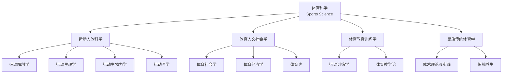
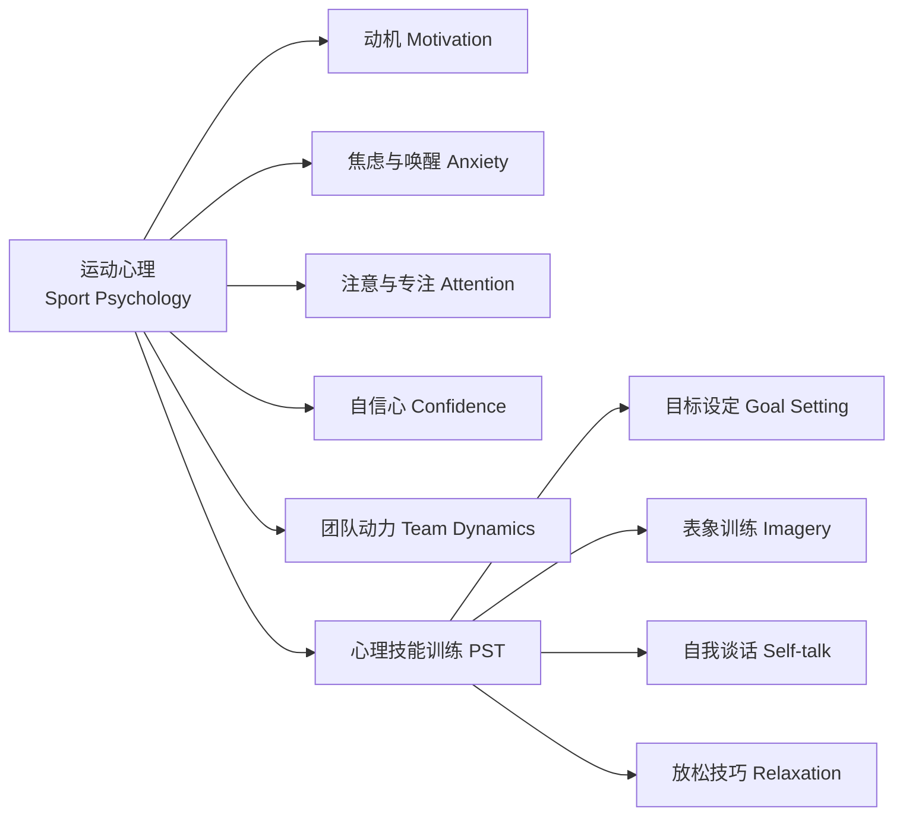
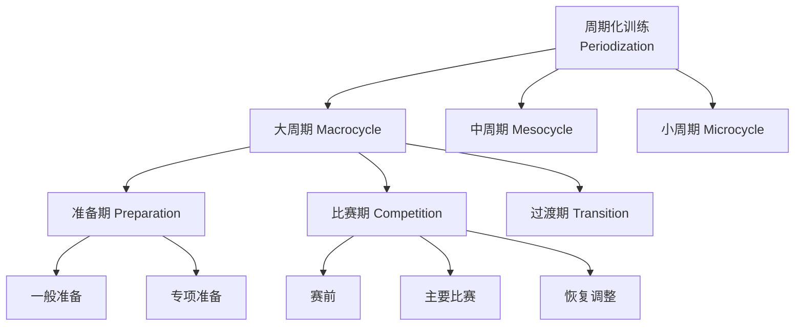

---
aliases: [SportsScienceLearningPath, 体育科学学习路径, ExerciseScience]
tags: ['12_SportsScience', 'LearningPath', 'ExercisePhysiology', 'SportTraining']
created: 2026-05-17
updated: 2026-05-17
---

# 体育科学学习路径 Sports Science Learning Path

## 概述 Overview

体育科学（Sports Science）是研究人体运动规律及其与健康、训练和竞技表现关系的综合性学科。它融合了生理学、生物力学、心理学、营养学等多个学科的理论和方法。

$$ \text{Sports Science} = \text{Physiology} + \text{Biomechanics} + \text{Psychology} + \text{Nutrition} + \text{Training Theory} $$

## 学科体系 Discipline Structure

## 基础阶段 Foundation Stage

### 运动解剖学 Exercise Anatomy

人体运动系统：骨骼（Skeleton）、关节（Joints）、肌肉（Muscles）。

$$ \text{Movement} = \text{Bones (Lever)} + \text{Joints (Pivot)} + \text{Muscles (Actuator)} $$

#### 人体主要肌群

| 肌群 | 主要肌肉 | 主要功能 |
|------|---------|---------|
| 胸肌群 | 胸大肌 Pectoralis Major | 肩内收、水平内收 |
| 背肌群 | 背阔肌 Latissimus Dorsi | 肩伸展、内收 |
| 肩肌群 | 三角肌 Deltoid | 肩外展、屈伸 |
| 臂屈肌 | 肱二头肌 Biceps Brachii | 肘屈曲 |
| 臂伸肌 | 肱三头肌 Triceps Brachii | 肘伸展 |
| 腹肌群 | 腹直肌 Rectus Abdominis | 躯干屈曲 |
| 股四头肌 | Quadriceps Femoris | 膝伸展 |
| 腘绳肌 | Hamstrings | 膝屈曲、髋伸展 |
| 臀肌 | Gluteus Maximus | 髋伸展、外旋 |

### 运动生理学 Exercise Physiology

#### 能量代谢系统 Energy Systems

| 系统 | 底物 | ATP 生成速率 | 持续时间 | 活动类型 |
|------|------|------------|---------|---------|
| ATP-CP 系统 | 磷酸肌酸 | 极快 | 0-10s | 爆发力：举重、短跑 |
| 糖酵解（快） | 肌糖原 | 快 | 10-60s | 高强度：400m 跑 |
| 糖酵解（慢） | 肌糖原/血糖 | 中等 | 1-3 min | 中等高强度 |
| 有氧氧化（糖） | 糖原/血糖 | 慢 | 30 min+ | 耐力运动 |
| 有氧氧化（脂肪） | 脂肪酸 | 最慢 | 60 min+ | 超长耐力 |

#### 能量消耗公式

$$ \text{VO}_2\text{max} = \text{maximal oxygen consumption (mL/kg/min)} $$

$$ \text{Total Energy Expenditure} = \text{BMR} + \text{TEF} + \text{PA} + \text{NEAT} $$

| 成分 | 含义 | 占比 |
|------|------|------|
| BMR (基础代谢) | 静息时最低能量需求 | 60-75% |
| TEF (食物热效应) | 消化食物消耗 | 8-10% |
| PA (运动消耗) | 有目的的运动 | 5-15% |
| NEAT (非运动性活动) | 日常活动 | 10-20% |

## 中级阶段 Intermediate Stage

### 运动生物力学 Sports Biomechanics

#### 基本运动学公式

$$ v = \frac{ds}{dt}, \quad a = \frac{dv}{dt}, \quad F = ma $$

$$ \text{Impulse} = F \cdot \Delta t = \Delta p = m \Delta v $$

$$ \text{Kinetic Energy} = \frac{1}{2}mv^2, \quad \text{Potential Energy} = mgh $$

#### 运动分析维度

| 维度 | 测量工具 | 分析指标 |
|------|---------|---------|
| 运动学 Kinematics | 摄像捕捉、IMU | 位移、速度、加速度、角度 |
| 动力学 Kinetics | 测力台 | 地面反作用力 GRF、力矩 |
| 肌电学 EMG | 表面电极 | 肌肉激活时序、强度 |
| 足底压力 | 压力板 | 压力分布、步态分析 |

#### 跑步的生物力学

$$ \text{GRF} = m \times a_{\text{vertical}}, \quad \text{Impact Peak} \approx 2-3 \times \text{BW} $$

| 着地方式 | 特点 | 适用 |
|---------|------|------|
| 后跟着地 Rearfoot | 高冲击、关节负荷大 | 慢跑、新手 |
| 前掌着地 Forefoot | 低冲击、小腿负荷大 | 速度快、精英 |
| 中足着地 Midfoot | 平衡冲击力 | 过渡跑姿 |

### 运动心理学 Sport Psychology

$$ \text{Performance} = f(\text{Skill}, \text{Physiology}, \text{Psychology}) $$

### 运动营养学 Sport Nutrition

#### 三大营养素

$$ \text{Total Energy} = 4 \times \text{Carbs(g)} + 4 \times \text{Protein(g)} + 9 \times \text{Fat(g)} $$

| 营养素 | 功能 | 推荐摄入量 | 食物来源 |
|--------|------|-----------|---------|
| 碳水化合物 | 主能源、糖原储备 | 5-12 g/kg/天 | 米面、水果、薯类 |
| 蛋白质 | 修复、增肌、酶 | 1.2-2.2 g/kg/天 | 肉蛋奶、豆制品 |
| 脂肪 | 储能、激素合成 | 0.8-1.5 g/kg/天 | 坚果、油脂、鱼油 |
| 水 | 代谢、体温调节 | 30-50 mL/kg/天 | 水、运动饮料 |

#### 运动营养时机

| 时间 | 目的 | 建议 |
|------|------|------|
| 运动前 2-3h | 储备糖原 | 高碳、低脂、适量蛋白 |
| 运动中 > 1h | 维持血糖 | 6-8% 碳水溶液 |
| 运动后 30min | 恢复窗口 | 碳蛋比 3:1 - 4:1 |
| 日常 | 基础营养 | 均衡膳食 |

## 高级阶段 Advanced Stage

### 训练理论 Training Theory

#### 训练原则 Training Principles

| 原则 | 内容 | 应用 |
|------|------|------|
| 超负荷 Overload | 超出身体现有负荷水平 | 逐渐增加重量/强度 |
| 渐进 Progression | 循序渐进提高负荷 | 520 原则：每周增 < 5% |
| 特异性 Specificity | 训练适应特定方向 | SAID 原则 |
| 个体化 Individualization | 因人而异 | 训练计划定制 |
| 可逆性 Reversibility | 用进废退 | 停训 2 周开始下降 |
| 周期性 Periodization | 大中小周期安排 | 年周期划分赛季阶段 |

#### 周期化训练 Periodization

#### 强度分区 Intensity Zones

| 分区 | % HRmax | % VO2max | RPE | 乳酸 mmol/L | 训练效果 |
|------|---------|----------|-----|-------------|---------|
| Z1 恢复 | 50-60% | 35-45% | 1-2 | < 1.5 | 主动性恢复 |
| Z2 基础耐力 | 60-70% | 45-60% | 3-4 | 1.5-2.0 | 有氧基础 |
| Z3 节奏 | 70-80% | 60-75% | 5-6 | 2.0-4.0 | 乳酸阈值 |
| Z4 阈值 | 80-90% | 75-88% | 7-8 | 4.0-6.0 | 乳酸清除 |
| Z5 最大摄氧 | 90-100% | 88-100% | 9-10 | > 6.0 | VO2max 提升 |

### 运动医学 Sports Medicine

#### 常见运动损伤

| 损伤类型 | 常见项目 | 处理原则 |
|---------|---------|---------|
| 踝关节扭伤 | 篮球、足球 | RICE 原则（休息、冰敷、加压、抬高） |
| 前交叉韧带 ACL 撕裂 | 足球、滑雪 | 手术重建 + 康复 |
| 跑步膝 PFPS | 跑步 | 股四头肌强化、髌骨带 |
| 跟腱炎 | 跑步、跳跃 | 离心训练、冲击波 |
| 肩袖损伤 | 投掷项目 | 功能康复、修复手术 |
| 应力性骨折 | 长跑 | 相对休息、骨代谢调节 |

#### RICE 急性损伤处理

$$ \text{RICE} = \text{Rest} + \text{Ice} + \text{Compression} + \text{Elevation} $$

## 职业方向 Career Paths

| 职业方向 | 核心能力 | 工作场景 |
|---------|---------|---------|
| 体能教练 Strength Coach | 训练设计、负荷管理 | 职业队、健身中心 |
| 运动生理学家 | 生理测试、数据分析 | 体育科研所、医院 |
| 运动营养师 | 饮食规划、补剂评估 | 运动队、医疗机构 |
| 运动医学医生 | 损伤诊断、治疗 | 运动医学中心 |
| 生物力学家 | 动作分析、技术优化 | 科研机构、装备研发 |
| 体育数据分析师 | 统计建模、比赛分析 | 职业俱乐部 |

## 推荐资源 Recommended Resources

### 核心教材

| 书名 | 作者 | 出版社 |
|------|------|--------|
| 《运动生理学》 | 王瑞元 | 人民体育出版社 |
| 《运动生物力学》 | 陆爱云 | 高等教育出版社 |
| 《运动训练学》 | 田麦久 | 人民体育出版社 |
| 《运动营养学》 | 张钧 | 高等教育出版社 |
| 《ACSM 运动测试与处方指南》 | ACSM | 北京体育大学出版社 |
| 《NSCA 体能训练概论》 | NSCA | 人民体育出版社 |

### 国际认证

| 认证 | 机构 | 适用 |
|------|------|------|
| ACSM-CEP | 美国运动医学会 | 运动生理 |
| CSCS | 美国体能协会 | 体能训练 |
| NASM-CES | 美国国家运动医学会 | 纠正训练 |
| ISSN 运动营养师 | 国际运动营养学会 | 运动营养 |
| EXOS 认证 | EXOS | 综合体能训练 |

### 在线平台

- **YouTube**：Athlean-X、Squat University、Dr. Mike
- **期刊**：Medicine & Science in Sports & Exercise, Journal of Strength and Conditioning Research
- **工具**：Kinovea（动作分析）、Golden Cheetah（训练分析）、TrainingPeaks

## 相关条目

- [[ExercisePhysiology]]
- [[12_SportsScience/SportsMedicine/SportsBiomechanics|SportsBiomechanics]]
- [[SportPsychology]]
- [[SportNutrition]]
- [[12_SportsScience/SportsTraining/TrainingTheory|TrainingTheory]]
- [[SportMedicine]]

