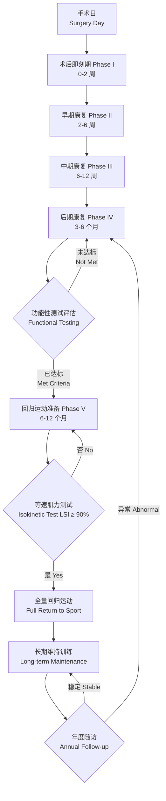

# 前交叉韧带重建

## 概述

前交叉韧带（Anterior Cruciate Ligament, ACL）重建术是骨科最常见的手术之一，主要用于治疗 ACL 断裂导致的膝关节前向不稳定（Anterior Instability）。ACL 损伤多发生于非接触性减速和变向动作（如足球、篮球、滑雪中的急停、转身和落地），年发病率约为每10万人中68例。术后康复（Postoperative Rehabilitation）对恢复膝关节功能、预防再伤和避免远期退行性病变至关重要。康复过程分为多个阶段，需根据移植物类型（Graft Type）、伴随损伤（Concomitant Injuries）、患者年龄和运动需求制定个性化方案。尽管 ACL 重建术后短期成功率较高，但长期随访显示部分患者可能发展为膝关节骨关节炎（Osteoarthritis），提示康复管理和本体感觉（Proprioception）重建的重要性。

## ACL 的解剖与生物力学功能

ACL 起自股骨外侧髁内侧面后部，止于胫骨平台髁间隆起前外侧。全长约 30-38 mm，宽度约 10-12 mm。ACL 由两个主要功能束组成：
- **前内侧束（Anteromedial Bundle, AM）**：屈膝时紧张，主要限制胫骨前移
- **后外侧束（Posterolateral Bundle, PL）**：伸膝时紧张，主要控制膝关节旋转稳定

ACL 的主要生物力学功能包括：
- 限制胫骨前移（Anterior Tibial Translation）
- 辅助控制胫骨内旋（Internal Rotation）
- 在膝关节全范围内提供被动稳定
- 提供本体感觉反馈（Mechanoreceptors 介导）

ACL 承受的最大载荷约为 1725-2160 N，日常行走时 ACL 受力约为 150-300 N，跑步时可达 1000-1500 N，跳跃落地时可达峰值的 80-100%。

## 康复阶段

### 术后即刻期 — Phase I（0–2 周）

- **保护目标**：保护移植物（Graft Protection），减轻疼痛和肿胀（Effusion），恢复完全被动伸直（Full Passive Knee Extension）
- **负重策略**：使用腋杖（Axillary Crutches），患肢部分负重（Partial Weight Bearing, PWB），骨-髌腱-骨移植可早期全负重
- **活动度（ROM）**：被动伸直 $0^\circ$，主动屈曲 $90^\circ$
- **训练内容**：股四头肌激活（Quadriceps Activation）、踝泵（Ankle Pumps）、直腿抬高（Straight Leg Raise, SLR）、髌骨松动（Patellar Mobilization）
- **支具（Brace）**：术后 0° 位锁定支具，行走时锁定伸直位，4周后根据情况解锁

### 早期康复 — Phase II（2–6 周）

- **保护目标**：保护移植物，控制肿胀，恢复正常步态，屈曲达 $120^\circ$
- **负重策略**：逐步过渡到完全负重（Full Weight Bearing, FWB），4周时弃拐
- **训练内容**：闭链运动（Closed Kinetic Chain, CKC）如靠墙静蹲（Wall Slide）、微蹲（Mini Squat）、leg press $90^\circ$-$30^\circ$、本体感觉训练（Proprioceptive Training）
- **注意事项**：腘绳肌腱（Hamstring Tendon, HT）移植者延迟腘绳肌强化至 12 周，以避免胫骨端愈合干扰

### 中期康复 — Phase III（6–12 周）

- **目标**：全范围关节活动（Full ROM），增强肌力（Strengthening），改善神经肌肉控制
- **训练内容**：进阶闭链运动、弓步（Lunge）、台阶训练（Step-up/Down）、单腿平衡训练（Single-leg Balance）、本体感觉进阶训练（扰动面训练）
- **有氧训练**：固定自行车（Stationary Bike，座椅调高避免屈曲过大）、椭圆机（Elliptical Trainer）
- **开链运动（Open Kinetic Chain, OKC）**：$40^\circ$-$90^\circ$ 范围内谨慎引入膝伸开链训练

### 后期康复 — Phase IV（3–6 个月）

- **目标**：回归运动准备，满足基本功能性测试标准
- **肌力目标**：LSI（Limb Symmetry Index）$\geq 80\%$
- **训练内容**：跑步循序渐进（Start with walk-jog program）、跳跃训练（Jump Training）、变向训练（Cutting/Pivoting Drills）、运动专项训练（Sport-Specific Drills）
- **注意**：跑步启动时机取决于肌力恢复水平，通常不早于术后 12 周

### 回归运动 — Phase V（6–12 个月）

- 通常不早于术后 9 个月（移植物韧带化 Ligamentization 和隧道愈合 Tunnel Healing 时间）
- 需通过等速肌力测试（Isokinetic Strength Testing），患肢肌力 LSI $\geq 90\%$
- 需完成运动专项测试（Sports Test I–III）后方可全量回归
- 心理准备评估（ACL-RSI 量表）达标

### 长期阶段（12 个月以后）

- 维持肌力平衡和运动控制
- 监测再伤信号（对侧和同侧再伤）
- 管理膝关节健康和骨关节炎预防

## 移植物类型注意事项

| 移植物类型 | 特点 | 康复注意事项 |
|-----------|------|-------------|
| 骨-髌腱-骨（Bone-Patellar Tendon-Bone, BPTB） | 固定强度高，骨-骨愈合快 | 注意膝前痛（Anterior Knee Pain）和髌腱炎，避免过度负重髌骨 |
| 腘绳肌腱（Hamstring Tendon, HT） | 供区并发症少，切口小 | 延迟腘绳肌强化至 12 周，注意屈膝力量恢复较慢 |
| 股四头肌腱（Quadriceps Tendon, QT） | 强度高，含骨块可选 | 早期注意股四头肌抑制（Quadriceps Inhibition），神经肌肉电刺激（NMES）有利 |
| 同种异体移植物（Allograft） | 无供区损伤与疼痛 | 融合速度较慢，康复进度谨慎，部分研究显示再伤率略高 |
| LARS 人工韧带 | 强度极大，恢复快 | 适用于高需求运动员，但远期效果证据有限 |

## 术后并发症管理

ACL 重建术后常见并发症包括：
- **膝关节纤维化（Arthrofibrosis）**：关节活动度受限，预防重于治疗，早期关注股四头肌安全收缩和被动伸直
- **膝前痛**：BPTB 移植后较常见，髌骨活动度训练有助于预防
- **移植物失效（Graft Failure）**：多与过早回归高强度运动或创伤相关
- **对侧 ACL 损伤**：RTS 后 2 年内对侧 ACL 损伤率达 12-15%
- **隧道扩大（Tunnel Widening）**：影像学常见但不一定影响临床功能

## ACL 再伤率与流行病学数据

ACL 重建术后同侧 ACL 再伤率约为 4-6%，对侧 ACL 损伤率约为 8-12%（年轻运动员更高）。RTS 后 2 年是再伤的最高风险期。青少年运动员（$\lt 25$ 岁）的再伤风险显著高于年长患者。重返同等运动水平的比例约为 55-65%，而重返伤前竞技水平仅为 40-50%。

## 神经肌肉控制训练与预防

ACL 损伤预防计划（ACL Injury Prevention Programs）已被广泛研究和推广，代表性预防训练包括 FIFA 11+、PEP 计划（Prevent Injury and Enhance Performance）和 Sportsmetrics。核心要素包括：
- 下肢力量训练（深蹲、硬拉、弓步）
- 核心稳定性（Core Stability）
- 落地生物力学修正（Landing Biomechanics Correction）
- 北欧腘绳肌训练（Nordic Hamstring Exercise）预防腘绳肌拉伤
- 动态稳定性训练（Perturbation Training）

## 术前康复

术前康复（Prehabilitation, Prehab）是 ACL 重建前进行的一段时间的康复干预，旨在优化手术预后。研究表明，术前康复可显著改善术后功能和降低移植物再伤率。核心内容包括：
- **消除关节积液**：通过冰敷、加压和主动活动控制肿胀
- **恢复全范围关节活动**：重点是达到充分的被动伸直
- **股四头肌激活**：使用 NMES（Neuromuscular Electrical Stimulation）减少股四头肌抑制（Quadriceps Inhibition）
- **术前步态训练**：使用腋杖保持正常步行模式
- **心理准备**：向患者提供手术-康复全周期的预期教育和心理支持

## 移植物选择决策模型

| 移植物类型 | 固定强度 | 供区并发症 | 融合速度 | 推荐人群 |
|-----------|---------|-----------|---------|---------|
| BPTB 自体 | 高（骨-骨愈合） | 膝前痛 20-30% | 快（6-8周骨愈合） | 接触性运动员（跳跃为主） |
| HT 自体 | 中等（软组织愈合） | 屈膝力量稍弱 | 较慢（8-12周） | 需跪姿项目（摔跤、柔术） |
| QT 自体 | 高 | 早期股四头肌抑制 | 快（骨块可选） | 翻修手术（Revision ACLR） |
| 同种异体 | 中等 | 无供区损伤 | 慢（12-16周） | 年龄较大、低运动需求 |
| LARS 人工韧带 | 极高 | 滑膜炎风险 | 即刻固定 | 高需求、快速回归运动员 |

## 临床表现与诊断

ACL 损伤的典型临床表现包括：
- **损伤机制**：非接触性减速、膝关节外翻-外旋（Valgus-External Rotation）、过伸（Hyperextension）
- **急性症状**：听到或感到"噗"声（Pop Sound）、即刻关节肿胀（Hemarthrosis）、无法继续运动
- **特殊检查**：
  - Lachman 试验：屈膝 30° 评估胫骨前移，敏感性最高（$\approx 95\%$）
  - 前抽屉试验（Anterior Drawer Test）：屈膝 90° 评估，特异性高
  - 轴移试验（Pivot Shift Test）：评估旋转不稳，需在麻醉下完成更准确

影像学检查首选 MRI（磁共振成像），T2加权像上 ACL 信号中断或不连续。X 线可排除胫骨平台骨折（Segond 骨折）、髁间棘撕脱骨折等相关损伤。

## 伴随损伤的处理

ACL 断裂常伴随其他结构损伤，影响康复进程和预后：
- **半月板损伤（Meniscal Tear）**：外侧半月板后角撕裂最常见。半月板缝合（Meniscus Repair）术后需限制负重 4-6 周，康复进程延迟；半月板部分切除术（Partial Meniscectomy）不影响康复进度
- **内侧副韧带损伤（MCL Injury）**：I-II 级 MCL 损伤通常保守治疗，支具保护，ACL 重建同期不处理 MCL。III 级损伤需评估手术与否
- **后外侧角损伤（Posterolateral Corner Injury）**：需一期修复，否则 ACL 移植物失效风险升高
- **软骨损伤（Chondral Injury）**：根据 Outerbridge 分级决定处理策略（微骨折 Microfracture、软骨细胞移植 ACI 等）

## 生物力学与步态训练

ACL 重建后步态异常是常见现象，表现为：
- 术后早期伸展滞后（Extension Lag）导致伸膝肌过度工作
- 屈膝受限导致髋关节代偿抬高步态
- 负重不对称导致健肢过度负荷

步态训练要点：
- 使用镜子（Mirror Feedback）进行视觉反馈训练纠正不良步态
- 生物反馈（Biofeedback）监测和纠正异常肌电活动
- 水中步态训练（Aquatic Gait Training）利用浮力减轻关节负荷
- 本体感觉鞋垫（Textured Insole）增强足底反馈

## 重建术后的生物愈合时间线

| 时间 | 移植物生物学状态 | 临床意义 |
|------|-----------------|---------|
| 0-4 周 | 移植物被滑膜覆盖，开始血管化 | 保护移植物，避免牵张 |
| 4-12 周 | 血管化高峰期，细胞浸润 | 移植物力学强度最低脆弱期 |
| 3-6 个月 | 胶原重塑（Collagen Remodeling），III 型→I 型胶原转变 | 逐步增加负重和力量训练 |
| 6-12 个月 | 韧带化完成（Ligamentization），力学强度恢复 | 开始回归运动准备 |
| 12-24 个月 | 成熟期，胶原排列接近原生韧带 | 移植物强度和功能基本定型 |

## 远期预后与生活质量

ACL 重建术后的长期随访显示：
- **重返运动率**：约 80-85% 患者可重返某种运动，65% 回到伤前水平，55% 回到竞技水平
- **对侧 ACL 损伤**：年轻运动员 5 年内对侧 ACL 损伤率约 15%，女性高于男性
- **骨关节炎风险**：ACL 损伤后 10-15 年，膝关节 OA 影像学发生率约 50%（与重建无关，与原始损伤和半月板状态相关）
- **生活质量**：KOOS、IKDC、Tegner 活动度量表评估术后长期功能状态

## 重返跑步的具体标准

ACL 重建后重返跑步（Return to Running）是康复的关键里程碑。推荐标准包括：
- 术后时间 $\ge 12-16$ 周（与移植物类型和愈合进程相关）
- 无痛的全范围关节活动（尤其是伸膝）
- 股四头肌肌力 LSI $\ge 70\%$（等速测试 60°/s）
- 无关节积液（无膝跳反射 Effusion Test 阴性）
- 正常步态模式（无痛、无代偿）持续 1 周以上
- 从走跑交替开始（跑 1 分/走 2-4 分），每周总跑量增加 $\le 10\%$
- 跑步后关节反应监测：次日无持续疼痛或肿胀加重

## ACL 重建术后重返运动的预测因素

RTS 成功的预测因素（Prognostic Factors）包括：
- **积极预测因素**：术前股四头肌肌力保存良好、女性（非接触性项目）、高内部动机（Intrinsic Motivation）、社会支持系统完善
- **消极预测因素**：伴随半月板缝合、年龄 $< 20$ 岁（再伤风险高）、术后早期过高的重返信心（与实际康复水平不匹配）、健侧 ACL 既往损伤史
- **无明确影响**：移植物类型（BPTB vs HT）对 RTS 率无显著差异、手术时机（急性期 vs 亚急性期 vs 延期）

## ACL 重建术后重返运动的心理预测工具

ACL-RSI（Anterior Cruciate Ligament Return to Sport after Injury）量表是目前最广泛使用的 RTS 心理准备评估工具，包含 12 个条目，涵盖 3 个维度：
- **情绪（Emotions）**：对重返运动的焦虑、沮丧和紧张感
- **信心（Confidence in Performance）**：对运动表现的自我效能感
- **风险评估（Risk Appraisal）**：对再伤风险的认知评估

ACL-RSI 评分与 RTS 成功率显著相关（OR 2.3, 95% CI 1.5-3.5）。推荐阈值：ACL-RSI $\ge 60-65$ 分列为"心理准备充分"。在重返运动前，心理评分低的运动员应接受认知行为干预和系统脱敏训练。

## 康复典型案例分期里程碑

| 阶段 | 时间范围 | 关键里程碑 |
|------|---------|-----------|
| Phase I | 0-2 周 | 被动伸膝 0°，主动屈膝 90°，股四头肌收缩可触及 |
| Phase II | 2-6 周 | 正常无痛步态，脱拐行走，屈膝 120° |
| Phase III | 6-12 周 | 全范围 ROM，上下楼梯无痛，单腿站立 $\ge 30$ s |
| Phase IV | 3-6 个月 | 无痛跑步（直线 15 min），单腿跳 LSI $\ge 80\%$ |
| Phase V | 6-9 个月 | 运动专项训练，跳跃着陆质量控制 |
| Phase VI | 9-12 个月 | 等速肌力 LSI $\ge 90\%$，功能测试通过，心理准备充分 |

## 相关条目

[[SportsInjuries]], [[Rehabilitation]], [[Physiotherapy]], [[ReturnToSport]], [[FunctionalAssessment]], [[Orthopedics]]
