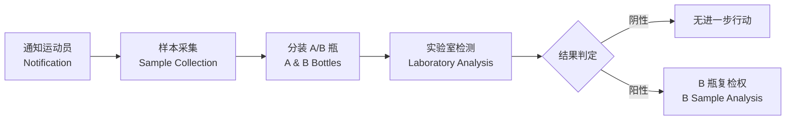

---
aliases: [AntiDoping]
tags: ['12_SportsScience', 'SportsMedicine']
created: 2026-05-17
updated: 2026-05-17
---

# 反兴奋剂 (Anti-Doping)

## 概述

反兴奋剂 (Anti-Doping) 是维护体育公平竞争 (Fair Play) 和运动员健康的核心工作体系。世界反兴奋剂机构 (World Anti-Doping Agency, WADA) 成立于 1999 年，负责制定、监督和协调全球反兴奋剂工作。WADA 每年发布的《禁用清单》(Prohibited List) 是国际公认的兴奋剂管控标准，所有签署《世界反兴奋剂条例》(World Anti-Doping Code) 的国家和组织必须遵守。

运动员对进入体内的任何物质负有严格责任 (Strict Liability)，即无论是否故意使用，检测结果呈阳性即构成违规。

## 禁用物质与方法 (Prohibited Substances & Methods)

### 禁用物质分类

WADA 将禁用物质分为以下主要类别：

| 类别 | 英文 | 典型示例 | 赛内/赛外 |
|------|------|---------|----------|
| S1. 蛋白同化制剂 | Anabolic Agents | 合成类固醇 (睾酮、诺龙)、SARMs | 均禁用 |
| S2. 肽类激素 | Peptide Hormones | EPO、生长激素 (hGH)、IGF-1、促红素 | 均禁用 |
| S3. β2-激动剂 | Beta-2 Agonists | 克伦特罗、沙丁胺醇 (需 TUE) | 均禁用 |
| S4. 激素与代谢调节剂 | Hormone Modulators | 他莫昔芬、氯米芬、胰岛素 | 均禁用 |
| S5. 利尿剂和掩蔽剂 | Diuretics & Masking Agents | 氢氯噻嗪、呋塞米、丙磺舒 | 均禁用 |
| S6. 刺激剂 | Stimulants | 安非他命、可卡因、哌醋甲酯 | 赛内禁用 |
| S7. 麻醉剂 | Narcotics | 吗啡、芬太尼、羟考酮 | 赛内禁用 |
| S8. 糖皮质激素 | Glucocorticoids | 口服/静脉/肌肉注射给药 | 赛内禁用 |
| S9. β-阻断剂 | Beta-Blockers | 普萘洛尔、美托洛尔 | 特定项目禁用 |

### 禁用方法

| 方法 | 英文 | 说明 |
|------|------|------|
| 血液兴奋剂 | Blood Doping | 自体或异体血液回输 |
| 化学和物理操作 | Chemical & Physical Manipulation | 篡改样本、替换尿液 |
| 基因兴奋剂 | Gene Doping | 转入核酸或正常/改良细胞 |

## 检测技术与程序 (Testing Procedures)

### 样本采集

**样本采集规范**：
- 尿样采集：全程陪同 (Chaperone/DCO)，直接目视排尿
- 血样采集：静脉采血，抗凝管保存
- 样本分装：A 瓶用于检测，B 瓶用于复检
- 样本链式监管 (Chain of Custody)：确保样本完整性

### 检测方法

| 检测方法 | 英文 | 检测对象 | 检测窗口 |
|---------|------|---------|---------|
| 气相色谱-质谱联用 | GC-MS | 小分子兴奋剂、类固醇 | 数天至数周 |
| 液相色谱-质谱联用 | LC-MS/MS | 肽类激素、利尿剂 | 数小时至数天 |
| 同位素比值质谱 | IRMS | 内源性类固醇 (区分内源/外源) | 数周 |
| 生物护照 | ABP | 血液学和类固醇指标纵向变化 | 长期监测 |

### 运动员生物护照 (Athlete Biological Passport, ABP)

ABP 是对运动员生物学指标进行长期纵向监测的系统，不直接检测禁用物质，而是通过统计学方法发现异常变化。

**ABP 模块**：
- **血液学模块 (Haematological Module)**：监测红细胞、血红蛋白、网织红细胞等指标，发现血液兴奋剂迹象
- **类固醇模块 (Steroidal Module)**：监测睾酮/表睾酮比值等，发现类固醇使用

## 治疗用药豁免 (Therapeutic Use Exemption, TUE)

当运动员因医疗需求必须使用禁用物质或方法时，可申请 TUE。

**TUE 申请条件**：
- 有明确的医疗诊断证明
- 该禁用物质/方法是治疗所必需的
- 无合理的替代治疗方案
- 使用该物质/方法不会带来额外的运动成绩提升

**TUE 审批流程**：

| 步骤 | 内容 | 时限 |
|------|------|------|
| 1. 医疗评估 | 专科医生出具诊断和治疗方案 | - |
| 2. 提交申请 | 向反兴奋剂组织提交 TUE 申请表及医疗资料 | 使用前 |
| 3. 专家审核 | TUE 委员会审核医学必要性和合规性 | 21 天内 |
| 4. 结果通知 | 批准/拒绝/要求补充材料 | 书面通知 |

**回溯性 TUE**：仅在紧急医疗情况下（如过敏性休克、严重创伤）可事后申请，需提供充分的医疗记录。

## 违规后果 (Sanctions)

### 禁赛期

根据《世界反兴奋剂条例》2021 版：

| 违规类型 | 禁赛期 | 说明 |
|---------|--------|------|
| 故意使用严重禁用物质 | 4 年 | 如类固醇、EPO、血液兴奋剂 |
| 非故意使用 | 2 年 | 需证明无重大过失或疏忽 |
| 逃避、拒绝或篡改样本 | 4 年 | 视为严重违规 |
| 持有/贩运 | 4 年至终身 | 视情节轻重 |
| 共犯 | 2~4 年 | 协助他人使用兴奋剂 |

### 附加处罚

除禁赛外，还可能包括：
- 取消比赛成绩、奖牌和积分
- 追回奖金和出场费
- 公开通报
- 所在单位或国家/地区可能受到额外处罚（如削减奥运参赛名额）

## 健康风险 (Health Risks)

兴奋剂对运动员健康造成严重危害：

| 兴奋剂类别 | 短期健康风险 | 长期健康风险 |
|-----------|------------|------------|
| 合成类固醇 | 痤疮、情绪波动、肝损伤 | 心血管疾病、肝肾衰竭、不育 |
| EPO/血液兴奋剂 | 血液粘稠度增加、高血压 | 血栓、中风、心脏病 |
| 刺激剂 | 心律失常、焦虑、体温升高 | 成瘾、精神障碍 |
| 利尿剂 | 脱水、电解质紊乱 | 肾功能损害、心律失常 |
| 生长激素 | 肢端肥大、关节疼痛 | 糖尿病、心脏病、癌症风险 |

## 伦理与教育 (Ethics & Education)

### 反兴奋剂教育

WADA 要求所有国际级运动员接受反兴奋剂教育：
- **运动员教育计划**：了解禁用清单、检测程序、权利与义务
- **反兴奋剂价值观教育**：公平竞争、尊重规则、健康第一
- **营养师与辅助人员教育**：辅助人员同样受反兴奋剂条例约束

### 举报机制

WADA 设立"举报兴奋剂 (Speak Up!)"平台，鼓励知情者举报兴奋剂违规行为。举报者可选择匿名，WADA 对举报人信息严格保密。

## 相关组织与法规

| 组织/法规 | 英文 | 职能 |
|----------|------|------|
| 世界反兴奋剂机构 | WADA | 制定标准、协调全球反兴奋剂工作 |
| 国际检测机构 | ITA | 代表国际奥委会进行独立检测 |
| 世界反兴奋剂条例 | WADC | 国际反兴奋剂基本法 |
| 禁用清单 | Prohibited List | 每年更新，列出所有禁用物质与方法 |
| 治疗用药豁免国际标准 | ISTUE | 规范 TUE 申请与审批程序 |
| 检查和调查国际标准 | ISTI | 规范样本采集和调查程序 |

## 中国反兴奋剂工作

中国反兴奋剂中心 (CHINADA) 是国家体育总局直属事业单位，负责全国反兴奋剂工作的组织实施。中国实行"拿干净金牌"的反兴奋剂长效治理体系，对兴奋剂问题"零容忍"。

**中国反兴奋剂法规**：
- 《反兴奋剂条例》（国务院令第 398 号）
- 《反兴奋剂管理办法》
- 《兴奋剂目录》（每年更新）

## 反兴奋剂科技前沿

随着科技发展，反兴奋剂领域不断涌现新的检测技术：
- **干血点检测 (Dried Blood Spot, DBS)**：微量采血，便于储存和运输
- **长期代谢物检测**：延长类固醇等物质的可检测窗口
- **人工智能辅助分析**：利用机器学习识别生物护照异常模式
- **基因兴奋剂检测**：检测外源基因或基因编辑痕迹

## 运动员权利与义务 (Athletes' Rights and Responsibilities)

### 运动员权利

- **知情权**：了解检测程序、禁用清单内容、权利与义务
- **隐私权**：样本采集过程保护隐私，检测结果保密（除阳性通报外）
- **复检权**：A 瓶阳性时有权要求 B 瓶复检
- **听证权**：对违规指控有权要求听证和申诉
- **法律援助权**：有权获得法律代表协助

### 运动员义务

- **配合检测义务**：无正当理由不得拒绝或逃避样本采集
- **行踪申报义务**：注册检查库运动员需按时准确申报行踪
- **用药谨慎义务**：确保任何进入体内的物质不含违禁成分
- **报告义务**：及时向反兴奋剂组织报告治疗用药和补充剂使用

## 经典文献与资源

- WADA《World Anti-Doping Code》
- WADA《Prohibited List》（年度更新）
- WADA《International Standard for Testing and Investigations》
- Mottram《Drugs in Sport》
- 中国反兴奋剂中心官网及教育资源

## 相关条目

- [[DopingAndAntiDoping]]
- [[SportsNutrition]]
- [[SportsSupplements]]
- [[SportsMedicine]]
- [[SportsEthics]]
- [[INDEX|SportsMedicine 索引]]

