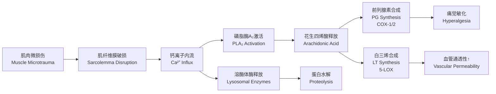
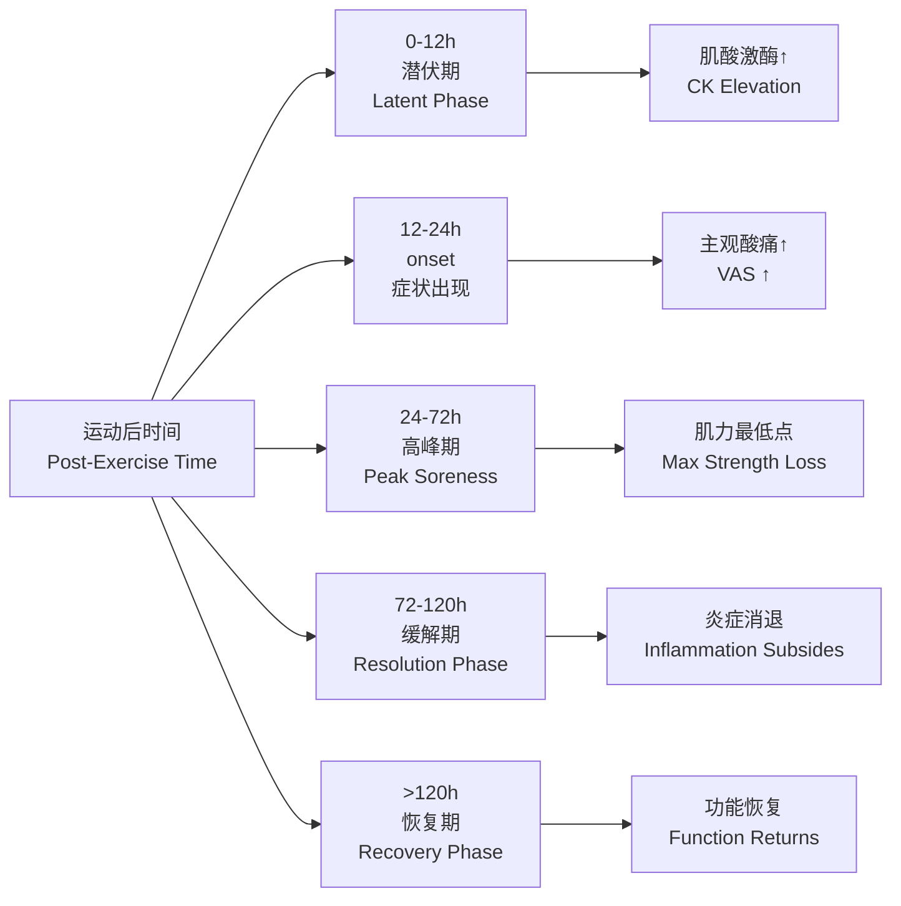

# 延迟性肌肉酸痛 (Delayed Onset Muscle Soreness, DOMS)

## 概述 (Overview)

延迟性肌肉酸痛（Delayed Onset Muscle Soreness, DOMS）是指从事**不习惯的运动 (Unaccustomed Exercise)** 或**高强度离心收缩 (High-Intensity Eccentric Contractions)** 后 $12$–$24$ 小时出现、$24$–$72$ 小时达峰、$5$–$7$ 天逐渐消退的**肌肉疼痛 (Muscle Pain)** 与**僵硬感 (Stiffness)** 综合征。DOMS 是运动医学与运动训练领域最常见的运动相关症状之一。

$$
DOMS_{onset} \approx 8 \text{–}12 \, \text{h post-exercise}
$$

$$
DOMS_{peak} \approx 24 \text{–}72 \, \text{h post-exercise}
$$

## 诱发因素 (Etiological Factors)

| 因素 (Factor) | 机制 (Mechanism) | 风险等级 (Risk Level) |
|--------------|-----------------|---------------------|
| 离心收缩 (Eccentric Contraction) | 肌节过度拉长，结构蛋白破坏 | 高 |
| 运动强度突增 (Intensity Spike) | 机械应力超载 | 高 |
| 新运动模式 (Novel Movement) | 神经肌肉协调不足 | 中 |
| 下坡跑/下楼 (Downhill Running) | 股四头肌持续离心负荷 | 中高 |
| 长时间制动后复训 (Detraining) | 肌肉适应性下降 | 中 |
| 年龄增长 (Aging) | 修复能力降低 | 低–中 |

## 发病机制 (Pathophysiological Mechanisms)

### 机械损伤假说 (Mechanical Damage Hypothesis)

**肌节不均匀理论 (Popping Sarcomere Theory)**：

离心收缩时，弱肌节被过度拉长至**肌联蛋白 (Titin)** 被动张力区，导致：

$$
\Delta L_{sarcomere} > L_{optimal} \Rightarrow \sigma_{passive} \uparrow \Rightarrow \text{Z-disk disruption}
$$

肌节长度-张力关系：

$$
F_{total} = F_{active}(L) + F_{passive}(L)
$$

在离心收缩拉长相，$F_{passive}$ 显著增加，对**肌联蛋白 (Titin)**、**伴肌动蛋白 (Nebulin)**、**肌间线蛋白 (Desmin)** 等结构蛋白产生机械应力。

### 代谢应激假说 (Metabolic Stress Hypothesis)

高强度运动中：

- **ATP 耗竭 (ATP Depletion)**：$< 30\%$ 静息值
- **钙超载 (Calcium Overload)**：胞浆 $[Ca^{2+}]$ 升高
- **活性氧生成 (ROS Production)**：线粒体电子泄漏
- **炎症反应 (Inflammatory Response)**：前列腺素、缓激肽释放

代谢通路：

$$
\text{Exercise} \rightarrow \text{Metabolic Stress} \rightarrow \text{ROS} \uparrow + \text{Ca}^{2+} \uparrow \rightarrow \text{Protease Activation} \rightarrow \text{Myofibril Degradation}
$$

### 炎症级联假说 (Inflammation Cascade Hypothesis)

### 水肿与压迫假说 (Edema & Compression Hypothesis)

损伤后局部水肿导致：

$$
P_{interstitial} \uparrow \Rightarrow \text{Mechanoreceptor Stimulation} \Rightarrow \text{Pain Sensation}
$$

组织压力增高刺激**Ⅲ型 (Aδ)** 与**Ⅳ型 (C)** 感觉神经纤维，传导钝痛与压痛。

## 临床表现 (Clinical Manifestations)

| 症状 (Symptom) | 特征 (Characteristics) | 评估方法 (Assessment) |
|---------------|----------------------|---------------------|
| 肌肉酸痛 (Muscle Soreness) | 深部钝痛，活动时加重 | 视觉模拟评分 (VAS) |
| 压痛 (Tenderness) | 触诊痛点明确 | 压力痛阈测定 (PPT) |
| 僵硬 (Stiffness) | 关节活动度受限 | 关节活动度测量 (ROM) |
| 肿胀 (Swelling) | 围度增加 | 肢体围度测量 |
| 肌力下降 (Strength Loss) | 等速/等长肌力降低 | 等速肌力测试 |
| 肌肉功能受损 | 跳跃高度、加速能力下降 | 功能测试 |

## 预防策略 (Prevention Strategies)

### 训练干预 (Training Interventions)

| 策略 (Strategy) | 机制 (Mechanism) | 实施方案 (Protocol) |
|----------------|-----------------|-------------------|
| 重复训练效应 (Repeated Bout Effect, RBE) | 结构性适应、神经适应 | 首次高强度训练前进行 $1$–$2$ 次亚极量离心训练 |
| 渐进超负荷 (Progressive Overload) | 逐步增加机械应力 | 每周增量 $< 10\%$ |
| 离心训练适应 (Eccentric Training) | 肌节数量增加、串联弹性元增强 | 系统化离心力量训练 |
| 热身 (Warm-Up) | 提高肌肉温度、血流 | 动态拉伸 $5$–$10$ min + 专项准备 |

RBE 保护窗口：

$$
Protection_{RBE} \approx 2 \text{–}6 \text{ weeks post-initial bout}
$$

### 营养干预 (Nutritional Interventions)

| 补充剂 (Supplement) | 剂量 (Dosage) | 机制 (Mechanism) | 证据等级 (Evidence) |
|-------------------|--------------|-----------------|-------------------|
| 蛋白质 (Protein) | $1.6$–$2.2$ g/kg/d | 提供氨基酸合成原料 | 高 |
| Omega-3 脂肪酸 | $2$–$4$ g EPA+DHA/d | 抗炎、膜流动性 | 中 |
| 姜黄素 (Curcumin) | $500$–$1500$ mg/d | 抑制 NF-κB 通路 | 中 |
| 酸樱桃汁 (Tart Cherry) | $480$ mg 花青素/d | 抗氧化、抗炎 | 中 |
| 咖啡因 (Caffeine) | $5$ mg/kg | 镇痛、中枢效应 | 中 |

### 物理干预 (Physical Interventions)

| 方法 (Method) | 参数 (Parameters) | 效果 (Effect) |
|--------------|------------------|--------------|
| 冷疗 (Cryotherapy) | $10$–$15°C$, $10$–$20$ min | 减轻急性炎症，DOMS 效果不一致 |
|  Compression garments | $15$–$25$ mmHg | 可能减轻肿胀与酸痛 |
| 按摩 (Massage) | $10$–$30$ min | 减轻酸痛感，机制不明 |
| 主动恢复 (Active Recovery) | 低强度有氧 $20$–$30$ min | 促进血流、代谢清除 |
| 泡沫轴 (Foam Rolling) | 每肌群 $60$–$120$ s | 短期改善 ROM，减轻酸痛 |

## 治疗与恢复 (Treatment & Recovery)

### 药物干预 (Pharmacological Interventions)

**非甾体抗炎药 (NSAIDs)**：

| 药物 (Drug) | 剂量 (Dosage) | 作用机制 (Mechanism) | 注意事项 (Caution) |
|------------|--------------|---------------------|-------------------|
| 布洛芬 (Ibuprofen) | $400$–$600$ mg q6–8h | COX-1/2 抑制 | 胃肠道、肾脏风险 |
| 萘普生 (Naproxen) | $250$–$500$ mg bid | COX-1/2 抑制 | 同布洛芬 |
| 对乙酰氨基酚 (Paracetamol) | $500$–$1000$ mg q6h | 中枢镇痛 | 肝毒性风险 |

**争议**：NSAIDs 可能干扰肌肉蛋白合成信号（mTOR 通路），长期或大剂量使用可能延缓肌肉适应。

### 恢复时间进程 (Recovery Timeline)

## 鉴别诊断 (Differential Diagnosis)

| 状况 (Condition) | 与 DOMS 区别 (Distinction from DOMS) | 关键指标 (Key Indicator) |
|-----------------|-----------------------------------|------------------------|
| 急性肌肉拉伤 (Acute Strain) | 即刻疼痛，非延迟 | 急性起病，局部血肿 |
| 横纹肌溶解 (Rhabdomyolysis) | 严重疼痛 + 全身症状 | CK $> 5\times$ ULN，肌红蛋白尿 |
| 筋膜室综合征 (Compartment Syndrome) | 进行性剧痛，被动牵拉痛 | 室压 $> 30$ mmHg |
| 延迟性肌肉酸痛样疾病 | 无运动史 | 自身免疫、代谢病筛查 |

## 参考文献 (References)

1. Lewis, P. B., et al. (2012). Muscle damage and repeated bout effect. *Sports Health*, 4(4), 346–352.
2. Hotfiel, T., et al. (2018). Advances in delayed-onset muscle soreness (DOMS). *Sports Medicine*, 48(6), 1367–1375.
3. Schoenfeld, B. J. (2012). The use of nonsteroidal anti-inflammatory drugs for exercise-induced muscle damage. *Sports Medicine*, 42(12), 1017–1028.
4. Clarkson, P. M., & Hubal, M. J. (2002). Exercise-induced muscle damage in humans. *American Journal of Physical Medicine & Rehabilitation*, 81(11), S52–S69.
5. 王瑞元 等. (2012). 《运动生理学》. 人民体育出版社.
