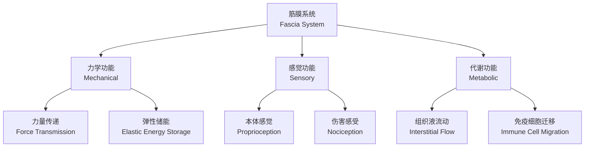
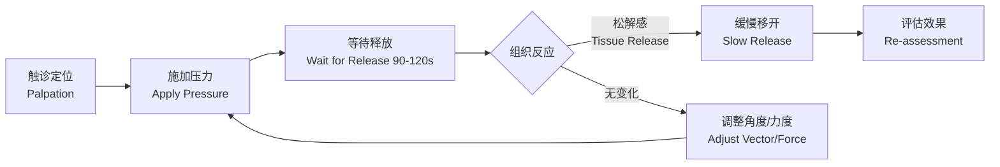

# 筋膜放松 (Fascia Release)

## 概述

筋膜释放技术（Fascia Release Therapy）是针对人体筋膜系统（fascia system）的手法（manual）和器械（instrument-assisted）治疗方法，旨在恢复筋膜的滑动性（gliding）、弹性（elasticity）和本体感觉功能（proprioceptive function）。筋膜是一种全身连续的三维结缔组织网络，包裹肌肉、器官、神经和血管，在运动链中承担力量传递和感觉输入的重要角色。

## 筋膜解剖学

### 筋膜的分层结构

| 层次 | 名称 | 成分 | 功能 |
|------|------|------|------|
| 浅层 | 浅筋膜 (Superficial Fascia) | 疏松结缔组织、脂肪 | 储存、隔热、本体感觉 |
| 深层 | 深筋膜 (Deep Fascia) | 致密胶原纤维 | 力量传递、分隔肌群 |
| 内脏层 | 脏筋膜 (Visceral Fascia) | 浆膜层 | 支撑内脏、空间固定 |

### 筋膜的力学特性

筋膜表现出粘弹性（viscoelasticity）和压电效应（piezoelectricity）。其应力-应变关系可由以下简化模型描述：

$$
\sigma(t) = E\varepsilon + \eta \frac{d\varepsilon}{dt}
$$

其中 $\sigma$ 为应力，$\varepsilon$ 为应变，$E$ 为弹性模量，$\eta$ 为粘性系数。

## 筋膜粘连与受限机制

筋膜受限（fascial restriction）的病理机制包括：

1. **胶原纤维交联异常**（Cross-linking）：缺乏运动或过度负荷导致胶原纤维异常交联，降低滑动性。
2. **透明质酸聚集**（Hyaluronan Aggregation）：深筋膜层间透明质酸浓度和分子量改变，导致层间滑动障碍。
3. **纤维化**（Fibrosis）：慢性炎症或损伤后成纤维细胞过度活跃，导致组织纤维化。
4. **扳机点形成**（Trigger Point Formation）：肌筋膜扳机点是局部高度敏感的结节，牵涉痛模式具有特征性。

## 主要技术

### 手法筋膜释放 (Manual Fascia Release)

| 技术 | 操作要点 | 适应症 |
|------|----------|--------|
| 直接法 (Direct) | 用指节、肘部或工具对受限区域施加持续压力 90–120 秒，等待组织松解 | 局部粘连、扳机点 |
| 间接法 (Indirect) | 轻触筋膜，引导组织沿放松方向运动，让筋膜自动归位 | 慢性紧张、系统性问题 |
| 交叉手法 (Cross-Hand) | 对相邻肌筋膜单元进行拉伸和剪切，恢复各层间滑动 | 大面积受限、运动链功能问题 |
| 肌筋膜松解 (MFR) | 低速、持续施压以触发高尔基腱器反射 | 肌张力过高 |

直接法的操作过程可用以下流程描述：

### 器械辅助筋膜放松

1. **泡沫轴** (Foam Roller)：利用自重在滚压中释放肌肉紧张，适合大肌群如股四头肌（quadriceps）、腘绳肌（hamstrings）、臀肌（gluteals）和背阔肌（latissimus dorsi）。
2. **筋膜枪** (Percussive Massage Gun)：高频振动（20–50 Hz）刺激高尔基腱器（Golgi tendon organ）和肌梭（muscle spindle），通过 Ib 传入抑制降低肌张力。
3. **筋膜球/花生球** (Massage Ball / Peanut Ball)：精准作用于扳机点（trigger point）和深层小肌群如梨状肌（piriformis）、胸小肌（pectoralis minor）。
4. **筋膜刀** (IASTM Tools, e.g. Graston Technique)：不锈钢器械刮擦皮肤表面，刺激成纤维细胞活性和胶原重塑。

## 临床应用

### 肌筋膜疼痛综合征 (Myofascial Pain Syndrome)

筋膜释放结合拉伸和干针疗法（dry needling）是 MPS 的一线治疗方案。研究显示，筋膜手法（fascial manipulation）配合运动疗法对慢性非特异性腰痛（chronic non-specific low back pain）的效果优于单一治疗。

### 运动恢复

训练后筋膜放松的主要效果：

| 指标 | 即时效果 | 24–48 小时后 |
|------|----------|--------------|
| 关节活动度 (ROM) | ↑ 8–15% | ↑ 5–10% |
| 主观酸痛 (DOMS) | ↓ 20–30% | ↓ 15–25% |
| 肌力恢复 | — | ↑ 3–8% |
| 血液乳酸清除 | ↑ 10–15% | — |

### 慢性疼痛管理

- 慢性下背痛（Chronic Low Back Pain）：胸腰筋膜（thoracolumbar fascia）的滑动性降低是重要致病机制。
- 肩颈紧张综合征：上斜方肌（upper trapezius）、提肩胛肌（levator scapulae）和胸锁乳突肌（SCM）是重点治疗区域。
- 足底筋膜炎（Plantar Fasciitis）：足底筋膜释放结合小腿三头肌拉伸效果显著。

## 禁忌症与注意事项

筋膜放松治疗的绝对和相对禁忌症包括：

- **绝对禁忌**：急性骨折、严重骨质疏松、深静脉血栓、开放性伤口、急性炎症期
- **相对禁忌**：抗凝治疗患者、皮肤过敏区、妊娠期（需调整压力）、肿瘤区域

## 研究进展

近期研究表明，筋膜中富含 Pacini 小体和 Ruffini 末梢等机械感受器，筋膜放松的镇痛效果部分通过激活下行抑制通路（descending inhibitory pathway）实现。此外，筋膜网络与自主神经系统间的交互作用是慢性疼痛维持的重要环节。

## 相关条目

- [[SelfMassage|自我按摩]]
- [[TriggerPointTherapy|扳机点疗法]]
- [[RecoveryAndRegeneration|恢复与再生]]
- [[PhysicalTherapy|物理治疗]]
- [[Stretching|拉伸训练]]
- [[MusclePhysiology|肌肉生理学]]
- [[INDEX|SportsMedicine 索引]]
- [[../../INDEX|TianshangKnowledgeBase 索引]]
