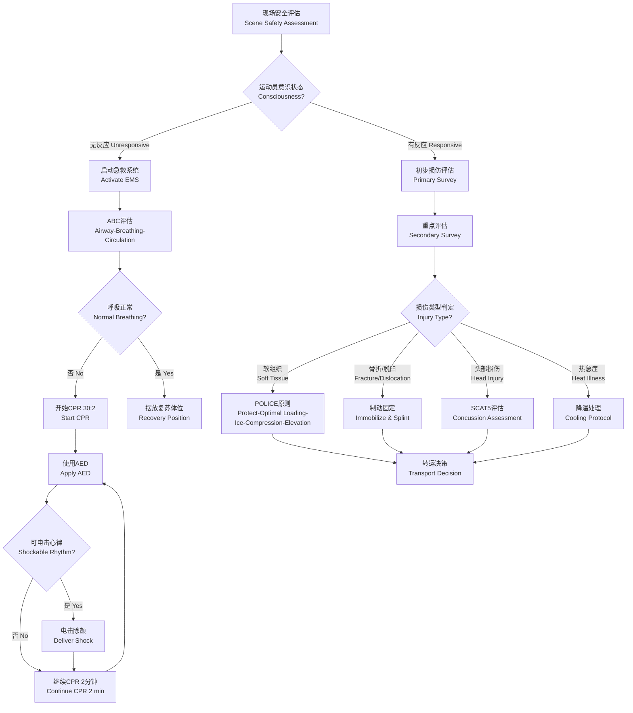

# 运动急救

## 概述

运动急救（First Aid in Sports）是体育活动中对突发伤病进行现场评估和紧急处置的系统措施，目标是救命（Life-saving）、防止伤情加重（Prevent Worsening）和促进后续治疗（Facilitate Subsequent Treatment）。运动急救人员需掌握基本的生命支持技能（Basic Life Support, BLS）和常见运动损伤的现场处理方法。运动急救的核心原则包括：时效性（Timeliness）——伤后即刻干预的"黄金时间"至关重要；安全性——首先确保急救人员和患者现场安全；系统性——遵循评估-决策-行动（Assess-Decide-Act）的标准化流程。各级运动队应制定急救预案（Emergency Action Plan, EAP），并进行定期演练。

## 急救评估流程

## 常见急症处理

### 软组织损伤 — POLICE 原则

软组织损伤（Soft Tissue Injury）的现场处理遵循POLICE原则，又称"保护-适量负荷-冰敷-加压-抬高"：

- **保护（Protect）**：使用护具（Brace）、支具（Splint）或制动（Immobilization）防止二次损伤
- **适量负荷（Optimal Loading）**：早期功能性活动（Early Functional Activity）促进组织修复，完全不动反而不利
- **冰敷（Ice）**：每 2-3 小时冰敷 15-20 分钟，急性期 48-72 小时持续应用。注意神经浅表部位避免冻伤
- **加压包扎（Compression）**：弹性绷带（Elastic Bandage）控制肿胀，压力适中，远端留指/趾端观察循环
- **抬高（Elevation）**：患肢高于心脏水平，利用重力促进静脉和淋巴回流

急性炎症的病理生理过程涉及血管扩张、通透性增加、白细胞趋化和炎症介质释放。冰敷通过降低局部温度导致血管收缩（Vasoconstriction），减少组织水肿和出血，同时降低组织代谢率，限制继发性损伤。冰敷的典型方案为每次 15-20 分钟，间隔至少 2 小时，避免长时间冰敷导致反射性血管扩张或神经损伤。

### 骨折与脱臼

- 就地制动，用夹板（Splint）或健肢固定伤处上下关节，确保骨折两端不移动
- 夹板固定范围应跨越骨折处及相邻两个关节
- 勿尝试自行复位（Reduce），脱臼也应由专业医师处理
- 注意检查远端血液循环（Distal Circulation）、感觉（Sensation）和运动功能（Motor Function），即CMS评估
- 开放性骨折（Open Fracture）用无菌敷料覆盖创面，勿将骨端推回
- 疑似脊柱损伤时须保持脊柱轴线稳定（Spinal Immobilization），使用硬质颈托（Cervical Collar）和脊柱板（Spine Board）

常见运动相关骨折类型包括：
- **锁骨骨折（Clavicle Fracture）**：自行车、橄榄球运动中常见，八字绷带固定
- **舟骨骨折（Scaphoid Fracture）**：跌倒手掌撑地所致，早期x线可能阴性，需临床高度怀疑
- **第五跖骨基底部骨折（Jones Fracture）**：踝内翻损伤时发生，愈合率取决于血供区域

### 脑震荡（Concussion）

- 疑有脑震荡需立即停止运动（Immediate Removal from Play），不可当天重返赛场（No Same-day Return）
- 脑震荡评估工具：SCAT5（Sport Concussion Assessment Tool）评估症状（Symptoms）、认知功能（Cognition）和平衡能力（Balance）
- 症状恶化指征（需立即送急诊）：呕吐、意识下降（Deteriorating Consciousness）、瞳孔不等大（Unequal Pupils）、局灶性神经症状（Focal Neurological Signs）
- 脑震荡分级管理：分为急性期（24-48小时相对休息）、亚急性期（症状导向的逐步恢复）和回归运动期（渐进式运动恢复计划GRTP，6步逐步回归方案）
- 儿童青少年脑震荡管理更保守，认知和身体需分别恢复

脑震荡的病理生理基础是功能性损伤而非结构性损伤，表现为神经元代谢紊乱（代谢危机假说：钙离子内流、钾离子外排导致Na/K泵过度耗能，结合脑血流减少）。因此，脑震荡后早期认知和身体休息（Rest）是核心管理措施。

### 运动性热急症（Exertional Heat Illness）

- **热痉挛（Heat Cramps）**：停止运动，口服补液（含电解质），轻度拉伸痉挛肌肉
- **热衰竭（Heat Exhaustion）**：移至阴凉处，平卧抬腿，口服或静脉补液，物理降温（冷毛巾、冰袋置于颈、腋、腹股沟）
- **热射病（Heat Stroke）**：核心体温 $\gt 40^\circ \text{C}$ 伴意识障碍，是医疗急症——立即实施极速降温（Whole-body Cold Water Immersion, 1-2°C冷水浸泡），冷水浸泡至核心体温降至 38.6°C 为止，启动急救系统。热射病的组织损害涉及多器官功能衰竭（MODS），源于热诱导的细胞毒性、内毒素释放和全身炎症反应综合征（SIRS）

预防热急症的核心策略包括：运动前充分补水、运动中规律补液、避免在高温高湿日的 10:00-16:00 时段进行高强度训练、注意热适应（Heat Acclimatization）需要 10-14 天逐步建立。

### 心脏骤停（Sudden Cardiac Arrest, SCA）

- 立即启动急救系统（Call EMS/Shout for Help）
- 高质量胸外按压（Chest Compression）：100-120 次/分，深度 5-6 cm，充分回弹（Full Recoil），按压中断 $\lt 10$ 秒
- 通气比例视操作者人数而定：单人 30:2，双人 15:2
- 尽早使用自动体外除颤器（Automated External Defibrillator, AED）。每延迟 1 分钟除颤，存活率下降 7-10%
- 运动中猝死（Sudden Cardiac Death, SCD）最常见原因为肥厚型心肌病（Hypertrophic Cardiomyopathy, HCM）和致心律失常性右心室心肌病（Arrhythmogenic Right Ventricular Cardiomyopathy, ARVC）

### 其他常见运动急症

- **气道异物梗阻（Choking）**：Heimlich手法（腹部冲击法）清除气道
- **严重过敏反应（Anaphylaxis）**：肾上腺素（Epinephrine）自动注射笔大腿外侧肌肉注射
- **严重出血（Severe Bleeding）**：直接加压止血（Direct Pressure），抬高患肢，止血带（Tourniquet）仅用于危及生命的肢体大出血
- **牙外伤（Dental Trauma）**：脱位牙齿保存在生理盐水或牛奶中，30分钟内求医

## 运动场急救箱推荐配置

| 类别 | 物品 | 用途 |
|------|------|------|
| 包扎类 | 弹性绷带、三角巾、纱布绷带 | 加压包扎、悬吊固定 |
| 敷料类 | 无菌纱布、无菌敷贴、透明敷料 | 伤口覆盖与保护 |
| 固定类 | 夹板（可塑形/充气）、胶带 | 骨折临时固定 |
| 冷疗类 | 化学冰袋（一次性）、冰袋（可重复使用） | 急性期冷敷 |
| 工具类 | 剪刀（钝头）、镊子、一次性手套（多双） | 辅助操作、隔离防护 |
| 急救通气类 | 口对面罩（Pocket Mask）、急救呼吸面罩 | CPR 人工呼吸隔离 |
| 药品类 | 生理盐水、碘伏棉签、消毒湿巾、肾上腺素自动注射笔 | 清洁、消毒、过敏急救 |
| 诊断类 | 手电筒、听诊器、血压计、SCAT5卡片 | 评估检查 |

急救箱应定期检查物品有效日期，放置在训练场和比赛场易取位置，所有教练和队医应熟悉急救箱物品位置和使用方法。

## 急救法律与伦理

运动急救涉及的法律伦理问题包括：
- **知情同意（Informed Consent）**：有意识患者需征得口头同意后方可施救
- **善意施救（Good Samaritan Laws）**：多数地区法律保护在合理范围内的紧急救助者
- **急救记录（Documentation）**：所有急救处置应详细记录，包括事件时间、症状、体征、处置措施和转归

## 运动场急救预案

### 急救预案制订

每个运动场地和赛事组织都应制定书面的急救预案（Emergency Action Plan, EAP），包含以下核心要素：
- **人员职责**：明确谁负责启动急救系统（EMS Activation）、谁负责现场处置、谁负责疏散人群和保持通道通畅
- **通讯方案**：比赛场地电话位置、对讲机频道、紧急联系人号码。赛事管理者手机中应预存当地急诊、120、AED存取点等信息
- **设备位置**：急救箱、AED、脊柱板、颈托（Cervical Collar）等急救设备的储存位置标注在场地图上
- **转运路线**：从球场/训练场到最近医院急诊的最优路线和备选路线，预估转运时间
- **演练频率**：至少每年 1-2 次全要素模拟演练（包括心脏骤停、严重受伤、热急症等场景）

### 特殊环境急救调整

- **高原环境（$\ge 2500$ m）**：急性高山病（AMS）和高原肺水肿（HAPE）的识别与管理，补氧适应
- **炎热环境**：热急症预防的WBGT（Wet Bulb Globe Temperature）监测，根据WBGT调整训练/比赛方案
- **寒冷环境**：低体温（Hypothermia）和冻伤（Frostbite）的识别与复温处理
- **水域运动**：溺水（Drowning）急救——优先通气和供氧，颈椎保护

### 水上运动急救要点

溺水（Drowning）是水上运动致死的首要原因。紧急处置顺序：
1. 救生员或急救人员入水施救，确保自身安全
2. 评估意识、呼吸和循环（ABC）
3. 无呼吸/无脉搏立即开始CPR（先给予 2 次人工通气，随后 30 次胸外按压循环）
4. 使用AED（确保患者体表干燥）
5. 所有溺水者即使恢复意识也应送医观察（继发性溺水 Secondary Drowning 风险）

### 过敏反应急救

运动诱发的全身性过敏反应（Exercise-induced Anaphylaxis）虽然罕见但可致命。食物依赖性运动诱发的过敏反应（Food-dependent Exercise-induced Anaphylaxis, FDEIA）特征为运动前摄入特定食物（小麦、海鲜等）触发全身过敏。一线急救措施：肾上腺素（Epinephrine, 1:1000）大腿外侧肌肉注射，成人 0.3-0.5 mg，儿童 0.01 mg/kg（最大 0.3 mg）。可在 5-15 分钟后重复给药。同时呼叫EMS，平卧抬高下肢，准备CPR。

## 重大赛事急救保障体系

大型赛事（奥运会、马拉松、世界杯）的急救保障体系包括四个层次：
1. **第一响应层**：场地急救志愿者和医疗帐篷——基础急救和分诊（Triage）
2. **急救转运层**：赛场内救护车（On-site Ambulance）和移动急救单元
3. **医院急诊层**：指定的区域内医院急诊科，接收转运伤员
4. **创伤中心和ICU层**：二级和三级创伤中心处理危重伤员

赛事医疗主任（Event Medical Director）负责整体协调和决策。马拉松赛事中每 2-3 公里设一个急救站，每站配备AED和基础急救物品。

## 常见运动相关慢性疾病急性发作的处理

### 运动性哮喘（Exercise-Induced Bronchoconstriction, EIB）
- **识别症状**：运动后 5-15 分钟出现呼吸困难、胸闷、咳嗽、喘息
- **急救处理**：立即停止运动，取坐位，使用短效β2受体激动剂（沙丁胺醇 Salbutamol MDI，2-4喷），必要时重复
- **预防**：运动前 15 分钟预防性吸入，充分热身，避免寒冷干燥环境跑步

### 糖尿病运动员低血糖（Hypoglycemia）
- **识别症状**：出汗、心悸、颤抖、意识模糊、行为异常，血糖 $\lt 70$ mg/dL
- **急救处理**：如果意识清醒，口服 15-20 g 速效糖（葡萄糖片 3-4 片、果汁 150 mL）。15 分钟后测血糖复发。如意识不清，肌肉注射胰高血糖素（Glucagon, 1 mg IM），呼叫EMS
- **预防**：运动前调整胰岛素剂量或碳水摄入，随时携带血糖仪和糖源

### 癫痫发作（Seizure）
- **急救处理**：保护患者避免撞伤和跌落，移除周围硬物。勿强行按压肢体或放入口中物品。记录发作时间。通常 2-3 分钟内自行停止。持续 $\gt 5$ 分钟或连续多次发作（癫痫持续状态 Status Epilepticus）需立即呼叫EMS和给予地西泮（Diazepam）等急救药物

### 脊柱损伤急救处理

疑有脊柱损伤（Spinal Injury）时的现场处置：
1. 保持头部与脊柱在一条直线上——手动稳定头部（Manual In-line Stabilization）
2. 评估意识水平（AVPU评分：Alert-Verbal-Pain-Unresponsive）
3. 评估运动、感觉功能（上下肢神经功能检查）
4. 使用硬质颈托（Cervical Collar）和脊柱板（Spine Board/Backboard）固定
5. 避免不必要的移动——翻身时采用滚木翻身技术（Log Roll）
6. 转运至有脊柱外科能力的创伤中心

脊柱损伤在跳水、橄榄球、马术、体操运动中较常发生。无神经症状（Nerve Root / Spinal Cord Signs）的脊柱损伤同样需要谨慎固定。

## 特定运动项目的急救要点

### 马拉松/路跑赛事
马拉松赛事中常见的医疗情况包括：水泡（Blister）、擦伤（Chafing）、低钠血症（Exercise-Associated Hyponatremia, EAH）、中暑（Exertional Heat Stroke）、心脏骤停（SCA）。医疗站设置要点：每 2-3 km 设急救站，终点区配置大型医疗帐篷。EAH的风险因素包括长时间运动、大量饮用低渗液体、女性、体型偏瘦和高BMI。EAH的现场识别（恶心、呕吐、意识模糊、癫痫）和限水处理至关重要。

### 格斗项目（拳击、柔道、散打等）
格斗项目特有的急救问题包括：头部反复冲击（慢性创伤性脑病 CTE风险）、鼻出血（Epistaxis）的压迫止血、牙齿脱位、肩关节脱位、手指脱位等。脑震荡评估在格斗项目中尤为关键——应使用SCAT5或改良版赛间评估。赛间出现"晕眩"（Stunned）状态或疑似脑震荡必须停止比赛。

### 冬季运动（滑雪、单板滑雪、冰球等）
低温环境增加了骨折、头部损伤和低体温的风险。头盔是减少头部损伤的最有效装备。疑似脊柱损伤在所有跌落/碰撞事故中应优先考虑。冰刀割伤（Laceration）的止血和伤口封闭。冻伤的初步处理——温水复温（37-39°C），避免揉搓和直接加热。

## 急救培训与认证体系

建议运动相关从业人员（教练、体育教师、运动防护师、体育志愿者）取得的急救认证：
- **红十字急救员**：基础急救 + CPR + AED 培训（16 学时）
- **EMT（Emergency Medical Technician）**：更高级的院前急救技能，适于运动队随队医务人员
- **AHA BLS（American Heart Association Basic Life Support）**：专注于高质量CPR和AED使用
- **运动急救专项课程**：如ATCSM（Advanced Trauma Care for Sports Medicine）、AMSSM（American Medical Society for Sports Medicine）举办的专项培训

建议运动急救认证每 2 年更新一次（CPR技能每年度更新）。

## 急救流程总结（ABC-D）

任何运动伤害现场的核心处理流程可归纳为 ABC-D 框架：
- **A（Airway）**：确保气道通畅——头后仰-抬下颌法（Head-tilt Chin-lift）或托下颌法（Jaw-thrust，疑有颈椎损伤时）
- **B（Breathing）**：评估呼吸——看胸部起伏、听呼吸音、感受呼吸气流。必要时辅助通气（口袋面罩或球囊面罩 Bag-valve Mask）
- **C（Circulation）**：评估循环——检查脉搏（颈动脉/桡动脉）、皮肤颜色和毛细血管回流时间（CRT $\le 2$ s）。无脉搏→CPR，出血→直接加压止血
- **D（Disability/Deformity）**：评估神经功能和畸形——AVPU评分、肢体运动、感觉、脉管状态。发现明显畸形→制动固定

## 相关条目

[[SportsInjuries]], [[FunctionalAssessment]], [[ReturnToSport]], [[SportsMedicine]], [[ConcussionManagement]], [[SportsSafety]]
