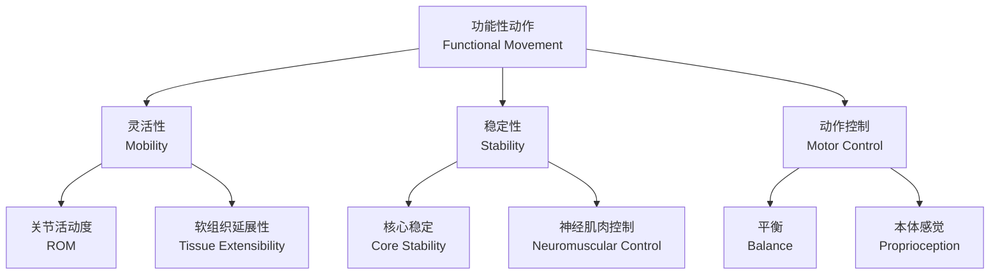
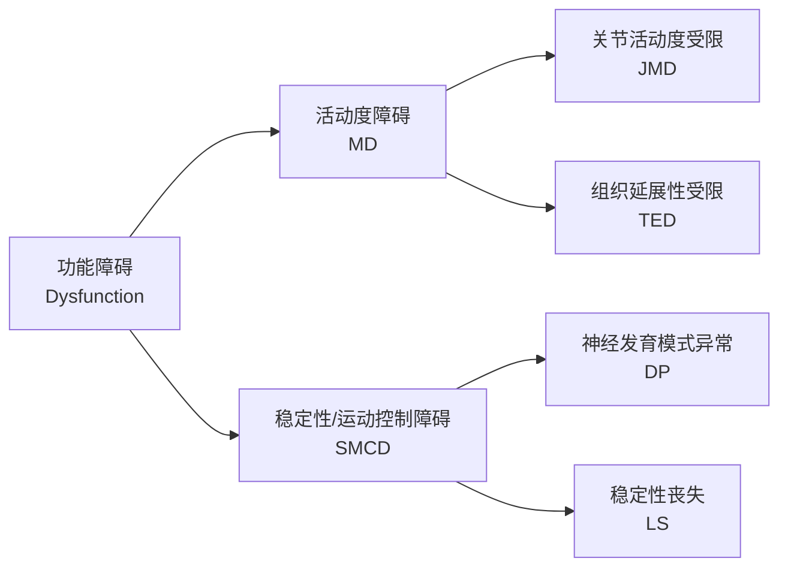
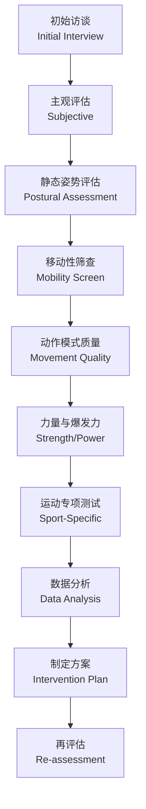

# 功能评估 (Functional Assessment)

## 概述 (Overview)

功能性评估是系统评价运动员或患者动作模式、力量、灵活性（Flexibility）、稳定性（Stability）和运动控制（Motor Control）的标准化流程。其核心目标是识别功能缺陷、预测损伤风险、指导康复决策，并为个性化训练方案提供客观依据。

功能评估不同于单纯的肌力测试或关节活动度测量，它强调在功能性动作模式下综合评价多关节协同工作的质量。

## 评估理论基础 (Theoretical Foundation)

### 动作质量模型 (Movement Quality Model)

### 功能性动作原理 (Principles)

1. **动作模式优先 (Pattern before Parts)**：先评估整体动作，再分析局部问题
2. **双侧对称性 (Bilateral Symmetry)**：左右差异是损伤风险的重要指标
3. **近端稳定性 (Proximal Stability)**：核心稳定是远端灵活性的基础
4. **动作代偿 (Compensation)**：识别身体为完成任务而采用的低效策略

## 主要评估工具 (Assessment Tools)

### 功能性动作筛查 (FMS, Functional Movement Screen)

FMS 由 Cook 等人提出，包含 7 个基础动作模式，每项评分 0-3 分，总分 21 分。

**7 项测试内容**：

| 测试项目 | 英文名称 | 评估重点 | 评分标准 |
|----------|----------|----------|----------|
| 深蹲 | Deep Squat | 髋、膝、踝灵活性 | 0-3 分 |
| 跨栏步 | Hurdle Step | 单腿支撑与髋分离 | 0-3 分 |
| 直线弓步蹲 | In-line Lunge | 下肢不对称与稳定 | 0-3 分 |
| 肩部灵活性 | Shoulder Mobility | 肩带活动度 | 0-3 分 |
| 主动直腿抬高 | Active Straight Leg Raise | 腘绳肌柔韧性 | 0-3 分 |
| 躯干稳定俯卧撑 | Trunk Stability Push-up | 核心抗伸稳定 | 0-3 分 |
| 旋转稳定性 | Rotary Stability | 核心抗旋稳定 | 0-3 分 |

**评分细则**：

- **3 分**：完成标准动作，无代偿
- **2 分**：完成代偿动作
- **1 分**：无法完成动作
- **0 分**：测试中出现疼痛

**风险阈值**：

- 总分 $\leq 14$：提示受伤风险显著升高
- 左右不对称 $\geq 1$ 分：需优先干预
- 存在 0 分（疼痛）：需医学检查

### 选择性功能动作评估 (SFMA, Selective Functional Movement Assessment)

SFMA 是 FMS 的临床扩展版本，用于疼痛患者的诊断分级。

**顶层动作**：

- 颈椎模式、上肢模式、多部位屈曲、多部位伸展
- 多部位旋转、单腿站立、高举深蹲

**分解逻辑**：

### Y-平衡测试 (YBT, Y-Balance Test)

YBT 是改良的星形偏移平衡测试（SEBT），用于评估动态稳定性和双侧不对称。

**下肢 YBT (Lower Quarter YBT)**：

- 测试姿势：单腿站立于平台中央
- 三个方向：前 (Anterior)、后内侧 (Posteromedial)、后外侧 (Posterolateral)
- 用对侧脚推动指示器测量最大伸展距离
- 计算综合得分：$Composite = \frac{3 \text{方向距离之和}}{3 \times \text{下肢长度}} \times 100$
- 双侧差异 $> 4$ cm 为显著不对称

**上肢 YBT (Upper Quarter YBT)**：

- 测试姿势：俯卧撑位，单手支撑于平台
- 三个方向：内侧 (Medial)、上外侧 (Superolateral)、下外侧 (Inferolateral)
- 用对侧手推动滑板测量距离
- 评估肩带稳定性与核心控制

### 等速肌力测试 (Isokinetic Strength Testing)

使用等速肌力测试仪以恒定角速度测量峰值力矩（Peak Torque）。

**常用测试速度**：

| 角速度 | 评估重点 | 正常参考值 |
|--------|----------|------------|
| $60°/s$ | 最大力量 | 峰值力矩 |
| $180°/s$ | 力量耐力 | 总做功 |
| $300°/s$ | 爆发力 | 平均功率 |

**关键指标**：

- **股四头肌/腘绳肌比率 (H:Q Ratio)**：
  - $60°/s$ 时应 $> 0.6$
  - 功能比率（离心 H : 向心 Q）应 $> 1.0$

- **双侧差异 (Limb Symmetry Index, LSI)**：
  - $LSI = \frac{患侧}{健侧} \times 100\%$
  - $< 90\%$ 为功能缺陷
  - 重返运动通常要求 $> 90\%$ 或 $> 95\%$

### 跳跃测试 (Jump Tests)

**单脚跳距离测试 (Single Leg Hop for Distance)**：

- 单脚站立，尽力向前跳跃
- 测量脚尖到脚跟的水平距离
- 双腿差异应 $< 10\%$

**垂直跳跃 (Vertical Jump)**：

- **反向跳跃 (CMJ, Countermovement Jump)**：评估牵张-缩短周期（SSC）效率
- **深蹲跳 (SJ, Squat Jump)**：评估向心爆发力
- 计算反应力量指数：$RSI = \frac{跳跃高度}{触地时间}}$

**重复跳跃测试 (Repeated Jump Test)**：

- 连续 5 次最大 effort 跳跃
- 记录每次接触时间（Contact Time）与腾空时间（Flight Time）
- 评估下肢刚度（Leg Stiffness）与疲劳恢复

## 专项评估工具 (Specialized Assessments)

### 平衡与本体感觉评估 (Balance and Proprioception)

**单腿站立测试 (Single Leg Stance Test)**：

- 睁眼/闭眼单腿站立
- 记录维持平衡的时间
- 闭眼测试去除视觉代偿，评估本体感觉

**压力中心测试 (COP, Center of Pressure)**：

- 使用测力台（Force Plate）记录
- 评估指标： sway area、sway velocity、椭圆面积
- 前-后方向 (AP) 与内-外方向 (ML) 分解分析

### 灵活性评估 (Flexibility Assessment)

**关节活动度 (ROM, Range of Motion)**：

| 测量部位 | 常用方法 | 正常范围 |
|----------|----------|----------|
| 肩关节屈曲 | 测角计 | $0° \sim 180°$ |
| 髋关节屈曲 | 托马斯试验 | $0° \sim 120°$ |
| 踝关节背屈 | 测角计/负重弓步 | $> 20°$ |
| 胸椎旋转 | 坐姿旋转测试 | $45°$ 每侧 |

**肌筋膜延展性 (Myofascial Extensibility)**：

- 改良托马斯试验（Modified Thomas Test）：髋屈肌延展性
- 腘绳肌被动直腿抬高（PKE）：$> 80°$ 为正常
- 肩屈测试（Back Scratch Test）：双手背侧中指间距

### 核心稳定性评估 (Core Stability Assessment)

**躯干肌肉耐力测试 (Trunk Muscular Endurance)**：

| 测试项目 | 动作描述 | 正常参考 |
|----------|----------|----------|
| 平板支撑 | 俯卧前臂支撑 | $> 60$ s |
| 侧桥支撑 | 侧卧单肘支撑 | $> 45$ s |
| 背伸耐力 | 俯卧位背伸维持 | $> 60$ s |

**核心动作质量**：

- 死虫测试（Dead Bug）：腰椎稳定性
- 鸟狗测试（Bird Dog）：对侧伸展控制
- 腹壁招募测试：腹横肌激活能力

## 评估流程与决策 (Assessment Protocol)

**标准化流程**：

1. **访谈与主观评分**：疼痛评分（VAS）、功能受限问卷（IKDC、KOOS）
2. **静态姿势评估**：脊柱排列、骨盆位置、足弓形态
3. **移动性评估**：主动与被动关节活动度、软组织延展性
4. **动作模式质量评估**：FMS 或 SFMA 分级测试
5. **力量与爆发力测试**：等速肌力、跳跃测试、等长力量
6. **运动专项测试**：与具体运动项目相关的功能性动作
7. **数据分析与报告**：双侧对比、与常模比较、优先级排序

## 重返运动标准 (Return to Sport Criteria)

| 评估维度 | 指标 | 达标标准 |
|----------|------|----------|
| 力量对称性 | LSI | $> 90\%$ |
| 跳跃对称性 | 单脚跳差异 | $< 10\%$ |
| 动态稳定 | YBT 综合分 | $> 95\%$ 或对称 $> 4$ cm |
| 动作质量 | FMS 总分 | $\geq 14$ 且无 0 分 |
| 心理 readiness | 恐惧回避信念 | 低风险评分 |

## 相关条目 (Related Entries)

- [[ReturnToSport]]
- [[ACLReconstruction]]
- [[PhysicalTherapy]]
- [[SportsInjuries]]
- [[Kinesiology]]
- [[SportsBiomechanics]]
- [[INDEX|SportsMedicine 索引]]
