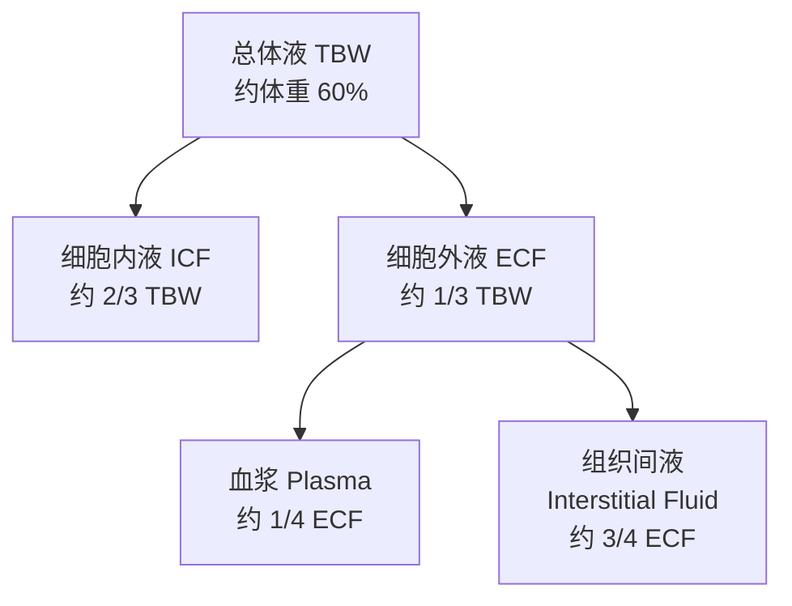
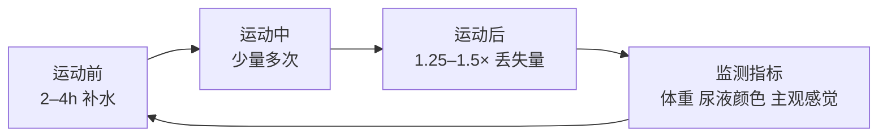

# 水合状态（Hydration）

## 概述

水合状态（Hydration Status）是指机体内水分的总量与分布状态，是维持生理功能、体温调节（Thermoregulation）和运动表现（Exercise Performance）的核心因素。水分约占成年人体重的 55–70%，其中骨骼肌含水量高达 75%，血液含水量约为 83%。

脱水（Dehydration）达到或超过体重 2% 时，即可显著降低有氧耐力、认知功能和体温调节能力。在高温环境或长时间耐力运动中，运动员的出汗率（Sweat Rate）可达 1.0–3.0 L/h，极端情况下超过 3.5 L/h。因此，制定个体化补水策略（Hydration Strategy）至关重要。

## 体液平衡的基本原理

### 体液分布

人体体液分为细胞内液（Intracellular Fluid, ICF）和细胞外液（Extracellular Fluid, ECF），后者包括血浆（Plasma）和组织间液（Interstitial Fluid）。

### 水分交换机制

- **渗透压调节**：通过抗利尿激素（ADH）和醛固酮（Aldosterone）调节肾脏对水的重吸收
- **口渴机制**：血浆渗透压升高或血容量下降时触发
- **肾脏调节**：肾小球滤过率（GFR）和肾小管重吸收共同维持水盐平衡

## 运动中水分丢失的途径

| 途径 | 占比 | 影响因素 |
|------|------|----------|
| 汗液（Sweat） | 主要途径 | 环境温度、湿度、运动强度、个体差异 |
| 尿液（Urine） | 次要途径 | 水合状态、ADH 分泌、咖啡因摄入 |
| 呼吸（Respiration） | 少量 | 通气量、环境湿度 |
| 粪便（Feces） | 微量 | 消化功能、膳食纤维 |

### 汗液成分

汗液并非纯水，含有电解质（Electrolytes）：

| 成分 | 浓度范围（mmol/L） | 丢失影响 |
|------|-------------------|----------|
| 钠（Na⁺） | 20–80 | 低钠血症风险 |
| 氯（Cl⁻） | 20–60 | 与钠协同丢失 |
| 钾（K⁺） | 2–8 | 肌肉功能影响 |
| 镁（Mg²⁺） | 0.2–1.0 | 神经肌肉兴奋性 |
| 钙（Ca²⁺） | 0.2–1.0 | 骨骼肌收缩 |

个体出汗率差异显著，可通过以下公式估算：

$$\text{出汗率} = \frac{(\text{运动前体重} - \text{运动后体重}) + \text{液体摄入} - \text{尿液排出}}{\text{运动时间}}$$

## 脱水程度分级与表现

| 程度 | 体重丢失 | 血浆渗透压 | 主要症状 |
|------|----------|------------|----------|
| 轻度（Mild） | 1–2% | 轻度升高 | 口渴、唇干、尿液颜色加深 |
| 中度（Moderate） | 2–5% | 明显升高 | 口干、头痛、注意力下降、心率加快 |
| 重度（Severe） | 5–10% | 显著升高 | 眩晕、乏力、运动表现严重下降 |
| 极重度（Critical） | >10% | 危险水平 | 循环衰竭、热射病（Heat Stroke）、意识障碍 |

## 运动补水的科学策略

### 运动前补水（Pre-exercise）

目标是在运动开始前达到最佳水合状态：

- 运动前 2–4 小时补充 **5–10 ml/kg 体重** 的液体
- 运动前 20–30 分钟补充 **200–300 ml**
- 监测尿液颜色（Urine Specific Gravity, USG < 1.020 为佳）
- 若尿液颜色深或 USG 高，额外补充液体

### 运动中补水（During Exercise）

核心目标是将体重丢失控制在 **<2%**：

- 每 15–20 分钟补充 **150–350 ml**
- 运动时间 >60 分钟：使用含碳水化合物（6–8%）和电解质（Na⁺ 300–700 mg/L）的运动饮料
- 高强度或高温环境：增加补液频率和量
- 避免一次性大量饮水（>1 L/h），以防低钠血症

### 运动后复水（Post-exercise）

恢复阶段需要补充丢失的液体和电解质：

- 每减重 1 kg 补充 **1.25–1.5 L** 液体（考虑尿液继续丢失）
- 优先选择含钠（Na⁺ 400–1100 mg/L）的饮品，促进液体保留
- 配合含碳水化合物的餐饮，促进糖原（Glycogen）合成
- 恢复时间充足时，正常饮食即可满足电解质需求

## 运动相关性低钠血症（EAH）

过量饮水而不补充电解质可导致运动相关性低钠血症（Exercise-Associated Hyponatremia, EAH），常见于马拉松（Marathon）和超马（Ultramarathon）选手。

### 病理机制

- 过量低渗液体摄入 → 血液稀释
- ADH 分泌不当（SIADH）→ 水潴留
- 钠丢失 > 摄入

### 临床表现

| 严重程度 | 血钠水平（mmol/L） | 症状 |
|----------|-------------------|------|
| 轻度 | 130–135 | 恶心、轻度头痛、手脚肿胀 |
| 中度 | 125–129 | 头痛加重、呕吐、意识模糊 |
| 重度 | <125 | 癫痫发作、脑水肿、呼吸衰竭 |

### 预防措施

- 不要饮水超过出汗量
- 使用含电解质的运动饮料
- 避免强迫性饮水
- 高风险赛事中监测体重变化

## 水合状态监测方法

| 方法 | 指标 | 优点 | 局限性 |
|------|------|------|--------|
| 体重变化 | 运动前后体重差 | 简便、无创 | 受食物、 clothing 影响 |
| 尿液颜色 | 比色卡评估 | 快速、廉价 | 受食物色素、维生素影响 |
| 尿比重（USG） | 折射仪测量 | 客观、便携 | 需设备、受疾病影响 |
| 血浆渗透压 | 实验室检测 | 金标准 | 有创、成本高 |
| 唾液渗透压 | 便携式设备 | 无创、可连续 | 受口腔卫生影响 |

## 不同环境条件下的补水要点

### 高温环境（>30°C）

- 出汗率显著增加，需提高补液量
- 增加钠的补充（Na⁺ 500–1000 mg/L）
- 运动前进行热适应（Heat Acclimatization）

### 高海拔环境（>2500 m）

- 呼吸性失水增加
- 尿量增加（高海拔性利尿）
- 需额外关注水合状态

### 冷水环境

- 口渴感降低，需主动补水
- 尿液生成可能增加

## 电解质补充策略

### 钠的补充

钠是汗液中丢失最多的电解质，补充策略因出汗率和汗液钠浓度而异：

| 出汗率（L/h） | 汗液钠浓度（mmol/L） | 建议钠摄入量（mg/h） | 运动饮料选择 |
|--------------|---------------------|---------------------|-------------|
| <0.5 | <20 | 200–300 | 普通运动饮料 |
| 0.5–1.0 | 20–40 | 300–700 | 标准电解质饮料 |
| 1.0–2.0 | 40–60 | 700–1000 | 高钠运动饮料 |
| >2.0 | >60 | 1000–1500 | 高钠饮料 + 盐片 |

### 其他电解质

| 电解质 | 丢失量 | 补充方式 | 注意事项 |
|--------|--------|----------|----------|
| 钾（K⁺） | 少量 | 香蕉、橙汁、运动饮料 | 过量补充有风险 |
| 镁（Mg²⁺） | 微量 | 坚果、绿叶蔬菜 | 缺镁可引起肌肉痉挛 |
| 钙（Ca²⁺） | 微量 | 奶制品 | 长期大量出汗需关注 |

## 不同运动项目的补水特点

| 运动项目 | 典型时长 | 出汗率 | 补水特点 |
|----------|----------|--------|----------|
| 马拉松 | 2–4 h | 1.0–2.5 L/h | 站点补水、预防低钠血症 |
| 足球 | 90 min | 1.0–2.0 L/h | 中场补水、高温比赛需暂停 |
| 网球 | 1.5–3 h | 1.5–3.0 L/h | 换边时补水、高温策略 |
| 铁人三项 | 8–17 h | 0.8–1.5 L/h | 转换区补水、多种补给 |
|  CrossFit | 20–60 min | 1.0–2.0 L/h | 组间补水、电解质补充 |
| 游泳 | 1–2 h | 0.3–0.8 L/h | 泳池中不显性失水被低估 |

## 特殊人群的补水

### 儿童与青少年

- 体温调节能力较成人差，更易脱水
- 口渴机制发育不完善，需提醒补水
- 建议运动前 10–15 分钟补充 100–250 ml
- 避免含咖啡因和高糖饮料

### 女性运动员

- 月经周期影响水合状态（黄体期体温升高）
- 口服避孕药可能影响电解质平衡
- 孕期和哺乳期需增加液体摄入

## 补水常见误区

| 误区 | 事实 |
|------|------|
| "口渴时才喝水" | 口渴已是脱水信号，应预防性补水 |
| "喝得越多越好" | 过量饮水可导致低钠血症 |
| "运动饮料比水好" | <60 分钟运动通常只需水 |
| "尿液完全无色最好" | 过度稀释可能提示过量饮水 |
| "咖啡和茶会脱水" | 适量摄入的利尿效应轻微 |
| "酒精不影响水合" | 酒精抑制 ADH，促进利尿 |

## 相关条目

- [[SportsNutrition|运动营养学]]
- [[SportsSupplements|运动补剂]]
- [[MetabolismAndExercise|运动代谢]]
- [[RecoveryAndRegeneration|恢复与再生]]
- [[Electrolytes|电解质]]
- [[Thermoregulation|体温调节]]
- [[INDEX|SportsMedicine 索引]]
