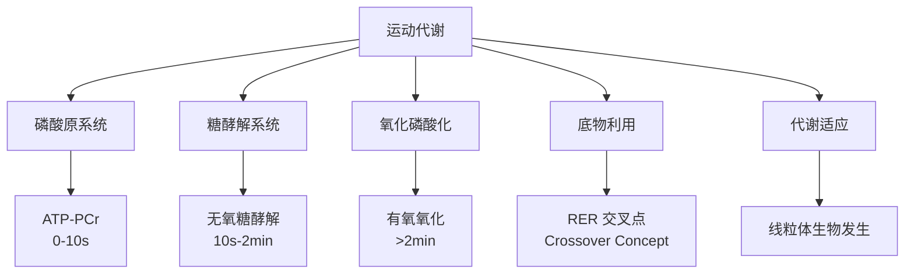
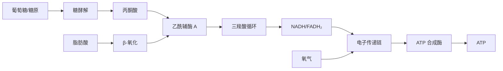

---
aliases: [MetabolismAndExercise, 运动与代谢]
tags: ['12_SportsScience', 'SportsMedicine', 'Metabolism', 'ExercisePhysiology']
created: 2026-05-17
updated: 2026-05-17
---

# 运动与代谢 (Metabolism and Exercise)

## 概述

运动代谢（Exercise Metabolism）是研究身体在不同运动强度和持续时间下如何利用能源底物产生三磷酸腺苷（Adenosine Triphosphate, ATP）的生理学科。ATP 是肌肉收缩的直接能源物质，但其体内储存量极为有限（约 100 g，仅支持数秒高强度运动），因此运动中 ATP 的持续再合成是维持运动能力的核心机制。

理解运动代谢对于制定训练计划、优化营养策略、提升运动表现和促进恢复具有重要指导意义。运动代谢的研究涉及生物化学、生理学和营养学的交叉领域。

## 三大供能系统

人体运动时的 ATP 再合成依赖三大供能系统，它们在运动中的贡献比例取决于运动强度和持续时间。

### 磷酸原系统（ATP-PCr System）

磷酸原系统是最快速的 ATP 再合成途径，无需氧气，也不产生乳酸。

**生化反应**：

$$ADP + PCr \xrightarrow{CK} ATP + Cr$$

肌酸激酶（Creatine Kinase, CK）催化磷酸肌酸（Phosphocreatine, PCr）将高能磷酸基团转移给 ADP，快速再生 ATP。

**特点**：

| 参数 | 数值/特征 |
|------|----------|
| 最大功率输出 | 约 4 W/kg 体重 |
| 持续时间 | 0-10 秒（最大强度） |
| 恢复时间 | 50% PCr 恢复需 30-60 秒；完全恢复需 3-5 分钟 |
| 能量来源 | 储备 ATP（~5 mmol/kg 干肌）+ PCr（~20 mmol/kg 干肌） |

**典型运动项目**：

- 100 米短跑
- 举重最大力量尝试
- 跳高、跳远
- 投掷项目

### 糖酵解系统（Glycolysis）

糖酵解是在细胞质中将葡萄糖或糖原分解为丙酮酸（有氧条件下）或乳酸（无氧条件下），同时产生 ATP 的代谢途径。

**净反应（无氧条件下）**：

$$\text{葡萄糖} + 2ADP + 2P_i \rightarrow 2\text{乳酸} + 2ATP + 2H_2O$$

$$\text{糖原（1 葡萄糖单位）} + 3ADP + 3P_i \rightarrow 2\text{乳酸} + 3ATP + 2H_2O$$

**特点**：

| 参数 | 数值/特征 |
|------|----------|
| 最大功率输出 | 约 2 W/kg 体重 |
| 持续时间 | 10 秒 - 2 分钟（高强度） |
| ATP 产量 | 每分子葡萄糖净产 2 ATP（无氧） |
| 副产物 | 乳酸（Lactate）、氢离子（H⁺） |

**快速糖酵解 vs. 慢速糖酵解**：

- 快速糖酵解：丙酮酸转化为乳酸，NAD⁺ 再生，维持糖酵解持续进行
- 慢速糖酵解：丙酮酸进入线粒体，通过三羧酸循环（TCA cycle）和氧化磷酸化进一步氧化

**乳酸与疲劳**：

乳酸本身并非疲劳的直接原因，但伴随产生的 H⁺ 导致：

- 细胞内 pH 下降（可降至 6.4-6.6）
- 抑制磷酸果糖激酶（PFK）活性
- 干扰钙离子与肌钙蛋白结合
- 增加疼痛感和运动知觉努力

**典型运动项目**：

- 400 米跑
- 100 米游泳
- 1000 米速度滑冰
- 高强度间歇训练（HIIT）

### 氧化磷酸化系统（Oxidative Phosphorylation）

氧化磷酸化是在线粒体中通过有氧代谢彻底氧化糖类、脂肪和少量蛋白质产生大量 ATP 的过程。

**总反应（葡萄糖）**：

$$C_6H_{12}O_6 + 6O_2 + 38ADP + 38P_i \rightarrow 6CO_2 + 6H_2O + 38ATP$$

**特点**：

| 参数 | 数值/特征 |
|------|----------|
| 最大功率输出 | 约 1 W/kg 体重 |
| 持续时间 | 2 分钟至数小时 |
| ATP 产量 | 每分子葡萄糖 ~36-38 ATP；每分子软脂酸 ~106 ATP |
| 氧气需求 | 是（最终电子受体） |

**代谢途径**：

**典型运动项目**：

- 马拉松（>2 小时）
- 长距离骑行
- 越野滑雪
- 铁人三项

## 运动中的底物选择

### 呼吸交换比（Respiratory Exchange Ratio, RER）

RER（或 RQ，呼吸商）是衡量运动中碳水化合物与脂肪氧化比例的重要指标：

$$RER = \frac{V_{CO_2}}{V_{O_2}}$$

| RER 值 | 主要燃料 | 说明 |
|--------|----------|------|
| 0.70 | 纯脂肪氧化 | 安静状态或极低强度运动 |
| 0.85 | 混合氧化 | 中等强度运动 |
| 1.00 | 纯碳水化合物氧化 | 高强度运动 |
| >1.00 | 无氧代谢参与 | 超强度运动，CO₂ 过量产生 |

### 交叉点概念（Crossover Concept）

Brooks 提出的交叉点概念描述了运动强度增加时，燃料选择从脂肪向碳水化合物转移的规律：

- 低强度运动（<50% VO₂max）：脂肪氧化占主导
- 中等强度运动（50-75% VO₂max）：碳水化合物氧化比例逐渐增加
- 高强度运动（>75% VO₂max）：碳水化合物成为主要燃料

影响因素包括：

- **训练状态**：耐力训练可提高脂肪氧化能力，使交叉点右移
- **饮食**：高碳水饮食增加糖原储备，高脂饮食提高脂肪氧化适应性
- **运动持续时间**：长时间运动中，糖原耗竭后脂肪氧化比例回升

### 肌糖原与肝糖原

- **肌糖原**：储存在骨骼肌中，直接供肌肉收缩使用，储量约 300-500 g
- **肝糖原**：储存在肝脏中，维持血糖稳定，储量约 80-100 g

**糖原耗竭时间**：

以 75% VO₂max 强度运动，肌糖原约可维持 90-120 分钟。

## 代谢适应与训练效应

### 耐力训练的代谢适应

长期耐力训练可诱导显著的代谢适应：

| 适应类型 | 机制 | 效果 |
|----------|------|------|
| 线粒体生物发生 | PGC-1α 通路激活 | 线粒体数量和体积增加 |
| 氧化酶活性提高 | 柠檬酸合成酶、细胞色素 c 氧化酶增加 | 有氧代谢能力增强 |
| 脂肪氧化能力提高 | 脂肪转运蛋白（FAT/CD36）上调 | 脂肪供能比例增加 |
| 糖原储存增加 | 糖原合酶活性上调 | 运动耐力延长 |
| 乳酸清除增强 | MCT 转运蛋白表达增加 | 乳酸阈提高 |

### 乳酸阈（Lactate Threshold, LT）

乳酸阈是指血乳酸浓度开始急剧上升的运动强度或摄氧量阈值。常用指标：

- **LT1（有氧阈）**：血乳酸首次高于静息水平（~2 mmol/L）
- **LT2（无氧阈/通气阈）**：血乳酸快速上升点（~4 mmol/L，OBLA）

训练可提高乳酸阈，使运动员能在更高强度下维持有氧代谢为主的状态。

### 高强度间歇训练（HIIT）的代谢效应

HIIT 可产生类似耐力训练的线粒体适应，改善胰岛素敏感性，增加静息脂肪氧化和显著的 EPOC。

## 运动后代谢

### 运动后过量氧耗（EPOC）

运动后恢复期内，摄氧量高于静息水平的部分称为 EPOC：

$$EPOC = EPOC_{快速成分} + EPOC_{慢速成分}$$

- **快速成分**（数分钟至 1 小时）：重新合成 ATP/PCr、氧合肌红蛋白再充氧、乳酸清除
- **慢速成分**（数小时至 24 小时以上）：体温调节恢复、激素平衡、蛋白质合成

高强度运动（抗阻训练和 HIIT）比中低强度稳态有氧产生更显著的 EPOC，但对总能量消耗的贡献通常小于 15%。

### 运动后代谢窗口

运动后 30-60 分钟为营养补充的"代谢窗口期"：肌细胞膜通透性增加，葡萄糖和氨基酸转运增强，胰岛素敏感性提高，mTOR 通路激活。建议及时补充碳水化合物和蛋白质（比例约 3:1 至 4:1）。

## 运动与代谢健康

### 胰岛素敏感性

运动是改善胰岛素敏感性的最有效非药物干预手段：

- 急性效应：单次运动可提高胰岛素敏感性 24-72 小时
- 慢性效应：规律运动持续改善胰岛素信号通路
- 机制：GLUT4 转位增加、AMPK 激活、脂肪组织减少

### 脂肪代谢与体重管理

- 低强度长时间运动：脂肪氧化比例高，但总能量消耗较低
- 中高强度运动：总能量消耗高，EPOC 显著
- 结合策略：HIIT + 稳态有氧 + 抗阻训练效果最佳

## 相关条目

- [[SportsNutrition|运动营养学]]
- [[Hydration|水合作用]]
- [[SportsSupplements|运动补剂]]
- [[RecoveryAndRegeneration|恢复与再生]]
- [[12_SportsScience/SportsTraining/EnduranceTraining|耐力训练]]
- [[INDEX|SportsMedicine 索引]]

