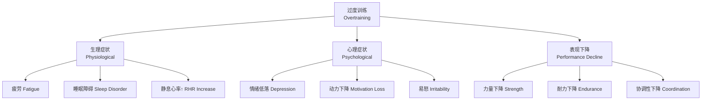
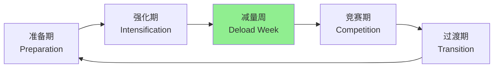

# 过度训练 (Overtraining)

## 概述 (Overview)

过度训练综合征（Overtraining Syndrome, OTS）是由于训练负荷长期超过身体恢复能力而导致的一种适应不良状态（Maladaptive State）。表现为持续运动表现下降、疲劳累积和情绪障碍，恢复期可达数周至数月，严重者甚至需要完全停训半年以上。

过度训练应与功能性过度训练（Functional Overreaching, FOR）和非功能性过度训练（Non-functional Overreaching, NFOR）区分：

| 状态 | 训练负荷 | 恢复时间 | 表现变化 |

|------|----------|----------|----------|

| 功能性过度训练 FOR | 短期增加 | 数天至一周 | 超量恢复后提升 |

| 非功能性过度训练 NFOR | 持续增加 | 数周 | 恢复至基线 |

| 过度训练综合征 OTS | 长期过量 | 数周至数月 | 持续低于基线 |

## 临床表现 (Clinical Manifestations)

过度训练综合征涉及多系统功能紊乱：

| 系统 | 症状 | 机制 |

|------|------|------|

| 生理系统 | 持续疲劳、静息心率升高、睡眠障碍、食欲下降 | 自主神经失调 |

| 运动表现 | 成绩停滞或下降、恢复变慢、协调性降低 | 神经肌肉功能受损 |

| 免疫系统 | 感染频率增加、伤口愈合缓慢 | 免疫抑制 |

| 心理系统 | 情绪低落、动力下降、易怒、焦虑 | 神经递质失衡 |

| 内分泌系统 | 皮质醇异常、睾酮/皮质醇比下降 | HPA轴功能紊乱 |

## 分期与诊断 (Staging and Diagnosis)

### 过度训练分期

- **功能性过度训练（Stage 1）**: 轻度症状，休息后快速恢复，属于正常训练反应
- **交感型过度训练（Stage 2）**: 交感神经过度激活，静息心率升高、兴奋性增高、睡眠障碍
- **副交感型过度训练（Stage 3）**: 副交感神经主导，持续疲劳和抑制状态、动力丧失、抑郁倾向

### 诊断标准

目前尚无单一金标准诊断 OTS，需综合评估：

1. **运动表现持续下降**（>2 周）
2. **训练负荷与恢复失衡**
3. **排除其他疾病**（感染、贫血、甲状腺功能异常等）
4. **心理评估**（POMS 量表）
5. **生理指标异常**（HRV 降低、静息心率升高）

## 生理机制 (Physiological Mechanisms)

### 自主神经系统失衡

心率变异性（Heart Rate Variability, HRV）是评估自主神经功能的重要指标：

$$HRV = \text{SDNN 或 RMSSD}$$

OTS 患者常见 HRV 降低，反映副交感神经张力下降。

### 神经内分泌变化

- **皮质醇（Cortisol）**：晨醒后升高或昼夜节律异常
- **睾酮/皮质醇比（T/C Ratio）**：下降提示合成代谢-分解代谢失衡
- **生长激素（GH）**：分泌减少
- **儿茶酚胺**：反应性降低

### 谷氨酰胺假说

血浆谷氨酰胺（Glutamine）浓度下降被认为是 OTS 的早期标志：

$$\text{谷氨酰胺} < 400\,\mu\text{mol/L} \Rightarrow \text{过度训练风险}$$

## 处理与恢复 (Treatment and Recovery)

### 急性处理

1. **休息**：完全停训 1–2 周或减少 50–80% 训练量
2. **睡眠**：保证 7–9 小时，必要时增加午睡
3. **营养**：充足蛋白质和总能量摄入，补充微量元素
4. **压力管理**：减少非训练压力源

### 渐进恢复训练

| 阶段 | 时间 | 训练量 | 训练强度 |

|------|------|--------|----------|

| 完全休息 | 1–2 周 | 0% | 0% |

| 轻度活动 | 第 3 周 | 30% | 40% |

| 中度恢复 | 第 4–5 周 | 50% | 60% |

| 渐进增加 | 第 6–8 周 | 70% | 80% |

| 正常训练 | >8 周 | 100% | 100% |

## 预防策略 (Prevention Strategies)

### 训练监控

- **主观疲劳量表**（RPE, Rating of Perceived Exertion）：sRPE = RPE × 训练时长（分钟）
- **心率变异性**（HRV）：每日晨起测量
- **睡眠质量评分**
- **心理状态评估**

### 周期化训练

合理周期化（Periodization）是预防 OTS 的核心：

### 恢复策略

- **主动恢复**：低强度有氧运动促进血液循环
- **物理治疗**：按摩、冷水浴、压缩衣
- **营养补充**：蛋白质、碳水化合物、抗氧化剂
- **心理技能训练**：放松训练、正念冥想

## 营养与过度训练 (Nutrition and Overtraining)

### 能量可用性

能量可用性（Energy Availability, EA）是预防过度训练的重要营养指标：

$$EA = \frac{\text{能量摄入} - \text{运动消耗}}{\text{去脂体重}}$$

| 能量可用性状态 | 范围 | 风险 |

|--------------|------|------|

| 充足 | ≥45 kcal/kg FFM/天 | 低 |

| 轻度不足 | 30–45 kcal/kg FFM/天 | 中等 |

| 严重不足 | <30 kcal/kg FFM/天 | 高（RED-S 风险）|

### 关键营养素

| 营养素 | 作用 | 推荐摄入 |

|--------|------|----------|

| 碳水化合物 | 糖原补充、训练燃料 | 5–7 g/kg/天 |

| 蛋白质 | 肌肉修复、免疫支持 | 1.6–2.2 g/kg/天 |

| 铁 | 氧气运输 | 根据缺乏程度补充 |

| 维生素 D | 免疫功能、骨骼健康 | 1000–2000 IU/天 |

| 抗氧化剂 | 减轻氧化应激 | 食物中获取 |

## 不同运动项目的特点

| 运动类型 | 过度训练特点 | 重点关注 |

|----------|-------------|----------|

| 耐力运动 | 副交感型为主 | HRV、静息心率 |

| 力量运动 | 交感型为主 | 力量输出、睡眠质量 |

| 技巧运动 | 心理症状突出 | 动机、情绪状态 |

| 混合运动 | 综合型 | 多指标综合监控 |

## 监测指标 (Monitoring Indicators)

| 指标 | 正常范围 | 过度训练信号 | 测量频率 |

|------|----------|-------------|----------|

| 静息心率 (RHR) | 个体基线 | 升高 >10 bpm | 每日 |

| HRV (RMSSD) | 个体基线 | 下降 >10% | 每日 |

| 睡眠质量 | 7–9 小时 | <6 小时或质量差 | 每日 |

| POMS 量表 | 正常范围 | 负性情绪升高 | 每周 |

| 垂直跳高度 | 个体基线 | 下降 >10% | 每周 |

| 睾酮/皮质醇比 | >0.3 | <0.2 | 每月 |

## 经典教材与参考资料

- 《运动医学》(Sports Medicine) — Brukner & Khan
- 《过度训练综合征：诊断、治疗与预防》
- 《运动员恢复与表现优化》
- Meeusen et al. (2013). Prevention, diagnosis and treatment of the overtraining syndrome

## 相关条目

- [[RecoveryAndRegeneration|恢复与再生 (Recovery)]]
- [[Periodization|周期化 (Periodization)]]
- [[FatigueMonitoring|疲劳监测 (Fatigue Monitoring)]]
- [[SportsPsychology|运动心理学 (Sports Psychology)]]
- [[HeartRateVariability|心率变异性 (HRV)]]
- [[INDEX|SportsMedicine 索引]]
