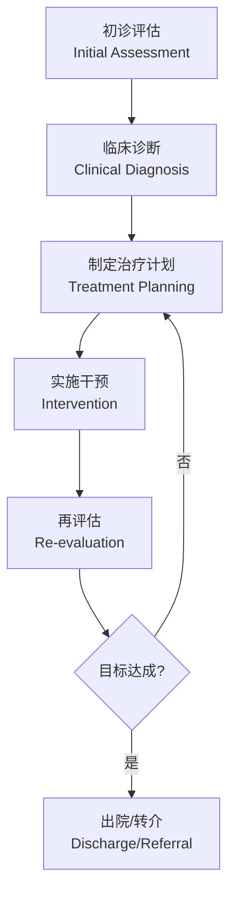

# 物理治疗 (Physical Therapy)

## 概述

物理治疗 (Physical Therapy, PT) 是通过运动疗法、手法治疗、物理因子治疗等非侵入性手段，恢复、维持和优化个体运动功能与活动能力的临床医疗专业。在运动医学 (Sports Medicine) 领域，物理治疗师 (Physical Therapist) 是运动员康复团队的核心成员，负责运动损伤的评估、诊断、治疗和预防。

现代物理治疗以循证医学 (Evidence-Based Medicine) 为基础，强调功能导向和患者主动参与。国际物理治疗联盟 (WCPT) 将物理治疗定义为促进、维持和重建运动与功能健康的专业。物理治疗师需具备解剖学、生理学、生物力学、神经科学和运动学等多学科知识背景。

## 评估体系 (Assessment)

### 主观评估

主观评估通过系统问诊获取患者病史和主诉信息：

- **现病史 (HPI)**：损伤机制、疼痛性质、加重/缓解因素
- **功能受限**：日常生活活动 (ADL) 受限程度
- **既往史**：既往损伤、手术史、慢性疾病
- **用药史**：是否使用抗凝药、镇痛药等影响治疗的药物
- **患者目标**：短期目标 (2~4 周) 与长期目标 (3~6 个月)

### 客观评估

| 评估项目 | 英文 | 常用工具/方法 | 正常参考值 |
|---------|------|-------------|----------|
| 关节活动度 | ROM | 量角器、电子测角仪 | 因关节而异 |
| 肌力测试 | MMT | 徒手肌力测试、等速肌力仪 | 5/5 级 |
| 功能性动作筛查 | FMS | 深蹲、跨栏步、直线弓步等 7 项 | 满分 21 分 |
| 平衡功能 | Balance | Y-Balance Test、单腿站立 | >30s |
| 本体感觉 | Proprioception | 关节位置重现测试 | 误差 <5° |

### 特殊检查测试

针对常见运动损伤的特殊检查：

- **膝关节**：Lachman Test (前交叉韧带)、McMurray Test (半月板)、Apprehension Test (髌骨不稳)
- **肩关节**：Empty Can Test (冈上肌)、Apprehension Test (前方不稳)、Hawkins Test (肩峰下撞击)
- **踝关节**：Anterior Drawer Test (距腓前韧带)、Talar Tilt Test (跟腓韧带)
- **腰椎**：Straight Leg Raise Test (神经根张力)、Slump Test (神经动力学)

## 运动疗法 (Therapeutic Exercise)

运动疗法是物理治疗的核心干预手段，遵循 FITT 原则（频率 Frequency、强度 Intensity、时间 Time、类型 Type）。

### 力量训练 (Strength Training)

| 训练类型 | 英文 | 特点 | 适用阶段 |
|---------|------|------|---------|
| 等长训练 | Isometric | 肌肉长度不变，关节角度固定 | 急性期、术后早期 |
| 向心训练 | Concentric | 肌肉缩短产生力量 | 恢复中期 |
| 离心训练 | Eccentric | 肌肉在拉长状态下产生力量 | 肌腱病康复、晚期 |
| 等速训练 | Isokinetic | 恒定角速度，阻力自适应 | 功能评估与高级训练 |

**渐进负荷原则**：遵循 10% 原则，每周训练负荷增加不超过 10%，避免再次损伤。

### 柔韧性训练 (Flexibility Training)

- **静态拉伸 (Static Stretching)**：维持拉伸位 15~30 秒，适用于放松和增加关节活动度
- **动态拉伸 (Dynamic Stretching)**：控制性摆动或主动活动，适用于运动前热身
- **PNF 拉伸 (Proprioceptive Neuromuscular Facilitation)**：利用神经肌肉反射原理，效果优于传统静态拉伸

### 神经肌肉控制训练 (Neuromuscular Control)

神经肌肉控制是预防再损伤的关键：

- **平衡训练**：从双足静态→单足静态→动态不稳定面（如 BOSU 球）
- **本体感觉训练**：闭眼单腿站立、扰动训练
- **运动模式重建**：深蹲、弓步蹲、落地模式矫正，强调膝关节对准第二脚趾

### 心肺耐力训练 (Cardiovascular Training)

术后或长期制动后逐步恢复有氧运动：

$$\text{目标心率} = (220 - \text{年龄}) \times \text{目标强度百分比}$$

初始强度为最大心率的 50~60%，逐步增加至 70~85%。

## 手法治疗 (Manual Therapy)

手法治疗是物理治疗师运用双手进行的治疗技术，需经过专门认证。

### 关节松动术 (Joint Mobilization)

| 学派 | 英文 | 技术特点 | 适应症 |
|------|------|---------|--------|
| Maitland | Maitland Concept | I~V 级振动技术，以缓解疼痛和恢复活动度为目标 | 关节疼痛、僵硬 |
| Mulligan | Mulligan Concept | 被动生理运动 + 关节滑动，无痛原则 | 关节活动受限 |
| Kaltenborn | Kaltenborn Concept | 牵引 + 滑动，III 级牵伸技术 | 关节僵硬、粘连 |

### 软组织治疗 (Soft Tissue Therapy)

- **筋膜松解 (Myofascial Release)**：针对筋膜粘连和紧张
- **神经松动术 (Neurodynamic Mobilization)**：利用神经滑行 (Neural Gliding) 技术缓解神经粘连，如坐骨神经松动、正中神经松动

## 物理因子治疗 (Physical Agents / Modalities)

物理因子治疗利用声、光、电、磁、热、冷等物理因素作用于人体。

| 物理因子 | 英文 | 作用机制 | 适应症 | 禁忌症 |
|---------|------|---------|--------|--------|
| 冷疗 | Cryotherapy | 血管收缩、降低代谢、镇痛 | 急性损伤 (48h 内)、肿胀 | 雷诺病、感觉障碍 |
| 热疗 | Thermotherapy | 血管扩张、促进血流、增加组织延展性 | 慢性疼痛、肌肉痉挛 | 急性炎症、出血倾向 |
| 超声波 | Ultrasound | 微按摩、空化效应、热效应 | 软组织粘连、肌腱炎 | 骨折未愈合部位、孕妇腹部 |
| 电刺激 | Electrical Stimulation | 神经肌肉激活、镇痛 (TENS) | 肌力重建、术后萎缩、慢性疼痛 | 心脏起搏器患者、颈动脉窦 |
| 激光治疗 | Laser Therapy | 光生化调节、促进 ATP 合成 | 浅表炎症、伤口愈合 | 眼睛、甲状腺 |
| 冲击波 | Shockwave | 机械应力、促进血管新生 | 慢性肌腱病、钙化性肌腱炎 | 出血倾向、肿瘤区域 |

## 物理治疗流程 (Clinical Decision Making)

### 治疗计划制定

基于 ICF 框架（国际功能、残疾和健康分类），治疗目标应包含：
- **身体功能与结构层面**：疼痛缓解、关节活动度恢复、肌力增强
- **活动层面**：步行、上下楼梯、跑跳功能恢复
- **参与层面**：重返运动、重返工作

## 常见运动损伤的物理治疗

### 前交叉韧带 (ACL) 重建术后康复

| 阶段 | 时间 | 目标 | 重点干预 |
|------|------|------|---------|
| 炎症控制期 | 0~2 周 | 消肿、恢复伸膝、激活股四头肌 | 冰敷、电刺激、直腿抬高 |
| 早期强化期 | 2~6 周 | 恢复全 ROM、步态正常化 | 闭链运动、功率自行车 |
| 功能恢复期 | 6~12 周 | 单腿力量对称性 >80% | 单腿训练、敏捷性训练 |
| 重返运动期 | 3~6 月 | 通过功能测试、心理准备好 | 运动专项训练、落地模式评估 |

### 肩袖损伤康复

肩袖 (Rotator Cuff) 损伤康复强调肩胛骨稳定性与肩袖渐进负荷：
- 早期：钟摆运动、被动活动度、等长收缩
- 中期：肩袖渐进抗阻、肩胛稳定肌训练
- 后期：功能性过顶动作、投掷程序 (Throwing Program)

## 康复阶段模型 (Rehabilitation Phases)

| 阶段 | 英文 | 持续时间 | 核心目标 |
|------|------|---------|---------|
| 急性期 | Acute Phase | 0~72 小时 | 控制炎症、保护组织、减轻疼痛 |
| 亚急性期 | Subacute Phase | 3 天~6 周 | 恢复活动度、激活肌肉、重建神经肌肉控制 |
| 重塑期 | Remodeling Phase | 6 周~6 月 | 力量恢复、功能训练、逐步回归运动 |
| 功能期 | Functional Phase | 3~6 月+ | 运动专项训练、预防再损伤 |

## 物理治疗质量控制 (Quality Control)

### 疗效评估指标

- **疼痛评分**：VAS 视觉模拟评分 (0~10 分)
- **功能评分**：KOOS (膝关节)、DASH (上肢)、Oswestry (腰椎)
- **重返运动标准 (Return to Sport Criteria)**：
  - 患侧力量达到健侧 90% 以上
  - 通过功能性动作测试 (Y-Balance, Single-leg Hop)
  - 心理状态准备好 (恐惧回避信念问卷 FABQ)

## 运动损伤预防 (Injury Prevention)

预防运动损伤比治疗更为重要，物理治疗师在损伤预防中发挥关键作用。

### 损伤风险筛查

| 筛查项目 | 工具/方法 | 风险指标 |
|---------|----------|---------|
| 下肢生物力学 | 二维/三维步态分析 | 膝关节外翻角度 >8° |
| 核心稳定性 | 躯干稳定俯卧撑测试 | 性别特异性标准差 |
| 落地模式 | 落地错误评分系统 (LESS) | 评分 >5 分 |
| 柔韧性 | 坐位体前屈、托马斯测试 | 低于同龄人均值 1SD |

### 预防性训练计划 (FIFA 11+ 等)

- **热身阶段**：慢跑、动态拉伸、加速跑
- **核心训练**：躯干稳定性、髋部控制、下肢力量
- **落地训练**：双足/单足落地模式矫正
- **放松阶段**：静态拉伸

研究表明，系统性的预防性训练可降低 ACL 损伤风险 50% 以上。

## 经典教材与资源

- Kolt & Snyder-Mackler《Physical Therapies in Sport and Exercise》
- Brukner & Khan《Brukner & Khan's Clinical Sports Medicine》
- Kisner & Colby《Therapeutic Exercise: Foundations and Techniques》
- 王艳《运动物理治疗学》
- 李建平等《骨科术后康复指南》

## 相关条目

- [[Rehabilitation]]
- [[SportsMedicine]]
- [[FunctionalAssessment]]
- [[SportsMassageAndManualTherapy]]
- [[ExercisePhysiology]]
- [[INDEX|SportsMedicine 索引]]
