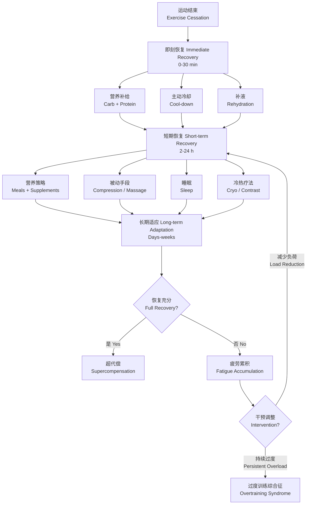

# 恢复与再生

## 概述

恢复与再生（Recovery and Regeneration）是指运动后身体从训练或比赛疲劳（Fatigue）中恢复并提高适应能力（Adaptation）的综合过程体系。科学安排恢复策略可以加速疲劳消除、降低损伤风险（Injury Risk）、提升训练质量和竞技表现。恢复不仅涉及生理层面的修复（组织修复、能量储存补充、代谢废物清除），还包括神经系统的再生和心理疲劳的缓解。高水平运动员在训练负荷与恢复之间寻求最佳平衡——过度训练（Overtraining）的本质是恢复不足累积导致的机能衰减综合征。个体化恢复方案需考虑运动项目、训练强度、个体差异和环境因素的多维交互。

## 疲劳与恢复的神经生理学基础

运动诱导的疲劳可分为外周疲劳（Peripheral Fatigue）和中枢疲劳（Central Fatigue）。外周疲劳涉及肌纤维内的代谢物堆积（乳酸、氢离子、无机磷酸盐）、糖原耗竭、肌浆网钙离子释放受损和肌原纤维微损伤。中枢疲劳涉及神经递质（5-羟色胺、多巴胺、去甲肾上腺素）失调、脊髓α运动神经元兴奋性下降、以及前额叶皮层活动改变。恢复过程的核心目标是逆转上述变化，包括：
- 维持酸碱平衡（Acid-Base Balance），恢复pH至静息水平
- 纠正电解质（Electrolyte）和水合状态
- 通过线粒体氧化磷酸化再合成ATP和磷酸肌酸（Phosphocreatine, PCr）
- 通过糖异生（Gluconeogenesis）和肝脏糖原分解补充肌糖原（Muscle Glycogen）
- 通过泛素-蛋白酶体系统和自噬（Autophagy）清除损伤蛋白
- 卫星细胞（Satellite Cell）激活促进肌纤维修复与再生

## 恢复策略分类

## 恢复策略详述

### 主动恢复（Active Recovery）

- **低强度有氧**：训练后 10-20 分钟低强度骑行或慢跑（心率 $\leq 120$ bpm），促进乳酸清除（Lactate Clearance）和血流恢复
- **放松性游泳**：水的浮力和静水压有助于肌肉放松和淋巴回流（Lymphatic Return），水温 26-28°C
- **放松拉伸**：运动后即刻进行低强度动态拉伸或PNF拉伸，维持关节活动度

### 营养恢复（Nutritional Recovery）

- **运动后补给窗（Post-exercise Window）**：运动后 30-60 分钟内摄入 1.0-1.5 g/kg 碳水化合物 + 20-40 g 蛋白质，快速补充肌糖原并启动蛋白质合成（Muscle Protein Synthesis, MPS）
- **水分电解质**：根据体重丢失按 1.25-1.5 倍补充，每丢失 1 kg 体重补充 1.25-1.5 L 液体
- **抗氧化营养素**：富含多酚（Polyphenols）的食物（樱桃汁、蓝莓、石榴）有助于减轻运动诱导的氧化应激（Oxidative Stress）
- **ω-3脂肪酸**：具有抗炎作用，有助于减少运动后肌肉酸痛
- **蛋白质类型选择**：乳清蛋白（Whey Protein）快速吸收，酪蛋白（Casein）缓慢释放，睡前摄入酪蛋白有利于整夜氨基酸供应

### 睡眠恢复（Sleep Recovery）

- 运动员推荐 8-10 小时/晚 + 必要时午睡 20-30 分钟
- 睡眠不足可降低糖原合成、增加皮质醇（Cortisol）、损害免疫功能（Immune Function）和认知表现
- 深度睡眠（Slow Wave Sleep, SWS）是生长激素（Growth Hormone, GH）分泌高峰期，促进组织修复
- 睡眠卫生优化：固定作息、睡前减少蓝光暴露、保持卧室凉爽（18-22°C）暗静
- 睡眠追踪工具：可穿戴设备监测睡眠时长和质量，结合主观睡眠评分

### 恢复性训练手段

- **泡沫轴（Foam Rolling）/筋膜枪**：运动后即刻使用降低肌肉张力（Muscle Tone），改善组织顺应性
- **拉伸（Stretching）**：静态拉伸放在运动后，每次拉伸 30-60 秒，拉伸感中等为宜
- **压缩装备（Compression Garments）**：梯度压缩衣/袜可促进静脉回流（Venous Return）、减轻延迟性肌肉酸痛（Delayed Onset Muscle Soreness, DOMS）
- **按摩（Massage）**：运动按摩降低肌张力、促进组织修复、减少炎症因子（IL-6, TNF-α）

### 物理恢复手段

- **冷疗（Cold Therapy）**：冷水浸泡（Cold Water Immersion, 10-15°C, 10-15 分钟）减轻炎症和DOMS。但需注意过度冷疗可能抑制适应性蛋白合成信号（mTOR通路）
- **冷热交替（Contrast Water Therapy, CWT）**：3-4 轮冷热交替（热 3 分钟 / 冷 1 分钟），促进血管舒缩和淋巴循环
- **全身冷冻疗法（Whole Body Cryotherapy, WBC）**：-110°C 至 -140°C 暴露 2-4 分钟，但证据级低于冷水浸泡
- **热水浴/桑拿（Hot Bath/Sauna）**：促进血管舒张、肌肉放松和热休克蛋白（HSP）表达
- **加压血流限制训练（Blood Flow Restriction Training, BFR）**：低负荷下实现肌肉肥大和恢复效果

## 恢复监测

| 指标 | 正常参考 | 异常提示 |
|------|---------|---------|
| 静息心率（Resting HR） | 正常基线 | 持续升高 $\ge 5$ bpm 提示疲劳累积 |
| 心率变异性（HRV） | 个体基线 | 下降提示自主神经（Autonomic）疲劳 |
| 主观疲劳评分（RPE） | 与预期匹配 | 偏离过大提示异常状态 |
| 睡眠质量 | $\ge 7$ h，深睡充足 | 睡眠不足影响恢复 |
| 晨起体重 | $\pm 1\%$ 范围内 | 持续下降提示脱水或过度训练 |
| 血肌酸激酶（CK） | 正常$\lt 200$ U/L | 升高提示肌肉损伤 |
| 血尿素氮（BUN） | 正常范围 | 升高提示蛋白质分解增加 |
| 主观恢复评分（TQR） | $\ge 14$ 分 | 低于 14 提示恢复不充分 |

## 超代偿与周期化恢复

超代偿（Supercompensation）是指训练刺激后身体在恢复期超越基线水平的现象。周期化恢复（Periodized Recovery）是系统安排训练负荷与恢复的宏观策略：
- **微周期（Microcycle, 1周）**：安排每周的恢复日和主动恢复
- **中周期（Mesocycle, 3-6周）**：每 3-4 周安排减量周（Deload Week），负荷降至 50-70%
- **大周期（Macrocycle, 1年）**：赛季结束后的恢复期（Transition Phase）保证 2-4 周主动休息

恢复训练的原则包括：循序渐进（Progressive Overload维持为前提）、个体化调整（Individualization）和训练-恢复平衡（Training-Recovery Balance）。恢复不足导致的过度训练综合征表现为长期疲劳、表现下降、免疫抑制和情绪障碍，需通过减少训练量和增加恢复措施进行处理。

## 恢复创新技术

近年来恢复领域的技术创新包括：脉冲电磁场（Pulsed Electromagnetic Field, PEMF）、红光/红外光疗（Photobiomodulation, PBM）、压缩脉冲恢复系统（Normatec等）、恢复性浮力舱（Floatation Tank）、以及基于人工智能的恢复管理系统。这些技术的证据基础正在积累中，但传统基础恢复策略（营养、睡眠、主动恢复）仍是一线推荐。

## 不同训练类型的恢复策略

### 耐力训练恢复
耐力训练（Endurance Training）导致显著的糖原耗竭和肌肉微损伤。关键恢复策略包括：
- 营养策略：高碳水化合物（8-10 g/kg/天）促进肌糖原超量补偿（Glycogen Supercompensation）
- 补液：重视钠离子补充，使用电解质饮料（含 460-690 mg/L 钠）
- 压缩装备：跑步后穿着梯度压缩袜可减轻下肢水肿并促进代谢废物清除
- 温和有氧恢复：运动后即刻进行 15-20 分钟低强度骑行或水中慢跑

### 力量训练恢复
大强度力量训练（Strength Training）以肌纤维微损伤、神经肌肉疲劳和结缔组织应力为主要特征。恢复建议：
- 蛋白质摄入：运动后即刻 0.4-0.5 g/kg 优质蛋白质（乳清蛋白），每 3-4 小时间隔摄入
- 肌酸（Creatine Monohydrate）补充：5 g/天有助于磷酸肌酸再生和肌力恢复
- 主动恢复：低强度有氧运动促进血流而不干扰蛋白质合成信号
- 充分间隔：同一肌群力量训练至少间隔 48 小时（高频训练采用分化训练 Split Routine）

### 高强度间歇训练恢复
高强度间歇训练（HIIT）对无氧供能系统、神经肌肉协调和中枢神经系统负荷极大。恢复策略重点：
- 训练后即刻主动冷却（5-10 分钟低强度）
- 碳水化合物补充重视快速吸收型（麦芽糊精 Maltodextrin + 果糖 Fructose混合）
- 重视神经系统恢复：冥想、正念（Mindfulness）和呼吸训练降低交感张力
- 训练频率控制：HIIT每周不超过 3-4 次，两次 HIIT 之间安排低强度训练或完全休息

## 生物化学恢复监测指标

| 指标 | 正常范围 | 疲劳/过度训练提示 |
|------|---------|-----------------|
| 血清肌酸激酶（CK） | 男 $\lt$ 200 U/L，女 $\lt$ 150 U/L | 持续 $\gt$ 500 U/L 提示显著肌损伤 |
| 血尿素氮（BUN） | 7-20 mg/dL | 升高提示蛋白质分解增加 |
| 血清皮质醇（Cortisol） | 晨 5-25 μg/dL | 持续升高提示下丘脑-垂体-肾上腺轴失调 |
| 睾酮/皮质醇比值 | 个体基线 | 比值下降 $\gt$ 30% 提示分解代谢占优 |
| C反应蛋白（hs-CRP） | $\lt$ 1 mg/L | 升高提示全身炎症反应 |
| 肌红蛋白（Myoglobin） | $\lt$ 90 μg/L | 升高提示严重肌损伤（警惕横纹肌溶解 Rhabdomyolysis） |
| 血乳酸（Blood Lactate） | 静息 $\lt$ 2 mmol/L | 运动后恢复期清除速率减慢提示恢复能力下降 |

## 性别与年龄因素对恢复的影响

### 性别差异
- **女性恢复特点**：雌激素（Estrogen）具有抗氧化特性，可能减少运动诱导的氧化应激。女性在卵泡期（Follicular Phase）相比黄体期（Luteal Phase）从训练中恢复更迅速。女性肌肉糖原存储低于男性，运动中糖原耗竭更快，营养恢复策略需针对性调整
- **男性恢复特点**：睾酮对蛋白质合成具有积极作用，但高强度训练后睾酮水平可能出现短暂下降

### 年龄差异
- **青少年运动员**：生长发育叠加训练负荷需要更充足的恢复时间。睡眠需求 （9-10 小时/天）高于成年人。营养需求需同时满足生长和恢复的双重需求。青少年恢复监测需关注生长痛（Growing Pain）和骨骺炎（Apophysitis）的鉴别
- **中老年运动员**：随着年龄增长，基础代谢率（BMR）下降，蛋白质合成速度放缓。睡眠结构改变（深睡眠减少）影响生长激素释放。恢复时间延长——50岁以上运动员可能需要 72-96 小时的充分恢复窗口。重视关节恢复和软组织修复，补充维生素D和钙质

## 运动专项恢复方案

### 足球
足球比赛涉及多次冲刺、变向和身体对抗，比赛后 48 小时糖原显著耗竭。恢复策略：比赛后即刻摄入 1.2 g/kg 碳水化合物 + 0.4 g/kg 蛋白质；冷水浸泡 10-15 分钟；次日低强度主动恢复训练；48 小时后逐步恢复训练负荷

### 篮球
篮球有背靠背比赛（Back-to-Back Games）特征，恢复窗口有限。策略包括：赛后即刻营养补充、压缩装备使用、睡眠优化、冷热交替浴、神经肌肉电刺激（NMES）辅助激活

### 游泳
水中训练和比赛的恢复特点：训练后温水淋浴（避免冷水引发肌肉痉挛）；重视肩关节（Swimmer's Shoulder预防）和肩袖肌群的放松；呼吸肌疲劳（Respiratory Muscle Fatigue）的恢复性训练

### 马拉松/长跑
长距离跑后 48-72 小时为急性恢复期。策略：立即补充碳水化合物和蛋白质；抬高下肢减轻水肿；压缩袜持续穿 24 小时；轻柔拉伸和泡沫轴滚动避免过度按压；重视足底筋膜和小腿三头肌的针对性恢复

## 水合状态与恢复

水合状态（Hydration Status）显著影响恢复过程。脱水 $\gt 2\%$ 体重即可导致运动表现下降和恢复延迟。补液策略的核心原则：
- **运动前**：运动前 4 小时摄入 5-7 mL/kg 液体，确保尿液颜色为淡黄色
- **运动中**：每 15-20 分钟摄入 150-300 mL 液体（取决于出汗率和环境温度）
- **运动后**：补充量为体重丢失的 1.25-1.5 倍。出汗率计算方法：运动前后体重差 + 液体摄入量
- **钠补充**：出汗率高时（$\gt 1.2$ L/h）需补充钠 1-2 g/L，通过含电解质饮料或运动后膳食补充

尿液比重（Urine Specific Gravity, USG）是方便的水合监测指标：USG $\le 1.020$ 表示充分水合，USG $\gt 1.030$ 表示脱水。

## 温度调节与恢复

环境温度调节策略对恢复质量有直接影响：
- **运动后高温环境**：体温持续升高影响睡眠质量、增加心血管负担。快速降温策略包括冷毛巾敷颈部和前额、冰浆饮料（Ice Slurry）摄入、冷空气暴露（18-20°C）
- **运动后低温环境**：适当的保暖（Warm Layer）防止肌肉僵硬和免疫功能下降
- **桑拿与热水浴**：运动后间隔 2 小时以上使用，避免与训练叠加的热负荷。桑拿 10-15 分钟（80-90°C）可促进放松和排毒，但不建议大量出汗后立刻使用

## 心理恢复策略

心理疲劳（Mental Fatigue）与生理疲劳交互影响恢复。心理恢复策略包括：
- **系统脱敏（Systematic Desensitization）**：通过渐进放松技术降低神经肌肉紧张
- **正念冥想（Mindfulness Meditation）**：每日 10-20 分钟，降低皮质醇水平和焦虑感
- **心理分离（Psychological Detachment）**：从运动环境中脱离，进行非运动相关活动（阅读、社交、音乐等）
- **自我对话（Self-talk）调整**：使用恢复性自我对话替代批判性自我评价
- **恢复-压力平衡日记**：记录每日 RPE 和主观恢复评分（TQR），发现早期预警信号

心理疲劳的量化指标包括心理耗竭量表（Athlete Burnout Questionnaire, ABQ）和心理恢复评分（Profile of Mood States, POMS）。

## 免疫与恢复的交互关系

高强度训练和比赛后存在短暂免疫抑制窗口期（Open Window Hypothesis），持续 3-72 小时。免疫恢复策略包括：
- 碳水化合物补充降低皮质醇介导的免疫抑制
- 谷氨酰胺（Glutamine）补充支持淋巴细胞和巨噬细胞功能
- 维生素D维持免疫功能，冬季低日照期尤其重要
- 益生菌（Probiotics）调节肠道免疫
- 减少与感染源接触（赛后洗手、不共用毛巾和水瓶）

反复高强度运动而未充分恢复导致的慢性免疫抑制表现为上呼吸道感染（Upper Respiratory Tract Infection, URTI）频率增加 2-6 倍。运动员 URTI 的年发生率约为非运动员的 2-3 倍。

## 恢复周期化的实践方案

### 微周期恢复安排（7日示例）

| 日期 | 训练类型 | 恢复策略 |
|------|---------|---------|
| 周一 | 高强度力量训练 | 即刻补液+碳水蛋白质，睡前泡沫轴 |
| 周二 | 中强度有氧+技术 | 主动恢复，营养恢复餐，冷疗 |
| 周三 | 高强度间歇训练 | 即刻冷疗+补液，压缩装备过夜 |
| 周四 | 低强度恢复训练+拉伸 | 主动恢复，按摩/筋膜枪 |
| 周五 | 中高强度组合训练 | 营养恢复+充足睡眠准备 |
| 周六 | 高强度比赛/模拟 | 即刻恢复流程，冷水浸泡 |
| 周日 | 完全休息或主动恢复 | 轻度活动+心理恢复+充足睡眠 |

## 运动恢复专题相关条目

[[Overtraining]], [[SelfMassage]], [[Hydration]], [[SportsNutrition]], [[SleepHygiene]], [[Periodization]]
