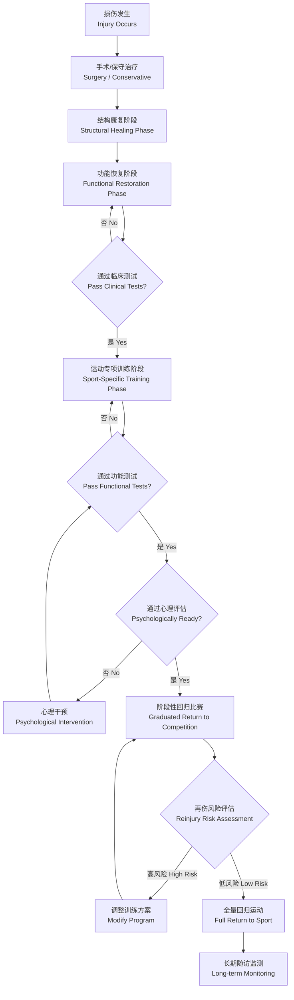

---
aliases: [ReturnToSport, RTS, 重返运动, 回归赛场]
tags: [SportsMedicine, Rehabilitation, ReturnToSport, SportsInjury]
created: 2026-05-17
updated: 2026-05-17
---

# 重返运动

## 概述

重返运动（Return to Sport, RTS）是指运动员在伤病后逐步恢复至伤前运动水平甚至更高水平的决策和过渡过程。RTS 不仅仅是时间线问题，更是基于多维评估的风险-收益权衡决策（Risk-Benefit Decision），涉及身体功能（Physical Function）、心理准备（Psychological Readiness）和运动环境（Sport Environment）三个维度。2016年 Ardern 等人在 British Journal of Sports Medicine 上发表的共识声明提出了 RTS 的三阶段模型，已被国际运动医学界广泛采纳。RTS 决策的核心目标是在最小化再伤风险（Reinjury Risk）的前提下，帮助运动员安全、及时地回归赛场。

## 三阶段模型（Ardern 2016）

### 阶段一：重返参与（Return to Participation）

- 运动员可以参与训练但尚未达到比赛标准
- 可能参与修改后的训练或非对抗性练习（Modified Training）
- 决策由康复团队（Rehabilitation Team）主导
- 此阶段重点是重建运动特定模式的神经肌肉控制
- 运动员在此阶段可尝试低强度运动专项动作

### 阶段二：重返运动（Return to Sport）

- 运动员恢复到足以参加比赛的水平
- 通过功能性测试和运动专项评估（Sport-Specific Assessment）
- 但可能尚未达到伤前水平或存在复发风险
- 此阶段强调运动专项训练（Sport-Specific Training）和负荷管理
- 教练和体能教练的评估权重增加

### 阶段三：重返高水平表现（Return to Performance）

- 恢复到伤前甚至更高水平（Preinjury Level or Above）
- 心理上准备就绪且无重返恐惧（Fear of Reinjury）
- 可承受完整的训练和比赛负荷（Full Training & Competition Load）
- 此阶段运动员通常已完成所有客观测试标准
- 长期随访监测（Long-term Follow-up）确保维持状态

## RTS 决策流程

## RTS 评估要素

| 评估维度 | 具体内容 | 常用工具/标准 |
|---------|---------|-------------|
| 疼痛与症状（Pain & Symptoms） | 无痛进行所有活动 | VAS 评分 $\leq 2$，无肿胀 |
| 关节活动度（Range of Motion, ROM） | 双侧对称 | 关节角度测量：差值 $\leq 5^\circ$ |
| 肌力（Strength） | 肌力对称 $\geq 90\%$ | 等速测试（Isokinetic Testing）、徒手肌力测试（MMT） |
| 神经肌肉控制（Neuromuscular Control） | 动作质量正常 | FMS、Y-Balance Test、单腿跳测试（Single-Leg Hop） |
| 有氧耐力（Aerobic Capacity） | 达到项目所需 $\dot{V}O_{2max}$ | 增量运动测试（Incremental Exercise Test） |
| 速度与爆发力（Speed & Power） | 达到伤前水平 | 冲刺时间、垂直纵跳（CMJ） |
| 心理准备（Psychological Readiness） | 重返信心 | ACL-RSI、TSK-11、I-PRRS |
| 运动专项能力（Sport-Specific Skills） | 完成项目特定动作 | 运动专项技能测试（如变向跑、跳跃着陆） |

## 客观测试标准：力量对称性

力量对称性通常以肢体对称性指数（Limb Symmetry Index, LSI）表示：

$$LSI = \frac{\text{患侧}}{\text{健侧}} \times 100\%$$

RTS 决策中广为接受的标准为 LSI $\geq 90\%$。常用测试项目包括：
- **等速肌力测试**：$60^\circ/s$ 和 $180^\circ/s$ 角速度下的膝伸/屈峰力矩
- **单腿跳测试（Single-Leg Hop for Distance）**：跳跃距离 LSI
- **交叉跳测试（Crossover Hop for Distance）**：含变向的跳跃能力
- **6米计时跳（6-m Timed Hop）**：跳跃速度对称性
- **三连跳（Triple Hop for Distance）**：连续爆发力对称性

新兴证据表明，对于 ACL 重建后患者，仅依赖上述测试仍不足以充分预测再伤风险，建议结合运动生物力学分析（Motion Analysis）和三维运动捕捉（3D Motion Capture）评估动态膝关节负荷。

## 心理因素评估

心理准备（Psychological Readiness）是 RTS 决策中不可忽视的因素。主要评估工具和指标包括：
- **ACL-RSI（Anterior Cruciate Ligament Return to Sport after Injury scale）**：专为 ACL 术后设计，评估情绪、信心和风险评估
- **TSK-11（Tampa Scale of Kinesiophobia）**：恐动症量表，评估对运动/再伤的恐惧
- **I-PRRS（Injury-Psychological Readiness to Return to Sport）**：简明的心理准备自评量表
- **运动信心（Sport Confidence）**：个体对完成特定运动任务的信念

心理干预策略包括认知行为疗法（Cognitive Behavioral Therapy, CBT）、目标设定（Goal Setting）、可视化训练（Visualization）和社会支持强化。研究表明，重返恐惧是预测 RTS 失败的重要因子，尤其在膝关节损伤后。

## 再伤风险因素与分层

RTS 决策的核心原则：运动员重返赛场后的再伤风险不应超过未受伤运动员的基线风险。高风险决策要素包括：

### 不可控因素
- 移植物类型（同种异体 > 自体移植物）
- 损伤严重程度（多发韧带损伤 > 单纯 ACL）
- 遗传因素（胶原蛋白基因多态性）
- 年龄（年轻运动员再伤风险更高）

### 可控因素
- 康复时间不足（ACLR < 9个月即返赛）
- 双侧肌力不对称 > 10%
- 跳跃落地时膝关节外翻角（Valgus Angle）增大
- 核心稳定性和髋关节控制不足
- 心理恐惧和缺乏信心
- 训练负荷突然增加（Spike in Training Load）

### 风险分层模型

风险评估可采用多维评分系统，整合客观测试结果、心理评估和运动负荷数据。高风险运动员应延迟 RTS，增加控制训练和保护性干预。再伤后的二次康复（Second Rehabilitation）通常耗时更长且预后更差，因此初次 RTS 决策的谨慎至关重要。

## 运动专项 RTS 指南

不同运动项目的 RTS 标准存在显著差异：
- **接触性运动（如足球、篮球）**：需通过对抗性训练模拟比赛条件
- **非接触性运动（如跑步、游泳）**：侧重有氧耐力和动作效率
- **过顶投掷项目（如棒球、排球）**：关注肩关节和核心动力链恢复
- **举重/格斗项目**：需达到绝对肌力和爆发力指标

### 足球专项 RTS
足球涉及变向、冲刺、跳跃、铲球和头球等高风险动作。ACL 重建后的足球运动员 RTS 注意事项：
- 回归跑步训练（直线）：术后 12-16 周
- 开始变向跑步（45°-90°）：术后 16-20 周
- 无对抗训练（Unopposed Training）：术后 6-9 个月
- 有对抗训练（Controlled Opposition）：术后 9 个月
- 正式比赛回归：术后 9-12 个月，通过全部功能测试

### 篮球专项 RTS
篮球运动包含大量跳跃、急停、落地和侧向移动。评估重点：
- 单腿垂直跳高度（Single-leg Vertical Jump）LSI $\ge 90\%$
- 侧向跳距离（Lateral Hop Distance）对称性
- 变向跑（T-drill, Pro-agility）时间对称性
- 重复跳跃测试（Repeated Jump Test）疲劳抗性

### 跑步专项 RTS
跑步相关损伤（Runner's Knee、MTSS、应力性骨折 Stress Fractures）的 RTS 逐步进程：
- 阶段一：无痛步行 30 分钟
- 阶段二：走-跑交替（Run-walk Intervals），跑 1 分/走 2-4 分，每周增量不超过 10%
- 阶段三：持续跑步（Continuous Running），距离逐步增加
- 阶段四：速度训练和变速跑（Interval/Speed Work）
- 阶段五：比赛准备

### 投掷项目 RTS
过顶投掷（Overhead Throwing）的 RTS 着眼于肩肘动力链评估。逐步恢复投掷程序（Interval Throwing Program, ITP）指导投掷距离和强度从 30 英尺（平地轻抛）到 180 英尺（全力投掷）逐步增加。关键监测指标包括投掷动作质量、肩关节 ROM 对称性和投掷后疼痛反应。

## RTS 失败原因分析

RTS 失败（包括再伤和非损伤性退出）的常见原因包括：
- **生物力学缺陷**：运动模式未纠正（如 ACLR 后落地时膝关节外翻角增大）
- **肌力恢复不充分**：即使 LSI 达到 90%，膝关节屈肌/伸肌比值（H/Q Ratio）可能失衡
- **神经肌肉控制不足**：疲劳状态下动作质量显著下降
- **心理因素**：重返恐惧、运动自信心降低、灾难化思维（Catastrophizing）
- **训练负荷错误**：回归后负荷增加过快（Load Spike）超过组织适应能力
- **康复配合度差**：居家训练依从性（Adherence）不足、过早或过晚回归

## 共同决策模型

RTS 应采用共同决策（Shared Decision Making, SDM）模式，整合运动员、康复团队、教练和运动科学支持团队的多方观点。SDM 流程包括：
1. 康复团队向运动员和教练呈现客观测试结果和风险评估
2. 讨论运动员的目标、期望和顾虑
3. 提供多个 RTS 选项（立即回归、阶段性回归、延迟回归）及其风险-收益分析
4. 运动员参与决策过程，表达个人偏好
5. 记录 RTS 决策过程和监测计划

## 儿童和青少年 RTS 的特殊考虑

儿童与青少年运动员 RTS 需特别关注：
- **骨骺损伤（Physeal Injury）**：开放性骨骺（Open Physis）的应力性损伤和骨折需更保守管理
- **重复损伤风险**：青少年前交叉韧带重建（ACLR）后 2 年内再伤率高达 20-30%
- **心理成熟度**：青少年心理准备评估工具需与年龄匹配
- **成长因素**：快速生长期（Growth Spurt）的神经肌肉控制能力下降可能增加再伤风险
- **家长沟通**：RTS 决策中应纳入家长教育（Parental Education）和期望管理
- **运动多样性**：建议青少年同时参与多种运动（Sport Diversification）而非早期专业化（Early Specialization），降低过度使用损伤（Overuse Injury）风险

## 运动员长期健康管理

RTS 的最终目标不仅是回归竞技，更是维护运动员长期健康（Long-term Athlete Health）。建议：
- 年度运动医学体检（Annual Pre-participation Physical Examination, PPE）
- 重返赛场后前 3 个月密切监测训练负荷和再伤信号
- 术后 2 年内定期功能评估（每 3-6 个月）
- 健康教育与损伤预防计划纳入日常训练
- 退役后关节健康管理（骨关节炎预防）

## 常见损伤的 RTS 时间框架参考

| 损伤类型 | 最小 RTS 时间 | 决定因素 |
|---------|-----------|---------|
| I 级踝关节外侧扭伤 | 1-3 周 | 疼痛消失，平衡能力恢复 |
| II 级踝关节扭伤 | 3-6 周 | 无痛运动，单腿平衡 LSI $\ge 90\%$ |
| I-II 级腘绳肌拉伤 | 2-6 周 | 无痛 Bias+速度测试，等速肌力对称 |
| III 级腘绳肌拉伤 | 8-12 周 | MRI 愈合征象，渐进抗阻训练完成 |
| 肩关节前脱位（非手术） | 3-6 周 | ROM 对称，肩袖力量恢复 |
| 肩关节前脱位（术后） | 4-6 个月 | 关节囊愈合，运动专项测试通过 |
| 髌腱炎（Patellar Tendinopathy） | 4-12 周（取决于分级） | VISA-P 评分 $\gt 80$，无痛跳跃测试 |
| 胫骨内侧应力综合征（MTSS） | 2-6 周（初期）至 3 个月 | 无痛骨骼触诊，逐步增加跑步负荷 |
| 应力性骨折（低风险部位） | 6-8 周 | 影像学愈合征象，无痛步行 |
| 应力性骨折（高风险部位如股骨颈） | 10-16 周 | MRI 或 CT 确认愈合，避免再伤 |

## RTS 康复团队协作

理想的 RTS 决策应由多学科团队（Multidisciplinary Team, MDT）协同完成：
- **运动医学医师（Sports Medicine Physician）**：医学评估、影像学解读、手术决策
- **物理治疗师/康复治疗师（Physical Therapist）**：功能评估、康复计划制定和执行
- **运动防护师（Athletic Trainer）**：日常训练负荷管理和再伤预防
- **力量与体能教练（Strength & Conditioning Coach）**：运动表现提升，测试达标
- **运动心理学家（Sports Psychologist）**：心理准备评估和干预
- **运动营养师（Sports Dietitian）**：营养优化支持恢复和表现
- **主教练/技术教练（Head/Technical Coach）**：运动专项能力评估，专项 RTS 决策

## 功能测试组合推荐

单一测试不足以全面评估 RTS 准备状态。推荐的功能测试组合（Functional Test Battery）包括：

**基础组合（适用于多数损伤）**：
1. Y-Balance Test（YBT）上肢和下肢——评估动态平衡和稳定性
2. 单腿跳距离测试（Single Hop for Distance）——爆发力对称性
3. 垂直跳测试（Countermovement Jump, CMJ）——下肢爆发力和神经肌肉控制

**进阶组合（ACLR 及其他重大损伤）**：
1. 等速肌力测试（60°/s 和 180°/s）——肌力平衡
2. 侧向跳测试（Lateral Hop）——侧向稳定性
3. 6米计时跳（6-m Timed Hop）——速度-爆发力综合
4. 降落误差评分系统（LESS, Landing Error Scoring System）——落地生物力学质量
5. Tuck Jump Assessment——跳跃动作对称性

测试结果应转化为清晰的阈值判断（如 LSI $\ge 90\%$，LESS $\le 5$），与运动员沟通时提供可视化的测试结果和目标基线。

## 相关条目

[[ACLReconstruction]], [[FunctionalAssessment]], [[Rehabilitation]], [[SportsInjuries]], [[PainScience]], [[12_SportsScience/SportsTraining/SportsPsychology|SportsPsychology]]

