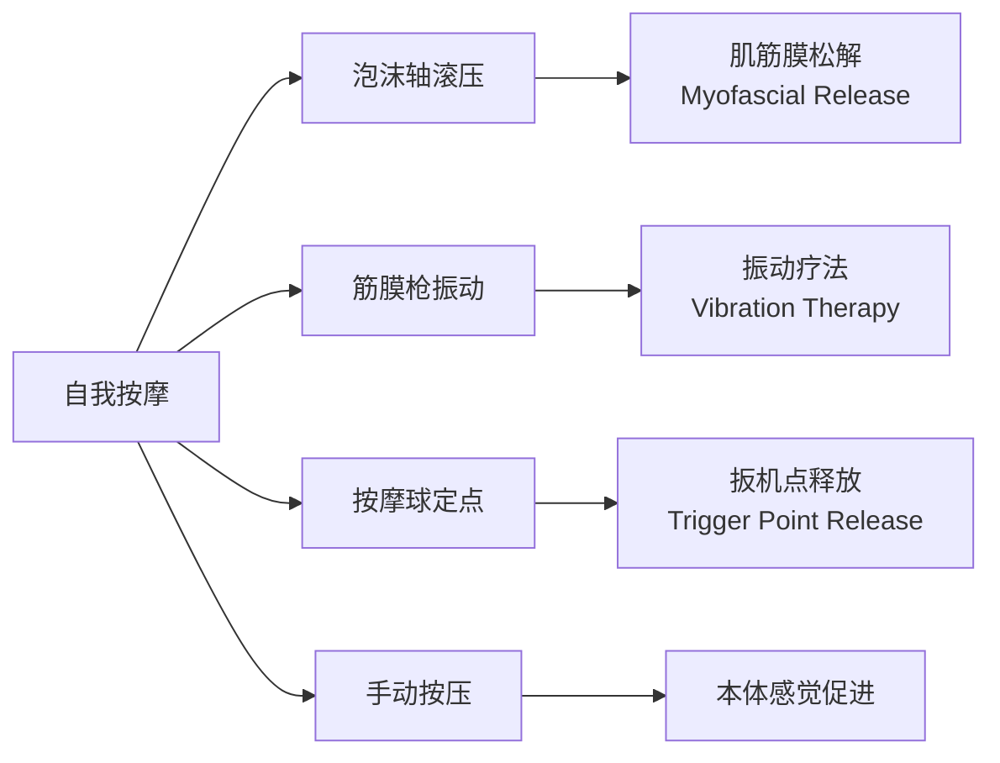
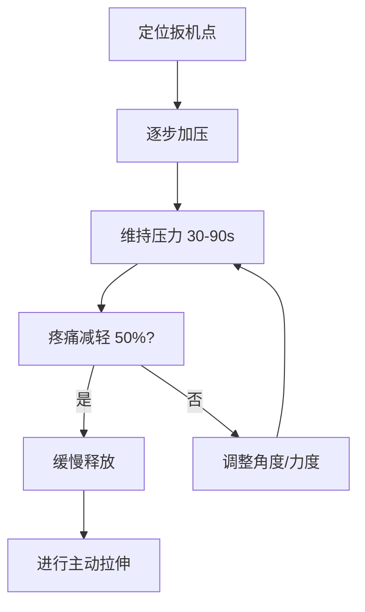

---
aliases: [SelfMassage, 自我按摩]
tags: ['12_SportsScience', 'SportsMedicine', 'SelfMassage', 'Recovery']
created: 2026-05-17
updated: 2026-05-17
---

# 自我按摩 (Self-Massage)

## 概述

自我按摩（Self-Massage）是指利用自身重量、手动操作或辅助工具对肌肉、筋膜（fascia）及软组织进行自主松解的技术。其核心目标包括缓解延迟性肌肉酸痛（DOMS）、降低肌筋膜张力、促进局部血液循环、加速代谢废物清除，以及改善关节活动度（ROM）。在运动康复和体能训练领域，自我按摩已成为主动恢复（active recovery）策略的重要组成部分。

与被动按摩（由治疗师操作）相比，自我按摩具有成本低、可随时随地实施、频率可控等优势。现代自我按摩工具的发展（如泡沫轴、筋膜枪、按摩球）极大地提升了其可操作性和效果一致性。

## 常用自我按摩工具

### 泡沫轴 (Foam Roller)

泡沫轴是最常见的自我按摩工具，通常由高密度 EVA 泡沫或 PVC 内管制成。其工作原理是通过自身体重在工具上滚动，对肌肉和筋膜施加持续的压力，从而促进筋膜重塑（fascial remodeling）和肌梭（muscle spindle）脱敏。

**常见规格**：

- 光滑泡沫轴：适合初学者和敏感区域
- 带凸起/纹路泡沫轴：深层刺激效果更强
- 振动泡沫轴：结合机械压力与振动刺激

**操作要点**：

- 每个肌群滚压 60-120 秒
- 遇到扳机点（trigger point）时停留 30-60 秒，直至酸痛感降低 50% 以上
- 滚动速度控制在每秒 2-5 厘米
- 保持自然呼吸，避免屏气（Valsalva maneuver）

### 筋膜枪 (Massage Gun)

筋膜枪利用高频振动（通常 1200-3200 次/分钟）对肌肉组织施加击打式刺激。其理论基础源于振动疗法（vibration therapy），可通过以下机制发挥作用：

- 抑制高尔基腱器官（Golgi tendon organ）活性，降低肌张力
- 增加局部血流量（局部血管扩张）
- 通过门控理论（gate control theory）暂时性降低痛觉传导

**使用规范**：

| 参数 | 建议值 | 说明 |
|------|--------|------|
| 振幅 | 10-16 mm | 深层肌群选用较大振幅 |
| 频率 | 1800-2400 rpm | 日常恢复使用 |
| 压力 | 中等 | 以不引起剧烈疼痛为准 |
| 单部位时间 | 30-60 秒 | 避免过度刺激 |

**禁忌区域**：

- 骨骼突起处（如胫骨前缘、脊柱棘突）
- 关节囊及韧带附着点
- 颈动脉窦区域
- 腹部及内脏投影区
- 急性损伤部位（48 小时内）

### 按摩球与花生球

按摩球（如 lacrosse ball、网球）和花生球（双球结构）适用于小面积、深层肌群的精准松解。

**经典应用部位**：

- **足底筋膜（plantar fascia）**：坐姿，球置于足弓，前后滚动 1-2 分钟
- **臀中肌/梨状肌（piriformis）**：坐姿，球置于臀部深层，缓慢施压并做小范围滚动
- **肩胛提肌/上斜方肌（upper trapezius）**：靠墙，球置于颈肩交界处，上下滑动
- **胸小肌（pectoralis minor）**：俯卧或靠墙，球置于锁骨下方 2-3 指处

### 刮筋工具 (IASTM Tools)

筋膜刀等工具可用于自我刮筋，但操作难度较高，建议在专业人士指导下使用。常用于：

- 髂胫束（IT band）松解
- 前臂屈肌/伸肌筋膜松解
- 跟腱区域维护

## 核心技术与原理

### 肌筋膜松解 (Myofascial Release)

筋膜是包裹肌肉、血管和神经的结缔组织网络，由胶原纤维、弹性纤维和基质（ground substance）组成。运动、姿势不良或创伤可导致筋膜粘连（adhesion），限制组织滑动（tissue gliding）。

自我按摩通过以下机制改善筋膜状态：

1. **机械效应**：持续压力改变筋膜基质的粘弹性（viscoelasticity），降低组织硬度
2. **神经生理效应**：刺激机械感受器（mechanoreceptors），降低交感神经兴奋性
3. **体液效应**：促进局部血流和淋巴回流，加速代谢废物（如乳酸、氢离子）清除

### 扳机点疗法 (Trigger Point Therapy)

扳机点是肌肉内可触及的紧张结节，按压时可产生局部疼痛或牵涉痛（referred pain）。其形成与运动终板（motor end plate）功能障碍、乙酰胆碱（ACh）过度释放有关。

**自我扳机点处理流程**：

### 与拉伸的协同效应

自我按摩后配合静态拉伸（static stretching）可产生叠加效应：

- 按摩降低肌梭敏感性和肌肉张力
- 拉伸进一步增加筋膜延展性和关节活动度
- 两者结合比单独进行任何一种更有效提升 ROM

建议顺序：**热身 → 自我按摩 → 拉伸 → 主训练**

## 分部位操作指南

### 下肢肌群

**股四头肌（Quadriceps）**：

- 俯卧，泡沫轴置于大腿前侧，从髋骨下缘缓慢滚至膝盖上方
- 重点处理股直肌（rectus femoris）与股外侧肌（vastus lateralis）交界处
- 配合膝关节屈伸可增加筋膜滑动效果

**腘绳肌（Hamstrings）**：

- 坐姿，泡沫轴在大腿后侧坐骨结节至腘窝之间滚动
- 半腱肌和半膜肌内侧束常存在扳机点
- 注意避开坐骨神经走行区域（大腿后侧中线偏外）

**髂胫束（IT Band）**：

- 侧卧，泡沫轴置于大腿外侧，从股骨大转子滚至膝关节外侧
- 该区域通常较为敏感，初学者应控制压力
- 优先处理相邻的阔筋膜张肌（TFL）效果更佳

**小腿后侧（Gastrocnemius/Soleus）**：

- 坐姿，泡沫轴置于小腿后侧，从腘窝下方滚至跟腱上方
- 可单腿叠加增加压力，或左右旋转寻找痛点
- 比目鱼肌（soleus）深层扳机点建议使用按摩球

### 躯干与上肢

**胸椎段（Thoracic Spine）**：

- 仰卧，泡沫轴横置于肩胛下角水平，双手抱头缓慢后仰
- 可进行脊柱伸展和左右旋转
- 注意避开放射至腰部的区域（L1 以下不建议用泡沫轴直接压迫）

**胸肌（Pectoralis）**：

- 俯卧或靠墙，按摩球置于胸大肌外侧缘
- 配合肩关节外展和外旋可增加松解效果
- 对改善圆肩姿势尤为有效

**背阔肌（Latissimus Dorsi）**：

- 侧卧，泡沫轴置于腋下至肋骨下缘之间
- 注意控制压力，该区域靠近肋骨

## 不同场景的应用策略

### 运动前激活 (Pre-activation)

- 时间：训练前 5-10 分钟
- 目标：激活肌肉、提升局部血流、增加关节活动度
- 方法：快速、轻压力的泡沫轴滚压（每部位 20-30 秒），配合动态拉伸
- 避免深层按压导致肌肉松弛和力量下降

### 运动后恢复 (Post-exercise Recovery)

- 时间：训练结束后 10-20 分钟内
- 目标：缓解 DOMS、促进恢复、降低交感神经过度兴奋
- 方法：深层、慢速的滚压和定点按压（每部位 60-120 秒）
- 可在冷水浴或冷热水交替后进行

### 日常维护 (Daily Maintenance)

- 时间：睡前或晨起
- 目标：改善姿势相关肌筋膜紧张
- 重点部位：上背部（久坐人群）、髋屈肌（久坐人群）、小腿后侧（跑步人群）
- 频率：每天 10-15 分钟

## 安全注意事项

- **急性损伤期**：软组织损伤后 48-72 小时内避免直接按摩伤处（遵循 PRICE 原则：保护、休息、冰敷、加压、抬高）
- **凝血功能障碍**：血友病或服用抗凝药物者慎用深层按压
- **静脉曲张**：避开明显曲张静脉区域，避免血栓形成风险
- **感觉异常**：糖尿病周围神经病变患者需谨慎控制按压力度
- **骨质疏松**：避免高强度冲击（如筋膜枪高档位在脊柱区域）
- **妊娠**：避免腹部和腰部深层按压，孕晚期避免仰卧位操作
- **皮肤破损**：开放性伤口、烧伤、皮炎区域禁止按摩
- **发热感染**：全身性感染发热期间不宜按摩
- **肿瘤区域**：未经医生评估，避免直接按摩肿瘤或淋巴结肿大区域

## 循证效果总结

| 效果指标 | 证据强度 | 说明 |
|----------|----------|------|
| 缓解 DOMS | 中等 | 多项 RCT 显示滚压可降低运动后 24-72h 酸痛感 |
| 提升 ROM | 中等 | 短期效果显著，长期需结合拉伸训练 |
| 提升运动表现 | 低-中等 | 对爆发力可能有轻微急性提升 |
| 降低肌张力 | 中等 | 神经肌肉层面的张力降低有较好证据 |
| 促进恢复 | 初步 | 主观恢复感改善明显，生化指标证据有限 |

## 经典教材与资源

- 《运动按摩与软组织手法治疗》（Sports Massage and Soft Tissue Therapy）
- Behm, D.G. 等 (2020). Foam rolling prescription: A clinical commentary. *The Journal of Strength & Conditioning Research*.
- Cheatham, S.W. 等 (2015). Roller massage: A commentary on clinical standards. *International Journal of Sports Physical Therapy*.

## 相关条目

- [[FasciaRelease|筋膜松解]]
- [[TriggerPointTherapy|扳机点疗法]]
- [[RecoveryAndRegeneration|恢复与再生]]
- [[SportsMassageAndManualTherapy|运动按摩与手法治疗]]
- [[FlexibilityTraining|柔韧性训练]]
- [[INDEX|SportsMedicine 索引]]

