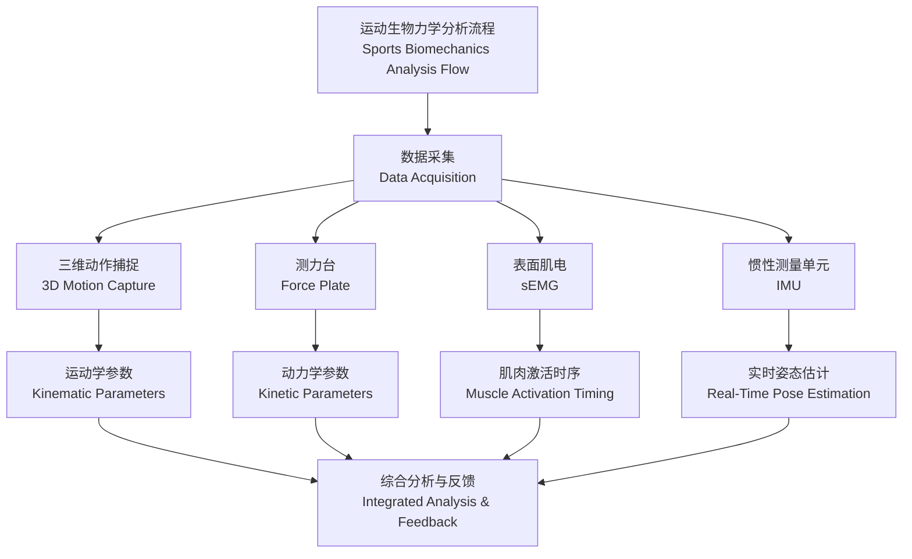

# 运动生物力学 (Sports Biomechanics)

## 概述 (Overview)

运动生物力学（Sports Biomechanics）是研究人体在运动过程中受力与运动规律交叉学科，融合**解剖学 (Anatomy)**、**生理学 (Physiology)**、**物理学 (Physics)** 与**工程学 (Engineering)** 原理，解析运动技术、优化动作模式并预防运动损伤。

$$
F = ma
$$

牛顿第二定律（Newton's Second Law）是生物力学分析基石，描述外力与加速度关系。

## 核心分支 (Core Branches)

| 分支 (Branch) | 研究内容 (Research Content) | 典型应用 (Typical Application) |
|---------------|---------------------------|------------------------------|
| 运动学 (Kinematics) | 时间、位移、速度、加速度 | 视频动作分析、姿态评估 |
| 动力学 (Kinetics) | 力、力矩、冲量、功 | 地面反作用力、关节力矩 |
| 肌肉力学 (Muscle Mechanics) | 收缩特性、力-长度关系 | 肌力训练处方 |
| 流体力学 (Fluid Mechanics) | 空气/水阻力、升力 | 游泳、骑行装备优化 |
| 材料力学 (Material Mechanics) | 组织应力-应变、刚度 | 鞋垫、护具设计 |

## 运动学分析 (Kinematic Analysis)

运动学关注**几何运动 (Geometric Motion)**，不考虑力来源。

### 关键参数 (Key Parameters)

| 参数 (Parameter) | 符号 (Symbol) | 单位 (Unit) | 定义 (Definition) |
|-----------------|---------------|-------------|-------------------|
| 位移 (Displacement) | $\Delta x$ | m | 位置变化矢量 |
| 速度 (Velocity) | $v$ | m/s | 位移对时间一阶导数 |
| 加速度 (Acceleration) | $a$ | m/s² | 速度对时间一阶导数 |
| 角位移 (Angular Displacement) | $\theta$ | rad | 旋转角度 |
| 角速度 (Angular Velocity) | $\omega$ | rad/s | 角位移变化率 |

抛体运动（Projectile Motion）轨迹方程：

$$
y(t) = y_0 + v_0 \sin(\theta) \cdot t - \frac{1}{2} g t^2
$$

其中 $v_0$ 为初速度，$\theta$ 为抛射角，$g = 9.81 \, \text{m/s}^2$ 为重力加速度。

## 动力学分析 (Kinetic Analysis)

动力学研究**力 (Force)** 与**力矩 (Torque)** 如何产生或改变运动。

### 牛顿-欧拉方程 (Newton-Euler Equations)

平移方程：

$$
\sum \vec{F} = m \vec{a}
$$

旋转方程：

$$
\sum \vec{M} = I \vec{\alpha}
$$

其中 $I$ 为转动惯量（Moment of Inertia），$\alpha$ 为角加速度。

### 地面反作用力 (Ground Reaction Force, GRF)

跑步时典型 GRF 曲线呈**双峰 (Double Hump)** 特征：

- **冲击峰 (Impact Peak)**：足触地初期，约 $1.5$–$3.0$ 倍体重
- **主动峰 (Active Peak)**：支撑中期，约 $2.0$–$3.5$ 倍体重

垂直方向 GRF 分量：

$$
F_z = m(g + a_z)
$$

## 运动分析技术 (Motion Analysis Technology)

### 三维动作捕捉 (3D Motion Capture)

利用多台红外摄像机追踪**反光标记点 (Retroreflective Markers)**，重建人体环节三维坐标。

空间重建精度：

$$
\epsilon_{3D} = \sqrt{(x_{true} - x_{measured})^2 + (y_{true} - y_{measured})^2 + (z_{true} - z_{measured})^2} \leq 2 \, \text{mm}
$$

### 测力台 (Force Plate)

测量三维地面反作用力与力矩，采样频率通常 $\geq 1000$ Hz。

**压力中心 (Center of Pressure, COP)** 轨迹：

$$
COP_x = \frac{M_y}{F_z}, \quad COP_y = -\frac{M_x}{F_z}
$$

## 损伤预防 (Injury Prevention)

### 前交叉韧带损伤机制 (ACL Injury Mechanism)

典型非接触性 ACL 损伤**三联征 (Triad)**：

1. **膝关节外翻 (Knee Valgus)**：$> 8°$
2. **胫骨外旋 (Tibial External Rotation)**：$> 15°$
3. **股骨内旋 (Femoral Internal Rotation)**：伴随髋内收

髋-膝-踝**三维力矩耦合 (3D Moment Coupling)** 是 ACL 负荷关键：

$$
M_{ACL} \approx f(M_{knee,valgus}, M_{knee,ext}, F_{GRF})
$$

### 损伤风险筛查 (Injury Risk Screening)

| 测试 (Test) | 指标 (Index) | 风险阈值 (Risk Threshold) |
|------------|-------------|--------------------------|
| 落地错误评分 (LESS) | 总分 | $> 5$ 分高风险 |
| Y-平衡测试 (Y-Balance) | 肢体对称指数 | $< 94\%$ 不对称 |
| 等速肌力 (Isokinetic) | 腘绳肌/股四头肌比值 (H/Q) | $< 0.6$ 肌力失衡 |
| 单腿跳 (Single-Leg Hop) | 肢体对称指数 | $< 90\%$ 功能缺陷 |

## 运动装备优化 (Equipment Optimization)

### 跑鞋中底力学 (Running Shoe Midsole Mechanics)

中底材料**应力-应变关系 (Stress-Strain Relationship)**：

$$
\sigma = E \cdot \varepsilon + \eta \cdot \dot{\varepsilon}
$$

其中 $E$ 为弹性模量，$\eta$ 为粘性系数，体现**粘弹性 (Viscoelasticity)**。

能量回弹率（Energy Return）：

$$
R = \frac{W_{return}}{W_{input}} \times 100\%
$$

### 球拍/球杆动力学 (Racket/Club Dynamics)

**甜区 (Sweet Spot)** 即**振动节点 (Vibration Node)** 与**撞击中心 (Center of Percussion)** 重合区域，此时手柄处反作用力最小。

网球拍转动惯量：

$$
I = m k^2
$$

其中 $k$ 为回旋半径（Radius of Gyration）。

## 关键公式汇总 (Key Formulas)

| 公式 (Formula) | 名称 (Name) | 应用场景 (Application) |
|---------------|------------|---------------------|
| $F = ma$ | 牛顿第二定律 | 所有动力学分析 |
| $W = F \cdot d$ | 功 | 能量消耗计算 |
| $P = F \cdot v$ | 功率 | 爆发力评估 |
| $E_k = \frac{1}{2}mv^2$ | 动能 | 冲刺、跳跃 |
| $E_p = mgh$ | 势能 | 重心变化 |
| $I = \sum m_i r_i^2$ | 转动惯量 | 旋转运动分析 |
| $L = I\omega$ | 角动量 | 体操、跳水 |

## 参考文献 (References)

1. Zatsiorsky, V. M. (2002). *Kinetics of Human Motion*. Human Kinetics.
2. Robertson, G. E., et al. (2014). *Research Methods in Biomechanics* (2nd ed.). Human Kinetics.
3. 刘大庆. (2010). 《运动生物力学》. 人民体育出版社.
4. Nigg, B. M., & Herzog, W. (2007). *Biomechanics of the Musculo-skeletal System* (3rd ed.). Wiley.
5. 全国体育院校教材委员会. (2012). 《运动生物力学》. 人民体育出版社.
