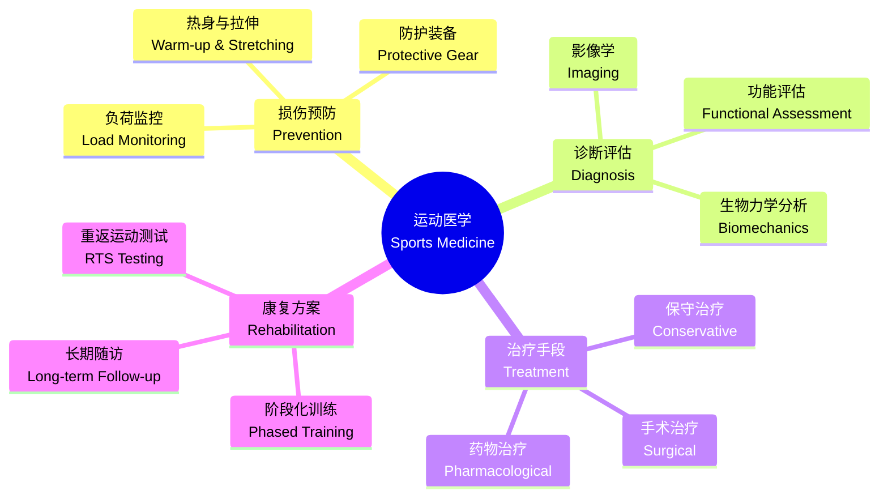
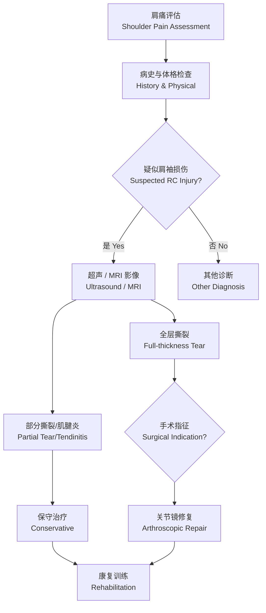

# 运动医学 (Sports Medicine)

> 运动医学是一门多学科交叉的临床医学分支，专注于体育相关损伤的预防、诊断、治疗与康复，同时涵盖运动营养学、运动生理学及运动心理学等领域。

## 学科概述 (Overview)

### 定义与范畴
运动医学（Sports Medicine）综合了临床医学、康复医学、运动生理学与生物力学，服务于竞技运动员、健身人群及普通患者。

### 核心领域
- **损伤预防** (Injury Prevention) —— 风险评估、防护装备、训练负荷管理
- **急性损伤处理** (Acute Injury Management) —— RICE 原则、PRICE 原则、手术干预
- **慢性劳损管理** (Chronic Overuse Management) —— 肌腱病、应力性骨折、骨关节炎
- **康复与重返运动** (Rehabilitation & Return to Sport) —— 阶段性康复方案
- **运动营养** (Sports Nutrition) —— 能量代谢、补剂策略、水合管理

---

## 损伤分类 (Injury Classification)

### 按组织类型分类

| 损伤类型 | 常见示例 | 典型机制 |
|---------|---------|---------|
| 肌肉损伤 (Muscle Injury) | 股后肌群拉伤 (Hamstring Strain) | 离心过载 (Eccentric Overload) |
| 韧带损伤 (Ligament Injury) | 前交叉韧带撕裂 (ACL Tear) | 非接触性扭转 (Non-contact Twist) |
| 肌腱病变 (Tendinopathy) | 跟腱病 (Achilles Tendinopathy) | 反复负荷 (Repetitive Load) |
| 骨骼损伤 (Bone Injury) | 应力性骨折 (Stress Fracture) | 过度训练 (Overtraining) |
| 软骨损伤 (Cartilage Injury) | 半月板撕裂 (Meniscus Tear) | 旋转压缩 (Rotational Compression) |

### 急性 vs 慢性损伤

- **急性损伤** (Acute Injury)：突然发生，如踝关节扭伤、骨折、肌肉撕裂。需立即进行 PRICE 原则处理。
- **慢性损伤** (Chronic/Oversue Injury)：逐渐发展，如髌腱炎（Jumper's Knee）、胫骨内侧应力综合征（Shin Splints）。需调整训练负荷并进行针对性康复。

---

## 损伤预防策略 (Injury Prevention Strategies)

### 预防模型 —— van Mechelen 四步模型
1. **流行病学调查** —— 明确损伤发生率与严重程度
2. **机制与风险因素分析** —— 内在因素（柔韧性、肌力、既往伤史）与外在因素（场地、装备、规则）
3. **引入预防措施** —— 神经肌肉训练、防护装备、规则修改
4. **效果评估** —— 通过 RCT 验证预防方案有效性

### 常见预防方案

- **FIFA 11+** —— 足球专项热身项目，降低 30%-50% 损伤风险
- **PEP Program** (Prevent Injury and Enhance Performance) —— 针对 ACL 损伤预防
- **Nordic Hamstring Exercise** —— 北欧腘绳肌训练，降低股后肌群拉伤风险 65%
- **平衡训练** —— 使用 BOSU 球、平衡板改善本体感觉

---

## 常见运动损伤详解 (Common Sports Injuries)

### 膝关节损伤 (Knee Injuries)

膝关节是运动中最易受损的关节之一。

**前交叉韧带损伤 (ACL Injury)**
- 机制：急停、变向、落地时膝关节外翻塌陷
- 诊断：Lachman 试验、Pivot Shift 试验、MRI 确认
- 治疗：青少年及运动员通常选择 ACL 重建手术（自体腘绳肌/髌腱移植）
- 康复周期：6-12 个月，分 4 阶段

| 阶段 | 时间 | 目标 | 训练重点 |
|------|------|------|---------|
| 早期 (Phase 1) | 0-4 周 | 消肿、恢复 ROM | 被动伸膝、股四头肌激活 |
| 中期 (Phase 2) | 4-12 周 | 正常步态、肌力恢复 | 闭链训练、本体感觉训练 |
| 后期 (Phase 3) | 3-6 月 | 跑步、跳跃准备 | 开链训练、离心训练 |
| 重返运动 (Phase 4) | 6-12 月 | 专项动作、比赛回归 | 变向训练、模拟对抗 |

### 肩关节损伤 (Shoulder Injuries)

**肩袖损伤 (Rotator Cuff Injury)**
- 组成：冈上肌、冈下肌、小圆肌、肩胛下肌
- 常见于：投掷运动、游泳、网球
- 治疗：保守治疗为主，包括物理治疗、离心训练；全层撕裂需手术修复

---

## 运动营养 (Sports Nutrition)

### 宏量营养素

- **碳水化合物** (Carbohydrates) —— 主要能量来源，推荐摄入量 6-10 g/kg/d
- **蛋白质** (Protein) —— 肌肉修复与合成，推荐摄入量 1.2-2.0 g/kg/d
- **脂肪** (Fat) —— 脂溶性维生素载体、激素前体，推荐摄入量 20%-35% 总能量

### 训练周期营养策略

| 时期 | 碳水化合物 | 蛋白质 | 脂肪 |
|------|-----------|-------|-----|
| 日常训练 | 5-7 g/kg | 1.4-1.8 g/kg | 1.0-1.5 g/kg |
| 高强度周期 | 7-10 g/kg | 1.6-2.0 g/kg | 0.8-1.2 g/kg |
| 恢复期 | 5-6 g/kg | 1.2-1.6 g/kg | 1.0-1.5 g/kg |
| 减脂期 | 3-5 g/kg | 1.8-2.2 g/kg | 1.2-1.5 g/kg |

### 补剂策略 (Supplement Strategy)

- **肌酸** (Creatine Monohydrate) —— 提高爆发力与肌肉质量，证据等级 A
- **β-丙氨酸** (Beta-Alanine) —— 缓冲 H+，延缓疲劳
- **咖啡因** (Caffeine) —— 提高耐力与警觉性，3-6 mg/kg
- **蛋白粉** (Whey/Casein Protein) —— 方便补充蛋白质摄入
- **维生素 D** —— 骨健康与免疫功能，尤其是室内运动员

---

## 康复原则与重返运动 (Rehabilitation & Return to Sport)

### 康复阶段模型

1. **保护期** (Protection Phase) —— 控制疼痛与肿胀，被动活动范围维持
2. **恢复期** (Restoration Phase) —— 全范围主动活动、肌力恢复、神经肌肉控制
3. **功能期** (Functional Phase) —— 运动专项训练、敏捷性、爆发力
4. **重返运动期** (Return to Sport Phase) —— RTS 测试达标后逐步回归比赛

### RTS 测试标准 (Return-to-Sport Criteria)

- 患侧肌力达健侧 90% 以上
- 单腿跳远距离对称指数 (LSI) > 90%
- 专项动作生物力学无代偿模式
- 心理准备度评分（例如 ACL-RSI 问卷）达标

---

## 特殊人群运动医学 (Special Populations)

- **青少年运动员** —— 骨骺损伤风险（如 Little League Elbow、Osgood-Schlatter 病）
- **老年运动员** —— 骨关节炎管理、平衡训练防跌倒
- **女性运动员** —— 女运动员三联征（能量利用障碍、月经功能紊乱、骨密度降低）
- **残障运动员** —— 轮椅运动损伤、假肢适配与界面管理

---

## 运动生理学基础 (Exercise Physiology)

### 能量代谢系统

| 供能系统 | 底物 | ATP 产量 | 持续时间 | 活动类型 |
|---------|------|---------|---------|---------|
| ATP-PC 系统 | 磷酸肌酸 | 1 ATP/PCr | 0-10s | 冲刺、举重 |
| 糖酵解 (Anaerobic Glycolysis) | 肌糖原 | 2-3 ATP/葡萄糖 | 10-120s | 400m 跑 |
| 有氧氧化 (Oxidative) | 糖/脂肪/蛋白 | 36-38 ATP/葡萄糖 | >2min | 马拉松 |

### 运动后恢复

- **主动恢复** (Active Recovery)：低强度运动促进乳酸清除，最优强度为 30%-60% VO₂max
- **被动恢复** (Passive Recovery)：完全休息，适用于神经疲劳恢复
- **营养干预**：运动后 30min 内补充碳水(1.0-1.2 g/kg/h) + 蛋白(0.3-0.4 g/kg)
- **睡眠恢复**：运动员推荐 8-10h 睡眠，N3 期与生长激素分泌密切相关

### 运动适应 (Training Adaptations)

- **神经适应**：前 2-4 周的力量增长主要来源于神经适应（运动单元募集效率提升）
- **肌肥大**：4-8 周后肌纤维横截面积增长，II 型肌纤维增粗潜力 > I 型
- **肌腱适应**：胶原蛋白合成增加，刚度提升，降低损伤风险
- **骨适应**：Wolff 定律——骨骼在承受机械负荷的区域骨密度增加

---

## 运动心理学基础 (Sports Psychology)

- **动机理论**：自我决定理论 (Self-Determination Theory)——自主性、胜任感、归属感
- **焦虑与表现**：Yerkes-Dodson 倒 U 型曲线——中等焦虑水平最优表现
- **心理韧性** (Mental Toughness)：目标承诺、自信、压力应对、逆境反弹
- **可视化训练**：心理意象激活相同神经通路，提升运动技能习得效率

---

## 生物力学在运动医学中的应用 (Biomechanics in Sports Medicine)

### 步态分析 (Gait Analysis)
- **跑步生物力学**：触地模式（前足/中足/后足）、垂直振幅、步频与步幅
- **常见异常**：过度旋前（Overpronation）、骨盆侧倾、膝外翻
- **分析工具**：三维运动捕捉、测力台、压力跑台、惯性传感器

### 投掷生物力学
- **投掷六阶段**：准备期 → 早摆臂 → 晚摆臂 → 加速期 → 减速期 → 随球期
- **肘关节**：外翻应力是投掷肘损伤的主因（内侧张力 + 外侧压缩）
- **肩关节**：GIRD（投掷肩内旋缺失）与肩袖撞击的关系

### 落地生物力学
- **膝关节屈曲角度**：> 30° 的膝屈曲减少 ACL 受力
- **髋关节控制**：股骨内收内旋增加 ACL 损伤风险
- **预防训练**：落地训练（Landing Training）关注膝对脚尖、髋膝联动

---

## 常见运动员专项伤病 (Sport-Specific Injuries)

| 运动项目 | 常见损伤 | 机制 | 预防重点 |
|---------|---------|------|---------|
| 足球 | 股后肌群拉伤、ACL 撕裂、踝扭伤 | 冲刺急停、变向 | Nordic 腘绳肌训练、FIFA 11+ |
| 篮球 | 踝关节扭伤、Jumper's Knee、手指挫伤 | 跳跃落地、侧切 | 踝稳定训练、离心膝训练 |
| 网球 | 网球肘 (Lateral Epicondylitis)、肩袖损伤 | 反复挥拍 | 前臂离心训练、肩胛稳定 |
| 游泳 | 肩峰下撞击、游泳肩 | 反复过头动作 | 肩袖强化、划水技术纠正 |
| 长跑 | 胫骨应力综合征、髂胫束综合征 | 过度使用 | 逐步增量、跑姿调整、力量训练 |

---

### 相关条目
- [[INDEX|SportsMedicine 索引]]
- [[../../13_Others/PhysicalEducation/Fitness/FunctionalTraining|功能性训练]]
- [[../../09_MedicineAndHealth/RehabilitationMedicine/RehabilitationMedicine|康复医学]]
- [[../../09_MedicineAndHealth/Pharmacy/Pharmacology|药理学]]
- [[../../02_NaturalSciences/Biology/Physiology/Physiology|生理学]]
- [[../../INDEX|TianshangKnowledgeBase 索引]]
