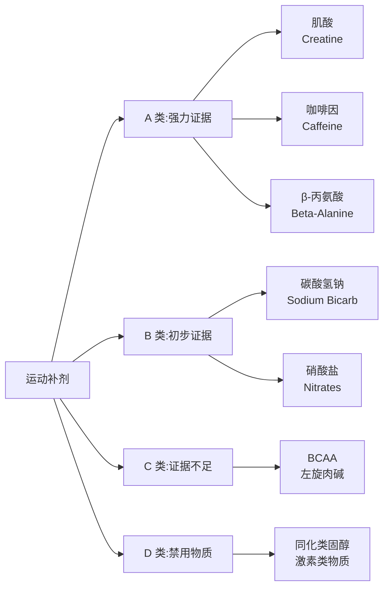

# 运动补剂 (Sports Supplements)

## 概述

运动补剂（Sports Supplements）是指用于补充常规饮食、提升运动表现（ergogenic effect）、促进恢复或改善身体成分的特定营养产品、物质或制剂。国际奥委会（International Olympic Committee, IOC）于 2018 年发布的共识声明将运动补剂及相关产品分为三类：有强力科学证据支持的补剂（Group A）、有初步证据或仅在特定条件下有效的补剂（Group B）、以及无证据或证据不足的补剂（Group C）。

运动员在选择补剂时应遵循循证原则，在注册营养师或运动医学专业人士指导下，根据个人运动项目、训练阶段和健康状况进行个体化选择。同时，补剂安全与反兴奋剂合规是职业运动员必须高度重视的问题。

## A 类补剂：强力证据支持

### 肌酸一水合物（Creatine Monohydrate）

肌酸是人体内天然存在的含氮有机酸，主要在肝脏和肾脏合成，储存于骨骼肌中，以磷酸肌酸（PCr）形式参与 ATP 再合成。

**作用机制**：

$$ADP + PCr \xrightarrow{CK} ATP + Cr$$

增加肌肉内磷酸肌酸储备，提升高强度短时运动（<30 秒）的 ATP 再合成速率。

**循证效果**：

| 效果 | 证据强度 | 幅度 |
|------|----------|------|
| 提升最大力量和爆发力 | 强 | 5-15% |
| 增加瘦体重 | 强 | 1-2 kg（初期多为水分） |
| 提升重复冲刺能力 | 中-强 | 改善恢复 |
| 促进训练适应 | 中 | 长期力量增长 |

**使用方案**：

| 阶段 | 剂量 | 持续时间 |
|------|------|----------|
| 负荷期（可选） | 20 g/天，分 4 次 | 5-7 天 |
| 维持期 | 3-5 g/天 | 长期 |

**安全性**：短期和长期使用（最长 5 年研究）均安全，可能引起体重增加（水分潴留），肾功能不全者慎用。

### 咖啡因（Caffeine）

咖啡因是世界上使用最广泛的精神活性物质，也是研究最充分的运动补剂之一。

**作用机制**：

- 腺苷受体拮抗剂：降低疲劳感知、提升警觉性
- 促进脂肪氧化：节省肌糖原（效果较小）
- 增强神经肌肉功能和钙离子释放

**循证效果**：

| 效果 | 证据强度 | 幅度 |
|------|----------|------|
| 提升耐力表现 | 强 | 2-4% |
| 提升力量和爆发力 | 中 | 轻微 |
| 提升认知功能和警觉性 | 强 | 显著 |
| 降低主观疲劳感（RPE） | 强 | 显著 |

**使用方案**：

| 参数 | 建议 |
|------|------|
| 剂量 | 3-6 mg/kg 体重 |
| 时机 | 运动前 45-60 分钟 |
| 来源 | 咖啡、胶囊、能量饮料、含咖啡因凝胶 |
| 上限 | 不超过 400 mg/天（一般人群） |

**注意事项**：高剂量（>9 mg/kg）增加副作用风险，常见副作用包括焦虑、心悸、失眠和胃肠不适。个体差异大（CYP1A2 基因多态性影响代谢），晚间使用影响睡眠质量。

### β-丙氨酸（Beta-Alanine）

β-丙氨酸是一种非蛋白质氨基酸，是肌肽（carnosine）合成的限速前体。

**作用机制**：

肌肽存在于快肌纤维中，具有缓冲 H⁺ 的能力：

$$\text{肌肽} + H^+ \rightarrow \text{质子化肌肽}$$

延缓高强度运动导致的肌肉酸化，延长高强度运动持续时间。

**循证效果**：

- 主要对持续 1-4 分钟的高强度运动有效
- 提升重复冲刺和抗阻训练容量
- 效果需长期积累（4-12 周）

**使用方案**：

| 参数 | 建议 |
|------|------|
| 剂量 | 4-6 g/天 |
| 服用方式 | 分 2-4 次，每次 ≤1.6 g（减少感觉异常） |
| 持续时间 | 至少 4 周，最佳 10-12 周 |
| 肌肽增加 | 约 40-60% |

**副作用**：剂量相关的感觉异常（paresthesia，皮肤刺痛、发麻），缓释制剂可降低此副作用。

### 碳酸氢钠（Sodium Bicarbonate）

碳酸氢钠是一种外源性缓冲剂，可提升血液和肌肉内缓冲容量。

**作用机制**：

$$HCO_3^- + H^+ \rightarrow H_2CO_3 \rightarrow H_2O + CO_2$$

中和高强度运动产生的 H⁺，延缓疲劳。

**循证效果**：

- 对持续 1-7 分钟的高强度运动效果最显著
- 提升 400-1500 米跑步、游泳等运动表现
- 改善抗阻训练中的重复次数

**使用方案**：

| 参数 | 建议 |
|------|------|
| 剂量 | 0.2-0.3 g/kg 体重 |
| 时机 | 运动前 60-90 分钟 |
| 分次服用 | 可分 2-4 次，减少胃肠不适 |

**副作用**：胃肠不适、腹胀、腹泻较常见，与食物同服或分次服用可减轻，钠摄入过量对高血压患者不利。

### 甜菜根汁/硝酸盐（Beetroot Juice / Nitrates）

膳食硝酸盐（NO₃⁻）在体内转化为一氧化氮（NO），具有血管舒张和线粒体效率改善作用。

**作用机制**：

$$NO_3^- \rightarrow NO_2^- \rightarrow NO$$

NO 通过 cGMP 通路引起血管舒张，改善氧输送和利用效率。

**循证效果**：

- 降低次最大强度运动的摄氧量（提升运动经济性）
- 延长高强度耐力运动的疲劳时间
- 对未经训练者效果更明显

**使用方案**：

| 参数 | 建议 |
|------|------|
| 剂量 | 6-8 mmol 硝酸盐（约 500 mL 甜菜根汁） |
| 时机 | 运动前 2-3 小时 |
| 累积使用 | 连续 3-7 天效果更好 |

## B 类补剂：初步证据支持

### 碳酸氢钠（已在 A 类详述）

### 其他 B 类补剂

| 补剂 | 可能效果 | 证据状态 |
|------|----------|----------|
| 牛磺酸 | 肌肉功能、抗氧化 | 初步 |
| 肌肽 | 缓冲、抗氧化 | 初步 |
| 谷氨酰胺 | 免疫功能（过量训练） | 初步 |
| 维生素 D | 肌肉功能、免疫 | 缺乏时有效 |
| 铁 | 耐力表现 | 仅对缺铁者有效 |

## C 类补剂：证据不足或无效

| 补剂 | 声称效果 | 实际证据 |
|------|----------|----------|
| BCAA（支链氨基酸） | 促进肌肉合成 | 蛋白摄入充足时无效 |
| 左旋肉碱（L-Carnitine） | 脂肪燃烧 | 口服生物利用度低 |
| 共轭亚油酸（CLA） | 减脂 | 效果微小且不确切 |
| 谷氨酰胺（一般人群） | 增肌 | 蛋白充足时无效 |
| 促睾补剂 | 提升睾酮 | 缺乏可靠证据 |

## 安全与合规

### 补剂污染风险

研究表明，约 10-20% 的运动补剂含有未标明的违禁物质，包括：

- 同化类固醇（anabolic steroids）
- 兴奋剂（stimulants）
- 激素前体（prohormones）
- SARMs（选择性雄激素受体调节剂）

**风险来源**：

- 交叉污染（共用生产线）
- 原料污染
- 故意添加（未标明）

### 第三方认证

运动员应选择经过第三方检测的品牌：

| 认证机构 | 标志 | 说明 |
|----------|------|------|
| Informed-Sport | | 每批次检测禁用物质 |
| NSF Certified for Sport | | 独立第三方认证 |
| BSCG Certified Drug Free | | 全面禁用物质筛查 |
| HASTA | | 澳大利亚认证 |

### 世界反兴奋剂机构（WADA）

- WADA 每年更新禁用清单（Prohibited List）
- 运动员对摄入体内的所有物质负严格责任
- "不知者无罪"不适用于反兴奋剂规则
- 建议运动员使用补剂前查阅 WADA 官网或咨询队医

## 经典教材与资源

- Maughan, R.J. 等 (2018). IOC consensus statement: dietary supplements and the high-performance athlete. *British Journal of Sports Medicine*.
- Rawson, E.S. 等 (2018). American College of Sports Medicine position stand: nutrition and athletic performance. *Medicine & Science in Sports & Exercise*.
- 《运动营养学》（Sports Nutrition）
- Examine.com：独立的补剂研究数据库

## 相关条目

- [[AntiDoping|反兴奋剂]]
- [[SportsNutrition|运动营养学]]
- [[Hydration|水合作用]]
- [[DopingAndAntiDoping|兴奋剂与反兴奋剂]]
- [[MetabolismAndExercise|运动与代谢]]
- [[INDEX|SportsMedicine 索引]]
