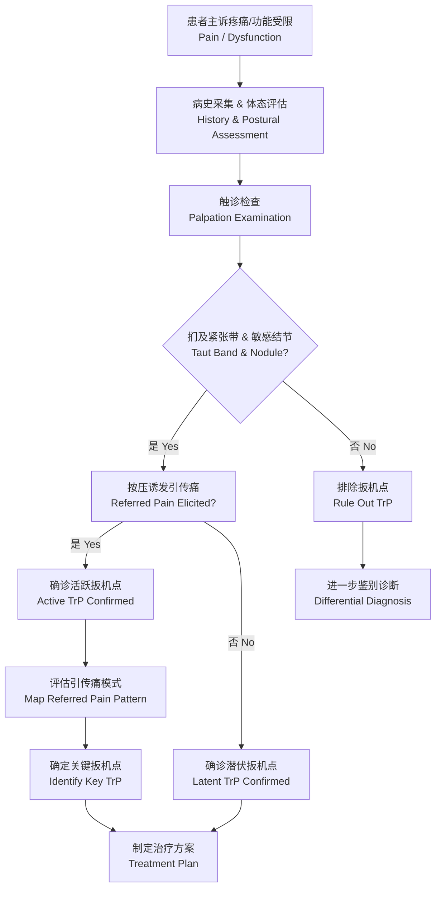

# 扳机点疗法

## 概述

扳机点（Trigger Point, TrP）是骨骼肌中过度应激的结节状紧张带（Taut Band），按压时产生局部疼痛并可能引传痛（Referred Pain）至远端区域。扳机点疗法（Trigger Point Therapy）是通过手法压迫、针刺（Dry Needling）或物理 modalities 等手段灭活扳机点，恢复肌肉正常功能、改善局部血液循环、缓解疼痛和运动功能障碍的系统治疗方法。扳机点的概念由 Janet Travell 博士（曾任美国总统肯尼迪的医师）和 David Simons 博士系统阐述，其理论与临床实践构成了肌筋膜疼痛综合征（Myofascial Pain Syndrome）诊断和治疗的基础。

## 扳机点形成机制

扳机点的形成涉及多种病理生理机制，包括运动终板（Motor Endplate）功能异常导致的乙酰胆碱（Acetylcholine）持续释放、肌浆网（Sarcoplasmic Reticulum）钙离子泵功能障碍导致的肌纤维持续收缩、局部缺血缺氧导致的能量危机（Energy Crisis），以及炎症介质（如缓激肽、前列腺素、P 物质）的累积。能量危机假说认为，持续的肌纤维收缩压迫局部微血管，导致缺血缺氧，ATP 供应不足，进而使钙离子泵失活，钙离子无法回收入肌浆网，形成恶性循环（Positive Feedback Loop）。

## 扳机点分类

| 类型 | 特征 | 临床表现 |
|------|------|---------|
| 活跃扳机点（Active TrP） | 自发性疼痛或运动时疼痛 | 静息时亦有不适，引传痛模式明确 |
| 潜伏扳机点（Latent TrP） | 仅按压时产生疼痛 | 平时无症状，可影响肌肉活动度和力量 |
| 卫星扳机点（Satellite TrP） | 位于活跃扳机点的引传痛区域 | 活跃扳机点灭活后可自行消失 |
| 中央扳机点（Central TrP） | 位于肌腹运动终板区域 | 最常见类型，核心病理位点 |
| 附着点扳机点（Attachment TrP） | 位于肌腱附着处 | 常被误诊为肌腱炎或附着点炎 |
| 关键扳机点（Key TrP） | 触发其他卫星扳机点的源头 | 灭活关键点可解除多个卫星点 |
| 原发性扳机点（Primary TrP） | 由直接损伤或过度使用导致 | 独立存在，非继发于其他扳机点 |

## 扳机点诊断流程

## 常见扳机点引传痛模式

- **上斜方肌（Upper Trapezius）**：向头部颞侧和下颌角引传，是紧张性头痛（Tension-Type Headache）的常见原因
- **冈上肌（Supraspinatus）**：向三角肌中部和上臂外侧引传，模拟肩峰撞击综合征（Impingement Syndrome）
- **臀小肌（Gluteus Minimus）**：向大腿外侧至脚踝外侧引传，类似坐骨神经痛（Sciatica）模式
- **腓肠肌（Gastrocnemius）**：向足跟和足底引传，与足底筋膜炎（Plantar Fasciitis）疼痛模式重叠
- **胸锁乳突肌（Sternocleidomastoid, SCM）**：向头顶、前额和眼部引传，可导致姿势性眩晕
- **咬肌（Masseter）**：向牙齿和颞下颌关节引传，与颞下颌关节紊乱（TMD）相关
- **腰方肌（Quadratus Lumborum, QL）**：向髂嵴和骶髂关节引传，模拟腰椎小关节紊乱

## 治疗技术

### 缺血性压迫（Ischemic Compression）

用拇指、指节或工具对扳机点施加持续稳定的压力，保持 30-90 秒至疼痛减轻或组织放松感出现。压力应以患者能耐受的轻中度疼痛为度。作用机制包括机械性破坏异常收缩环路、机械性拉伸紧张带、以及压迫后反应性充血（Reactive Hyperemia）清除代谢废物。改良方法包括逐渐递增压力法（Gradual Pressure Increase）和间歇性压迫法（Intermittent Compression）。

### 干针疗法（Dry Needling）

使用细针插入扳机点进行针刺，引发局部抽搐反应（Local Twitch Response, LTR），快速打破异常收缩环路。干针可结合电刺激增强效果。针刺深度取决于目标肌肉的解剖深度，需避免刺入胸膜腔（气胸风险）或大血管。干针的神经生理机制包括：
- 机械破坏运动终板异常去极化
- 激活 A-δ纤维触发脊髓和皮层镇痛通路
- 局部微创伤引发血管舒张和生长因子释放
- 牵张反射弧的重置（Resetting of Stretch Reflex Arc）

### 拉伸与喷雾牵张（Spray and Stretch）

先喷涂皮肤冷却剂（Vapocoolant Spray）后立即拉伸目标肌肉，利用反射抑制机制降低肌张力，使扳机点更容易释放。冷却剂沿肌肉纵轴单向喷洒，配合被动拉伸至肌肉正常长度。该技术特别适用于急性期扳机点或对压迫治疗反应不佳者。

### 穴位按压与触发点按摩

结合中医穴位理论与扳机点定位技术，通过深部按压（Acupressure）和横向摩擦（Transverse Friction Massage）松解肌筋膜粘连。手法治疗可结合激痛点揉按、肌筋膜松解术（Myofascial Release）和肌肉能量技术（Muscle Energy Technique, MET）。MET 通过等长收缩后放松（Post-Isometric Relaxation, PIR）或交互抑制（Reciprocal Inhibition）机制促进扳机点释放。

### 物理治疗 modality

- **治疗性超声（Therapeutic Ultrasound）**：1-1.5 W/cm² 连续波，5-10分钟，热效应增加组织伸展性
- **激光治疗（Low-Level Laser Therapy, LLLT）**：促进微循环和组织修复
- **经皮电神经刺激（TENS）**：通过门控理论（Gate Control Theory）减轻疼痛
- **冲击波治疗（Extracorporeal Shock Wave Therapy, ESWT）**：适用于慢性难治性扳机点

## 常见扳机点的治疗手法参数

| 肌肉 | 患者体位 | 治疗手法 | 注意事项 |
|------|---------|---------|---------|
| 上斜方肌 | 坐位或仰卧 | 拇指或指节压迫，配合颈部侧屈拉伸 | 避免颈动脉窦压迫 |
| 冈上肌 | 坐位手背靠腰 | 拇指从肩胛冈上方深入按压 | 注意肩峰下间隙 |
| 臀小肌 | 侧卧屈髋屈膝 | 肘部深压按压至大转子周围 | 避开坐骨神经 |
| 腓肠肌 | 俯卧位足垂床外 | 指压内外侧头，配合踝背屈 | 勿过度按压胫神经 |
| 胸锁乳突肌 | 仰卧位 | 拇指与食指捏按肌腹 | 注意避免颈动脉窦 |

## 自我管理（Self-Management）

使用筋膜球（Massage Ball）、花生球（Peanut Ball）或扳机点棒（Trigger Point Stick）进行自我按压。每个扳机点施压 30-90 秒，每日 1-3 次。自我放松后应配合温和拉伸以巩固疗效。建议配合泡沫轴（Foam Roller）进行大范围肌筋膜放松，结合呼吸训练促进自主神经调节。自我管理的禁忌包括急性损伤期、局部感染或炎症、深静脉血栓风险、以及骨质疏松区域。

## 扳机点疗法的循证医学证据

系统综述表明扳机点疗法对颈痛、肩痛、下背痛和紧张性头痛具有中等强度的证据支持。缺血性压迫联合主动拉伸的疗效优于单一治疗。干针疗法的效果不劣于手法治疗，对慢性疼痛患者具有显著改善。然而，扳机点疗法的长期效果（6个月以上随访）仍需更多高质量随机对照试验（RCT）验证。

## 不同肌肉的专项治疗策略

### 肩颈部肌群
上斜方肌（Upper Trapezius）是运动人群中最常涉及扳机点的肌肉之一。治疗时患者取坐位或仰卧位，治疗师用拇指或指节在肩颈交界处（斜方肌上缘中点）施加持续压力30-60秒。配合颈椎侧屈和对侧旋转的主动拉伸（Active Stretching）增强放松效果。冈上肌（Supraspinatus）扳机点的触诊需将患者手臂内收后伸置于背后（手背贴腰体位），治疗师从肩胛冈上方软组织凹陷处向肩关节方向深入按压。

### 腰骨盆区肌群
腰方肌（Quadratus Lumborum）是慢性下背痛中易忽略的扳机点来源。患者侧卧位，治疗师以肘部沿髂嵴上缘向腰椎方向按压。臀小肌（Gluteus Minimus）扳机点需要治疗师以大转子为中心进行扇形触诊（Fan-shaped Palpation）。臀中肌（Gluteus Medius）的扳机点常被误认为骶髂关节功能紊乱。髂腰肌（Iliopsoas）扳机点可通过仰卧位屈髋放松触诊，与髋关节弹响综合征（Snapping Hip Syndrome）进行鉴别。

### 下肢肌群
股四头肌（Quadriceps）扳机点易导致膝前痛和髌股关节功能异常。股内侧肌（Vastus Medialis Obliquus, VMO）扳机点与髌骨半脱位相关联。腘绳肌（Hamstrings）扳机点可导致坐骨结节区域的局部疼痛和俯卧腿弯举时的牵拉感。腓肠肌（Gastrocnemius）扳机点与足跟痛密切相关，治疗时以拇指在腓肠肌内外侧头肌腹最饱满处施压，配合踝关节背屈拉伸。比目鱼肌（Soleus）扳机点则需在屈膝位下按压（腓肠肌放松后触诊更准确）。

### 头面与咀嚼肌群
咬肌（Masseter）和颞肌（Temporalis）扳机点是颞下颌关节紊乱（Temporomandibular Disorder, TMD）和紧张型头痛的重要原因。口内触诊（Intraoral Palpation）可直接按压咬肌深层扳机点。胸锁乳突肌（Sternocleidomastoid, SCM）扳机点可导致姿势性眩晕（Postural Dizziness）和平衡障碍，治疗时用拇指和食指捏按 SCM 肌腹（颈动脉三角区，避免压迫颈动脉窦 Siphon）。

## 扳机点疗法与针灸的异同

扳机点干针疗法（Trigger Point Dry Needling）与中医针灸（Acupuncture）有本质区别：
- **理论基础不同**：干针基于西方解剖学和神经生理学；针灸基于中医经络理论和气血学说
- **治疗靶点不同**：干针靶向肌肉运动终板的异常电活动和扳机点；针灸靶向经络上的穴位（Acupoints）
- **操作手法不同**：干针强调引发局部抽搐反应（LTR）；针灸强调得气（Deqi Sensation，酸麻胀重感）
- **用针规格不同**：干针常使用较细的实心不锈钢针；针灸针规格多样
- **循证证据水平不同**：干针在肌筋膜疼痛综合征中的证据等级高于针灸在此适应症中的证据

但两者存在实践技术上的交叉：部分针灸穴位与常见扳机点的解剖位置高度吻合（如合谷 LI4与第一骨间背侧肌扳机点，足三里 ST36与胫前肌扳机点）。

## 扳机点疗法的禁忌证与注意事项

### 绝对禁忌
- 局部感染（蜂窝织炎 Cellulitis、脓肿 Abscess、皮肤感染）
- 深静脉血栓（Deep Vein Thrombosis, DVT）或血栓性静脉炎
- 出血性疾病（血友病 Hemophilia、血小板减少症）或正在使用抗凝药物
- 局部恶性肿瘤或不明肿块
- 开放性损伤或手术后未愈合切口

### 相对禁忌
- 严重骨质疏松（Osteoporosis）：避免过度按压
- 怀孕期（尤其腰骶部和腹部区域）：谨慎施治
- 局部皮肤异常（烧伤、皮炎、瘢痕组织）
- 慢性疼痛综合征患者的过度刺激可能导致疼痛放大

### 不良反应
- 治疗后24-48小时局部酸痛或瘀青（Ecchymosis）
- 干针后偶见局部小血肿（通常可自行吸收）
- 罕见但严重的气胸（Pneumothorax）：干针时肩胛区和锁骨上区针刺过深
- 自主神经反应（血管迷走性晕厥 Vasovagal Syncope）：患者紧张或疼痛敏感时出现

## 与其他治疗方法的整合策略

扳机点疗法不应孤立使用，而应作为综合康复方案的一部分。推荐整合策略包括：
- **手法治疗组合**：缺血性压迫 → 肌肉能量技术（MET）→ 被动拉伸 → 主动激活
- **物理治疗整合**：干针 → 治疗性超声 → 神经肌肉再教育
- **运动训练整合**：扳机点灭活 → 筋膜放松 → 功能性力量训练 → 运动专项训练
- **行为因素管理**：纠正不良姿势（Postural Correction）、优化工作站人体工学（Ergonomics）、管理心理压力（Stress Management）

## 诊断性影像与扳机点

近年来，弹性超声（Elastography）和磁共振弹性成像（Magnetic Resonance Elastography, MRE）被用于客观量化扳机点的力学特性。扳机点在弹性超声上表现为局部硬度增高的区域（Young's Modulus 高于周围组织 1.5-2.0 倍）。微透析技术（Microdialysis）显示扳机点区域 pH 降低、缓激肽（Bradykinin）、CGRP（Calcitonin Gene-Related Peptide）、P 物质（Substance P）和 TNF-α等炎症介质浓度升高。红外热成像（Infrared Thermography）可辅助定位扳机点区域的温度异常（通常表现为局部温度略高）。

## 扳机点疗法实用案例

### 案例一：跑步运动员腓肠肌扳机点
运动员主诉足跟痛，踩地时加重。查体发现腓肠肌内侧头有明显紧张带和敏感结节，按压引传痛沿跟腱至足底。干针治疗一次后（引发两次 LTR），配合腓肠肌离心拉伸（Eccentric Stretch），疼痛 VAS 由 6/10 降至 2/10。3 周内 3 次治疗后症状完全消失。

### 案例二：久坐办公人员的上斜方肌扳机点
患者双侧肩颈酸痛伴频发紧张性头痛。触诊双侧上斜方肌活跃扳机点，按压引传至颞部和眼眶。治疗方案：缺血性压迫 3 次/周 + 工作位人体工学调整 + 每日肌肉自我放松。4 周后头痛频率从每周 4 次降至每周少于 1 次。

## 呼吸与扳机点的关系

呼吸模式异常（特别是胸式呼吸过度依赖、膈肌功能不足）与颈部和胸廓扳机点的形成密切相关。辅助呼吸肌（斜角肌 Scalenes、胸锁乳突肌 SCM、胸小肌 Pectoralis Minor）在呼吸模式异常时过度使用，形成慢性肌筋膜扳机点。治疗策略包括：
- **膈肌呼吸训练（Diaphragmatic Breathing）**：重建以膈肌为主的腹式呼吸模式
- **胸廓活动度训练**：胸椎伸展（Thoracic Extension）和肋间肌拉伸
- **辅助呼吸肌放松**：SCM 和斜角肌扳机点灭活

## 运动项目相关扳机点

| 运动项目 | 高发肌肉群 | 常见临床模式 |
|---------|-----------|-------------|
| 网球/羽毛球 | 冈上肌、冈下肌、小圆肌 | 肩外展/外旋受限，网球肘关联 |
| 游泳 | 肩胛下肌、大圆肌、胸大肌 | 游泳肩（Swimmer's Shoulder） |
| 足球 | 臀中肌、股直肌、腓肠肌 | 腹股沟痛、腘绳肌拉伤关联 |
| 举重/体操 | 腰方肌、髂腰肌、竖脊肌 | 下背痛、髋屈曲紧张 |
| 自行车 | 髂腰肌、股直肌、胸大肌 | 下背痛、膝前痛、手部麻木 |

## 扳机点治疗后的康复训练建议

扳机点治疗后的康复训练应当遵循"灭活-拉伸-激活-整合"的四个步骤序列（Inactivate-Stretch-Activate-Integrate, ISAI 原则），确保疗效的长期维持。ISAI 流程强调治疗的完整闭环——灭活扳机点后必须立即进行针对性拉伸，恢复肌肉静息长度，然后通过低负荷激活重建神经肌肉控制，最后整合入功能性动作模式。

扳机点灭活后应结合针对性的运动控制（Motor Control）训练以预防复发。研究表明，单纯灭活不配合运动训练的患者，3个月内复发率可达 40-60%。

针对性训练建议包括：
- **肩颈部扳机点**：肩胛骨稳定性训练（Scapular Stabilization）、深颈屈肌激活（Deep Neck Flexor Activation）
- **腰骨盆区扳机点**：核心稳定性训练（腹横肌 Transversus Abdominis 和盆底肌协同激活）、髋关节外展肌力量训练
- **下肢扳机点**：足弓功能训练（Foot Core）、单腿平衡和着陆生物力学训练

每次扳机点治疗后应给予患者居家练习 1-2 项自我技术，配合拉伸和功能锻炼，主动运动是维持疗效的关键。治疗计划通常需要 4-8 周系统干预（每周 1-2 次治疗间隔），慢性多区域扳机点可能需要更长期管理。

## 相关条目

[[FasciaRelease]], [[SelfMassage]], [[SportsMassageAndManualTherapy]], [[PhysicalTherapy]], [[Acupuncture]], [[PainScience]]
