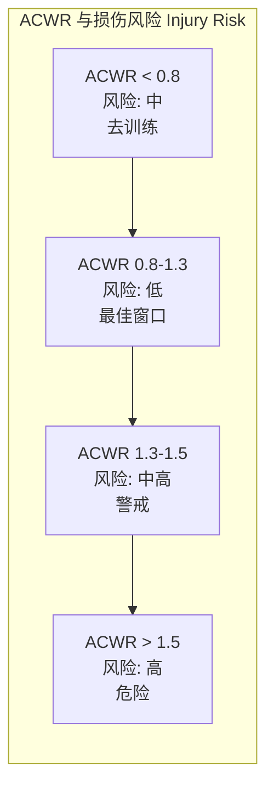
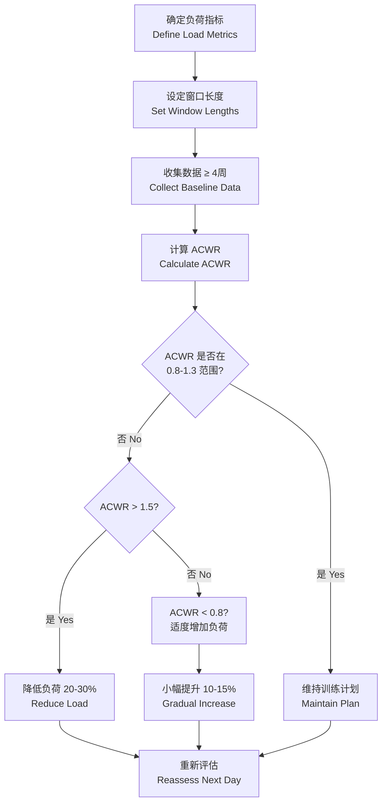

---
aliases:
  - ACWR
  - AcuteChronicWorkloadRatio
  - TrainingLoadRatio
  - LoadManagement
  - InjuryRiskMonitoring
tags:
  - 12_SportsScience
  - SportsTraining
  - ACWR
  - TrainingLoad
  - InjuryPrevention
  - PerformanceMonitoring
created: 2024-02-20
updated: 2026-05-17
---

# 急性慢性负荷比

> 急性慢性负荷比 (Acute:Chronic Workload Ratio, ACWR) 是监控运动员训练负荷与伤病风险的关键指标，通过对比短期 (急性) 负荷与长期 (慢性) 负荷，量化训练压力的相对变化。

## ACWR 的定义与计算

### 基础公式

ACWR 的基本计算公式为：

$$ \text{ACWR} = \frac{\text{急性负荷 (Acute Load)}}{\text{慢性负荷 (Chronic Load)}} $$

其中：

- **急性负荷 (Acute Load)**：过去 1 周的总训练负荷 (通常以 7 天为窗口)
- **慢性负荷 (Chronic Load)**：过去 4 周的平均周训练负荷 (通常以 28 天为窗口)

$$ \text{慢性负荷} = \frac{\text{过去 4 周的总训练负荷}}{4} $$

```mermaid
graph LR
    subgraph 急性窗口 Acute Window (7天)
        D1[Day 1-7] --> AL[急性负荷<br/>Acute Load<br/>∑ 7天]
    end
    subgraph 慢性窗口 Chronic Window (28天)
        W1[Week 1] --> W2[Week 2]
        W2 --> W3[Week 3]
        W3 --> W4[Week 4]
        W4 --> CL[慢性负荷<br/>Chronic Load<br/>∑ 28天 ÷ 4]
    end
    AL --> ACWR[ACWR<br/>= AL / CL]
    CL --> ACWR
```

### 扩展计算模型

| 模型 | 计算方法 | 特点 |
| :--- | :--- | :--- |
| **固定窗口 (Fixed Window)** | 7 天 / 28 天简单平均 | 计算简便，经典方法 |
| **滚动窗口 (Rolling Window)** | 每天重新计算最近 7 天和 28 天 | 更平滑，消除边界效应 |
| **EWMA (指数加权移动平均)** | $L_t = \lambda \cdot X_t + (1-\lambda) \cdot L_{t-1}$ | 最新负荷贡献更大，反应更灵敏 |
| **耦合 EWMA (Coupled EWMA)** | 急性和慢性均使用 EWMA | 适应性强，研究中表现优异 |

EWMA 模型的计算公式如下：

$$ \text{EWMA}_t = \lambda \times X_t + (1-\lambda) \times \text{EWMA}_{t-1} $$

其中 $\lambda$ 为衰减因子 (通常设为 0.1-0.3)，$X_t$ 为第 $t$ 天的负荷值，$\text{EWMA}_{t-1}$ 为上一天的 EWMA 值。

## ACWR 与损伤风险的关系

### 最佳区间理论

大量研究表明，ACWR 保持在 **0.8-1.3** 的范围内，训练适应与损伤风险之间达到最佳平衡：

| ACWR 范围 | 风险等级 | 解释 | 建议 |
| :--- | :--- | :--- | :--- |
| < 0.8 | 低负荷 | 训练刺激不足，去训练效应 | 适当增加负荷 |
| **0.8-1.3** | **最佳区间** | 适应的 Sweet Spot | 维持当前负荷节奏 |
| 1.3-1.5 | 警戒区间 | 损伤风险开始升高 | 注意恢复和负荷调整 |
| **> 1.5** | **高风险** | 损伤风险显著增加 | 必须降低负荷 |
| **< 0.5** | **去适应** | 过度减量，能力下降 | 逐步回归训练 |

### 损伤风险的 U 形曲线



研究数据表明，当 ACWR > 1.5 时，软组织损伤 (肌肉拉伤、肌腱病变) 的风险增加 2-4 倍；当 ACWR 在 0.8-1.3 时，损伤风险最低。

## 训练负荷的量化方法

### 内部负荷 (Internal Load) 指标

| 指标 | 测量方法 | 优点 | 缺点 |
| :--- | :--- | :--- | :--- |
| **RPE (主观疲劳评分)** | Borg CR-10 或 0-10 量表 | 简易、经济、反映整体感受 | 主观性强，需校准 |
| **sRPE (Session RPE)** | RPE × 训练时长 (分钟) | 综合反映强度与量 | 对时长估计误差敏感 |
| **心率 (HR)** | 平均 HR、%HRmax、HR 分区时间 | 客观、连续监测 | 受环境/疲劳影响 |
| **TRIMP (训练冲量)** | 基于 HR 分区累积 | 成熟、研究充分 | 设备依赖 |
| **乳酸 (Blood Lactate)** | 指尖血样分析 | 反映代谢强度 | 侵入性、不连续 |

$$ \text{sRPE} = \text{RPE 评分} \times \text{训练时长 (分钟)} $$

### 外部负荷 (External Load) 指标

| 指标 | 测量手段 | 典型单位 | 适用项目 |
| :--- | :--- | :--- | :--- |
| **总距离 (Total Distance)** | GPS | 米 (m) | 足球、橄榄球、田径 |
| **高速跑距离 (HID)** | GPS | 米 (> 19.8 km/h) | 球类团队项目 |
| **加速度/减速度 (Acc/Dec)** | GPS + IMU | 次数 (m/s²) | 多方向运动项目 |
| **冲刺次数 (Sprint Count)** | GPS | 次数 | 同歇性团队项目 |
| **发力次数 (Load/Impact)** | 加速度计 | 任意单位 (AU) | 接触性运动 |
| **投掷/举重次数** | 视频/传感器 | 次数 + 重量 | 力量/投掷项目 |

## ACWR 在运动项目中的应用

### 团队球类项目

| 运动 | 常用外部负荷指标 | 典型最佳 ACWR 区间 | 特殊考虑 |
| :--- | :--- | :--- | :--- |
| 足球 (Soccer) | 总距离 + HID + 冲刺 | 0.8-1.3 | 比赛日为峰值，周间差异大 |
| 橄榄球 (Rugby) | 接触次数 + 加速负荷 | 0.8-1.3 | 冲击负荷需单独建模 |
| 篮球 (Basketball) | 负荷剂量 (PL) + 跳跃 | 0.8-1.4 | 多场比赛周需调整 |
| 澳式足球 (AFL) | 距离 + HID + 加速度 | 0.8-1.5 | 对慢性窗口长度敏感 |

### 个人项目

| 运动 | 常用负荷指标 | 典型 ACWR 范围 | 应用场景 |
| :--- | :--- | :--- | :--- |
| 中长跑 | 里程 + sRPE | 0.8-1.3 | 赛前减量期控制 |
| 游泳 | 距离 + RPE + 心率 | 0.9-1.4 | 不同泳姿差异处理 |
| 自行车 | 功率 + TSS | 0.8-1.3 | CTL/ATL 模型类似 |
| 力量举 | 总吨位 + RPE | 0.7-1.3 | 不同动作分别监控 |

## ACWR 的局限性与批判

### 已知局限性

| 局限性 | 表现 | 缓解方法 |
| :--- | :--- | :--- |
| **窗口长度敏感性** | 7/28 天窗口不一定适合所有项目 | 使用 EWMA 或调整窗口 |
| **个体基线缺失** | 相同 ACWR 对不同运动员意义不同 | 积累个体基线数据 |
| **数据质量依赖** | GPS/RPE 不准确导致结果偏差 | 多指标交叉验证 |
| **损伤的多因素性** | 损伤不仅与 ACWR 相关 | 综合考量生物力学、心理、营养 |
| **天花板效应** | 慢性负荷高时 ACWR 变化小 | 使用 Z 分数或百分比变化 |
| **统计争议** | 部分研究对 ACWR 预测能力存疑 | 使用 Bayesian 方法 |
| **急性/慢性窗口的非对称性** | 负荷增加 vs 减少的风险不同 | 使用耦合 ACWR 模型 |

### 最新研究批判

- **Lolli 等 (2019)**：指出 ACWR 的数学耦合问题——急性负荷包含在慢性负荷的计算中，导致统计上的伪相关
- **Wang 等 (2020)**：提出解耦 ACWR (Decoupled ACWR)，将急性与慢性负荷完全分离
- **Impellizzeri 等 (2020)**：强调 ACWR 的方法学质量差异大，未来应关注前瞻性研究设计
- **Williamson (2022)**：系统综述表明，ACWR 在团队项目中预测能力中等 (AUC ≈ 0.6-0.7)

## 实践应用建议

### 实施流程



### 综合决策工具

ACWR 不应作为孤立的决策指标，而需整合其他数据源：

| 数据类型 | 工具/方法 | 整合方式 |
| :--- | :--- | :--- |
| 主观感受 | 当天 Well-Being 问卷 (疲劳/睡眠/情绪/肌肉酸痛/压力) | 与 ACWR 联合报警 |
| 客观恢复 | HRV (心率变异性)、静息心率 | 调整负荷建议的权重 |
| 教练观察 | 技术质量评分、训练态度 | 定性修正 |
| 损伤历史 | 既往损伤记录 | 设定个性化的 ACWR 阈值 |
| 训练阶段 | 赛季周期、比赛日程 | 动态调整目标区间 |

## ACWR 的统计与数学基础

### 指标的理论分布

ACWR 本质上是一个比率 (Ratio)，其统计分布并非正常的正态分布。在处理 ACWR 数据时，应注意以下特性：

- **比率分布**：ACWR 的最小值为 0 (理论最低)，最大值无上限 (极端高负荷周)
- **对数转换**：部分研究建议对 ACWR 取自然对数 $\ln(\text{ACWR})$ 以改善分布特性
- **置信区间**：推荐报告 ACWR 的 90% 或 95% 置信区间以反映不确定性

### 不同模型的对比

| 模型 | 对急性峰值的反应速度 | 数据需求 | 统计争议 | 适用场景 |
| :--- | :--- | :--- | :--- | :--- |
| 固定窗口 (7/28 天) | 慢 (边界跳跃效应明显) | 低 (简单求和) | 周期性窗口伪差 | 无连续数据采集的团队 |
| 滚动窗口 | 中等 (每天更新) | 低-中 | 改进但仍有耦合 | 日常监控的过渡方案 |
| EWMA ($\lambda = 0.1$) | 慢 (平滑性强) | 中等 | 降低耦合问题 | 耐力项目长期监控 |
| EWMA ($\lambda = 0.3$) | 快 (反应灵敏) | 中等 | 噪音较多 | 高强度项目短期监控 |
| 耦合 EWMA | 可调 | 高 (需调优 $\lambda$) | 最新研究推荐 | 数据驱动的队 |
| 贝叶斯模型 | 灵活 (包含先验) | 高 (需编程实现) | 克服小样本问题 | 科研前沿 |

### 贝叶斯 ACWR 模型的公式框架

$$ P(\theta|D) \propto P(D|\theta) \times P(\theta) $$

其中 $P(\theta|D)$ 是给定数据 $D$ 后的后验分布，$P(D|\theta)$ 是似然函数，$P(\theta)$ 是先验分布。

优点：可以利用历史数据构建个体化的先验，解决"小样本 + 个体差异"的双重困境。

## 实践案例

### 案例 1：足球队员的赛季负荷管理

| 周次 | 急性负荷 (m) | 慢性负荷 (m) | ACWR | 教练决策 |
| :--- | :--- | :--- | :--- | :--- |
| 赛前 1 周 | 22000 | 18000 | 1.22 | ✅ 可接受，进入赛前准备 |
| 第 1 周 (比赛周) | 35000 | 21000 | 1.67 | ⚠️ 高风险，下一周需要主动恢复 |
| 第 2 周 (恢复周) | 18000 | 23000 | 0.78 | ⚠️ 低负荷，注意保持训练刺激 |
| 第 3 周 | 25000 | 24000 | 1.04 | ✅ 最佳窗口，维持 |
| 第 4 周 (密集赛程) | 38000 | 25000 | 1.52 | ⚠️ 高强度，伤病风险评估 |
| 第 5 周 (减量) | 20000 | 26000 | 0.77 | ✅ 策略性减量，为下一阶段准备 |

### 案例 2：不同位置运动员的 ACWR 差异

在一支职业足球队中，不同位置的跑动模式差异显著，ACWR 阈值也应相应调整：

| 位置 | 平均周跑动距离 (m) | 高速跑占比 (%) | 个性化 ACWR 阈值 |
| :--- | :--- | :--- | :--- |
| 边锋 (Winger) | 28000 ± 3000 | 18-22 | 0.8-1.3 (基础) |
| 中场 (Midfielder) | 32000 ± 2500 | 12-16 | 0.8-1.25 (总距离大) |
| 中后卫 (Center Back) | 20000 ± 2000 | 8-12 | 0.75-1.35 (负荷波动大) |
| 边后卫 (Full Back) | 30000 ± 2800 | 15-20 | 0.8-1.3 |

$$ \text{位置调整后} = \text{通用 ACWR} + \Delta_{\text{位置}} $$

## 数据收集与工具

### 推荐技术栈

| 层次 | 工具选项 | 说明 |
| :--- | :--- | :--- |
| 数据采集 | GPS 背心 (Catapult, STATSports) | 外部负荷原始数据 |
| 主观评分 | 手机 App (AthleteMon, METRIC) | RPE + Well-Being 问卷 |
| 心率监测 | Polar, Garmin, Firstbeat | 内部负荷生理数据 |
| 数据存储 | Google Sheets, Airtable, SQL DB | 组织化数据管理 |
| 计算模型 | Python (Pandas), R (shiny), Excel | ACWR + 可视化 |
| 报告输出 | Tableau, Power BI, Dash | 教练可读的仪表盘 |

### 最小可行的 ACWR 实施方案 (对资源有限的团队)

1. **第 1 步**：确定负荷指标 (至少一个内部 + 一个外部)
2. **第 2 步**：使用 sRPE (RPE × 分钟) 作为统一指标
3. **第 3 步**：用 Google Sheets 或 Excel 创建模板
4. **第 4 步**：以固定窗口计算每日 ACWR
5. **第 5 步**：设置三个颜色区域：绿 (0.8-1.3)、黄 (1.3-1.5)、红 (>1.5)
6. **第 6 步**：每周回顾 + 教练讨论，积累个体基线

## 未来发展方向

- **多变量 ACWR**：整合疲劳、睡眠、心理状态的复合指标
- **机器学习预测**：使用随机森林、XGBoost 预测 ACWR 超出的时间
- **可穿戴实时 ACWR**：传感器数据实时计算并提醒
- **个体化窗口**：基于运动员的特征自动选择最佳窗口长度
- **跨运动标准化**：建立统一的负荷量化标准

## 相关条目

- [[AltitudeTraining|高原训练]]
- [[TrainingPeriodization|训练周期化]]
- [[RecoveryMethods|恢复方法]]
- [[SportsPhysiology|运动生理学]]
- [[InjuryPrevention|损伤预防]]
- [[MonitoringLoad|训练负荷监控]]
- [[RPEBasedTraining|RPE 训练负荷]]
- [[SportsDataAnalytics|运动数据分析]]
- [[INDEX|SportsTraining 索引]]
- [[../../INDEX|TianshangKnowledgeBase 索引]]
