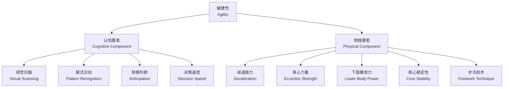
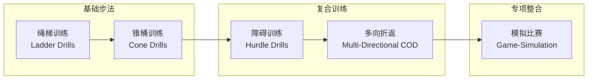
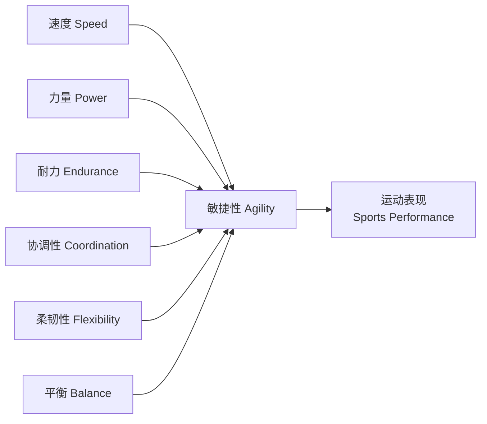

---
aliases:
  - AgilityTraining
  - CODTraining
  - ReactiveAgility
  - ChangeOfDirection
tags:
  - 12_SportsScience
  - SportsTraining
  - AgilityTraining
  - SpeedDevelopment
  - AthleticPerformance
created: 2024-02-10
updated: 2026-05-17
---

# 敏捷性训练

> 敏捷性训练 (Agility Training) 旨在提高运动员快速改变方向 (Change of Direction, COD) 的同时保持身体控制和速度的能力，是集体球类和个人对抗项目运动表现的关键素质。

## 敏捷性的定义与构成

### 敏捷性的二要素模型

现代运动科学将敏捷性分为两个核心维度：

| 维度 | 英文 | 占比 | 主要内容 |
| :--- | :--- | :--- | :--- |
| 感知决策 | Perceptual & Decision-Making | ~50% | 视觉扫描、模式识别、预期判断、反应时间 |
| 变向能力 | Change of Direction (COD) | ~50% | 减速技术、侧向切割、跨步调整、再加速 |

## 变向的生物力学基础

### 切割技术的力学分析

变向过程中的地面反作用力 (Ground Reaction Force, GRF) 可达体重的 3-5 倍。关键技术要点：

- **减速阶段**：最后 1-2 步的制动步，重心后移，髋膝踝屈曲角度增大
- **支撑阶段**：外侧脚外展约 30-45°，产生侧向推进力
- **推进阶段**：内侧脚快速前跨，髋关节外旋，完成变向
- **再加速阶段**：前倾身体，短促有力的摆臂驱动

### 离心力量的重要性

离心力量 (Eccentric Strength) 是高效减速的生物力学前提。研究表明，离心力量不足会导致：

- 变向速度下降 15-25%
- 前交叉韧带 (ACL) 损伤风险升高
- 身体重心控制不稳定

## 敏捷性测试方法

| 测试名称 | 距离/布局 | 主要测量 | 参考标准 (男子运动员) |
| :--- | :--- | :--- | :--- |
| **T 测试 (T-Test)** | 10码×4 锥桶 | 前后 + 侧向移动 | < 9.5 秒 (优秀) |
| **伊利诺斯测试 (Illinois Test)** | 10码×5 锥桶 | 多方向变向 | < 15.2 秒 (优秀) |
| **Pro-Agility (5-10-5)** | 5-10-5 码折返 | 侧向爆发力 | < 4.3 秒 (优秀) |
| **六边形跳 (Hexagon Test)** | 边长 24 英寸 | 快速脚步 + 协调 | 连续 3 圈 < 15 秒 |
| **Y 型测试 (Y-Shape Test)** | 5 米 Y 型 | 反应敏捷性 | 反应时间 < 0.4 秒 |

## 敏捷性训练方法

### 计划性敏捷性 (Planned Agility)

#### 绳梯训练 (Ladder Drills)
- **单脚过梯 (One-Foot In/Out)**：每格单脚踏入踏出，强调频率
- **伊卡里安 (Icky Shuffle)**：进-进-出模式，训练协调性
- **侧向跑 (Lateral Run)**：侧身快速横移
- **交叉步 (Carioca)**：前后交叉步，训练髋关节灵活性

#### 锥桶训练 (Cone Drills)
- **W 形折返**：5 个锥桶呈 W 形排列，前进后退结合
- **六边形锥桶**：随机指示方向，培养快速决策
- **Box Drill (箱式训练)**：锥桶呈正方形，顺时针/逆时针变向

### 反应敏捷性 (Reactive Agility)

反应敏捷性训练引入外部刺激，模拟比赛中不可预测的情境：

| 刺激类型 | 设备/方法 | 训练效果 |
| :--- | :--- | :--- |
| 视觉刺激 | 灯光反应板 (FitLight, BlazePod) | 缩短视觉-运动反应时间 |
| 听觉刺激 | 蜂鸣器定向指令 | 听觉反应敏捷性 |
| 真人对手 | 1v1 面对面对抗 | 最接近比赛情境 |
| 视频模拟 | 比赛视频触发变向 | 模式识别训练 |
| 虚拟现实 | VR 头显 + 动作捕捉 | 沉浸式训练 (前沿) |

### 力量与核心训练

- **下肢离心训练**：北欧腘绳肌下放 (Nordic Hamstring Lower)、单腿离心箱式下蹲
- **增强式训练 (Plyometrics)**：深度跳跃 (Depth Jump)、侧向跳箱、跨栏跳
- **核心抗旋转训练**：Pallof Press、抗旋转弓步蹲、Medicine Ball 旋转抛投

## 训练周期与整合

### 年度训练计划中的敏捷性安排

| 阶段 | 训练重点 | 频率 | 单次时长 |
| :--- | :--- | :--- | :--- |
| 基础期 (准备期) | 力量 + 基础步法建立 | 3x/周 | 20-30 min |
| 发展期 (赛前) | 变向技术 + 反应训练 | 3-4x/周 | 30-40 min |
| 巅峰期 (赛季) | 专项整合 + 维持 | 2x/周 | 15-20 min |
| 恢复期 (过渡期) | 主动恢复 + 技术校正 | 1-2x/周 | 10-15 min |

### 与其他素质训练的关系

## 运动专项敏捷性

### 不同项目的敏捷性特征

| 运动项目 | 敏捷性特征 | 典型训练 |
| :--- | :--- | :--- |
| 足球 (Soccer) | 多方向 + 间歇反复变向 | 带球变向、1v1 对抗 |
| 篮球 (Basketball) | 侧向移动 + 急停跳投 | 防守滑步 + 切入组合 |
| 网球 (Tennis) | 爆发性启动 + 制动 | 分腿垫步 + 侧向追逐 |
| 橄榄球 (Rugby) | 直线变向 + 躲闪 | 侧身跑 + 假动作变向 |
| 羽毛球 (Badminton) | 低重心 + 多向步法 | 米字步法、交叉步上网 |

## 损伤预防与注意事项

- **ACL 损伤预防**：强调屈膝落地的技术教学、Nordic Hamstring 训练
- **足踝稳定性**：单腿平衡训练、足踝肌群强化
- **训练负荷控制**：避免疲劳状态下的高强度变向训练
- **渐进原则**：从慢速低强度到高速高强度，从计划到反应
- **恢复与再生**：泡沫轴放松、冷水浴、睡眠管理

### 疲劳监控与风险管理

高强度敏捷训练容易导致神经肌肉疲劳，表现为反应时间延长和运动模式紊乱：

| 疲劳指标 | 测量方法 | 安全阈值 |
| :--- | :--- | :--- |
| CMJ 跳跃高度下降 | 纵跳测试板/力台 | < 10% 基础值 |
| 变向时间延长 | 计时门 | > 5% 基础值 |
| RPE 异常升高 | Borg CR-10 | 比平时高 2 分以上 |
| 技术质量下降 | 教练评分 (1-5) | < 3 分时停止训练 |

### 敏捷性训练设备与工具

| 工具类别 | 代表产品 | 主要用途 |
| :--- | :--- | :--- |
| 速度梯 (Agility Ladder) | 可调节梯格 | 基础步法、频率训练 |
| 锥桶 (Cones/Plates) | 扁平锥桶、标志碟 | 变向路线、空间意识 |
| 反应灯 (Reaction Lights) | BlazePod, FITLIGHT | 反应敏捷性、认知刺激 |
| 敏捷杆 (Agility Poles) | 可调节高度的柔韧杆 | 障碍变向、身体控制 |
| 计时系统 (Timing Gates) | Brower, Swift | 客观速度与变向时间测量 |
| 压力垫 (Pressure Mats) | Just Jump, SmartJump | 跳跃与反应时间测试 |
| 阻力设备 (Resistance) | 弹性阻力带、阻力伞 | 增强变向的力量输出 |

### 热身与冷却方案

#### 敏捷训练前的动态热身 (10-15 分钟)

| 阶段 | 活动 | 时长 | 目的 |
| :--- | :--- | :--- | :--- |
| 1. 轻度有氧 | 慢跑 + 高抬腿 + 踢臀跑 | 3 min | 核心温度升高 |
| 2. 动态拉伸 | 弓步转体、侧弓步、直腿摆动 | 4 min | 关节活动度准备 |
| 3. 神经激活 | 快速小碎步、原地变向跳 | 3 min | 神经肌肉连接激活 |
| 4. 专项准备 | 模拟变向路线 (50% 强度) | 3 min | 运动模式预演 |

#### 训练后的冷却与再生 (10 分钟)

- **静态拉伸**：腘绳肌、股四头肌、臀肌、小腿各 30 秒
- **泡沫轴放松**：大腿外侧 (IT band)、小腿、臀肌
- **呼吸调节**：腹式呼吸 2-3 分钟，心率恢复至 < 100 bpm
- **营养补充**：训练后 30 分钟内摄入碳水 + 蛋白质 (3:1)

### 青少年敏捷性训练的特殊考虑

青少年神经系统的可塑性较高，是发展敏捷性的黄金时期。训练应遵循：

| 年龄阶段 | 训练重点 | 训练量 | 注意事项 |
| :--- | :--- | :--- | :--- |
| 6-9 岁 | 基础运动技能、简单步法游戏 | 15-20 min, 2x/周 | 以游戏为主，不强调竞争 |
| 10-12 岁 | 多方向移动、反应游戏 | 20-30 min, 2-3x/周 | 引入锥桶和绳梯，保持趣味性 |
| 13-15 岁 | 变向技术、反应敏捷性 | 25-35 min, 2-3x/周 | 结合力量训练基础，强调技术 |
| 16-18 岁 | 专项整合、竞赛模拟 | 30-45 min, 2-3x/周 | 高强度，结合速度与力量周期化 |

### 性别差异与训练调整

男女运动员在敏捷性训练中的生理差异需考虑：

| 变量 | 女性运动员 | 男性运动员 | 训练调整建议 |
| :--- | :--- | :--- | :--- |
| ACL 损伤风险 | 比男性高 4-6 倍 | 相对较低 | 女性加强神经肌肉控制训练 |
| 下肢力量 | 绝对值较低 | 绝对值较高 | 女性增加离心力量训练比例 |
| 激素周期影响 | 月经周期可能影响神经肌肉控制 | 无周期性影响 | 女性根据月经周期调整训练强度 |
| 反应时间 | 与男性无显著差异 | 与女性无显著差异 | 同样重视反应敏捷性训练 |

### 敏捷性训练与认知功能

近年研究揭示了敏捷性训练对认知功能的双重益处：

- 增强执行功能 (Executive Function)：工作记忆、认知灵活性、抑制控制
- 提高视觉-空间处理速度：对学习和运动表现均有迁移效应
- 神经可塑性促进：多方向移动训练激活小脑和基底神经节
- 运动-认知双任务 (Dual-Task) 训练：在敏捷性训练中增加认知任务 (如数字倒背)，提高比赛中的决策能力

### 周期化模型中的敏捷性安排

| 周期阶段 | 力量准备 | 敏捷性发展 | 专项整合 | 主动恢复 |
| :--- | :--- | :--- | :--- | :--- |
| 训练方法 | 基础力量 + 核心 | 变向技术 + 步法 | 模拟比赛 + 反应 | 低强度 + 技术校正 |
| 强度 | 60-75% 1RM | 70-85% 最大速度 | 85-95% 最大速度 | < 60% 最大速度 |
| 量 | 中 | 中-高 | 中 | 低 |
| 频率 | 3-4x/周 | 3x/周 | 2x/周 | 1-2x/周 |
| 恢复 | 48h | 48-72h | 72h+ | 主动恢复 |

## 相关条目

- [[SpeedTraining|速度训练]]
- [[PlyometricTraining|增强式训练]]
- [[StrengthTraining|力量训练]]
- [[CoreStability|核心稳定训练]]
- [[ACWR|急性慢性负荷比]]
- [[YouthAthleteDevelopment|青少年运动员发展]]
- [[NeuroplasticityAndTraining|神经可塑性与训练]]
- [[INDEX|SportsTraining 索引]]
- [[../../INDEX|TianshangKnowledgeBase 索引]]
