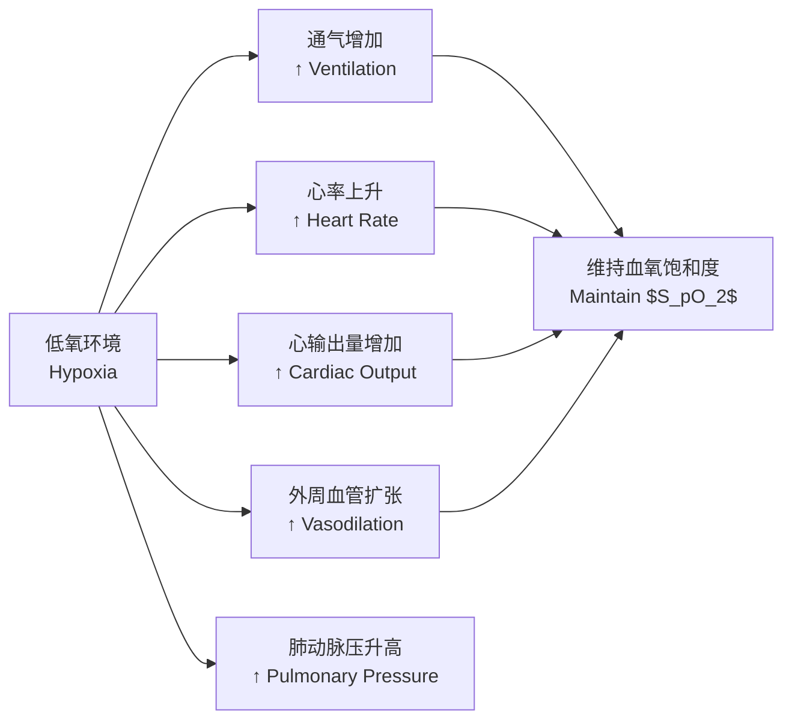
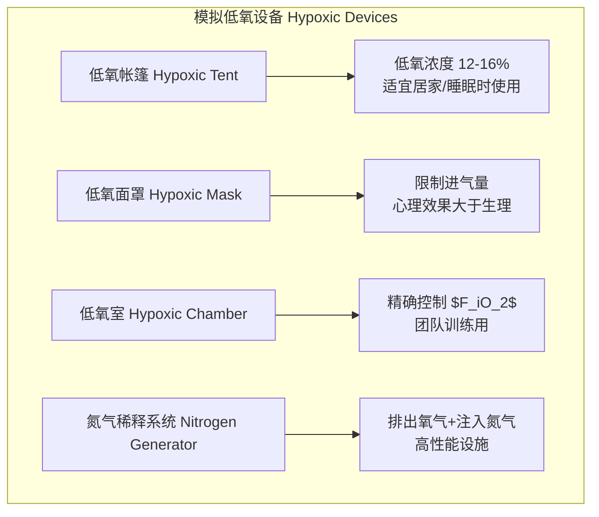

---
aliases:
  - AltitudeTraining
  - HypoxicTraining
  - HighAltitudeTraining
  - LHTL
  - LiveHighTrainLow
tags:
  - 12_SportsScience
  - SportsTraining
  - AltitudeTraining
  - EnduranceTraining
  - Physiology
created: 2024-02-15
updated: 2026-05-17
---

# 高原训练

> 高原训练 (Altitude Training / Hypoxic Training) 利用低氧环境刺激身体生理适应，以提升耐力运动表现，是现代中长跑、游泳、自行车等耐力项目的核心训练手段之一。

## 高原环境的生理基础

### 低氧环境的定义

随着海拔升高，大气压 (Barometric Pressure) 下降，导致肺泡氧分压 (Partial Pressure of Oxygen, $P_{O_2}$) 降低：

$$ P_{O_2} = (P_{\text{atm}} - 47) \times 0.2093 $$

其中 $P_{\text{atm}}$ 为大气压 (mmHg)，47 为 37°C 时的饱和水蒸气压，0.2093 为空气中氧的体积分数。

| 海拔 (m) | 大气压 (mmHg) | 肺泡 $P_{O_2}$ (mmHg) | 动脉血氧饱和度 $S_pO_2$ (%) |
| :--- | :--- | :--- | :--- |
| 海平面 (0) | 760 | ~100 | 97-99 |
| 中等海拔 (1500) | 635 | ~80 | 95-97 |
| 中高海拔 (2500) | 560 | ~65 | 90-94 |
| 高海拔 (3500) | 490 | ~50 | 85-90 |
| 极高海拔 (4500+) | 430 | ~40 | 75-85 |

### 急性低氧反应 (Acute Hypoxic Response)

初到高原时，身体产生一系列急性适应反应：

## 慢性生理适应

### 血液学适应

最重要的适应之一是**红细胞生成的增加**。低氧诱导因子 (Hypoxia-Inducible Factor, HIF-1α) 被激活后，上调促红细胞生成素 (Erythropoietin, EPO) 基因表达：

$$ \text{HIF-1α} \uparrow \rightarrow \text{EPO} \uparrow \rightarrow \text{RBC 生成} \uparrow \rightarrow \text{Hb 浓度} \uparrow \rightarrow \text{血氧容量} \uparrow $$

| 适应指标 | 时间窗口 | 变化幅度 | 意义 |
| :--- | :--- | :--- | :--- |
| EPO 浓度升高 | 2-3 小时 | 2-3 倍基础值 | 刺激骨髓红系造血 |
| 网织红细胞计数 | 3-5 天 | ↑ 30-50% | 新生 RBC 标志 |
| 血红蛋白浓度 | 7-14 天 | ↑ 5-10% | 血氧容量增加 |
| 血容量 (血浆 + RBC) | 2-4 周 | ↑ 5-15% | 运输氧气能力提升 |

### 肌肉与代谢适应

- **线粒体密度**：低氧刺激线粒体生物合成 (PGC-1α 上调)
- **氧化酶活性**：细胞色素 c 氧化酶、柠檬酸合酶活性增强
- **毛细血管网络化**：VEGF (血管内皮生长因子) 表达增加，毛细血管密度增加
- **乳酸代谢**：乳酸清除能力增强 (MCT1/MCT4 转运蛋白上调)
- **肌红蛋白浓度**：肌细胞内氧存储能力改善
- **抗氧化酶**：SOD、谷胱甘肽过氧化物酶活性升高，减轻氧化应激

## 高原训练的主要模式

### 经典训练方法比较

| 模式 | 英文 | 居住海拔 | 训练海拔 | 适用人群 | 优点 | 缺点 |
| :--- | :--- | :--- | :--- | :--- | :--- | :--- |
| **高住低练** | LHTL | 2000-2500m | 海平面/低海拔 | 耐力运动员 | 保持训练强度 + 获得低氧适应 | 设备成本高 |
| **高住高练** | LHTH | 1800-2500m | 1800-2500m | 早期适应 | 简单易行 | 训练强度下降 |
| **中住低练** | IHE (间歇性) | 3000-5000m (短时) | 低海拔 | 恢复期 | 时间灵活 | 适应不完全 |
| **低住高练** | LHTL 变异 | 模拟低氧室 | 低海拔 | 团队项目 | 不影响团队训练 | 设施昂贵 |

### 模拟低氧设备

## 训练计划制定

### 海拔选择与持续时间

**经典方案**：1800-2500m 海拔，每天 12-16 小时暴露，持续 2-4 周。

| 训练目标 | 推荐海拔 | 建议时长 | 训练频率 |
| :--- | :--- | :--- | :--- |
| 促红细胞生成 | 2000-2500m | 3-4 周 | 每年 1-2 次 |
| 赛前刺激 | 1800-2200m | 2-3 周 | 重大赛事前 |
| 维持适应 | 模拟低氧 3-5h/天 | 持续 | 每周 3-5 次 |
| 高原基地训练 | 1800-2400m | 3-6 周 | 年度计划中 1-2 次 |

### 周训练量安排示例 (中长跑运动员，高住高练模式)

| 星期 | 上午 | 下午 |
| :--- | :--- | :--- |
| 周一 | 适应性跑 40min (低强度) | 核心力量 + 拉伸 |
| 周二 | 间歇跑 8×400m (高原配速) | 恢复性游泳 30min |
| 周三 | 持续跑 60min (乳酸阈强度) | 技术训练 + 筋膜放松 |
| 周四 | 变速跑 6×1000m | 低氧室辅助核心训练 |
| 周五 | 恢复跑 30min | 主动恢复 (瑜伽/步行) |
| 周六 | 长距离跑 90-120min (低强度) | 营养补充 + 按摩 |
| 周日 | 完全休息 | 生理指标监测 |

## 赛后效应与竞赛安排

### 下高原后的竞技窗口

回到海平面后，血液学优势逐渐衰减，但运动员可利用**最佳竞赛窗口**：

$$ \text{赛后窗口} = 7\text{–}21 \text{ 天} $$

| 时间 | 生理状态 | 建议 |
| :--- | :--- | :--- |
| 第 1-3 天 | 血容量恢复期，部分适应丢失 | 低强度恢复训练 |
| 第 4-7 天 | 红细胞质量依然较高，感觉良好 | 赛前强度训练 |
| **第 7-14 天** | **血红蛋白和血容量最佳** | **竞赛高峰期** |
| 第 14-21 天 | 血象逐渐回到基础值 | 竞赛窗口关闭 |
| 第 21 天以后 | 低氧适应基本消退 | 需再次评估是否需要下一轮 |

## 潜在风险与注意事项

### 高原训练的风险

| 风险类型 | 表现 | 预防与管理 |
| :--- | :--- | :--- |
| 急性高原反应 (AMS) | 头痛、恶心、失眠 | 阶梯性登高、补水、乙酰唑胺 |
| 过度训练综合征 | 持续疲劳、免疫抑制、情绪低落 | 负荷监控、恢复日安排、主观感受评分 |
| 脱水 | 高原干燥 + 通风增加导致隐性失水 | 每日 3-4L 水分补充 |
| 睡眠质量下降 | 周期性呼吸 (Cheyne-Stokes) | 低氧帐篷、褪黑素、睡前调整 |
| 免疫抑制 | 上呼吸道感染风险升高 | 加强营养、注意保暖、补充维生素 D |
| 铁储备耗竭 | 红细胞生成加快消耗铁 | 铁补充剂 (如有必要监测血清铁蛋白) |

### 个体化因素

- **铁储备**：血清铁蛋白 < 30 ng/mL 者应在训练前补充铁剂
- **个人对低氧的敏感度**：存在显著的个体差异
- **既往高原经验**：首次高原训练者应降低 10-20% 强度
- **训练阶段的匹配**：建议在基础期结束后进入高原

## 新兴研究方向

| 研究方向 | 方法 | 初步发现 |
| :--- | :--- | :--- |
| 低氧抗阻训练 | 低氧环境 + 力量训练 | 肌肉肥大和力量增益增强 |
| 间歇性低氧训练 (IHT) | 短时间 (5-10 分钟) 低氧/常氧交替 | 改善血管功能 |
| 低氧与营养干预 | 低氧 + 硝酸盐/β-丙氨酸补充 | 协同效应 |
| 低氧与冷暴露 | 低氧 + 冷环境训练 | 代谢适应增强 |
| 转录组学/蛋白质组学 | 低氧适应生物标志物筛选 | 个体化训练方案优化 |
| 一氧化氮 (NO) 代谢 | 低氧诱导 NO 代谢物升高 | 血管舒张和氧输送改善 |

## 特殊人群的高原训练

### 青少年运动员

| 考虑因素 | 青少年 (< 18 岁) | 成人 |
| :--- | :--- | :--- |
| 推荐海拔上限 | 2000m | 2500m |
| 训练周期 | 2-3 周 | 3-4 周 |
| 初始负荷调整 | 降低 15-25% | 降低 10-20% |
| 特殊风险 | 生长板损伤、运动性哮喘加重 | 高原肺水肿/脑水肿 |
| 监测频率 | 每日主观感受 + 血氧饱和度 | 每周血象 + 训练负荷 |

### 女子运动员

近年研究关注性别差异对高原适应的影响：

| 生理参数 | 女性特点 | 训练调整 |
| :--- | :--- | :--- |
| 血红蛋白基线 | 通常低于男性 10-12% | 铁补充尤为重要 |
| 铁储备 | 月经周期导致铁流失 | 月经周期中调整补充策略 |
| 体温调节 | 高原环境中散热效率不同 | 注意保暖和水分补充 |
| EPO 反应 | 部分研究显示女性 EPO 反应更高 | 个体化监测 |

### 高原训练的营养支持

| 营养素 | 作用 | 推荐摄入 | 食物来源 |
| :--- | :--- | :--- | :--- |
| 铁 (Iron) | 红细胞生成的原料 | 女性: 18mg/d, 男性: 8mg/d | 红肉、菠菜、豆类、铁强化谷物 |
| 维生素 C | 促进铁吸收 | 100-200mg/d | 柑橘类水果、猕猴桃、彩椒 |
| 叶酸 (Folate) | 红细胞生成辅助因子 | 400μg/d | 深绿色蔬菜、豆类、肝脏 |
| 维生素 B12 | 红细胞成熟必需 | 2.4μg/d | 动物肝脏、鱼类、蛋类 |
| 抗氧化剂 | 减轻氧化应激 | 多样化的果蔬摄入 | 蓝莓、坚果、绿茶 |

### 高原训练基地推荐

世界各地知名的高原训练基地：

| 基地名称 | 位置 | 海拔 (m) | 特色 | 主要使用项目 |
| :--- | :--- | :--- | :--- | :--- |
| Iten | 肯尼亚 | 2400 | 长跑圣地，土路丰富 | 中长跑 |
| St. Moritz | 瑞士 | 1800 | 设施完善，风景优美 | 越野滑雪、自行车 |
| Font Romeu | 法国 | 1850 | 国家队基地，气候干燥 | 田径、自行车 |
| Albuquerque | 美国新墨西哥州 | 1500-1700 | 坡度缓，酒店密集 | 铁人三项 |
| 多巴 (Duoba) | 中国青海 | 2366 | 国家高原训练基地 | 中长跑、竞走 |
| 奥索尔诺 (Osorno) | 智利 | 2800 | 南美高水平基地 | 足球、耐力项目 |

### 高原训练的伦理与反兴奋剂

高原训练本身是合法的训练方法，但需注意：

- **血液兴奋剂 (Blood Doping)**：自体或异体输血以提高血液携氧能力，属于 WADA 禁用的方法
- **EPO 注射**：合成 EPO 是 WADA 禁用物质，高原训练诱导的内源性 EPO 升高是合法的
- **模拟低氧设备的使用**：合法，但需在比赛规则框架内使用 (部分赛事限制比赛前使用低氧帐篷)
- **检测问题**：自体和同种输血在反兴奋剂检测中需要通过运动员生物护照 (ABP) 进行间接识别

## 相关条目

- [[ACWR|急性慢性负荷比]]
- [[EnduranceTraining|耐力训练]]
- [[VO2maxTraining|最大摄氧量训练]]
- [[SportsPhysiology|运动生理学]]
- [[RecoveryMethods|恢复方法]]
- [[12_SportsScience/SportsMedicine/SportsNutrition|运动营养]]
- [[IronDeficiencyInAthletes|运动员缺铁]]
- [[INDEX|SportsTraining 索引]]
- [[../../INDEX|TianshangKnowledgeBase 索引]]

