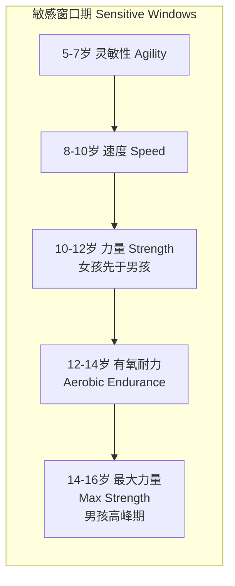
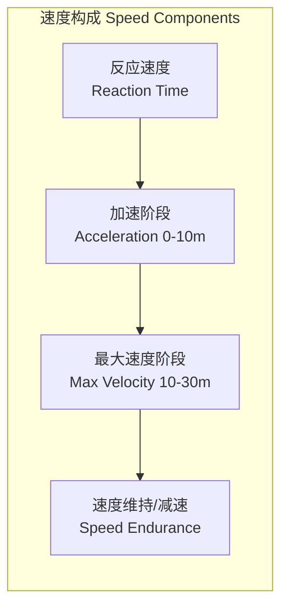

---
aliases: [AthleticAbility, 运动能力, PhysicalFitness, 身体素质, LTAD, 长期运动员发展]
tags: ['12_SportsScience', 'SportsTraining', 'AthleticDevelopment', 'PhysicalPreparation']
created: 2026-05-17
updated: 2026-05-17
---

# 运动能力 Athletic Ability

## 1. 概述 (Overview)

运动能力发展（Athletic Ability Development）是指系统地培养运动员的综合身体素质基础，涵盖力量（Strength）、速度（Speed）、耐力（Endurance）、柔韧（Flexibility）和协调（Coordination）五大核心素质。这些素质相互依存、相互促进，共同决定了运动员在专项运动中的表现水平。运动能力的全面发展是高水平竞技表现的基础，也是预防运动损伤和延长运动生涯的关键保障。

## 2. 长期运动员发展模型 (LTAD Model)

长期运动员发展（Long-Term Athlete Development, LTAD）模型由 Istvan Balyi 提出，将运动员的成长分为七个阶段：

| 阶段 | 年龄范围 | 核心发展目标 |
|:-----|:---------|:-------------|
| Active Start | 0–6 岁 | 基本活动能力、运动乐趣培养 |
| FUNdamentals | 6–9 岁（男）/ 6–8 岁（女） | 基本运动技能（FMS）、敏捷、平衡、协调 |
| Learn to Train | 9–12 岁（男）/ 8–11 岁（女） | 综合运动能力、运动专项启蒙 |
| Train to Train | 12–16 岁（男）/ 11–15 岁（女） | 有氧基础、力量发展、技术积累 |
| Train to Compete | 16–23 岁（男）/ 15–21 岁（女） | 专项化训练、高强度竞技适应 |
| Train to Win | 19+ 岁（男）/ 18+ 岁（女） | 顶尖表现、比赛优化 |
| Active for Life | 任何年龄 | 终身体育参与、健康维护 |

LTAD 模型强调在正确的窗口期发展对应的体能素质，儿童和青少年时期是发展基本运动技能（Fundamental Movement Skills, FMS）和灵敏协调能力的敏感窗口期（Sensitive Periods/Windowing of Trainability）。

### 关键窗口期

## 3. 五大运动素质 (Five Pillars of Athleticism)

### 3.1 力量 (Strength)

力量是运动能力的基石——核心力量、最大力量和爆发力直接关联运动表现。

| 力量类型 | 定义 | 训练方法 | 测试方式 |
|:---------|:-----|:---------|:---------|
| 最大力量 (Max Strength) | 肌肉最大自主收缩力 | 1RM 大重量训练 | 1RM 深蹲、卧推 |
| 爆发力 (Power) | 单位时间做功能力 | 奥林匹克举、增强式训练 | CMJ、功率车测试 |
| 力量耐力 (Strength Endurance) | 持续施加次最大力量能力 | 高次数循环训练 | 俯卧撑最大次数 |
| 核心力量 (Core Strength) | 躯干稳定与控制能力 | 平板支撑、抗旋转训练 | 核心耐力测试 |

**力量训练原则**：超负荷（Overload）、特异性（Specificity）、渐进性（Progression）、可逆性（Reversibility）。力量的发展遵循神经适应先于肌肥大的规律——训练初期力量提升主要源于神经系统的优化，随后才是肌肉横截面积的增加。

### 3.2 速度 (Speed)

速度能力包括线性加速（Linear Acceleration）、最大速度（Maximum Velocity）和速度耐力（Speed Endurance），需要神经系统的持续优化。

**速度的生物力学要素**：
- 支撑阶段（Stance Phase）：着地位置、支撑时间、垂直刚度
- 摆动阶段（Swing Phase）：大腿前摆速度、折叠角度、髋关节伸展
- 神经系统因素：运动单位募集率（Rate Coding）、运动单位同步化

### 3.3 耐力 (Endurance)

耐力发展分为有氧基础建设（Aerobic Base Building）与无氧供能系统专项提升（Anaerobic Capacity Development）两个层次。

| 耐力类型 | 供能系统 | 训练强度 | 典型训练 |
|:---------|:---------|:---------|:---------|
| 有氧基础 (Aerobic Base) | 有氧氧化 | LT1 以下（<80% HRmax） | LSD 长距离慢跑 |
| 有氧功率 (Aerobic Power) | 有氧氧化 + 糖酵解 | LT1–LT2（80–90% HRmax） | 阈值跑、节奏跑 |
| 无氧容量 (Anaerobic Capacity) | 无氧糖酵解 | 90–100% HRmax | 间歇训练、重复跑 |
| 磷酸原系统 (ATP-PC) | ATP-PC 系统 | 极限强度 | 短冲刺（5–10秒） |

### 3.4 柔韧与活动度 (Flexibility & Mobility)

柔韧与活动度训练通过提升关节活动范围（Range of Motion, ROM）降低软组织损伤风险。

主动活动度（Active ROM）与被动活动度（Passive ROM）之间的差距称为"活动度储备"。柔韧训练的主要方法包括：

| 训练类型 | 方法 | 适用时机 | 持续时间 |
|:---------|:-----|:---------|:---------|
| 动态拉伸 (Dynamic) | 控制性动作活动度训练 | 热身阶段 | 5–10 分钟 |
| 静态拉伸 (Static) | 保持终末位置拉伸 | 训练后/恢复课 | 15–30 秒/动作 |
| PNF 拉伸 | 收缩-放松-拉伸循环 | 专项柔韧提升 | 6–10 秒收缩+30秒拉伸 |
| SMR (Foam Rolling) | 自我肌筋膜放松 | 热身/恢复 | 30–60 秒/部位 |

### 3.5 协调 (Coordination)

协调（敏捷性、平衡、节奏）决定了已有身体素质的有效表达效率。协调能力包括：

- **平衡**（Balance）：静态平衡（单腿站立）和动态平衡（落地稳定）
- **节奏**（Rhythm/Timing）：动作时机与节律控制
- **空间定向**（Spatial Orientation）：身体在空间中的位置感知
- **反应能力**（Reaction Ability）：对外部刺激的快速响应
- **分化能力**（Differentiation）：精细肌肉控制与力度调节

## 4. 运动能力评估 (Athletic Assessment)

运动能力评估需通过标准化测试量化结果，以便追踪运动员的发展轨迹并指导训练决策。

### 4.1 评估维度

| 维度 | 测试项目 | 评估指标 |
|:-----|:---------|:---------|
| 力量 | 1RM 深蹲、1RM 卧推 | 相对力量（重量/体重） |
| 爆发力 | CMJ（测力台）、立定跳远 | 跳跃高度、相对峰值功率 |
| 速度 | 10m/30m/40m 冲刺 | 分段时间、最大速度 |
| 敏捷 | T-Test、Illinois Agility | 完成时间 |
| 有氧耐力 | Yo-Yo Intermittent、Beep Test | VO₂max 估计值 |
| 柔韧 | Sit-and-Reach、Shoulder Mobility | ROM 角度/距离 |
| 身体成分 | 皮脂厚度、BIA、DXA | 体脂率、瘦体重 |

### 4.2 评估频率建议

- **年度测试**（Comprehensive Battery）：赛季前全面的体能评估
- **季中测试**（Mid-season Monitoring）：关键指标的周期性追踪
- **周/日监测**（Daily/Weekly Monitoring）：神经肌肉状态（CMJ）、主观疲劳（RPE）

## 5. 训练计划设计原则 (Programming Principles)

训练计划应遵循以下核心原则：

1. **循序渐进**（Progressive Overload）：训练刺激的系统性递增
2. **周期化**（Periodization）：宏观周期（Macrocycle）→ 中观周期（Mesocycle）→ 微观周期（Microcycle）
3. **个体化**（Individualization）：根据运动员的年龄、训练年限、伤病史和优势素质定制方案
4. **专项性**（Specificity）：SAID 原则（Specific Adaptation to Imposed Demands）
5. **变异性**（Variation）：避免训练停滞和过度使用损伤
6. **恢复整合**（Recovery Integration）：训练刺激与恢复的平衡

**避免过早专项化**（Early Specialization）：研究表明过早专项化增加过度使用损伤风险和运动员倦怠率。建议在青少年阶段进行多元化运动参与（Multi-sport Participation），建立广泛的运动能力基础。

## 6. 年龄与性别差异 (Age & Sex Differences)

### 6.1 儿童与青少年

青少年运动员的身体素质发展具有明显的窗口期（Windows of Opportunity）特征。在青春期生长突增（PHV, Peak Height Velocity）前后，不同身体素质的可训练性存在差异：

| 阶段 | 发展重点 | 训练建议 |
|:------|:---------|:---------|
| 青春期前 (Pre-PHV) | 基本运动技能（FMS）、协调性 | 游戏化训练、多元化运动 |
| 青春期 (Circa-PHV) | 有氧能力、力量发展 | 轻度力量训练、技术学习 |
| 青春期后 (Post-PHV) | 最大力量、爆发力 | 系统抗阻训练、专项体能 |

### 6.2 女性运动员

女性运动员在以下方面具有特殊性：
- **月经周期与运动表现**：黄体期耐力下降但力量可维持
- **ACL 损伤风险**：女性运动员 ACL 损伤率是男性的 4-6 倍
- **红色 S 三合症**（Female Athlete Triad）：能量可用性不足、月经失调、骨密度下降

## 7. 专项运动能力模型 (Sport-Specific Models)

不同运动项目对运动能力的需求权重不同：

| 运动项目 | 首要素质 | 次要素质 | 辅助素质 |
|:---------|:---------|:---------|:---------|
| 短跑 (Sprint) | 爆发力 + 速度 | 最大力量 | 核心稳定性 |
| 马拉松 (Marathon) | 有氧耐力 | 肌肉耐力 | 柔韧 + 跑步经济性 |
| 篮球 (Basketball) | 爆发力 + 敏捷 | 速度耐力 | 力量 + 协调 |
| 举重 (Weightlifting) | 最大力量 + 爆发力 | 柔韧 | 核心稳定性 |
| 游泳 (Swimming) | 有氧 + 无氧耐力 | 力量 | 柔韧 + 协调 |

## 8. 营养与恢复 (Nutrition & Recovery)

运动能力的提升不仅依赖于训练刺激，还与营养和恢复密切相关：
- **蛋白质摄入**：1.6-2.2 g/kg/天，分 4-6 次摄入
- **碳水化合物**：根据训练负荷调整，高强度日 6-10 g/kg
- **睡眠**：7-9 小时/天，是生长激素分泌和学习运动技能的关键时期
- **主动恢复**：低强度有氧活动促进血液循环和代谢物清除

## 9. 运动能力测试标准 (Testing Norms)

### 9.1 青少年测试标准（15-17 岁男性）

| 测试项目 | 优秀 | 良好 | 一般 | 需改进 |
|:---------|:-----|:------|:-----|:-------|
| 30m 冲刺 | <4.2s | 4.2-4.5s | 4.5-4.8s | >4.8s |
| CMJ 高度 | >50cm | 45-50cm | 38-45cm | <38cm |
| 立定跳远 | >2.5m | 2.3-2.5m | 2.1-2.3m | <2.1m |
| 深蹲 1RM (相对) | >1.8×BW | 1.5-1.8×BW | 1.2-1.5×BW | <1.2×BW |
| Yo-Yo IR1 | >1800m | 1400-1800m | 1000-1400m | <1000m |

### 9.2 运动员基准建立流程

1. **第 1-2 周**：熟悉测试程序，消除学习效应
2. **第 3 周**：正式基线测试，采集完整数据
3. **每 8-12 周**：重新测试，评估训练适应
4. **赛季末**：年度综合测试，规划下一周期训练目标

## 相关条目

- [[FatigueMonitoring]]
- [[Plyometrics]]
- [[LactateThreshold]]
- [[PowerTraining]]
- [[SportsPeriodization]]
- [[StrengthAndConditioning]]
- [[12_SportsScience/SportsMedicine/SportsNutrition|SportsNutrition]]
- [[SleepAndRecovery]]
- [[INDEX|SportsTraining 索引]]
- [[../../INDEX|TianshangKnowledgeBase 索引]]

