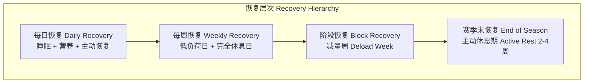

# 疲劳监测 Fatigue Monitoring

## 1. 概述 (Overview)

疲劳监测系统（Fatigue Monitoring System）是通过主客观指标追踪运动员训练恢复状态以优化表现并预防伤病的流程。有效的疲劳监测能够帮助教练团队识别早期过度训练征兆（Early Signs of Overtraining），在运动表现下降和伤病发生之前及时调整训练计划。疲劳管理是高水平竞技训练的关键组成部分——训练刺激必须与充分的恢复相平衡，才能实现持续的运动表现提升。

## 2. 疲劳的分类 (Classification of Fatigue)

### 2.1 按生理机制分类

| 疲劳类型 | 生理机制 | 主要表现 | 恢复时间 |
|:---------|:---------|:---------|:---------|
| 神经肌肉疲劳 (Neuromuscular) | 运动单位募集效率下降、中枢驱动减弱 | 跳跃高度下降、力量输出降低 | 24–72 小时 |
| 代谢性疲劳 (Metabolic) | 糖原耗竭、乳酸堆积、ATP 再生不足 | 耐力下降、运动效率降低 | 24–48 小时 |
| 心理疲劳 (Psychological) | 中枢神经系统疲劳、动机下降 | 训练意愿降低、注意力分散 | 数天至数周 |
| 肌源疲劳 (Muscular) | 肌纤维微损伤、炎症反应 | 肌肉酸痛（DOMS）、活动受限 | 48–96 小时 |

### 2.2 按时间维度分类

- **急性疲劳**（Acute Fatigue）：单次训练课引起的短期状态下降，通常 24 小时内恢复
- **功能性过度负荷**（Functional Overreaching, FOR）：短期积累性疲劳，超级代偿后表现提升
- **非功能性过度负荷**（Non-Functional Overreaching, NFO）：恢复期超过 2 周的状态下降
- **过度训练综合征**（Overtraining Syndrome, OTS）：持续数月以上的恢复困难，伴随多系统紊乱

## 3. 主观监测指标 (Subjective Measures)

### 3.1 每日自我报告指标

主观指标是疲劳监测中最敏感的工具之一，因为心理和情绪变化往往先于生理指标出现。

| 指标 | 工具/方法 | 频率 | 评分范围 |
|:-----|:----------|:------|:---------|
| 训练感知 exertion (RPE) | Borg CR-10 / modified RPE | 每次训练后 | 0–10 |
| 睡眠质量 | Likert 量表 / 睡眠日志 | 每日 | 1–5 |
| 情绪状态 | POMS (Profile of Mood States) | 每周 | 0–4 五点量表 |
| 全身疲劳感 | Likert 量表 | 每日 | 1–7 |
| DOMS 酸痛 | 视觉模拟量表 (VAS) | 每日 | 0–10 |
| 压力水平 | 自评量表 | 每日 | 1–5 |

**sRPE**（Session RPE）是训练负荷量化的常用方法：

$$
\text{sRPE} = \text{训练课 RPE 评分} \times \text{训练时长（分钟）}
$$

训练负荷（Training Load）通常以任意单位（Arbitrary Units, AU）表示。例如，一次 RPE 为 7、时长 60 分钟的训练课产生 420 AU 的负荷。

### 3.2 问卷工具

- **POMS**（Profile of Mood States）：评估紧张、抑郁、愤怒、活力、疲劳、困惑六个维度
- **RESTQ-Sport**（Recovery-Stress Questionnaire）：综合评估恢复与压力平衡
- **Hooper Index**：五分量表评估疲劳、睡眠、DOMS、压力四个维度

## 4. 客观监测指标 (Objective Measures)

### 4.1 生理指标

| 指标 | 测量方法 | 评估内容 | 注意点 |
|:-----|:---------|:---------|:-------|
| 心率变异性 (HRV) | 晨起静息 RR 间期分析 | 自主神经系统平衡 | 需建立个体基线 |
| 静息心率 (RHR) | 晨起静息心率 | 心血管恢复状态 | 个体变异较大 |
| 血液生化标志物 | 指尖血采样 | CK、BUN、皮质醇、睾酮 | 侵入性强、成本高 |
| 睡眠监测 | 穿戴设备/多导睡眠图 | 睡眠时长、深睡比例、觉醒次数 | 数据可靠性因设备而异 |

**心率变异性**（Heart Rate Variability, HRV）是反映自主神经系统状态的灵敏指标。晨起 HRV 的每日变化趋势可以反映运动员的恢复状态：

- HRV 升高（高于基线）→ 恢复良好
- HRV 降低（低于基线）→ 累积疲劳
- HRV 连续下降 → 可能进入过度训练状态

### 4.2 神经肌肉功能指标

垂直跳高度是目前最常使用的神经肌肉状态监测工具：

| 测试 | 设备 | 关键变量 | 测试用时 |
|:-----|:------|:---------|:---------|
| 反向纵跳 (CMJ) | 测力台/接触垫 | 跳跃高度、RFD、冲量 | 5 分钟 |
| 下跳 (Drop Jump) | 测力台/接触垫 | 接触时间、RSI | 5 分钟 |
| 等速肌力测试 | 等速测力计 | 峰值力矩、力矩比率 | 15 分钟 |

**反应力量指数**（Reactive Strength Index, RSI）：

$$
\text{RSI} = \frac{\text{跳跃高度 (m)}}{\text{地面接触时间 (s)}}
$$

RSI 下降 >10% 通常提示神经肌肉疲劳。

### 4.3 运动表现指标

| 指标 | 测量场景 | 指示方向 |
|:-----|:---------|:---------|
| 冲刺时间 | 简短冲刺测试 | 疲劳时减速（通常 >3%） |
| 变向能力 | Agility T-Test | 疲劳时完成时间延长 |
| 落地错误评分 | LESS (Landing Error Scoring System) | 疲劳时姿势控制下降（损伤风险增加） |
| 训练完成度 | 训练课负荷达成率 | 未完成计划量说明疲劳 |

## 5. 训练负荷量化 (Training Load Quantification)

### 5.1 外部负荷 (External Load)

外部负荷是运动员实际完成的物理工作量，通常使用 GPS 和加速度计测量：

| 指标 | 单位 | 描述 |
|:-----|:------|:------|
| 总距离 | m | 运动时间内的累计移动距离 |
| 高速跑距离 | m | 速度 >19.8 km/h 的距离 |
| 冲刺次数 | 次 | 速度 >25.2 km/h 的加速次数 |
| 加速度/减速度计数 | 次 | 高幅值（>3 m/s²）变向次数 |
| PlayerLoad™ | AU | 三维加速度向量模的和 |
| 力学负荷 | AU | 冲击力和地面反作用力的整合指标 |

### 5.2 内部负荷 (Internal Load)

内部负荷是运动员对外部负荷的生理响应：

- 心率区间法：Edward's TRIMP（Training Impulse）
- sRPE 法：RPE × 训练时长
- 乳酸浓度法：乳酸曲线下的面积

### 5.3 急性:慢性工作负荷比 (ACWR)

ACWR（Acute:Chronic Workload Ratio）是最近一周（急性）负荷除以最近四周（慢性）平均负荷的比值：

$$
\text{ACWR} = \frac{\text{急性负荷（1 周）}}{\text{慢性负荷（4 周均值）}}
$$

| ACWR 范围 | 解释 | 建议 |
|:----------|:------|:------|
| < 0.8 | 减量/不充分刺激 | 考虑增加负荷 |
| 0.8 – 1.3 | 安全区间 | 维持当前负荷 |
| 1.3 – 1.5 | 适当挑战区 | 短期可接受 |
| > 1.5 | 高损伤风险区 | 需降低负荷 |

## 6. 恢复策略 (Recovery Strategies)

### 6.1 主动恢复方法

| 方法 | 机制 | 推荐时机 |
|:-----|:------|:---------|
| 低强度有氧活动 (Active Recovery) | 促进血液循环、代谢物清除 | 训练后 10–15 分钟 |
| 冷疗 (Cold Water Immersion) | 减轻炎症、缓解 DOMS | 高强度训练后即刻 10–15 分钟 |
| 压缩衣 (Compression Garments) | 促进静脉回流、减轻水肿 | 训练后/睡眠时 |
| 按摩/泡沫轴 (Massage/SMR) | 肌筋膜放松、副交感神经激活 | 训练后 30–60 分钟 |
| 睡眠优化 (Sleep Hygiene) | 生长激素分泌、神经修复 | 每日 7–9 小时 |
| 营养策略 (Nutrition) | 糖原再合成、蛋白质修复 | 训练后 30 分钟窗口 |

### 6.2 周期化恢复



## 7. 数据管理与可视化 (Data Management)

疲劳监测数据的有效管理需要：

1. **个体基线建立**：前 2–4 周的数据作为正常波动范围参考
2. **趋势分析**（Trend Analysis）：关注变化方向而非单次数据点
3. **多维整合**（Multi-dimensional Integration）：结合主观、客观和表现数据
4. **可视化仪表盘**（Visual Dashboard）：便于教练组快速解读

**关键提示**：运动员个体基线值的建立比群体标准更具参考价值，因个体对负荷的耐受力差异巨大。

## 8. 不同运动项目的疲劳特征 (Sport-Specific Fatigue)

### 8.1 团队球类项目

| 项目 | 疲劳特征 | 监测重点 |
|:-----|:---------|:---------|
| 足球 (Soccer) | 高速跑距离的逐半场下降、半场后冲刺次数减少 | GPS 外部负荷、CMJ |
| 篮球 (Basketball) | 跳跃高度的逐节下降、变向速度降低 | 重复跳测试、RPE |
| 橄榄球 (Rugby) | 碰撞累积负荷影响神经系统恢复 | HRV、碰撞计数 |

### 8.2 个人项目

| 项目 | 疲劳特征 | 监测重点 |
|:-----|:---------|:---------|
| 耐力跑 (Endurance Running) | 逐周训练负荷累积影响有氧能力 | sRPE、HRV、静息心率 |
| 游泳 (Swimming) | 肩部和核心的局部肌肉疲劳 | SHOULD DER 评分、肩关节 ROM |
| 自行车 (Cycling) | 低压高容训练模式导致心理疲劳 | POMS、训练意愿评分 |

## 9. 疲劳监测的实施流程 (Implementation Workflow)

### 9.1 日常流程建议

```
晨起 (5分钟) → HRV 测量 + 晨起静息心率 + 主观问卷（疲劳/睡眠/DOMS/压力）
训练前 (2分钟) → 简短 CMJ 测试 + 热身期间的主观感受
训练中 → GPS 外部负荷 + 心率追踪
训练后 (1分钟) → sRPE 评分 + 简短的训练反馈
每周 (10分钟) → POMS 问卷 + 周负荷统计
每月 (30分钟) → 正式体能测试 + 生化标志物检测
```

### 9.2 预警阈值参考

| 指标 | 绿色（正常） | 黄色（注意） | 红色（干预） |
|:-----|:-------------|:-------------|:--------------|
| CMJ 高度变化 | ±5% | -5% 至 -10% | <-10% 连续 2 天 |
| HRV (rMSSD) | ±10% | -10% 至 -20% | <-20% 连续 3 天 |
| 晨起静息心率 | ±3 bpm | +3 至 +6 bpm | >+6 bpm 连续 3 天 |
| ACWR | 0.8-1.3 | 1.3-1.5 | >1.5 或 <0.5 |
| 主观疲劳评分 | 1-3/10 | 4-6/10 | 7-10/10 连续 3 天 |

## 相关条目

- [[AthleticAbility]]
- [[Plyometrics]]
- [[LactateThreshold]]
- [[PowerTraining]]
- [[SportsPeriodization]]
- [[StrengthAndConditioning]]
- [[SleepAndRecovery]]
- [[SportsNutrition]]
- [[INDEX|SportsTraining 索引]]
- [[../../INDEX|TianshangKnowledgeBase 索引]]
