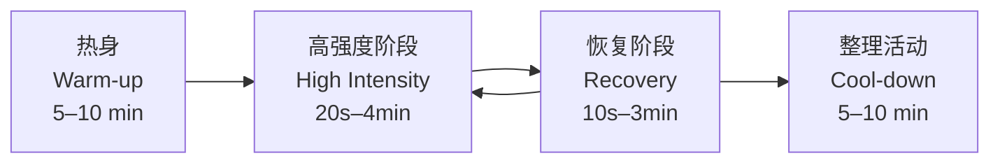
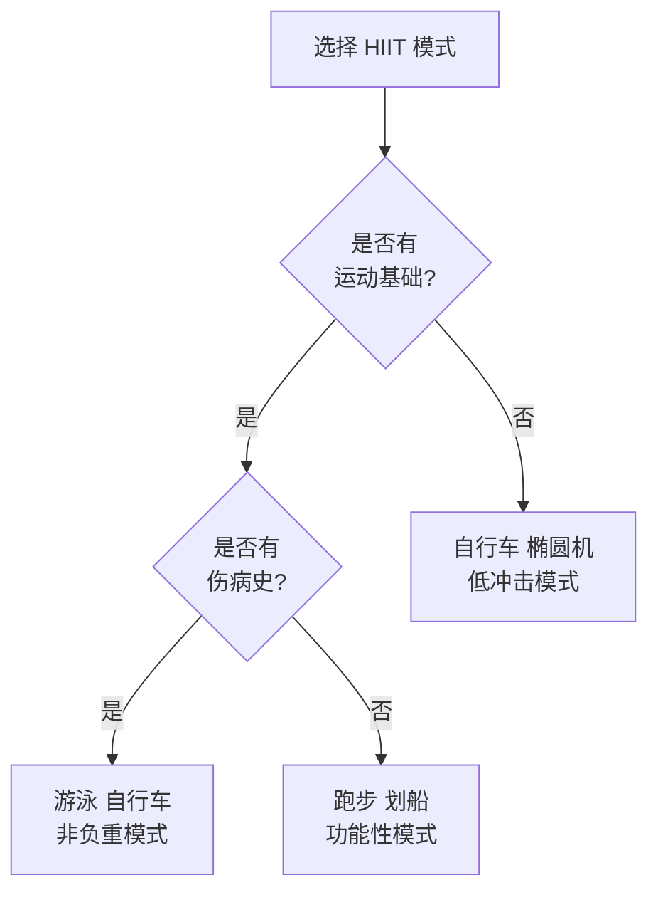

# 高强度间歇训练（HIIT）

## 概述

高强度间歇训练（High-Intensity Interval Training, HIIT）是一种交替进行短时间爆发性高强度运动（High-Intensity Exercise）和低强度恢复（Low-Intensity Recovery）或完全休息（Complete Rest）的训练方法。其核心特征是在较短时间内达到较高的训练负荷，总训练时间通常为 10–30 分钟。

HIIT 自 20 世纪 90 年代由日本科学家田畑泉（Izumi Tabata）系统研究以来，已成为运动科学（Sports Science）和大众健身领域的重要训练模式。研究表明，HIIT 在提升心肺功能、改善代谢健康（Metabolic Health）和促进体成分优化方面的效果，往往优于传统的持续中等强度训练（MICT）。

## 生理机制

### 心血管适应

HIIT 通过间歇性的高强度刺激，产生显著的心血管训练适应：

- **最大摄氧量提升（VO₂max Enhancement）**：高强度阶段接近或达到 VO₂max，刺激中枢和外周适应。中枢适应包括心脏每搏输出量（Stroke Volume）增加和心输出量（Cardiac Output）提升；外周适应包括肌肉毛细血管密度增加和线粒体（Mitochondria）生物合成。

- **EPOC 效应（Excess Post-exercise Oxygen Consumption）**：运动后过量氧耗使静息代谢率（Resting Metabolic Rate）在运动结束后持续升高数小时。EPOC 的大小与运动强度和持续时间正相关。

$$\text{EPOC} = \int_{t_0}^{t_1} (\dot{V}O_{2\text{ post}} - \dot{V}O_{2\text{ rest}}) \, dt$$

### 代谢适应

- **糖原利用与储存**：高强度阶段快速消耗肌糖原（Muscle Glycogen），训练后糖原超量恢复（Supercompensation）能力提升。

- **脂肪氧化**：长期 HIIT 训练可提高肌肉脂肪氧化酶活性，增加静息和运动中的脂肪利用率。

- **胰岛素敏感性（Insulin Sensitivity）**：HIIT 通过激活 AMPK 和 PI3K/Akt 信号通路，改善骨骼肌葡萄糖转运蛋白 GLUT4 的转位和表达。

### 神经肌肉适应

- **II 型肌纤维募集**：高强度阶段优先激活快肌纤维（Type II Muscle Fibers），促进神经肌肉系统的适应性改变。
- **运动单位同步化**：提高力量输出效率。
- **缓冲能力**：增强肌肉对乳酸（Lactate）和 H⁺ 的缓冲能力。

## 常见 HIIT 方案与参数

### 经典方案对比

| 方案名称 | 工作/休息比 | 高强度持续时间 | 恢复持续时间 | 总轮数 | 强度标准 | 适用人群 |
|----------|------------|---------------|-------------|--------|----------|----------|
| Tabata | 2:1 | 20 秒 | 10 秒 | 8 轮 | 170% VO₂max | 进阶训练者 |
| 1:1 间歇 | 1:1 | 30 秒 | 30 秒 | 10–20 轮 | 90–95% HRmax | 大多数人群 |
| 2:1 间歇 | 2:1 | 40 秒 | 20 秒 | 8–12 轮 | 95–100% HRmax | 高级训练者 |
| 长间歇（Long Interval） | 4:3 | 4 分钟 | 3 分钟 | 4–6 轮 | 85–95% HRmax | 耐力运动员 |
| 30-20-10 | 变节奏 | 30 秒低 + 20 秒中 + 10 秒高 | 2 分钟 | 5 轮 | 最后 10 秒冲刺 | 初学者友好 |
| Wingate | 1:4.5 | 30 秒全力 | 4.5 分钟 | 4–6 轮 | 全力冲刺 | 科研/精英 |

### 强度监控指标

| 指标 | 目标范围 | 测量方法 |
|------|----------|----------|
| 心率储备（HRR） | 85–95% | $(HR_{\text{运动}} - HR_{\text{静息}}) / (HR_{\text{max}} - HR_{\text{静息}}) \times 100\%$ |
| 最大心率百分比（%HRmax） | 85–100% | $HR_{\text{运动}} / HR_{\text{max}} \times 100\%$ |
| 主观疲劳度（RPE） | 15–20 | Borg 6–20 量表 |
| 功率/速度 | 个人最好成绩的 90–100% | 功率计/计时 |
| 血乳酸 | 8–15 mmol/L | 乳酸分析仪 |

## 训练效果与循证依据

### 心肺功能

- **VO₂max 提升**：Meta 分析显示，HIIT 可使 VO₂max 提升 4–10 ml/(kg·min)，效果优于同等训练量的 MICT。
- **血压降低**：收缩压降低 5–10 mmHg，舒张压降低 3–7 mmHg。
- **血管内皮功能**：改善血流介导的血管扩张（FMD）。

### 代谢健康

- **血糖控制**：HbA1c 降低 0.5–0.7%，空腹血糖降低 0.5–1.0 mmol/L。
- **血脂谱改善**：甘油三酯降低 10–20%，HDL-C 升高 5–10%。
- **体成分改变**：全身脂肪量减少 1.5–3.0 kg，内脏脂肪面积减少 10–20 cm²。

### 运动表现

- **耐力表现**：5K 和 10K 成绩提升 2–4%。
- **无氧能力**：Wingate 测试峰值功率提升 5–15%。
- **运动经济性（Running Economy）**：长间歇训练改善跑步经济性 2–5%。

### 认知与心理健康

- **认知功能**：长期 HIIT 可维持海马体（Hippocampus）体积，改善执行功能和工作记忆。
- **心理健康**：降低焦虑和抑郁评分，提升主观幸福感。

## 训练编程原则

### 频率与周期

| 训练水平 | 每周频率 | 单次时长 | 周期安排 |
|----------|----------|----------|----------|
| 初学者 | 1–2 次 | 10–15 分钟 | 每 3 周递增 |
| 中级 | 2–3 次 | 20–25 分钟 | 4 周为一个小周期 |
| 高级 | 3–4 次 | 25–40 分钟 | 包含减量周 |

### 进阶策略

1. **增加工作时间**：从 20 秒逐步增至 60 秒
2. **缩短恢复时间**：从 2:1 工作/休息比增至 1:1 或 2:1
3. **增加轮数**：从 6 轮增至 10–15 轮
4. **提高强度**：从 85% HRmax 增至 95–100%
5. **改变运动模式**：从自行车进阶至跑步、游泳或全身性动作

### 与力量训练的整合

- 同一天训练时，HIIT 放在力量训练之后或分开进行
- 高强度下肢 HIIT 与下肢力量训练间隔至少 48 小时
- 上肢 HIIT 可与下肢力量训练同天进行

## 安全注意事项与禁忌症

### 风险评估

| 风险因素 | 评估方法 | 建议 |
|----------|----------|------|
| 心血管疾病 | PAR-Q+ 问卷、体检 | 高风险人群需医学许可 |
| 肌肉骨骼损伤史 | 病史询问、功能筛查 | 选择低冲击运动模式 |
| 代谢疾病 | 血糖、血压监测 | 运动中监测生理指标 |
| 热病风险 | 环境温湿度评估 | 避免高温高湿环境 |

### 安全准则

- **充分热身**：5–10 分钟渐进式热身，包含动态拉伸
- **循序渐进**：初学者从较低强度和较长恢复开始
- **监测体征**：运动中注意心率、呼吸和主观感受
- **及时终止**：出现胸痛、眩晕、呼吸困难立即停止
- **恢复优先**：确保两次高强度训练之间有足够的恢复时间

### 特殊人群注意事项

- **老年人**：降低强度至 75–85% HRmax，延长恢复时间
- **孕妇**：避免仰卧位运动，强度控制在对话测试水平
- **糖尿病患者**：监测运动前后血糖，携带快速碳水化合物
- **肥胖人群**：选择游泳、自行车等低冲击运动

## HIIT 的运动模式选择

### 常见运动方式

| 运动模式 | 强度调节 | 优点 | 缺点 | 适用人群 |
|----------|----------|------|------|----------|
| 跑步（Running） | 速度/坡度 | 功能性最强 | 冲击大、受伤风险 | 有基础者 |
| 自行车（Cycling） | 阻力/踏频 | 低冲击、安全 | 需设备 | 所有人群 |
| 划船机（Rowing） | 阻力/划频 | 全身参与 | 技术要求高 | 中级以上 |
| 椭圆机（Elliptical） | 阻力/步频 | 低冲击 | 强度上限低 | 初学者/康复 |
| 游泳（Swimming） | 速度/间歇距离 | 零冲击 | 场地限制 | 所有人群 |
| 功能性训练 | 动作难度/次数 | 趣味性高 | 强度难量化 | 健身爱好者 |

### 运动模式的选择原则

## HIIT 在不同运动项目中的应用

| 运动项目 | HIIT 应用形式 | 训练目标 | 典型参数 |
|----------|--------------|----------|----------|
| 长跑 | 间歇跑、坡道冲刺 | 提升配速、VO₂max | 400–1000 m 间歇 |
| 自行车 | 功率间歇、爬坡间歇 | 提升 FTP、无氧能力 | 2–5 min 高功率 |
| 游泳 | 冲刺间歇、技术间歇 | 提升速度耐力 | 50–200 m 冲刺 |
| 球类运动 | 小场地对抗、重复冲刺 | 比赛专项体能 | 4–10 s 全力 |
| 力量项目 | 复合动作循环 | 代谢能力提升 | 30–60 s 工作 |

## HIIT 与营养配合

### 运动前营养

- 运动前 2–3 小时摄入含碳水化合物的正餐
- 避免高脂高纤维食物（消化慢）
- 可适量摄入咖啡因（3 mg/kg）提升表现

### 运动后恢复

| 时间窗 | 营养策略 | 作用 |
|--------|----------|------|
| 0–30 min | 快速碳水 + 蛋白质（3:1 至 4:1） | 糖原恢复、肌肉修复 |
| 2 h 内 | 均衡正餐 | 全面营养补充 |
| 24 h 内 | 充足蛋白质（1.2–1.6 g/kg） | 训练适应 |

## HIIT 常见误区

| 误区 | 事实 |
|------|------|
| "HIIT 越多越好" | 过量 HIIT 导致过度训练，每周 2–3 次为宜 |
| "HIIT 可以替代所有训练" | 应结合稳态有氧和力量训练 |
| "越累效果越好" | 质量优于数量，技术变形增加受伤风险 |
| "HIIT 只适合年轻人" | 适当调整后适合各年龄段 |
| "空腹 HIIT 减脂更快" | 可能增加肌肉分解，效果不明确 |
| "HIIT 不需要热身" | 充分热身是安全的前提 |

## 相关条目

- [[VO2max|最大摄氧量]]
- [[IntervalTraining|间歇训练]]
- [[EnduranceTraining|耐力训练]]
- [[LactateThreshold|乳酸阈]]
- [[Periodization|周期化训练]]
- [[RecoveryAndRegeneration|恢复与再生]]
- [[INDEX|SportsTraining 索引]]
