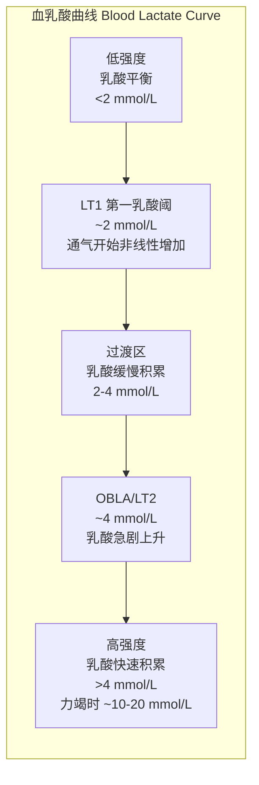
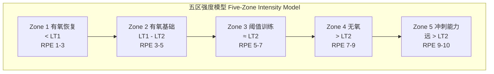

# 乳酸阈值 Lactate Threshold

## 1. 概述 (Overview)

乳酸阈（Lactate Threshold, LT）是指运动强度持续增加时，血液乳酸浓度开始以非线性的方式急剧上升的临界点。该现象反映了有氧氧化供能向无氧糖酵解供能转换的转折区。乳酸阈是评估耐力运动员有氧工作能力及预测耐力表现的核心指标之一，也是制定训练强度分区的重要依据。

## 2. 生理基础 (Physiological Basis)

### 2.1 乳酸的生成与清除

乳酸（Lactate）是糖酵解（Glycolysis）的终产物。在低强度运动时，肌肉产生的乳酸与血液中乳酸的清除速率达到平衡；随着运动强度增加，糖酵解速率加快，乳酸生成超过清除能力，导致血液乳酸积累。

$$
\text{[La^-]}_{\text{blood}} = \text{生成速率} - \text{清除速率}
$$

乳酸清除的主要途径包括：
- 通过 Cori 循环在肝脏中重新合成葡萄糖（Gluconeogenesis）
- 在心肌和慢肌纤维中作为氧化底物被利用
- 通过乳酸穿梭（Lactate Shuttle）在不同组织间转运

### 2.2 乳酸阈值曲线

### 2.3 阈值命名体系

| 术语 | 缩写 | 特征 | 约对应血乳酸浓度 | 对应生理事件 |
|:-----|:------|:------|:----------------|:------------|
| 第一乳酸阈值 | LT1 | 乳酸首次持续性超过静息水平 | ~2 mmol/L | 通气当量开始增加 |
| 第二乳酸阈值 | LT2 | 乳酸开始急剧非线性上升 | ~4 mmol/L | 通气代偿点 |
| 个体无氧阈 | IAT | 个体化的乳酸清除与生成平衡点 | 个体差异 | 个体阈值 |
| 血乳酸积累起点 | OBLA | 乳酸固定达到 4 mmol/L | 4 mmol/L | 实用参考点 |
| 最大乳酸稳态 | MLSS | 乳酸浓度在运动 20–30 分钟内增加 <1 mmol/L | 个体最大稳态负荷 | 可持续最高强度 |

**重要概念**：OBLA 是一个固定的、相对粗糙的参考值，而 IAT 和 MLSS 是需要通过个体化测试确定的更精确的阈值指标。

## 3. 影响乳酸阈的因素 (Influencing Factors)

### 3.1 生理因素

| 因素 | 对 LT 的影响 | 训练可塑性 |
|:-----|:-------------|:-----------|
| 肌纤维类型分布 (Fiber Type) | I 型纤维比例越高，LT 越高 | 低（遗传决定） |
| 毛细血管密度 (Capillary Density) | 毛细血管化程度越高，乳酸清除越快 | 高 |
| 线粒体酶活性 (Mitochondrial Enzymes) | 氧化酶活性越高，乳酸利用效率越高 | 高 |
| 缓冲能力 (Buffering Capacity) | 肌肉缓冲系统效率越高，高乳酸耐受越好 | 中 |
| 乳酸穿梭能力 (Lactate Shuttle) | MCT 转运蛋白表达水平 | 中-高 |
| 糖原储备 (Glycogen Stores) | 充足的糖原支持更高强度的有氧输出 | 中 |

### 3.2 训练与非训练因素

| 因素 | 对 LT 的影响 |
|:------|:------------------|
| 系统耐力训练 | LT 对应的运动强度右移（在更高的运动负荷下保持较低的血乳酸水平） |
| 高原训练 (Altitude Training) | 红细胞增多改善携氧能力，间接提升 LT |
| 热适应 (Heat Acclimation) | 血浆容量增加改善散热和心血管功能 |
| 营养状态 | 糖原不足时 LT 降低 |
| 睡眠质量 | 睡眠不足导致恢复不充分，LT 降低 |
| 年龄 | 年龄增长伴随氧化能力下降，LT 呈下降趋势 |

## 4. 测试方法 (Testing Methods)

### 4.1 乳酸阈直接测试

**递增负荷测试**（Graded Exercise Test, GXT）是乳酸阈测定的标准方法：

1. **设备**：跑台（Treadmill）或功率自行车（Cycle Ergometer）
2. **方案**：以递增负荷等级进行（如跑台每 3 分钟增加 1 km/h，自行车每 3 分钟增加 25–30W）
3. **采样**：每个负荷等级末的 30 秒内采集指尖血
4. **分析**：绘制血乳酸-负荷曲线，确定 LT1 和 LT2

| 测试平台 | 优势 | 劣势 |
|:---------|:------|:------|
| 跑台 (Treadmill) | 跑步专项，最贴近实际运动 | 影响技术动作、采样不便 |
| 功率自行车 (Cycle Ergometer) | 便于采样、功率输出控制精确 | 局部肌肉疲劳限制 |
| 游泳池泳 (Swimming Flume) | 游泳专项 | 设备昂贵、可及性低 |
| 划船测功仪 (Rowing Ergometer) | 专项针对性 | 上肢局部疲劳影响 |

**注意事项**：
- 测试前 24 小时避免高强度训练
- 测试前 2–3 小时摄入标准化饮食
- 保持充分水合状态
- 环境温度控制在 20–22°C

### 4.2 非侵入性替代方法

#### 通气阈测定 (Ventilatory Threshold, VT)

通气阈（VT）可作为非侵入的乳酸阈替代指标，通过呼出气体分析实现：

| 阈值 | 对应生理事件 | 判断标准 |
|:-----|:-------------|:---------|
| VT1 (第一通气阈) | 对应于 LT1 | VE/VO₂ 开始增加，VE/VCO₂ 不变 |
| VT2 (第二通气阈/RC 点) | 对应于 LT2 | VE/VCO₂ 开始增加，PETCO₂ 下降 |

#### 其他替代方法

| 方法 | 原理 | 精度 | 适用场景 |
|:-----|:------|:------|:---------|
| 心率拐点法 (HR Deflection) | 心率-负荷关系出现非线性拐点 | 中 | 无法进行气体分析时 |
| 谈话测试 (Talk Test) | 最符合"能较轻松谈话"的强度 | 中-低 | 大众训练 |
| 最大乳酸稳态测试 (MLSS) | 多个恒定负荷测试确定 | 高 | 精英运动员精确测定 |
| 30分钟测试 (30-min TT) | 30分钟最大努力的平均功率 ≈ MLSS 功率 | 高 | 自行车训练中常用 |

## 5. 训练应用 (Training Applications)

### 5.1 基于乳酸阈的分区模型

| 训练区 | 目标 | 训练时长 | 典型训练方式 |
|:-------|:------|:---------|:-------------|
| Zone 1 | 恢复、基础有氧 | > 60 分钟 | 轻松慢跑、低强度骑行 |
| Zone 2 | 有氧效率提升 | 30–90 分钟 | LSD、稳态跑 |
| Zone 3 | LT 提升、代谢适应 | 10–40 分钟 | 阈值跑 (Threshold/Tempo Run) |
| Zone 4 | 最大摄氧量、耐乳酸能力 | 3–8 分钟间隔 | VO₂max 间歇 |
| Zone 5 | 冲刺能力、ATP-PC 系统 | 5–15 秒 | 重复冲刺 |

### 5.2 阈值训练 (Threshold Training)

**Tempo Run / 节奏跑** 和 **Sweet Spot Training** 是最经典的耐力提升区段之一。

| 训练方式 | 强度 | 持续时间 | 总工作量 | 频率 |
|:---------|:------|:---------|:---------|:------|
| 连续节奏跑 (Continuous Tempo) | ~LT 或略低于 | 20–40 分钟 | 一次完成 | 1–2 次/周 |
| 巡航间歇 (Cruise Intervals) | ~LT | 5–15 分钟 × 2–4 组 | 总 20–40 分钟 | 1–2 次/周 |
| Sweet Spot | 88–93% FTP (自行车) | 10–20 分钟 × 2–3 组 | 总 30–50 分钟 | 1–3 次/周 |

### 5.3 训练适应的生理表现

系统训练（8–12 周）后，乳酸阈的典型适应包括：

1. **同一绝对强度下血乳酸浓度降低**：氧化酶活性提升，乳酸生成减少
2. **LT 对应的运动强度右移**：在更高的速度/功率输出下才达到阈值
3. **LT 与 VO₂max 的比值提升**：从 ~60–70% VO₂max 提升至 75–85% 甚至更高
4. **MLSS 对应的功率/速度提高**：可持续最高强度提升

**精英运动员的 LT 特征**：优秀马拉松运动员的 LT 可达到 85–90% VO₂max，意味着他们可以在接近最大有氧能力的强度下长时间维持稳态。

## 6. 训练应用注意事项 (Practical Considerations)

- **个体化**：LT 存在显著的个体差异，应通过测试确定个体阈值而非套用固定值
- **周期性**：LT 应在赛季的不同阶段（基础期、赛前期、比赛期）分别测试以跟踪训练效果
- **关联指标**：同时监测 LT、VO₂max、跑步经济性（Running Economy）三项指标以全面评估有氧能力变化
- **阈值漂移**：在减量阶段（Taper）和高原训练后，LT 可能出现暂时性变化
- **限制因素**：LT 主要反映有氧-无氧过渡能力，不能完全代表短时无氧能力和冲刺能力

## 7. 科学研究进展 (Research Frontiers)

- **性别差异**：女性在次最大强度下的乳酸积累通常低于男性
- **遗传学研究**：ACTN3 和 PPARGC1A 基因多态性与 LT 水平相关
- **种族差异**：不同种族人群的 LT 特征存在差异，可能与肌纤维类型分布有关
- **乳酸作为信号分子**：乳酸不仅是代谢副产物，也是重要的信号分子和氧化底物

## 8. 乳酸阈在不同运动中的应用 (Sport Applications)

### 8.1 耐力项目

| 项目 | LT 典型值（%VO₂max） | 训练重点 |
|:-----|:---------------------|:---------|
| 马拉松 (Marathon) | 85-90% | 稳态阈值跑、长距离节奏跑 |
| 自行车 (Cycling) | 80-88% | Sweet Spot 训练、FTP 工作 |
| 越野滑雪 (Cross-Country Skiing) | 80-90% | 上肢 + 下肢阈值训练 |
| 游泳 (Swimming) | 75-85% | 临界速度（Critical Speed）训练 |

### 8.2 间歇性项目

对于球类、格斗等间歇性项目，乳酸阈值同样具有重要意义：
- **足球**：LT 越高，高强度奔跑的恢复速度越快
- **网球**：LT 水平影响多分竞争中的持续出球质量
- **柔道/摔跤**：多次对抗间歇的乳酸清除能力决定后续表现

### 8.3 力量/爆发力项目

虽然 LT 主要在耐力训练中讨论，但力量项目运动员的下肢乳酸清除能力同样影响训练后恢复速度。大重量训练的乳酸积累可能限制训练量。

## 9. 常见误解与澄清 (Common Misconceptions)

| 误解 | 事实 |
|:-----|:------|
| 乳酸是肌肉酸痛的原因 | DOMS 由微细肌纤维损伤和炎症引起，非乳酸导致 |
| 乳酸阈越高越好 | LT 是有氧能力的指标，但过度追求 LT 可能忽视其他能力 |
| OBLA 是普适的阈值 | 4 mmol/L 是一个粗略参考，个体差异巨大 |
| 乳酸阈训练只在阈值强度有效 | 基础有氧训练（Zone 2 以下）同样通过改善线粒体密度间接提升 LT |
| 血乳酸测试是唯一准确方法 | 通气阈方法在熟练操作下与乳酸阈的误差 <5% |

## 10. 术语对照表 (Glossary)

| 中文 | English | 缩写 |
|:-----|:--------|:------|
| 乳酸阈值 | Lactate Threshold | LT |
| 个体无氧阈 | Individual Anaerobic Threshold | IAT |
| 最大乳酸稳态 | Maximal Lactate Steady State | MLSS |
| 通气阈值 | Ventilatory Threshold | VT |
| 血乳酸积累起点 | Onset of Blood Lactate Accumulation | OBLA |
| 跑步经济性 | Running Economy | RE |
| 最大摄氧量 | Maximal Oxygen Uptake | VO₂max |
| 功能阈值功率 | Functional Threshold Power | FTP |

## 相关条目

- [[AthleticAbility]]
- [[FatigueMonitoring]]
- [[PowerTraining]]
- [[AerobicEndurance]]
- [[VO2Max]]
- [[ExercisePhysiology]]
- [[SportsPeriodization]]
- [[INDEX|SportsTraining 索引]]
- [[../../INDEX|TianshangKnowledgeBase 索引]]
