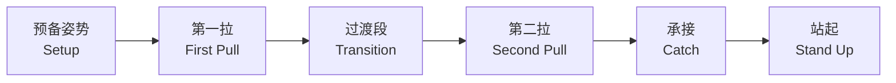
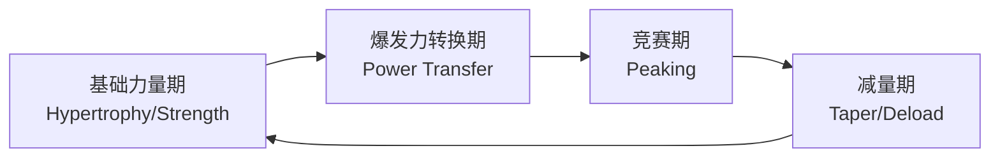

---
aliases: [OlympicLifting, 奥林匹克举重, 举重, Weightlifting, OlympicWeightlifting]
tags: ['12_SportsScience', 'SportsTraining', 'OlympicLifting', 'StrengthAndConditioning']
created: 2026-05-17
updated: 2026-05-17
---

# 奥林匹克举重

奥林匹克举重（Olympic Weightlifting）包含两个竞赛动作——抓举（Snatch）和挺举（Clean & Jerk），是力量和爆发力训练的核心支柱。举重是奥运会正式项目，男子和女子各设多个体重级别。两个动作的合计成绩（Total）决定最终名次。抓举是一次性将杠铃从地面举至过头顶的动作，要求极高的灵活性（Flexibility）、协调性（Coordination）和爆发力（Power）。挺举分为两步：先将杠铃翻至肩前（Clean），再向上推举过头（Jerk），允许更大的重量负荷。奥林匹克举重训练能有效提升运动员的峰值功率输出、力发展速率（Rate of Force Development, RFD）和神经肌肉激活效率。

## 竞赛动作技术分析

### 抓举 （Snatch）

抓举的技术分段：

| 阶段 | 关键技术要点 | 常见错误 |
|:---|:---|:---|
| 预备姿势 | 肩关节位于杠铃正上方，背部挺直 | 臀部过低或过高 |
| 第一拉 | 杠铃贴腿匀速上升至膝上 | 杠铃远离身体 |
| 过渡段 | 膝回屈（Rebend），躯干直立 | 臀部上升过快 |
| 第二拉 | 踝、膝、髋三伸展（Triple Extension） | 过早或过晚发力 |
| 承接 | 快速下蹲至深蹲位，杠铃锁定在头顶 | 杠铃后掉或不锁定 |
| 站起 | 从深蹲位站起，保持重心稳定 | 前倾或后倒 |

#### 生物力学公式

$$ P = F \times v, \quad \text{RFD} = \frac{\Delta F}{\Delta t} $$

第二拉阶段峰值功率可达到 3000-6000 W（取决于运动员水平）。

### 挺举 （Clean & Jerk）

挺举是更复杂的二段式动作，分为翻站（Clean）和上挺（Jerk）：

翻站阶段：
1. **第一拉**：杠铃从地面到膝上
2. **第二拉**：爆发力伸展 + 耸肩提肘
3. **接铃**：快速旋转肘关节，杠铃落在肩前锁定位
4. **站起**：从全蹲站起

上挺阶段：
1. **预蹲**（Dip）：保持躯干直立，快速下蹲缓冲
2. **发力**（Drive）：反向爆发伸展，杠铃获得向上速度
3. **分腿下蹲**（Split/Squat Jerk）：接住杠铃并稳定
4. **站直**：收腿，完成锁定

| 挺举方式 | 优点 | 缺点 | 适用人群 |
|:---|:---|:---|:---|
| 分腿挺（Split Jerk） | 重心低，稳定，支撑易 | 技术复杂，柔韧要求高 | 传统选手 |
| 下蹲挺（Squat Jerk） | 腿部力量利用率高 | 支撑难度大，肩关节要求高 | 亚洲选手 |

## 举重技术中的关键力学原理

$$ F = ma, \quad \tau = I\alpha $$

$$ \text{杠铃轨迹最优路径} = \text{S 形曲线}, \quad \text{靠近身体重心线} $$

三伸展（Triple Extension）的时序：
1. 踝关节伸展（Plantar Flexion）
2. 膝关节伸展（Knee Extension）
3. 髋关节伸展（Hip Extension）

## 训练方法

### 主要训练动作分类

| 类别 | 动作示例 | 训练目的 |
|:---|:---|:---|
| 竞赛动作 | 抓举、挺举（完整+分段） | 技术 + 力量 |
| 拉力变式 | 高拉（High Pull）、膝上悬垂拉 | 爆发力第二拉 |
| 接铃变式 | 悬垂翻（Hang Clean）、Power Clean | 接铃技术 |
| 辅助力量 | 前蹲（Front Squat）、过头蹲 | 腿部力量和稳定性 |
| 上肢力量 | 推举（Push Press）、引体向上 | 支撑和锁定力量 |
| 核心力量 | 提拉重物、负重体前屈 | 躯干稳定性 |

### 训练周期化

| 周期阶段 | 目标 | 强度区间 | 训练量 | 主要动作 |
|:---|:---|:---:|:---:|:---|
| 基础力量期 | 增大最大力量 | 75-85% | 高 | 前蹲、后蹲、辅助 |
| 爆发力转换期 | 提高 RFD 和功率 | 70-90% | 中高 | 抓举/挺举变式 |
| 竞赛期 | 最大化竞赛表现 | 85-100% | 中低 | 完整竞赛动作 |
| 减量期 | 恢复和超量恢复 | 60-80% | 低 | 技术训练 |

## 力量与功率的关系

$$ \text{功率} = F \times v = \frac{\text{做功}}{\text{时间}} $$

在举重中，最佳功率输出通常发生在 70-85% 1RM 的负荷区间：

| 负荷百分比 | 速度特征 | 训练适应 |
|:---:|:---|:---|
| < 60% | 高速度、低力量 | 技术强化、爆发力末端 |
| 60-75% | 中高速度 | 功率发展 |
| 75-90% | 中低速度 | 最大力量 + 爆发力 |
| > 90% | 低速度、高神经驱动 | 最大力量、神经适应 |

## 损伤预防与装备

### 常见损伤类型

| 部位 | 常见损伤 | 预防措施 |
|:---|:---|:---|
| 腰部 | 腰椎间盘突出、腰肌劳损 | 核心训练、适当热身 |
| 肩关节 | 肩袖损伤、肩峰撞击 | 肩关节活动度训练 |
| 腕关节 | 腕管综合征 | 护腕、适当拉伸 |
| 膝关节 | 髌腱炎、半月板损伤 | 前蹲强化、膝超等长训练 |

### 推荐装备

- **举重鞋**（Weightlifting Shoes）：硬底（木底或 TPU）+ 升高鞋跟（0.75-1.5英寸）
- **举重腰带**（Belt）：提升腹内压，保护腰椎
- **护腕**（Wrist Wraps）：支撑腕关节翻站
- **镁粉**（Chalk）：增加抓握摩擦力
- **护膝**（Knee Sleeves）：保暖和轻微支撑

## 著名举重运动员与技术风格

| 运动员 | 国籍 | 级别 | 成就 | 技术特点 |
|:---|:---|:---:|:---|:---|
| 吕小军 | 中国 | 77/81 kg | 三届奥运金牌 | 下蹲挺，技术完美，髋部爆发力强 |
| Lasha Talakhadze | 格鲁吉亚 | 109+ kg | 世界纪录保持者 | 力量超群，挺举 267 kg |
| Ilya Ilyin | 哈萨克斯坦 | 94/105 kg | 四届世锦赛冠军 | 抓举技术精准，第二拉极高效率 |
| Naim Süleymanoğlu | 土耳其 | 60-64 kg | 三届奥运金牌 | "袖珍大力士"，极强爆发力 |
| Pyrros Dimas | 希腊 | 77-85 kg | 三届奥运金牌 | 稳定性极高，六次试举成功率惊人 |
| 侯志慧 | 中国 | 49 kg | 两届奥运金牌 | 心理素质稳定，技术细腻 |

## 爆发力训练的生理学基础

### 神经适应

- **肌肉内协调**：运动单位同步发放频率增加
- **肌肉间协调**：拮抗肌共激活下降，协同肌激活提升
- **Henneman 大小原则**：从慢肌单位到快肌单位的递进激活

### 肌肉适应

$$ \text{肌肉横截面积} \propto \text{最大力量} $$

但举重训练的神经适应贡献（40-80%）远大于肌肉肥大贡献（20-60%），尤其在训练初期。

### 激素响应

急性举重训练诱导的激素变化：

| 激素 | 变化方向 | 功能 |
|:---|:---:|:---|
| 睾酮 | ↑ | 蛋白质合成、神经兴奋性 |
| 生长激素（GH） | ↑ | 组织修复、脂肪代谢 |
| IGF-1 | ↑ | 肌肉卫星细胞激活 |
| 皮质醇 | ↑↓ | 短期应激，过度训练时升高 |
| 儿茶酚胺（肾上腺素） | ↑↑ | 神经驱动、心输出量 |

## 举重训练的编程变量

### 训练频率

| 训练水平 | 每周训练天数 | 每次训练时长 | 总组数 |
|:---|:---:|:---:|:---:|
| 初学者 | 3-4 | 60-90 min | 15-20 |
| 中级 | 4-5 | 90-120 min | 20-30 |
| 高级 | 5-6 | 90-150 min | 25-40 |

### RPE 与 RIR 管理

主观劳累度（RPE）和预留次数（RIR）的关系：

$$ \text{RPE} = 10 - \text{RIR} $$

| RPE | 描述 | RIR | 负荷大致区间 |
|:---:|:---|:---:|:---:|
| 6-7 | 轻松，可轻松完成多组 | 3-4 | 65-75% |
| 8 | 有挑战性 | 2 | 75-82% |
| 9 | 困难 | 1 | 82-90% |
| 10 | 极限 | 0 | 90-100% |

### 变式训练的周期性安排

在训练周期的不同阶段插入抓举和挺举的变式动作：

- **爆发力阶段**：高拉（High Pull）、膝上悬垂翻、力量翻
- **技术阶段**：分段抓举/挺举（拉+接分解）、轻重量技术磨炼
- **最大力量阶段**：前蹲、窄拉、架上挺
- **竞赛模拟阶段**：完整动作、加重组合（Clusters）

## 营养与恢复

### 能量需求

举重运动员每日能量消耗估算：

$$ \text{TDEE} = \text{BMR} \times \text{活动因子} $$

| 活动因子 | 描述 | 参考值 |
|:---:|:---|:---:|
| 1.2-1.4 | 低训练量 | 恢复日 |
| 1.5-1.8 | 中等训练量 | 常规训练日 |
| 1.8-2.2 | 高训练量/双次训练 | 集训期 |

### 宏量营养素

$$ \text{蛋白质}: 1.6-2.2 \, \text{g/kg}, \quad \text{碳水}: 4-7 \, \text{g/kg}, \quad \text{脂肪}: 0.8-1.2 \, \text{g/kg} $$

### 减重策略

举重竞赛按体重级别划分，减重常见策略：

1. **慢速减脂**：赛季前 8-12 周，每周减 0.5-1% 体重
2. **快速脱水**：称重前 24-48 h 通过控制水和钠摄入、桑拿等方式降低体重
3. **称重后补液**：摄入电解质溶液和易消化碳水恢复脱水

## 竞赛规则概要

| 项目 | 抓举 | 挺举 |
|:---|:---|:---|
| 试举次数 | 3 次 | 3 次 |
| 计时 | 1 分钟（从叫铃起） | 1 分钟 |
| 失败判定 | 未锁定、杠铃前掉、屈肘 | 上挺未锁定、两次动作 |
| 体重级别（男子） | 55, 61, 67, 73, 81, 89, 96, 102, 109, 109+ kg |
| 体重级别（女子） | 45, 49, 55, 59, 64, 71, 76, 81, 87, 87+ kg |

## 相关条目

- [[INDEX|SportsTraining 索引]]
- [[StrengthTraining|力量训练]]
- [[12_SportsScience/ExercisePhysiology/Biomechanics|运动生物力学]]
- [[Periodization|周期化训练]]
- [[../../INDEX|TianshangKnowledgeBase 索引]]

