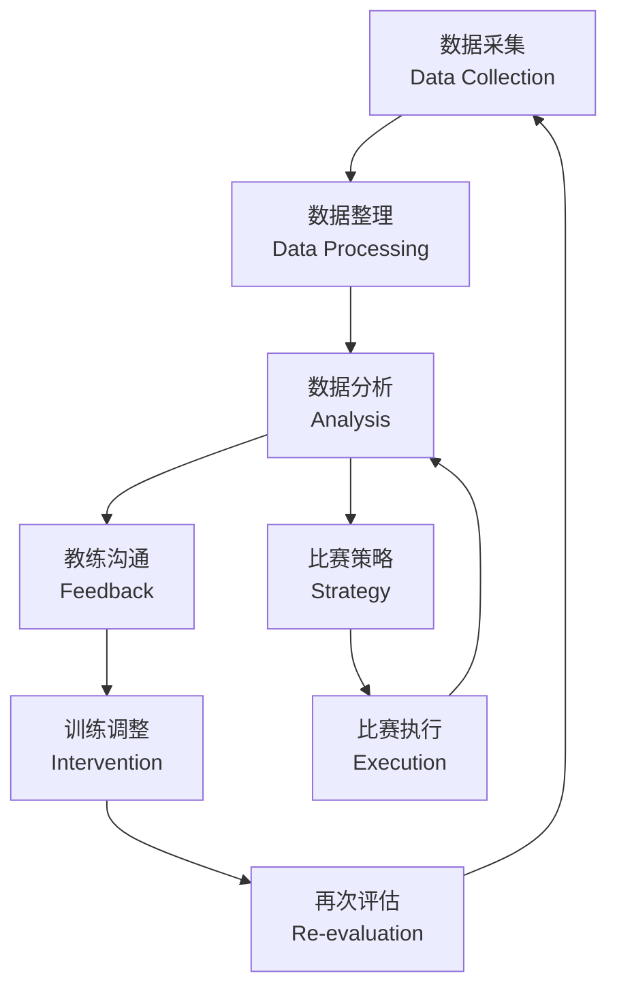
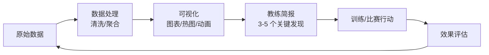

# 运动表现分析

运动表现分析（Performance Analysis）是通过视频和数据分析系统对运动员及团队表现进行客观评估的学科。它整合运动科学（Sports Science）、数据科学（Data Science）和教练学（Coaching Science），为训练决策和比赛策略提供证据支撑。技术分析关注动作技术的精准度，如跑步经济性、投篮机制、挥杆轨迹等微观动作变量。战术分析涉及团队阵型、空间控制、传球网络和决策模式的时间序列编码。

## 表现分析框架

## 视频分析技术与工具

### 视频分析方法

| 方法 | 描述 | 适用场景 |
|:---|:---|:---|
| 实时标注（Live Coding） | 比赛同时标记事件 | 现场战术反馈 |
| 事后分析（Post-Match） | 比赛后深度分析 | 赛后复盘 |
| 时间编码（Time-Stamping） | 事件精确记录 | 关键片段提取 |
| 模式识别（Pattern Recognition） | 重复序列识别 | 战术习惯分析 |
| 对比分析（Comparative Analysis） | 自我/对手对比 | 对手研究 |

### 主流视频分析软件

| 软件 | 平台 | 特色功能 | 主要用户群 |
|:---|:---|:---|:---|
| Dartfish | 桌面+移动 | 运动学分析、轨迹标注 | 个人项目（田径/游泳） |
| Hudl | 云端 | 团队协作、自动剪辑 | 团队球类（足球/篮球） |
| Sportscode | 桌面 | 多角度同步、实时编码 | 专业运动队 |
| LongoMatch | 跨平台 | 开源免费、自定义面板 | 中小型俱乐部 |
| Kinovea | Windows | 开源、逐帧分析 | 个人技术分析 |

## 位置数据追踪 （Positional Tracking）

### 追踪技术对比

| 技术 | 精度 | 采样率 | 室内/室外 | 优点 | 缺点 |
|:---|:---:|:---:|:---:|:---|:---|
| GPS | 5-10 cm | 10-20 Hz | 室外 | 普及度高 | 室内不可用 |
| LPS (Local) | 2-5 cm | 20-100 Hz | 室内 | 高精度 | 基础设施成本 |
| 光学追踪 | 1-5 cm | 25-100 Hz | 两者 | 无需佩戴设备 | 遮挡问题 |
| UWB | 5-15 cm | 50-200 Hz | 室内 | 低延迟 | 基站布置 |

### 常见位置数据指标

$$ \text{总距离} = \sum_{i=1}^{N-1} \| \mathbf{p}_{i+1} - \mathbf{p}_i \| $$

$$ \text{速度区间时间} = \int_{t_1}^{t_2} \mathbb{1}(v(t) \in \text{区间}) \, dt $$

| 指标 | 单位 | 描述 |
|:---|:---:|:---|
| 总跑动距离 | m | 全场比赛总移动 |
| 高强度跑距离（HIR） | m | 速度 > 5.5 m/s 的跑动 |
| 冲刺次数 | 次 | 速度 > 7 m/s 持续时间 > 1s |
| 加速度负荷 | m/s² | 正负加速度累积 |
| 最高速度 | m/s | 全场峰值速度 |
| 代谢功率 | W/kg | 考虑能量消耗的综合指标 |
| 最大速度持续时间 | s | 达到最高速度区间的时长 |

## 时间-运动分析 （Time-Motion Analysis）

根据运动员的速度和活动强度，将比赛时间分配到不同类别：

| 速度区间 | 活动类别 | 典型占比（足球） | 典型占比（篮球） |
|:---|:---|:---:|:---:|
| 0-1.5 m/s | 静止/慢走 | 40-50% | 30-40% |
| 1.5-3.5 m/s | 慢跑/中速跑 | 30-35% | 35-40% |
| 3.5-5.5 m/s | 高速跑 | 10-15% | 15-20% |
| > 5.5 m/s | 冲刺 | 5-10% | 5-10% |

## 关键表现指标 （Key Performance Indicators, KPI）

### KPI 设计原则

$$ \text{KPI} \propto \frac{\text{预测力} \times \text{可靠性}}{\text{采集成本}} $$

### 不同运动的 KPI 示例

| 运动项目 | 技术 KPI | 战术 KPI | 体能 KPI |
|:---|:---|:---|:---|
| 足球 | 传球成功率、射门精度 | 控球率、压迫指数 | 高强度跑距离 |
| 篮球 | 投篮命中率、罚球率 | 助攻失误比、防守效率 | 跳跃次数、冲刺次数 |
| 网球 | 一发得分率、制胜分 | 破发点转化率 | 跑动距离、变向次数 |
| 橄榄球 | 抢断成功率、传球精度 | 阵型保持度 | 碰撞次数、加速度负荷 |
| 田径 | 步频、步幅、触地时间 | 配速策略 | 心率恢复 |

## 可穿戴设备与生物反馈

### 常用传感器

- **心率胸带**（HR Monitor）：实时心率、心率变异性（HRV）
- **加速度计**（Accelerometer）：冲击负荷、步数、着陆峰值力
- **IMU**（惯性测量单元）：角速度、姿态角、惯性矢量
- **肌电图**（EMG）：肌肉激活时序
- **近红外光谱**（NIRS）：肌肉氧合程度

### 训练负荷管理

$$ \text{急性负荷} = \text{最近 7 天平均值}, \quad \text{慢性负荷} = \text{最近 28 天平均值} $$

$$ \text{ACWR} = \frac{\text{急性负荷}}{\text{慢性负荷}} $$

| ACWR 区间 | 伤病风险 | 建议 |
|:---:|:---:|:---|
| < 0.8 | 低（负荷不足） | 增加训练量/强度 |
| 0.8-1.3 | 最佳 | 维持当前负荷 |
| 1.3-1.5 | 较高 | 需监控和调整 |
| > 1.5 | 高风险 | 显著降低负荷 |

## 比赛报告生成

表现分析报告的结构化模板通常包含以下组成部分：

### 报告结构

1. **执行摘要**：3-5 个关键发现，直接面向教练决策
2. **团队整体指标**：控球率、传球网络、攻入三区次数等
3. **个体表现**：每个运动员的 KPI 对比（本场 vs 赛季均值）
4. **关键时刻分析**：进球、失球、红黄牌事件的视频片段
5. **对手分析**：阵型变化、核心球员特征、攻防模式
6. **趋势对比**：最近 5 场比赛的 KPI 变化曲线
7. **训练建议**：基于分析结果的针对性训练方案

### 定量到定性的转化

分析结果需要"翻译"成教练和运动员易于理解的语言：
- "控球率 62%" → "我们在中场建立了有效控制，但最后一传不够果断"
- "高强度跑动比对手多 15%" → "体能优势明显，但需要更合理地分配体力"
- "传球成功率 91%" → "短传稳定，但纵向穿透球偏少"

## 运动项目专项分析案例

### 足球表现分析

| 维度 | 指标 | 分析工具 |
|:---|:---|:---|
| 阵型分析 | 平均位置、阵型变化时间点 | 位置热图、重心偏移 |
| 传球网络 | 传球矩阵、连线密度、PPDA | 网络图、Martinez 指标 |
| 防守压迫 | 压迫开始距离、压迫成功率 | 压缩线距离、团队形状 |
| 进攻组织 | 转换速度、攻入三区次数 | 进攻分段编码 |
| 死球 | 角球/任意球战术成功率 | 定位球视频库 |

### 篮球表现分析

- **进攻效率**：每百回合得分（Offensive Rating）
- **防守效率**：每百回合失分（Defensive Rating）
- **净效率**：进攻效率 - 防守效率
- **回合数**（Pace）：比赛节奏指标
- **有效命中率**：$ \text{eFG\%} = (\text{FG} + 0.5 \times \text{3P}) / \text{FGA} $
- **球员影响力**：正负值（Plus/Minus）、RAPM（调整后）

### 网球表现分析

- **发球分析**：一发/二发得分率、落点分布热图
- **战术模式**：发球-截击模式、底线相持演变
- **跑动效率**：平均每分跑动距离、变向频率
- **关键分表现**：破发点/局点/赛点的决策质量

## 数据质量与管理

### 数据准确性保障

| 问题类型 | 描述 | 处理方法 |
|:---|:---|:---|
| 传感器漂移 | GPS/IMU 随使用时间累积误差 | 定期校准、数据融合 |
| 遮挡（Occlusion） | 光学追踪中目标被遮挡 | Kalman 滤波插值 |
| 标签错误 | 手动标注中的误标 | 双人独立编码 + 一致性检查 |
| 时间同步 | 多源数据时间轴不一致 | 时间戳对齐、互相关校正 |
| 异常值 | 设备瞬时干扰导致的极端值 | 中位数滤波、IQR 检测 |

### 数据存储与访问

现代运动表现分析采用云端数据库架构：
- 原始数据存入时序数据库（如 InfluxDB）
- 结构化指标存入关系数据库（如 PostgreSQL）
- 视频文件存储于对象存储（如 AWS S3）
- 通过 API 网关统一提供数据访问接口

## 心理因素与表现分析

### 心理-表现关联

运动心理学指标与表现数据存在系统关联：

- **自我效能**（Self-efficacy）：与罚球命中率、关键分表现正相关
- **注意力控制**（Attentional Control）：与决策准确性和反应时间相关
- **压力指标**：心率变异性（HRV）下降预示着执行功能衰退
- **流畅状态**（Flow State）：主观体验与客观表现高峰的一致性

### 结合方法

1. **赛后即时问卷**：采集运动员的主观努力感、情绪状态、策略执行感
2. **心理-生理同步**：结合心率、皮肤电导等客观指标与主观报告
3. **行为编码**：从视频中编码非语言行为（肢体语言、表情、沟通频率）

## 数据可视化与呈现

有效的分析输出应清晰传达关键信息：

## 表现分析中的挑战

- **数据过载**（Data Overload）：KPI 过多导致信息噪音
- **生态效度**（Ecological Validity）：实验室指标能否迁移到实战环境
- **时机敏感性**（Timeliness）：分析需要在信息还"温热"时呈现
- **教练接受度**（Coach Buy-in）：分析结果需要转化为可操作语言
- **隐私与伦理**：运动员数据的所有权和使用边界

## 未来趋势

- **AI 辅助分析**：计算机视觉自动事件识别和战术模式挖掘
- **数字孪生**（Digital Twin）：运动员的虚拟化身用于模拟和预测
- **实时边缘计算**：赛场端即时处理传感器数据
- **多模态融合**：视频、位置、生物信号、主观报告的联合分析
- **小数据决策**：在小样本量下通过贝叶斯方法做出可靠推断

## 相关条目

- [[INDEX|SportsTraining 索引]]
- [[OlympicLifting|奥林匹克举重]]
- [[Biomechanics|运动生物力学]]
- [[SportsTechnology|体育科技]]
- [[../../INDEX|TianshangKnowledgeBase 索引]]
