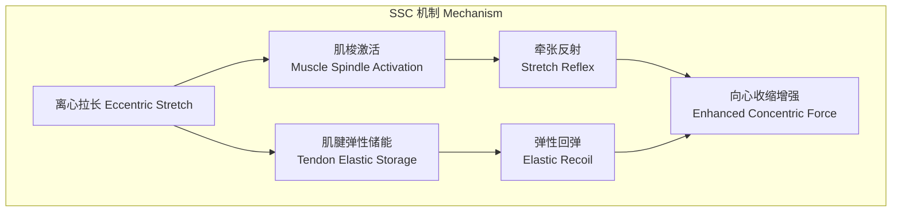

# 增强式训练 Plyometrics

## 1. 概述 (Overview)

增强式训练（Plyometrics），又称超等长训练或快速伸缩复合训练，是利用肌肉的拉长-缩短周期（Stretch-Shortening Cycle, SSC）来增强爆发力输出的训练方法。Plyometrics 起源于 20 世纪 60 年代苏联和东欧国家的跳跃训练方法，随后被引入西方运动科学领域，成为提高运动员弹跳能力和爆发力的经典训练手段。

相比于纯粹的向心收缩训练，增强式训练能更有效地提升神经肌肉系统的反应能力（Reactivity）和功率输出，因此在篮球、排球、田径、足球等需要弹跳和快速变向的运动项目中得到广泛应用。

## 2. 拉长-缩短周期 (SSC)

### 2.1 SSC 的三个阶段

SSC（Stretch-Shortening Cycle）是肌肉先被拉长（离心阶段）紧接着迅速缩短（向心阶段）的自然运动模式。

| 阶段 | 名称 | 持续时间 | 生理机制 |
|:-----|:------|:---------|:---------|
| Phase I | 离心制动 (Eccentric Braking) | 50–150 ms | 牵张反射激活、肌肉弹性成分储能 |
| Phase II | 摊销期 (Amortization) | 0–50 ms | 离心到向心的过渡，关键的速度决定期 |
| Phase III | 向心收缩 (Concentric Propulsion) | 50–250 ms | 弹性势能释放 + 主动收缩力叠加 |

**关键概念**：摊销期越短，力学输出越高。摊销期过长（>200 ms）会导致储存的弹性能以热能形式耗散，SSC 的优势被削弱。

### 2.2 SSC 的生理机制

SSC 的增效机制可通过以下公式理解：

$$
F_{\text{SSC}} = F_{\text{concentric}} + F_{\text{reflex}} + F_{\text{elastic}}
$$

- $F_{\text{concentric}}$：纯向心收缩产生的力
- $F_{\text{reflex}}$：牵张反射激活的额外运动单位贡献
- $F_{\text{elastic}}$：串联弹性组件（Series Elastic Component, SEC）释放的弹性能

### 2.3 慢速与快速 SSC

| SSC 类型 | 地面接触时间 | 关节角度变化 | 示例动作 | 训练目标 |
|:---------|:-------------|:-------------|:---------|:---------|
| 快速 SSC (Fast SSC) | < 200 ms | 小范围（<50°） | 重复跳、弹性跳、短跳 | 反应力量、刚度 |
| 慢速 SSC (Slow SSC) | > 200 ms | 大范围（>50°） | 蹲跳、下跳、跳箱 | 爆发力、启动力量 |

## 3. 经典增强式练习 (Classic Plyometric Exercises)

### 3.1 练习分类

| 类别 | 练习 | 强度等级 | 主要目标 |
|:-----|:------|:---------|:---------|
| 原地跳 (Jumps in Place) | 双脚跳、踝跳、提膝跳 | 低 | SSC 基础能力 |
| 立定跳 (Standing Jumps) | 立定跳远、垂直 CMJ | 中 | 爆发力启动 |
| 多次跳 (Multiple Hops/Jumps) | 跨步跳、三级跳、连续跳 | 中-高 | 反应力量、水平力 |
| 下跳 (Depth Jumps) | 跳箱下跳+起跳 | 高 | SSC 最大化 |
| 跳箱 (Box Jumps) | 跳上跳箱 | 中 | 向心爆发力 |
| 障碍跳 (Hurdle Hops) | 连续跳跃过栏架 | 中-高 | 节奏、垂直刚度 |
| 投掷 (Upper Body) | 药球胸前传球、过头抛 | 低-中 | 上肢爆发力 |

### 3.2 练习强度分级

训练强度由**接触时间**（Ground Contact Time, GCT）、**跳落高度**（Drop Height）、**外部负荷**（Additional Load）和方向变化共同决定。

| 强度 | 接触时间 | 跳落高度 | 示例 |
|:-----|:---------|:---------|:------|
| 低 (Low) | > 300 ms | 0–15 cm | 原地提膝跳 |
| 中 (Moderate) | 200–300 ms | 15–45 cm | 跨步跳、跳箱 |
| 高 (High) | 100–200 ms | 45–75 cm | 下跳 45cm + 高度起跳 |
| 极高 (Very High) | < 100 ms | > 75 cm / 负重伤 | 负重下跳、深跳 |

**下跳高度推荐**：一般选择 30–75 厘米，初学者从 30 cm 以下开始。

## 4. 训练效益 (Training Benefits)

### 4.1 生理适应

| 适应类型 | 效应 | 证据支持 |
|:---------|:------|:---------|
| 神经适应 (Neural) | 运动单位募集率提升、协同肌激活优化 | 强证据 |
| 肌腱刚度 (Tendon Stiffness) | 跟腱和髌腱刚度增加、弹性储能效率提高 | 中-强证据 |
| 肌纤维类型转换 (Fiber Type) | IIx → IIa 转换（适应性转变） | 中等证据 |
| 肌肉肥大 (Hypertrophy) | II 型肌纤维选择性肥大 | 有限证据 |
| 牵张反射增益 (Reflex Potentiation) | 牵张反射敏感性提升 | 中等证据 |

### 4.2 运动表现提升

- **垂直跳跃高度**：系统训练 6–12 周后可提升 10–20%（新手中更高）
- **短距离加速能力**（0–10m）：改善 3–8%
- **变向能力**（COD）：改善 5–10%
- **跑步经济性**（Running Economy）：中长跑运动员的 SSC 利用效率提升

## 5. 技术要点与教学 (Technical Coaching Points)

### 5.1 着地技术 (Landing Mechanics)

着地技术是预防损伤的教学重点：

1. **重心控制**：落地时髋关节稍屈，躯干前倾约 45° 保持中立
2. **膝盖对齐**：膝盖对准脚尖方向（避免膝内扣 Valgus Collapse）
3. **足部着地模式**：前脚掌先着地 → 迅速过渡到全脚掌
4. **脊柱中立**：避免过度腰椎前凸或后凸
5. **手臂配合**：双臂协调摆动以贡献向上的动量

### 5.2 错误纠正

| 常见错误 | 后果 | 纠正方法 |
|:---------|:------|:---------|
| 膝关节内扣 (Knee Valgus) | ACL 损伤风险增加 | 弹力带抗阻练习、髋外展肌激活 |
| 足跟着地 (Heel Strike) | 制动效应、冲击传递异常 | 赤足/极简鞋辅助练习 |
| 弯腰弓背 (Excessive Trunk Flexion) | 下背部压力、力链中断 | 核心稳定性训练 |
| 落地僵硬 (Stiff Landing) | 冲击吸收不足、骨折风险 | 弹性落地技术训练 |

## 6. 训练计划设计 (Program Design)

### 6.1 进阶路径

进阶路径通常为：**低强度原地跳 → 水平跨步跳 → 垂直下跳 → 负重超等长**

| 阶段 | 目标 | 持续时间 | 示例内容 |
|:-----|:------|:---------|:---------|
| Phase 1: 基础 (Foundation) | 着地技术、SSC 初步适应 | 2–4 周 | 原地踝跳、低箱跳 |
| Phase 2: 强度提升 (Intensification) | 提升负荷和 SSC 效率 | 4–6 周 | 跨步跳、跳箱、30cm 下跳 |
| Phase 3: 专项化 (Specialization) | 匹配专项动作模式 | 4–8 周 | 单腿跳、变向跳、深跳 |
| Phase 4: 维持 (Maintenance) | 保持适应、周期化整合 | 持续 | 1–2 次/周维持性训练 |

### 6.2 训练参数

| 参数 | 推荐范围 |
|:-----|:---------|
| 频率 | 每周 1–3 次 |
| 恢复间隔 | 练习间 48–72 小时 |
| 组间休息 | 2–3 分钟（高质恢复） |
| 每组触地次数 | 低强度 10–15 次、高强度 3–6 次 |
| 总触地次数 | 新手 40–60 次/课、高级 120–200 次/课 |

### 6.3 力量基础要求

超等长训练前的力量基础被认为是安全高效的先决条件：

- 深蹲 1RM ≥ 1.5 倍体重
- 能够在体重负荷下完成 5 次完美下跳着地
- 具备良好的核心稳定性和下肢对齐控制能力

## 7. 与力量训练的整合 (Integration with Strength Training)

### 7.1 同期化训练 (Concurrent Training)

增强式训练与力量训练的同期化安排需要考虑疲劳管理：

| 训练日安排 | 顺序 | 理由 |
|:-----------|:------|:------|
| 同一天 | 增强式训练 → 力量训练 | 先执行需要高神经激活和爆发性的训练 |
| 分区天 | 增强式训练日 / 力量训练日 | 适合大量高强度增强式训练计划 |
| 组合式 | 力量训练后以低强度增强式收尾 | 用于 SSC 技术训练和神经激活收尾 |

### 7.2 复合训练法 (Complex Training)

复合训练法（Complex / Contrast Training）是在同一训练课中交替进行大重量力量练习和生物力学相近的增强式练习：

- **配对示例**：深蹲（3RM）→ 30 秒休息 → 跳蹲（5次）→ 3 分钟休息
- **理论机制**：大重量力量练习后的"后激活增强效应"（Post-Activation Potentiation, PAP）可提升后续增强式练习的爆发力输出

## 8. 损伤风险与预防 (Injury Risk & Prevention)

| 风险因素 | 管理措施 |
|:---------|:---------|
| 力量基础不足 | 先发展基础力量到前述标准 |
| 训练量增长过快 | 遵守每周总触地次数增加不超过 20% 的原则 |
| 疲劳状态下训练 | 推迟高强度增强式训练至充分恢复后 |
| 着地技术缺陷 | 在低强度阶段反复打磨着地技术 |
| 地面硬度过高 | 在适当表面（草地、体操垫、专用地板）进行 |

## 9. 专项化增强式训练 (Sport-Specific Plyometrics)

### 9.1 按运动项目分类

| 运动项目 | 重点练习 | 训练目标 |
|:---------|:---------|:---------|
| 篮球/排球 (Basketball/Volleyball) | 深跳 + 垂直 CMJ + 单腿垂直跳 | 垂直弹跳力、二次起跳速度 |
| 足球 (Soccer) | 水平跳跃 + 变向跳 + 单腿跨步跳 | 加速能力、变向爆发力 |
| 田径短跑 (Track Sprint) | 弹性跳 + A-Skip + 前冲跨步跳 | 步频提升、触地时间缩短 |
| 游泳 (Swimming) | 药球旋转抛 + 上肢增强式 | 转身蹬壁爆发力、划水爆发力 |
| 格斗 (Combat Sports) | 分腿跳 + 转体药球 + 跳箱变体 | 下肢爆发力、核心旋转力 |

### 9.2 女子运动员的考量

女性运动员在增强式训练中有特殊的生理考虑：
- ACL 损伤风险更高，需特别强调着地技术和膝关节控制
- 雌激素水平变化可能影响肌腱刚度，在月经周期不同阶段调整训练强度
- 渐进性增强式训练可有效降低 ACL 损伤风险（研究表明降低 40-60%）

### 9.3 青少年运动员的注意事项

- 骨髁未闭合前避免高强度冲击训练
- 优先发展着地技术、身体控制能力
- 训练量与强度的递增速度应比成人慢 50%
- 加入游戏化元素以维持训练兴趣

## 10. 科学循证基础 (Evidence-Based Practice)

### 10.1 系统综述结论

| 研究主题 | 主要结论 | 效应量 |
|:---------|:---------|:-------|
| 增强式 vs 传统力量训练 | 增强式训练对跳跃高度提升更优 | ES = 0.87 |
| 增强式 + 力量训练同期化 | 同期化效果优于单一训练 | ES = 1.09 |
| 增强式与青少年运动员 | 安全有效，但需适当渐进 | ES = 0.72 |
| 单腿 vs 双腿增强式 | 单腿训练更利于专项迁移 | ES = 0.53 |

### 10.2 最佳实践总结

1. 在基础力量达到标准后进行（1RM 深蹲 ≥ 1.5 倍体重）
2. 每次训练前进行适当的神经激活热身（低强度增强式 5-10 分钟）
3. 始终以质量优先于数量的原则指导训练
4. 技术评估常态化（使用视频反馈和接触垫数据）
5. 结合力量训练安排在恰当的周期化框架中

## 相关条目

- [[PowerTraining]]
- [[AthleticAbility]]
- [[FatigueMonitoring]]
- [[StrengthAndConditioning]]
- [[SportsPeriodization]]
- [[Biomechanics]]
- [[InjuryPrevention]]
- [[INDEX|SportsTraining 索引]]
- [[../../INDEX|TianshangKnowledgeBase 索引]]
