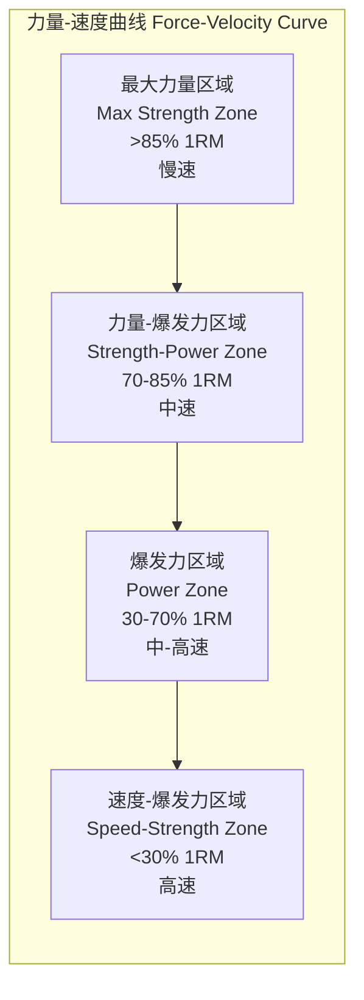
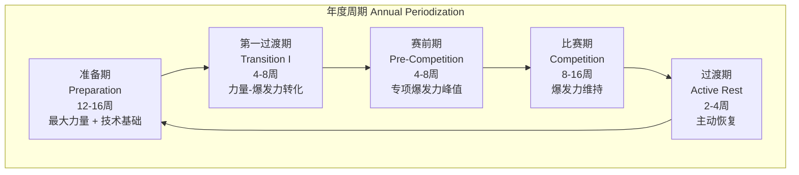

# 力量训练 Power Training

## 1. 概述 (Overview)

爆发力训练（Power Training）旨在最大化运动员在单位时间内产生力量的能力。在运动科学中，功率（Power）定义为力与速度的乘积：

$$
P = F \times v = \frac{\text{做功}}{\text{时间}} = \frac{F \cdot d}{t}
$$

爆发力的生物力学基础依赖于运动单位的快速募集（Rapid Motor Unit Recruitment）、神经驱动效率（Neural Drive Efficiency）以及拉长-缩短周期（SSC）的充分利用。与最大力量训练不同，爆发力训练更关注力产生的速度而非绝对力的大小。

## 2. 爆发力的生理基础 (Physiological Basis)

### 2.1 力发展速率 (Rate of Force Development)

**力发展速率**（Rate of Force Development, RFD）是区分高水平运动员与普通运动员的关键神经肌肉变量。RFD 定义为力的斜率：

$$
\text{RFD} = \frac{\Delta F}{\Delta t}
$$

在大多数运动项目中，运动员需要在极短的时间内（50–250 ms）产生高水平的力，而在此时间内最大力量通常只能达到其理论峰值的 50–70%。因此，高 RFD（而非最大力量本身）是决定运动表现的关键因素。

| 时间窗口 | 生理决定因素 | 训练重点 |
|:---------|:-------------|:---------|
| 0–50 ms | 神经驱动初始爆发、运动单位同步 | 快速收缩训练、弹振式训练 |
| 50–100 ms | 运动单位募集速率、II 型肌纤维激活 | 奥林匹克举、增强式训练 |
| 100–250 ms | 弹性成分和牵张反射贡献 | SSC 练习、复合训练 |
| > 250 ms | 最大力量贡献（肌肉横截面积） | 大重量力量训练 |

### 2.2 力量-速度关系 (Force-Velocity Relationship)

肌肉力量输出与收缩速度呈反比关系（Hill 模型）：

$$
(F + a)(v + b) = (F_0 + a) \cdot b
$$

其中 $F_0$ 为最大等长收缩力，$a$ 和 $b$ 为 Hill 常数。

### 2.3 力量-速度曲线上的负荷区域

| 训练目标 | 负荷强度 | 举重速度 | 每组次数 | 主要影响 |
|:---------|:---------|:---------|:---------|:---------|
| 最大力量 (Max Strength) | 85–100% 1RM | < 0.3 m/s | 1–5 | 运动单位同步、神经适应 |
| 力量-爆发力 (Strength-Power) | 70–85% 1RM | 0.3–0.75 m/s | 3–5 | 肌肉横截面积 + RFD |
| 爆发力 (Power) | 30–70% 1RM | 0.75–1.3 m/s | 3–6 | 高功率输出、RFD 优化 |
| 速度 (Speed/Strength) | < 30% 1RM | > 1.3 m/s | 5–10 | 极速神经驱动 |

**功率-负荷曲线**：峰值功率通常出现在 50–70% 1RM 的负荷区间，具体值因个体和动作而异。但爆发力训练的负荷并非追求峰值功率——低负荷（<30% 1RM）和高负荷（>80% 1RM）训练虽然峰值功率较低，但对力量-速度曲线的不同区域有独特的训练效应。

## 3. 典型训练动作 (Typical Exercises)

### 3.1 奥林匹克举及其衍生动作 (Olympic Lifts & Variations)

| 动作 | 特点 | 负载范围 | 功率输出特征 |
|:-----|:------|:---------|:-------------|
| 高翻 (Power Clean) | 从地面到肩部，髋膝伸展 | 60–90% 1RM | 峰值功率极高 |
| 高抓 (Power Snatch) | 从地面到头顶，一次完成 | 50–80% 1RM | 全驱动爆发 |
| 悬垂高翻 (Hang Clean) | 从膝上开始，减少离心复杂 | 60–85% 1RM | 纯向心爆发 |
| 借力推 (Push Press) | 下肢驱动辅助上肢推举 | 50–70% 1RM | 垂直力链爆发 |
| 膝上抓 (Hang Snatch) | 从膝上开始抓举 | 50–75% 1RM | 快速三关节伸展 |

### 3.2 非奥林匹克举动作

| 动作 | 负荷 | 特点 |
|:-----|:------|:------|
| 跳蹲 (Jump Squat) | 30–50% 1RM | 垂直爆发力，SSC 利用 |
| 壶铃摇摆 (Kettlebell Swing) | 16–32 kg | 髋主导、节奏爆发 |
| 跳箱 (Box Jump) | 体重 | 向心爆发、安全着落 |
| 药球旋转抛 (Medicine Ball Rotational Throw) | 3–10 kg | 旋转爆发力 |
| 弹力带加速俯卧撑 (Plyo Push-Up) | 体重 | 上肢爆发力 |
| 阻力带冲刺 (Resisted Sprint) | 轻-中阻力 | 水平加速度 |

### 3.3 动作选择原则

- **运动相关性**：动作模式应与专项运动生物力学特征匹配（如重直 vs 水平 vs 旋转）
- **力线方向**：选择能产生与运动专项相近方向力的动作
- **SSC 利用**：优先选择能充分利用 SSC 的动作
- **安全性**：技术复杂度和运动员技术水平匹配

## 4. 训练方法与编程 (Training Methods & Programming)

### 4.1 核心训练方法

| 方法 | 描述 | 适用阶段 |
|:------|:------|:---------|
| 传统爆发力训练 (Traditional) | 中等负荷 + 爆发性举起 | 全年可用 |
| 弹振式训练 (Ballistic) | 举起后释放器械（跳、抛） | 专项准备期 |
| 复合训练 (Complex/Contrast) | 交替大重量力量 + 爆发力动作 | 赛前集中期 |
| 奥林匹克举衍生 (Weightlifting Derivatives) | 从下肢驱动动作变体 | 基础期-赛前期 |
| 增强式训练 (Plyometrics) | SSC 为主的多方向跳跃 | 与力量训练并行 |
| 等长爆发训练 (Isometric) | 快速等长收缩 | 损伤康复期 |

### 4.2 复合训练法 (Complex Training)

复合训练在力量训练后立即进行生物力学相似的爆发力动作，利用**后激活增强效应**（Post-Activation Potentiation, PAP）：

| 配对组 | 力量动作 | 爆发力动作 | 组间休息 | PAP 效应 |
|:-------|:---------|:-----------|:---------|:---------|
| 下肢 | 深蹲 3RM | 跳蹲 × 5 | 30–60 秒 | 跳跃高度 +5–8% |
| 下肢 | 硬拉 3RM | 跨步跳 × 5 | 30–60 秒 | 水平爆发力增强 |
| 上肢 | 卧推 3RM | 药球胸前传球 | 30–60 秒 | 投掷速度 +4–6% |

### 4.3 训练参数

| 参数 | 一般建议 | 高级运动员 |
|:-----|:---------|:-----------|
| 训练频率 | 每周 2 次 | 每周 3–4 次 |
| 每组次数 | 3–6 次（保持高质） | 1–5 次 |
| 组数 | 3–5 组 | 4–8 组 |
| 组间休息 | 2–3 分钟 | 3–5 分钟 |
| 训练量指数 | 15–30 次/动作/课 | 20–40 次/动作/课 |
| 速度要求 | 爆发性举起（<500 ms 向心） | 峰值速度 ≥ 1.2 m/s |

**关键原则**：训练质量优先于数量。一旦向心速度下降 >10%，建议停止该动作训练。

## 5. 周期化安排 (Periodization)

### 5.1 宏观周期设计

爆发力周期的安排通常与比赛期同步，优先在赛前 4–8 周集中安排。

### 5.2 中观周期（区块）安排

| 区块 (Block) | 时长 | 重点 | 负荷特征 |
|:-------------|:------|:------|:---------|
| 力量积累 (Strength Accumulation) | 4–6 周 | 高负荷（80–90% 1RM） | 低速度、高负荷 |
| 力量-爆发力转化 (Strength-Power Transmutation) | 3–4 周 | 中等负荷（50–80% 1RM） | 中负荷、高速度 |
| 爆发力峰值 (Power Realization) | 2–4 周 | 轻-中负荷（30–60% 1RM） | 低负荷、极高速 |
| 减量爆发力 (Taper Power) | 1–2 周 | 维持强度、降低容量 | 高质、低量 |

## 6. 监测与评估 (Monitoring & Assessment)

### 6.1 测试方法

| 测试 | 设备 | 指标 | 评估维度 |
|:-----|:------|:------|:---------|
| 垂直跳 (CMJ) | 测力台/接触垫 | 跳跃高度、峰值功率、RFD | 下肢爆发力 |
| 功率自行车 Wingate | 飞轮车 | 峰值功率、平均功率、疲劳指数 | 无氧功率 |
| 等速肌力测试 | 等速测力计 | 峰值力矩、到达峰值力矩时间 | 肌肉功能 |
| 借力推/跳蹲 | 测力台 + 测功杆 | 峰值力、峰值速度、峰值功率 | 专项力量-速度 |
| Ballistic 投掷 | 雷达枪/测速仪 | 抛射速度 | 上肢爆发力 |

### 6.2 关键监测指标

- **峰值功率**（Peak Power, $P_{\text{peak}}$）
- **功率衰减率**（Power Drop-off）：组内最后一次重复相比第一次的功率下降百分比
- **RFD 窗口值**（0–100 ms, 0–200 ms）：特定时间窗口内的 RFD
- **冲量**（Impulse）：力-时间曲线下的面积，反映总驱动力
- **力-速度曲线偏移**：训练前后 F-V 曲线斜率变化反映力量或速度偏向

## 7. 常见训练误区 (Common Pitfalls)

| 误区 | 问题 | 建议 |
|:------|:------|:------|
| 每组做到力竭 | 力竭导致速度显著下降，训练目的丧失 | 保留 1–3 次重复能力 |
| 组间休息不足 | 神经疲劳积累，无法维持爆发性输出 | 提供充分的 3–5 分钟休息 |
| 过度强调负荷而忽略速度 | 转为力量训练而非爆发力训练 | 监测向心速度确保训练目标 |
| 忽视技术训练 | Olympic 举的高技术风险 | 技术训练和力量训练分开安排 |
| 反复使用相同负荷 | 神经适应后训练刺激减弱 | 力量-速度曲线上的周期性变化 |

## 相关条目

- [[AthleticAbility]]
- [[Plyometrics]]
- [[LactateThreshold]]
- [[FatigueMonitoring]]
- [[StrengthAndConditioning]]
- [[SportsPeriodization]]
- [[Biomechanics]]
- [[OlympicWeightlifting]]
- [[INDEX|SportsTraining 索引]]
- [[../../INDEX|TianshangKnowledgeBase 索引]]
