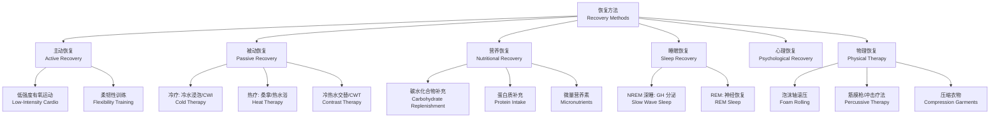

---
aliases: [RecoveryMethods, 恢复方法, 运动恢复, PostExerciseRecovery, SportRecovery, 疲劳恢复, 再平衡, 恢复策略]
tags: ['12_SportsScience', 'SportsTraining', 'RecoveryMethods']
created: 2026-05-17
updated: 2026-05-17
---

# 恢复方法（Recovery Methods）

## 概述

运动恢复（Recovery）是指训练或比赛后，机体通过生理和心理层面的主动与被动调节回归稳态，进而实现超量恢复（Supercompensation）的过程。高质量恢复是训练能力持续提升和损伤风险有效降低的基础。运动生理学研究表明，竞技水平相近的运动员之间，恢复能力的差异往往可以解释 30–40% 的表现差异。恢复方法不应被视为"不训练的被动等待"，而应被纳入训练计划的主动组成部分。现代运动科学将恢复视为训练刺激与适应之间的关键变量——没有充分的恢复，就没有高质量的训练适应。

## 恢复的生理维度

恢复是一个多维度、多时间尺度的过程。不同生理系统的恢复时间常数差异显著：

| 生理系统 | 恢复至基线 | 完全修复 | 关键限制因素 |
|----------|-----------|----------|-------------|
| 磷酸原系统（ATP-PCr） | 2–3 分钟 | 3–5 分钟 | PCr 再合成速率 |
| 肌糖原（Muscle Glycogen） | 24–36 小时 | 48–72 小时 | 碳水化合物摄入量 |
| 肌原纤维蛋白（Myofibrillar） | 24–48 小时 | 72–96 小时 | 蛋白质摄入与 mTOR 信号 |
| 神经系统（CNS/PNS） | 12–24 小时 | 48–72 小时 | 神经递质再平衡 |
| 结缔组织（Tendon/Ligament） | 48–72 小时 | 72–120 小时 | 胶原蛋白合成速率 |
| 免疫系统 | 12–48 小时 | 48–72 小时 | 淋巴细胞增殖 |
| 心理/情绪 | 数小时–数天 | 个体差异 | 压力水平与社会支持 |

## 恢复方法分类体系

## 恢复的生理学基础

### 磷酸原系统再合成

高强度短时间运动消耗肌肉中的磷酸肌酸（Phosphocreatine, PCr）。PCr 的再合成通过肌酸激酶（Creatine Kinase）反应完成：

$$ \text{ADP} + \text{PCr} \xrightarrow{\text{肌酸激酶}} \text{ATP} + \text{Cr} $$

PCr 再合成呈指数曲线，半衰期约为 30–60 秒，完全恢复需要 3–5 分钟。该过程的速率受线粒体氧化磷酸化能力和细胞内 pH 值影响——酸中毒会抑制肌酸激酶的活性。

### 糖原再合成

运动后肌糖原（Muscle Glycogen）的再合成速率取决于碳水化合物摄入的时机和数量。运动后 30–60 分钟的"代谢窗口期"（Metabolic Window）内，肌肉对葡萄糖的摄取和糖原合成酶的活性最高：

$$ \text{糖原合成速率} = \frac{V_{\text{max}} [\text{葡萄糖}]}{K_m + [\text{葡萄糖}]} \times \text{胰岛素敏感性} $$

推荐摄入量为 $1.0\text{–}1.2 \text{ g/kg}$ 体重的碳水化合物，每 2 小时重复摄入，直至总量达到 $8\text{–}10 \text{ g/kg/天}$。

### 蛋白质合成与肌肉修复

运动后肌肉蛋白质合成（Muscle Protein Synthesis, MPS）在 24–48 小时内升高。亮氨酸（Leucine）是激活 mTOR 信号通路的关键氨基酸，每餐摄入 2–3 克亮氨酸可最大化 MPS 反应：

$$ \text{MPS 速率} = \begin{cases} \text{基线水平} & \text{无刺激} \\ \text{升高 50–100\%} & \text{运动后 4–6 小时} \\ \text{升高 100–150\%} & \text{运动 + 蛋白质摄入} \end{cases} $$

推荐蛋白质摄入量为每餐 20–40 克，分布在全天 3–4 餐中。

## 主动恢复（Active Recovery）

训练结束后以 40–60% 最大摄氧量强度的低强度活动维持血液循环，加速代谢废物清除。

| 方式 | 强度指标 | 持续时间 | 最佳应用时机 |
|------|----------|----------|-------------|
| 慢跑（Jogging） | 40–60% HRmax / RPE 2–3 | 10–20 分钟 | 高强度间歇训练后 |
| 低强度游泳 | RPE 2–4 | 15–30 分钟 | 全身性疲劳、冲击项目后 |
| 骑行（Cycling） | 50–60 W / 60–70 rpm | 10–15 分钟 | 下肢离心负荷较大时 |
| 椭圆机（Elliptical） | 40–50% HRmax | 10–15 分钟 | 关节需要低冲击时 |
| 水中跑步（Aqua Jogging） | 60–75% HRmax | 15–25 分钟 | 下肢损伤恢复期 |

机制：主动恢复通过提高心输出量和肌肉泵作用，加速乳酸从肌肉组织向肝脏的转运（Cori 循环），同时增加一氧化氮（NO）介导的血管舒张，提高营养物质输送和代谢废物清除效率。

## 冷疗（Cold Therapy）

### 冷水浸泡（Cold Water Immersion, CWI）

温度 10–15°C，时长 10–20 分钟。低温引起血管收缩（Vasoconstriction），降低局部血流量，减轻急性炎症和水肿。系统综述表明 CWI 对 24–48 小时后的延迟性肌肉酸痛（DOMS）缓解有中等效应量（Cohen's d = 0.60–0.80）。CWI 对短期力量恢复效果较好，但长期适应研究的结论尚不一致。

注意事项：运动后立即 CWI 可能抑制 mTOR 信号通路，削弱力量与肌肥大适应。建议在训练后 2–4 小时再行冷水浸泡，或将 CWI 保留在比赛日的恢复策略中。

### 冷空气疗法（Whole Body Cryotherapy, WBC）

温度 −110°C 至 −140°C，时长 2–3 分钟。WBC 通过极低温激活交感神经系统释放儿茶酚胺（Catecholamines），产生镇痛和抗炎效应。相比 CWI，WBC 的皮肤温度下降更快但核心温度变化更小，适用于对冷水不耐受的运动员。

## 热疗（Heat Therapy）

### 热水浸泡与桑拿

热水浸泡温度 38–42°C，时长 15–30 分钟。热刺激上调热激蛋白（Heat Shock Protein, HSP）表达，促进受损蛋白质的修复与再折叠，同时引起血管舒张（Vasodilation），改善血流和组织氧合。

桑拿（Sauna）温度 70–90°C，相对湿度 10–20%，促进排汗和副交感神经激活。定期桑拿可能降低心血管并发症风险，同时通过热激蛋白的持续上调改善细胞保护机制。

### 冷热水交替浴（Contrast Water Therapy, CWT）

冷水 1–2 分钟 + 热水 3–4 分钟，重复 3–4 轮。血管交替舒缩的"泵送效应"促进淋巴回流和组织液的代谢废物清除。

$$ \text{CWT 效应} = \sum_{i=1}^{n} \left( \text{冷缩} + \text{热胀} \right)_i $$

## 物理恢复手段

### 泡沫轴滚压（Foam Rolling）

通过自体重力对筋膜进行平面按压，降低筋膜粘连（Adhesion）和肌肉紧张度。研究显示 2 分钟泡沫轴滚压可增加关节活动度约 10–15%，效果可持续 10–20 分钟。泡沫轴还可能通过抑制脊髓水平的牵张反射（Stretch Reflex）来降低肌张力。

### 筋膜枪（Percussive Therapy）

高频振动（20–50 Hz）刺激肌梭和腱梭，降低牵张反射敏感性。筋膜枪的穿透深度约为 2–4 cm，适合中等深度的肌肉放松。对于深层肌肉（>4 cm），传统的按摩手法可能更为有效。

### 压缩衣物（Compression Garments）

梯度压力设计（由远心端向近心端递减）改善静脉回流和淋巴引流，降低运动后肌肉肿胀感。研究表明压缩衣物对 DOMS 的缓解有较小但显著的效应量（Cohen's d = 0.30–0.50）。

### 拉伸（Stretching）

动态拉伸（Dynamic Stretching）适合训练前准备，通过模拟运动动作激活神经肌肉系统。静态拉伸（Static Stretching）适合训练后恢复，每次拉伸保持 15–30 秒，总时长不超过 10 分钟。PNF 拉伸（Proprioceptive Neuromuscular Facilitation）通过收缩-放松循环进一步增加活动度。

## 营养恢复（Nutritional Recovery）

运动后 30–60 分钟的"代谢窗口期"内肌肉对营养物质的敏感性最高：
$$ \text{CHO} = 1.0\text{–}1.2 \text{ g/kg 体重（碳水化合物）} $$
$$ \text{PRO} = 20\text{–}40 \text{ g（蛋白质）} $$

推荐碳水化合物与蛋白质的比例为 3:1 至 4:1。微量营养素方面：镁（300–400 mg）参与 ATP 合成和肌肉舒张；锌（15–25 mg）促进组织修复和免疫功能；Omega-3 脂肪酸（EPA+DHA 2–3 g）降低炎症因子如 IL-6 和 TNF-α 的水平；维生素 D（1000–4000 IU）支持骨骼健康和免疫调节。

## 睡眠（Sleep）

睡眠是自然恢复中最关键且不可被其他手段替代的环节。NREM 深度睡眠（Slow Wave Sleep, SWS）占每日生长激素（GH）分泌量的 60–70%。睡眠不足（<6 小时/晚）会导致糖原再合成速率下降、皮质醇升高和免疫功能降低。

| 睡眠阶段 | 恢复功能 | 占总量 |
|----------|----------|--------|
| N1 浅睡 | 入睡过渡阶段 | 5–10% |
| N2 中等深度 | 记忆巩固、突触修剪 | 45–55% |
| N3 深睡 | GH 分泌、组织修复 | 15–25% |
| REM | 神经恢复、技能巩固 | 20–25% |

运动员建议睡眠：7–9 小时/晚，午间小睡（20–30 分钟）可辅助恢复。

## 心理恢复（Psychological Recovery）

正念冥想（Mindfulness Meditation）每日 10–20 分钟降低静息皮质醇水平。呼吸训练（Breathing Training）：4-7-8 法（吸气 4 秒、屏息 7 秒、呼气 8 秒）激活副交感神经。可视化技术（Visualization）在心理层面模拟放松情景，降低感知疲劳（RPE）。生物反馈（Biofeedback）通过实时监测心率变异性（HRV）指导运动员学习自我调节。

## 恢复策略选择矩阵

| 训练类型 | 首选恢复策略 | 辅助策略 | 避免 |
|----------|-------------|----------|------|
| 高强度间歇（HIIT） | 主动恢复 + 碳水化合物补充 | CWI（2–4h 后） | 立即 CWI |
| 力量训练 | 蛋白质补充 + 睡眠 | 泡沫轴滚压 | 过度静态拉伸 |
| 耐力训练 | 碳水化合物补充 + 压缩衣物 | 桑拿/热水浴 | 长时间 CWI |
| 爆发力训练 | PCr 补充 + 神经系统恢复 | 筋膜枪 | 过度按摩 |
| 比赛期 | 睡眠 + 心理恢复 | CWT | 新的恢复手段 |

## 常见误区

| 误区 | 事实 |
|------|------|
| 恢复手段越多越好 | 过度恢复（如过度按摩）可能产生副作用 |
| 冷水浴可替代睡眠 | 没有任何手段可以替代睡眠对神经和组织的修复 |
| 只有运动后才需要恢复 | 休息日也需要主动恢复策略 |
| 训练前静态拉伸可预防损伤 | 动态热身 + 力量训练才是关键 |
| 恢复就是被动休息 | 主动恢复策略的效果显著优于完全静卧 |
| 补剂可以替代基础营养 | 补剂只是基础饮食的补充，不应替代天然食物 |

## 恢复技术前沿

恢复科学正在快速发展。冷热交替疗法（Contrast Therapy）通过
血管交替舒缩促进淋巴回流。压缩技术（Compression Technology）
从梯度压缩衣物发展到间歇式气动加压设备。睡眠优化（Sleep
Optimization）包括红光疗法、温度调控和认知行为干预。营养
恢复（Nutritional Recovery）领域的个性化补给方案正在成为
研究热点。未来恢复策略将整合可穿戴设备实时监测的生理数据，
实现精准化的恢复管理。

## 主要参考文献

1. Kellmann, M. et al. Recovery and Performance in Sport.
    Human Kinetics, 2018.
2. 王瑞元. 运动生理学. 人民体育出版社, 2012.
3. Bishop, P. A. et al. Recovery from Training: A Brief Review.
    J Strength Cond Res, 2008.
4. Peake, J. M. et al. Recovery of the Immune System after
    Exercise. J Appl Physiol, 2017.
5. Hausswirth, C. & Mujika, I. Recovery for Performance in
    Sport. Human Kinetics, 2013.

## 相关条目

- [[Supercompensation]]
- [[SportsPhysiology]]
- [[12_SportsScience/SportsMedicine/InjuryPrevention|InjuryPrevention]]
- [[12_SportsScience/SportsMedicine/SportsNutrition|SportsNutrition]]
- [[INDEX|SportsTraining 索引]]

