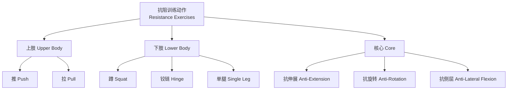

# 抗阻训练 (Resistance Training)

## 概述 (Overview)

抗阻训练（Resistance Training）是以外部阻力（自由重量 Free Weights、器械 Machines、弹力带 Resistance Bands 或自重 Body Weight）为手段，以提升肌肉力量（Strength）、肥大（Hypertrophy）、耐力（Endurance）和爆发力（Power）为目标的系统性训练体系。

抗阻训练是运动科学（Sports Science）和体能训练（Strength and Conditioning）的核心组成部分，广泛应用于竞技体育、大众健身和康复医学领域。

## 训练适应目标 (Training Adaptation Goals)

### 适应目标与负荷参数

| 适应目标 | 负荷强度 (% 1RM) | 每组次数 (Reps) | 组间休息 | 训练频率 |

|----------|------------------|----------------|----------|----------|

| 最大力量 (Maximal Strength) | 85–100% | 1–5 | 3–5 分钟 | 2–3 次/周 |

| 肌肉肥大 (Hypertrophy) | 67–85% | 6–12 | 60–90 秒 | 3–5 次/周 |

| 肌肉耐力 (Muscular Endurance) | <67% | >12 | 30–60 秒 | 2–3 次/周 |

| 爆发力 (Power) | 30–60% | 1–5 | 2–5 分钟 | 2–3 次/周 |

其中 1RM（One Repetition Maximum）指一次最大重复重量。

### 力量-速度曲线

肌肉收缩产生的力与收缩速度呈反比关系：

$$F = F_{max} \cdot \left(1 - \frac{v}{v_{max}}\right)$$

## 基本动作模式 (Fundamental Movement Patterns)

抗阻训练按动作模式可分为四大类：

| 动作模式 | 代表动作 | 主要肌群 |

|----------|----------|----------|

| 推 (Push) | 卧推 Bench Press、过头推举 Overhead Press | 胸大肌、三角肌前束、肱三头肌 |

| 拉 (Pull) | 引体向上 Pull-up、划船 Row | 背阔肌、菱形肌、肱二头肌 |

| 蹲 (Squat) | 深蹲 Back Squat、前蹲 Front Squat | 股四头肌、臀大肌、腘绳肌 |

| 铰链 (Hinge) | 硬拉 Deadlift、臀推 Hip Thrust | 臀大肌、腘绳肌、竖脊肌 |

## 神经与形态学适应 (Neural and Morphological Adaptations)

### 神经适应 (Neural Adaptations)

抗阻训练的早期适应以神经系统变化为主：

- **运动单位同步化**（Motor Unit Synchronization）：提高力量输出效率
- **自主激活增加**（Increased Voluntary Activation）：解除神经抑制
- **交叉教育效应**（Cross-Education）：单侧训练可导致对侧力量增益 5–25%

### 形态学适应 (Morphological Adaptations)

长期训练导致肌肉结构变化：

- **肌纤维肥大**（Fiber Hypertrophy）：肌原纤维数量与体积增加
- **肌浆肥大**（Sarcoplasmic Hypertrophy）：肌浆容量增加
- **肌纤维类型转换**：IIx 型向 IIa 型转化

肌肥大的力学张力-代谢应激-肌肉损伤三因素模型：

$$\text{Hypertrophy} \propto f(\text{Mechanical Tension}, \text{Metabolic Stress}, \text{Muscle Damage})$$

## 周期化设计 (Periodization)

周期化（Periodization）是抗阻训练长期发展的核心策略，通过系统性地变化训练变量避免平台期。

### 周期化类型

| 周期化类型 | 特征 | 适用人群 |

|------------|------|----------|

| 线形周期 (Linear) | 负荷渐增、容量渐减 | 初学者 |

| 波动周期/日波动 (DUP) | 每日变化负荷与次数 | 中高级训练者 |

| 模块化周期 (Block) | 分阶段专注不同目标 | 竞技运动员 |

| 共轭周期 (Conjugate) | 同时发展多种能力 | 力量举运动员 |

## 训练量与频率 (Volume and Frequency)

### 最适训练量范围

每周每个肌群 10–20 组（Sets）常被视为肌肥大最适范围，但存在个体差异：

$$\text{每周训练量} = \sum_{i=1}^{n} \text{组数}_i \times \text{次数}_i \times \text{负荷}_i$$

### 训练频率

- **高频率**（每肌群 2–3 次/周）：单次训练量低，恢复充分
- **低频率**（每肌群 1 次/周）：单次训练量高，需更长恢复

## 动作速度控制 (Tempo and Velocity)

向心（Concentric）和离心（Eccentric）速度的控制显著影响训练适应：

| 阶段 | 速度类型 | 主要效果 |

|------|----------|----------|

| 离心 (Eccentric) | 慢速 (2–4 秒) | 增加肌肉损伤、肥大信号 |

| 离心 (Eccentric) | 快速 | 增强弹性势能储存 |

| 向心 (Concentric) | 慢速 | 增加代谢应激 |

| 向心 (Concentric) | 爆发性 (Explosive) | 提升发力速率 (RFD) |

发力速率（Rate of Force Development, RFD）：

$$RFD = \frac{\Delta F}{\Delta t}$$

## 渐进超负荷原则 (Progressive Overload)

渐进超负荷是抗阻训练的基本原则，要求定期增加训练刺激：

1. **增加负荷**（Load）：提高重量
2. **增加次数**（Reps）：提高每组重复次数
3. **增加组数**（Sets）：增加总组数
4. **减少休息时间**（Rest）：缩短组间恢复
5. **提高动作质量**（Quality）：增加动作幅度或控制速度

## 恢复与过度训练 (Recovery and Overtraining)

### 恢复策略

- **组间休息**：影响 ATP-PC 恢复和代谢物清除
- **训练间隔**：同肌群至少 48 小时恢复
- **睡眠**：7–9 小时，生长激素分泌高峰期在深度睡眠
- **营养**：蛋白质摄入 1.6–2.2 g/kg 体重/天

### 中枢神经系统疲劳

高强度抗阻训练可导致中枢神经系统（CNS）累积性疲劳，表现为：

- 动力下降、情绪改变
- 垂直跳高度降低
- 反应时延长

## 自由重量 vs 器械训练 (Free Weights vs Machines)

| 比较维度 | 自由重量 | 固定器械 |

|----------|----------|----------|

| 稳定性需求 | 高（核心激活强） | 低 |

| 动作轨迹 | 自由 | 固定 |

| 功能迁移性 | 高 | 中等 |

| 学习难度 | 较高 | 较低 |

| 安全性 | 需保护者/技巧 | 较高 |

| 负荷潜力 | 高 | 中等 |

## 特殊人群训练考虑 (Special Populations)

### 青少年训练

| 考虑因素 | 建议 |

|----------|------|

| 起始年龄 | 建议 7–8 岁开始基础动作学习 |

| 负荷选择 | 自重为主，渐进增加 |

| 监督要求 | 必须有合格教练监督 |

| 禁忌 | 避免极限负荷和奥林匹克举重 |

### 老年人训练

- 注重功能性动作和平衡训练
- 降低负荷、增加重复次数
- 关注骨密度提升（骨质疏松预防）
- 预防跌倒（本体感觉训练）

### 女性训练

- 月经周期对力量和恢复的影响
- 孕期和产后训练调整
- 骨密度保护的重要性

## 训练记录与监控 (Training Logs)

有效的训练记录应包括：

| 记录项目 | 内容 | 用途 |

|----------|------|------|

| 训练动作 | 具体动作名称 | 计划制定 |

| 负荷重量 | kg 或 %1RM | 进度追踪 |

| 次数与组数 | Reps × Sets | 训练量计算 |

| RPE 评分 | 1–10 主观用力感 | 疲劳监控 |

| 休息时间 | 组间秒数 | 强度控制 |

| 备注 | 体感、睡眠、饮食 | 恢复评估 |

## 经典教材与参考资料

- 《力量训练原理》(The Scientific Principles of Strength Training) — Mike Israetel
- 《超级训练》(Supertraining) — Mel Siff
- 《周期化训练》(Periodization) — Tudor Bompa
- 《NSCA 体能训练概论》(Essentials of Strength Training and Conditioning)

## 相关条目

- [[Periodization|周期化 (Periodization)]]
- [[MuscleHypertrophy|肌肥大 (Muscle Hypertrophy)]]
- [[StrengthTesting|力量测试 (Strength Testing)]]
- [[RecoveryAndRegeneration|恢复与再生 (Recovery)]]
- [[SportsNutrition|运动营养 (Sports Nutrition)]]
- [[INDEX|SportsTraining 索引]]
- [[../../INDEX|TianshangKnowledgeBase 索引]]
