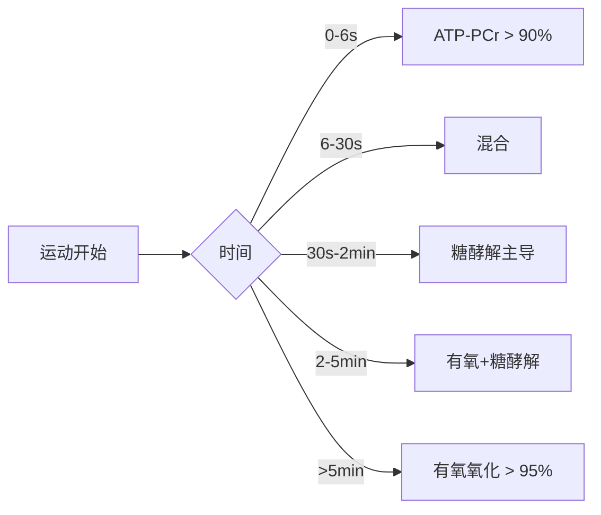

# 运动生理学（Sports Physiology）

## 概述

运动生理学（Exercise & Sports Physiology）是研究人体在急性运动刺激下各器官系统的即时反应（Acute Response）以及长期规律训练引起的慢性适应性改变（Chronic Adaptation）的学科。它是运动训练学、物理治疗、运动医学和运动营养学的共同基础理论支柱，为训练处方的科学化制定提供了生物学的理论依据。运动生理学的知识体系涵盖神经-肌肉控制、心血管与呼吸支持、能量代谢转换、内分泌调节以及基因-环境交互作用等层面。

## 三大供能系统

人体运动所需的直接能源是三磷酸腺苷（ATP）。骨骼肌中 ATP 的储存量极微（约 5–8 mmol/kg），仅够维持 1–2 秒最大收缩。持续运动依赖三条代谢通路不断再生 ATP。

### 1. 磷酸原系统（ATP-PCr System）

$$PCr + ADP + H^+ \xrightarrow{CK} ATP + Cr$$

ATP 生成速率最快（9–11 mmol/g/s），持续 0–10 秒。主导极限爆发力项目（举重、100m 跑、跳跃）。

### 2. 无氧糖酵解系统（Anaerobic Glycolysis）

$$Glucose + 2ADP + 2P_i \to 2Lactate^- + 2H^+ + 2ATP$$

速率 4–5 mmol/g/s，持续 10 s–2 min。H⁺ 积累使 pH 从 7.0 降至 6.4，抑制 PFK。主导 400m 跑、100m 游泳。

### 3. 有氧氧化系统（Oxidative System）

葡萄糖有氧氧化：
$$C_6H_{12}O_6 + 6O_2 \to 6CO_2 + 6H_2O + 36\text{–}38ATP$$

脂肪酸氧化（棕榈酸）：
$$C_{16}H_{32}O_2 + 23O_2 \to 16CO_2 + 16H_2O + 129ATP$$

速率最慢（1–2.5 mmol/g/s），但 ATP 产率最高。持续 > 2 min 至数小时。

### 供能交互主导

## 心血管系统

### 最大摄氧量（VO₂max）

VO₂max 是心肺耐力的金标准指标：

$$VO_{2max} = HR_{max} \times SV_{max} \times (a-vO_2差)_{max}$$

| VO₂max（mL/kg/min） | 男性 | 女性 |
|---------------------|------|------|
| 精英耐力运动员 | 70–85 | 60–75 |
| 良好运动员 | 55–65 | 48–58 |
| 经常锻炼者 | 45–55 | 38–48 |
| 久坐人群 | 30–38 | 25–33 |

VO₂max 遗传度约 50%，训练可提升 10–20%。

### 心率与训练分区

**最大心率**（Tanaka 公式）：
$$HR_{max} \approx 208 - 0.7 \times 年龄$$

**Karvonen 公式（心率储备法）**：
$$\text{目标 HR} = HR_{rest} + \%_{强度} \times (HR_{max} - HR_{rest})$$

**五区训练模型**：

| 分区 | %HRmax | RPE | 生理效应 |
|------|--------|-----|----------|
| Z1 有氧恢复 | 50–60% | 1–2 | 脂肪氧化 |
| Z2 基础耐力 | 60–70% | 3–4 | 线粒体密度↑ |
| Z3 节奏 | 70–80% | 5–6 | 乳酸清除↑ |
| Z4 阈值 | 80–90% | 7–8 | 乳酸阈值提升 |
| Z5 最大有氧 | 90–100% | 9–10 | VO₂max 提升 |

## 呼吸系统

运动时肺通气量从静息 5–8 L/min 增至 180–200 L/min。通气当量：
$$VE/VO_2 = \frac{\text{分钟通气量}}{\text{摄氧量}}$$

VE/VO₂ 最小值对应通气阈（VT1），是有氧强度常用指标。

## 肌肉系统

### 肌纤维类型

| 类型 | 收缩速度 | 有氧酶 | 糖酵解酶 | 疲劳抗性 |
|------|----------|--------|----------|----------|
| I 型（慢肌） | 慢 | 高 | 低 | 高 |
| IIa 型（快肌氧化） | 快 | 中高 | 中高 | 中 |
| IIx 型（快肌酵解） | 最快 | 低 | 高 | 低 |

**亨内曼尺寸原则**：运动单位募集遵循 I→IIa→IIx 顺序。

### 神经适应 vs 肌肉肥大

训练早期（2–4 周）力量增长主要来自神经适应（运动皮层兴奋↑、运动单位同步放电↑、拮抗肌抑制↓）。肌肥大在 4–8 周后成为显著贡献者。

## 内分泌系统

| 激素 | 运动反应 | 功能 |
|------|---------|------|
| 肾上腺素 | ↑ 3–18 倍 | 糖原分解、脂肪动员 |
| 去甲肾上腺素 | ↑ 2–6 倍 | 血管收缩调节 |
| 睾酮 | ↑ 20–50% | 蛋白质合成↑ |
| 皮质醇 | 与强度/时长正相关 | 分解代谢 |
| 生长激素 | 脉冲式 ↑ 10–20 倍 | 组织修复 |
| 胰岛素 | 运动中被抑制 | 葡萄糖转运 |
| IGF-1 | 运动后 12–24h ↑ | 合成代谢 |

## 长期训练适应

### 耐力适应

- 心脏离心性肥大 → SV↑ 15–25%
- 毛细血管密度↑ 20–40%
- 线粒体生物合成（PGC-1α）↑ 50–100%
- 有氧酶活性（CS、SDH）↑
- 血容量↑

### 力量适应

- 肌横截面积：I 型↑ 10–20%，II 型↑ 20–40%
- 肌腱刚度↑
- 神经驱动↑ 20–60%
- 发力速率（RFD）↑

## 特殊议题

### 女性运动员三联征（Female Athlete Triad）

能量可利用性不足 → 月经功能障碍 → 骨密度下降。RED-S（Relative Energy Deficiency in Sport）是核心驱动力。

### 儿童与青少年

青春期前有氧能力相对较高，无氧能力显著低于成人。

### 衰老

HRmax 每年递减 0.7 bpm，VO₂max 每十年下降 8–12%（久坐）至 3–5%（运动），肌少症 30 岁后每十年丧失 3–8% 肌量。

## 经典教材

- McArdle *Exercise Physiology*
- *ACSM's Guidelines*
- 《运动生理学》（王步标、邓树勋）
- Wilmore *Physiology of Sport and Exercise*

## 相关条目

- [[Supercompensation]]
- [[RecoveryMethods]]
- [[InjuryPrevention]]
- [[INDEX|SportsTraining 索引]]
- [[../../INDEX|TianshangKnowledgeBase 索引]]
