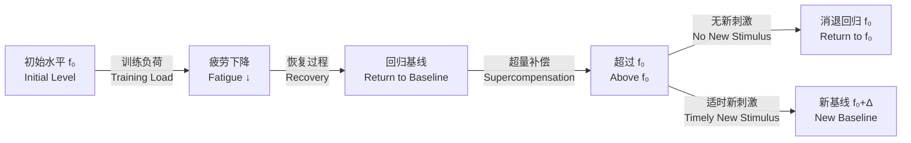

---
aliases:
  - Supercompensation
  - 超量恢复
  - 超量代偿
  - Overcompensation
  - Training Adaptation
  - 训练适应
tags:
created: 2026-05-17
updated: 2026-05-17
  - SportsScience
  - SportsTraining
  - ExercisePhysiology
---

# 超量恢复（Supercompensation）

超量恢复（Supercompensation），亦译作"超量代偿"，是运动生理学和训练学领域最经典的核心适应理论。该模型描述了机体在受到训练刺激后，不仅恢复到原有功能水平，还会在一段时间内超过基线水平的现象。合理利用这一"超量"窗口是实现训练适应性累积的生理基础。该理论由苏联运动科学家在 20 世纪 50–60 年代系统提出，后经 Matveyev 整合为经典周期化训练模型（Classical Periodization）的生理学支柱。超量恢复理论经历了从经验观察到数学模型验证的发展历程，至今仍是运动训练计划设计的基石。

## 经典四阶段模型

### 阶段一：负荷施加（Fatigue Phase）

训练刺激打破机体内稳态（Homeostasis），引发疲劳积累，功能水平短暂下降。疲劳的幅度与训练负荷的三要素直接相关：强度（Intensity）、容量（Volume）和密度（Density）。高负荷训练后，肌糖原可降低 40–60%，最大力量输出下降 10–30%，神经驱动效率显著降低。训练刺激的强度阈值决定了是否能够触发后续的超量恢复响应——低于阈值的训练量仅引起可逆的生理扰动而无法产生实质性适应。这一阈值通常被表述为最小有效剂量（Minimum Effective Dose），它因训练者的训练水平、年龄和遗传背景而异。

### 阶段二：恢复期（Recovery Phase）

运动结束即进入恢复期。主要事件包括：能量基质（磷酸肌酸 Phosphocreatine、肌糖原 Muscle Glycogen）逐步再合成；代谢产物（乳酸 Lactate、氢离子、氨）被清除；受损肌纤维启动修复程序；交感神经张力回归基线。恢复期持续时间取决于训练刺激量和营养支持条件。主动恢复（Active Recovery）相较于完全静息可加速乳酸清除率达 30–50%。恢复过程的速率可以用指数衰减模型近似描述：

$$F(t) = F_0 \cdot e^{-k_r \cdot t}$$

其中 $F_0$ 为训练结束时的疲劳水平，$k_r$ 为恢复速率常数，$t$ 为恢复时间。

### 阶段三：超量恢复期（Supercompensation Phase）

机体功能水平超过原有基线——这是运动适应的本质体现。超量恢复的幅度受以下因素影响：训练刺激的强度与特化性（专项性越强，超量恢复越明显）、个体的训练水平（高水平运动员幅度较小但更持久）、恢复支持条件（营养、睡眠、心理状态）。超量恢复的生理基础包括肌原纤维蛋白合成上调、线粒体生物发生（Mitochondrial Biogenesis）增加、酶活性提高和神经募集效率优化。这一阶段窗口的宽度从数小时到数天不等，取决于所训练的具体生理系统。

### 阶段四：消退期（Involution Phase）

若在超量恢复阶段未施加新的有效训练刺激，超量恢复效应逐渐消退，功能水平回归至训练前基线。消退速度与超量恢复幅度呈负相关——幅度越大、消退越慢。这一特性决定了训练频率规划的关键原则：应在超量恢复窗口内施加下一次刺激，而非等待完全消退后再开始。消退过程同样可以用指数函数描述，但其时间常数 $\tau_d$ 通常远大于 $\tau_r$：

$$A(t) = A_{\max} \cdot e^{-t / \tau_d}$$

## 超量恢复流程示意

## 不同生理系统的恢复时间

| 生理系统 | 恢复至基线 | 超量恢复峰值 | 完整消退 | 关键影响因素 |
|----------|-----------|-------------|----------|-------------|
| 磷酸原系统（ATP-PCr） | 2–3 分钟 | 3–5 分钟 | 约 6 小时 | 训练强度、肌酸储备 |
| 肌糖原（Muscle Glycogen） | 24–36 小时 | 24–48 小时 | 3–5 天 | 碳水化合物摄入时机与质量 |
| 肌肉收缩蛋白（Myofibrillar Protein） | 24–48 小时 | 48–72 小时 | 5–7 天 | 蛋白质摄入量与分布 |
| 神经肌肉功能（Neuromuscular Function） | 12–24 小时 | 24–48 小时 | 3–5 天 | 睡眠质量、中枢疲劳 |
| 结缔组织（Connective Tissue） | 48–72 小时 | 72–96 小时 | 7–10 天 | 胶原蛋白合成能力 |
| 有氧酶系统（Aerobic Enzymes） | 12–24 小时 | 24–48 小时 | 4–6 天 | 训练频率、膳食抗氧化剂 |
| 内分泌系统（Endocrine System） | 24–48 小时 | 48–72 小时 | 5–7 天 | 总训练压力、心理应激 |

## 数学模型

设 $f_0$ 为初始功能水平，$A(t)$ 为适应增益函数，$F(t)$ 为疲劳函数，则净功能水平为：

$$f(t) = f_0 + A(t) - F(t)$$

训练刺激施加后，疲劳积累与适应增益的动力学可以用以下微分方程组描述：

$$\frac{dF}{dt} = k_1 \cdot S - k_2 \cdot F$$

$$\frac{dA}{dt} = k_3 \cdot S - k_4 \cdot A$$

其中 $S$ 为训练刺激量，$k_1$ 为疲劳积累常数，$k_2$ 为疲劳衰减常数，$k_3$ 为适应增益常数，$k_4$ 为适应衰减常数。训练适应取决于疲劳衰减与适应增益之间的时间差匹配——当适应累积曲线 $A(t)$ 与疲劳消退曲线 $F(t)$ 之间的间距最大化时，即为最佳训练间隔：

$$\Delta_{\max} = \arg\max_t \left[ A(t) - F(t) \right]$$

该最优间隔可以通过求解 $\frac{d}{dt}\left[A(t) - F(t)\right] = 0$ 获得：

$$k_2 F_0 e^{-k_2 t} = k_4 A_0 e^{-k_4 t}$$

$$t_{\text{opt}} = \frac{\ln(k_2 F_0) - \ln(k_4 A_0)}{k_2 - k_4}$$

这一公式为训练计划中最佳训练间隔的估算提供了一种理论框架——尽管实际应用中需要根据个体差异进行调整。

## 现代修正与理论进展

### 残余疲劳（Residual Fatigue）

经典模型假设疲劳在训练结束后完全消退。现代训练学发现部分神经-内分泌层面的疲劳可持续数天甚至数周。有效训练刺激应当在残余疲劳尚未完全消除但适应增益已显著积累的时刻施加。残余疲劳模型将净功能状态修正为：

$$f(t) = f_0 + A(t) - F_{\text{急性}}(t) - F_{\text{残余}}(t)$$

其中 $F_{\text{残余}}(t)$ 以更慢的时间常数衰减。这一修正解释了为什么高水平运动员需要更长的恢复周期——他们的训练负荷诱导的残余疲劳积累更深。

### 多因素维度（Multidimensional Recovery）

恢复不是单一维度的线性过程，而是生化、神经、心理、结构等多个子系统的综合再平衡。不同子系统的时间常数差异使得超量恢复峰值更接近一个分布窗口（Recovery Window）而非精确的时间点。睡眠质量、营养摄入时机、心理压力水平均会显著影响实际窗口的大小和位置。研究者提出了多维恢复-适应模型（Multidimensional Recovery-Adaptation Model），将 $f(t)$ 推广为向量值函数：

$$\mathbf{f}(t) = [f_1(t), f_2(t), \ldots, f_n(t)]^T$$

每一维度 $f_i(t)$ 对应一个生理子系统的功能水平，整体竞技状态取决于各维度的加权组合。

### 适应残留与训练继承（Training Residuals）

长期训练者在停止训练后仍保留部分适应效果，称为适应残留（Training Residuals）。力量训练的残留时间最长可达 4 周，有氧耐力适应残留约 2–3 周，而神经适应残留约 1–2 周。这一机制解释了为什么经验丰富的运动员在短暂停训后能够较快恢复到原有水平。适应残留的数学表达为：

$$f_{\text{residual}} = f_0 + \Delta_0 \cdot e^{-t / \tau_{\text{res}}}$$

其中 $\Delta_0$ 为停训初始的超量幅度，$\tau_{\text{res}}$ 为残留时间常数。

## 不同周期化模型对超量恢复的运用

| 模型 | 核心策略 | 对超量恢复理论的运用 | 适运动员群体 |
|------|---------|---------------------|-------------|
| Matveyev 经典周期化 | 大周期-中周期-小周期逐级规划 | 严格依据超量恢复窗口安排负荷涨落节奏 | 新手至中级 |
| 区块周期化（Block Periodization） | 集中 2–4 周发展特定能力 | 利用不同生理系统超量恢复时间差进行连续区块叠加 | 高水平运动员 |
| 波浪周期化（Undulating Periodization） | 每日非线性波动负荷 | 避免精确识别窗口的困难，通过频繁变化载荷覆盖面 | 力量/爆发力项目 |
| 共轭序列周期化（Conjugate Sequence） | 同一微观周期混合多种训练刺激 | 利用不同能力的恢复窗口互补性减少干扰效应 | 高水平综合项目 |

## 训练实践应用

**训练频率决策**：大肌群力量训练的理想间隔为 48–72 小时；爆发力训练为 24–48 小时；有氧耐力的高量训练间隔为 24–48 小时。具体频率需根据个体对同一肌群的恢复能力调整——初学者可能需要更长的恢复间隔，而高水平运动员的恢复速度更快、窗口更窄。

**减量周（Deload Week）**：每 4–6 周安排一次减量周，训练量减少 40–60%，强度保持不变或轻微降低。减量的目的是在持续积累的疲劳基础上给予神经系统和内分泌系统一个"重置"窗口，使身体在下一个训练周期开始时处于超量恢复的高位。

**赛前减量（Tapering）**：比赛前 1–3 周渐进递减训练量，使多个生理系统同步达到超量恢复峰值。研究表明，合理的减量策略可提升 2–6% 的竞技表现。减量的三个变量为频率、容量和强度——通常优先降低容量而保持强度以维持神经适应性。最优减量曲线的公式近似为：

$$V(t) = V_0 \cdot \left(1 - \alpha \cdot \frac{t}{T}\right)$$

其中 $V_0$ 为常规训练量，$\alpha$ 为减量幅度（通常取 0.4–0.6），$T$ 为减量周期长度。

**个体差异因素**：年龄（年长者恢复更慢）、训练水平（高水平运动员幅度小但持久）、性别（女性在某些生理系统的恢复速度不同）、遗传因素（ACTN3 和 ACE 基因多态性影响恢复能力）以及营养状态和睡眠质量均显著影响超量恢复窗口的位置和宽度。

## 超量恢复的营养支持

| 营养素 | 作用机制 | 关键窗口 | 推荐摄入量 | 食物来源 |
|--------|---------|---------|-----------|---------|
| 蛋白质（Protein） | 肌纤维修复与合成 | 运动后 0–4 小时 | 0.25–0.4 g/kg 体重/餐 | 乳清蛋白、鸡蛋、瘦肉 |
| 碳水化合物（Carbohydrate） | 糖原再合成 | 运动后 0–2 小时 | 1.0–1.2 g/kg 体重/小时 | 米饭、面条、香蕉 |
| 肌酸（Creatine） | 磷酸原系统恢复加速 | 持续补充 | 3–5 g/日 | 红肉（少量）、补剂 |
| Omega-3 脂肪酸 | 抗炎、降低残余疲劳 | 每日膳食 | 1–2 g/日 | 鱼油、亚麻籽油 |
| 维生素 D | 骨骼肌修复、免疫功能 | 每日补充 | 800–2000 IU/日 | 阳光、鱼类、补剂 |
| 镁（Magnesium） | 神经肌肉放松、睡眠质量 | 睡前一小时 | 200–400 mg/日 | 深绿色蔬菜、坚果 |

## 常见误解与辨正

| 误解 | 正确理解 |
|------|----------|
| 超量恢复是"不劳而获"的被动过程 | 依赖充分的训练刺激——训练不足无法突破稳态阈值，训练过度则导致积累性疲劳超过适应 |
| 所有训练都会引发超量恢复 | 低强度或低量训练只引起生理扰动而无法触发实质性适应；需要达到最小有效刺激阈值 |
| 训练越多超量恢复越强 | 过度训练导致累积性疲劳大于适应增益，超量恢复窗口被压缩甚至消失——存在倒 U 形关系 |
| 超量恢复峰值是明确的时间点 | 它是一个时间窗口，宽度因系统而异——多种生理系统同步峰值的时刻才是最佳竞赛期 |
| 超量恢复只适用于生理层面 | 技能学习和认知训练同样遵循适应-恢复规律，神经可塑性也表现出类似的超量恢复特征 |
| 所有人群的超量恢复时间相同 | 个体差异性极大——受遗传、年龄、性别、训练状态、营养和睡眠等多重因素共同调节 |
| 超量恢复可以通过被动手段无限放大 | 即使最佳恢复条件也无法超越遗传上限——严格遵循收益递减规律 |

## 超量恢复与过度训练综合征

长期在不充分的恢复条件下重复高强度训练会导致过度训练综合征（Overtraining Syndrome, OTS）。其生理机制是超量恢复窗口被反复打断，疲劳积累持续超过适应积累，最终导致功能水平的持续性下降：

$$f(t) \approx f_0 - \int_{0}^{t} \left[F(\tau) - A(\tau)\right] d\tau$$

典型症状包括：持续疲劳感、竞技表现不可逆下降、情绪低落、睡眠障碍、免疫功能抑制和内分泌紊乱（皮质醇升高、睾酮下降）。预防 OTS 的关键在于系统性地监控恢复状态——包括主观疲劳评分（RPE, Rating of Perceived Exertion）、心率变异性（HRV, Heart Rate Variability）、血液生化标志物（肌酸激酶 CK、皮质醇、睾酮/皮质醇比）等指标的综合评估。

运动训练的本质是在"刺激-恢复-适应"的循环中渐进提升功能水平。超量恢复理论为理解这一过程提供了最简洁而有力的概念框架——训练不是破坏，而是有控制的扰动；恢复不是被动等待，而是主动管理的生理过程。

## 监控超量恢复的指标

| 指标类型 | 具体指标 | 正常范围 | 超量恢复窗口提示 |
|---------|---------|---------|----------------|
| 主观心理 | 训练准备度量表 | 1–10 分 | 准备度回升至 7+分 |
| 自主神经 | 心率变异性 HRV（rMSSD） | 个体基线 ±10% | HRV 高于基线 5–15% |
| 生化 | 肌酸激酶（CK） | 100–300 U/L | CK 降至 <200 U/L |
| 生化 | 睾酮/皮质醇比（T/C） | >0.35 | T/C 回升至基线水平 |
| 神经肌肉 | 垂直跳高度损失 | <5% | 跳跃高度恢复到基线的 98%+ |
| 神经肌肉 | 最大自主收缩力（MVC） | 个体基线 ±5% | MVC 恢复至基线的 100–105% |

## 不同训练类型的超量恢复特征

### 力量训练（Strength Training）

力量训练诱导的超量恢复以神经适应和肌原纤维蛋白合成为双重基础。高负荷低重复（5RM–8RM）力量训练后：神经适应（运动单位募集效率提升）在 8–24 小时内达到第一个峰值；肌纤维结构蛋白合成在 24–72 小时内达到峰值。因此，纯力量训练的最优频率通常是 48–72 小时间隔。

### 耐力训练（Endurance Training）

耐力训练的超量恢复主要涉及线粒体生物发生、毛细血管增生和氧化酶活性上调。关键适应窗口：线粒体蛋白合成在运动后 0–4 小时开始上升，24–48 小时达到峰值，约 3–5 天后完全消退。这意味着高质量耐力训练的理想间隔为 24–48 小时，而大负荷耐力训练可能需要 48–72 小时的恢复。

### 爆发力训练（Power Training）

爆发力训练以神经适应（神经冲动频率、运动单位同步化、高尔基腱器抑制解除）为核心。神经适应的超量恢复窗口较短——约 24–48 小时。在同一微观周期中，爆发力训练应安排在力量训练之前或者在力量训练后的恢复日进行，以利用神经系统的相对新鲜度。

### 技能训练（Skill Training）

运动技能学习的超量恢复同样遵循"练习-休息-巩固"的循环。睡眠在技能巩固中起关键作用——REM 睡眠阶段参与程序性记忆的整合。技能训练的超量恢复窗口约为 8–24 小时（视任务复杂程度而定），分散练习（Distributed Practice）优于集中练习（Massed Practice）的核心原因正是在于为每次练习后的神经巩固提供了完整的恢复窗口。

## 超量恢复的历史沿革

| 年代 | 学者/贡献 | 里程碑 |
|------|----------|--------|
| 1890s | Roux | 首次提出功能适应的概念，但尚未形成理论模型 |
| 1950s | 苏联运动科学界（Letyunov, Zimkin） | 系统提出超量恢复（Supercompensation）概念 |
| 1964 | Matveyev | 将超量恢复理论整合进经典周期化训练模型 |
| 1970s | Yakovlev | 建立超量恢复的酶学模型——验证了肌糖原的超量合成机制 |
| 1990s | Viru | 提出残余疲劳模型——修正了经典四阶段理论的简化假设 |
| 2000s | Zatsiorsky, Kraemer | 将超量恢复理论与训练分类学结合，发展出可操作化的训练处方框架 |

## 相关条目

- [[RecoveryMethods|恢复方法]]
- [[SportsPhysiology|运动生理学]]
- [[12_SportsScience/SportsMedicine/InjuryPrevention|运动损伤预防]]
- [[Periodization|周期化训练]]
- [[INDEX|SportsTraining 索引]]
- [[../../INDEX|TianshangKnowledgeBase 索引]]

