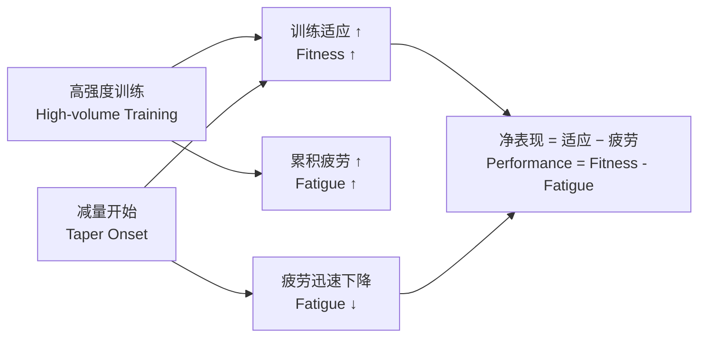
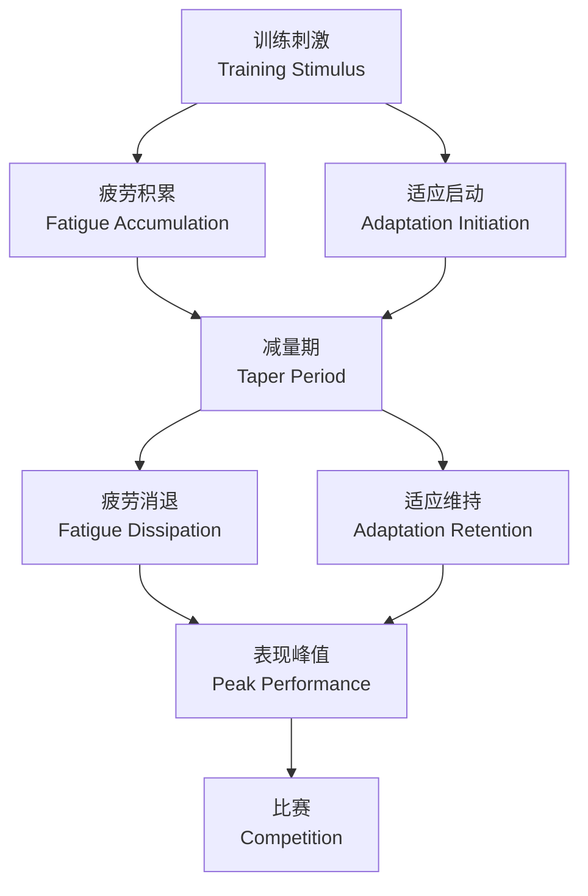

---
aliases: [Tapering, 减量训练, 赛前减量, Peaking]
tags: ['SportsScience', 'SportsTraining', 'Periodization', 'PerformanceOptimization']
created: 2026-05-17
updated: 2026-05-17
---

# 减量训练 (Tapering)

## 定义与概述

减量训练（Tapering）是指在重大比赛前
系统性地降低训练负荷（Training Load）。

目的是在消除累积性疲劳（Accumulated Fatigue）的同时，
维持甚至提升赛前运动表现。

减量训练的核心机制是让运动员
在保留训练适应（Training Adaptation）的基础上，
从高训练量导致的神经肌肉疲劳（Neuromuscular Fatigue）
和代谢疲劳（Metabolic Fatigue）中充分恢复。

减量期结束后出现的表现峰值称为竞技高峰（Peaking）。

从生理学角度，减量的本质是调节
"训练适应-累积疲劳"（Fitness-Fatigue）平衡，
使净表现（Net Performance）在比赛日达到最大值。

减量期间，训练量（Volume）通常降低 40–60%。
但训练频率（Frequency）应保持至少 80%。
训练强度（Intensity）应保持或稍有提升。

这一模式确保运动员不会因训练刺激不足而出现减适应（Detraining）。
研究表明，训练频率的维持对神经肌肉协调（Neuromuscular Coordination）的保持至关重要。

## 减量模式分类 (Tapering Modalities)

### 线性减量 (Linear Taper)

训练量以恒定速率每周递减。
适用于比赛日程可预测的项目（如马拉松）。
数学形式为 $V(t) = V_0 - kt$，其中 $k$ 为每周减少量。

### 逐步减量 (Step Taper)

训练量呈阶梯式下降——先骤降后再维持一段时间。
常用于游泳池训练的赛前减量。

### 指数减量 (Exponential Taper)

训练量按指数函数衰减，实证支持最为充分。
分为快降（Fast Decay）和慢降（Slow Decay）两种变体：

| 模式 | 数学形式 | 疲劳清除速度 | 最佳适用项目 |
|------|----------|-------------|-------------|
| 线性减量 | $V(t) = V_0 - kt$ | 中等 | 长跑、铁人三项（Endurance Events） |
| 逐步减量 | $V(t) = V_0 \cdot r^{\lfloor t/T \rfloor}$ | 快 | 游泳、划船、赛艇（Water Sports） |
| 快指数减量 | $V(t) = V_0 \cdot e^{-\lambda_1 t}$ | 最快 | 田径短跑、自行车冲刺（Power Events） |
| 慢指数减量 | $V(t) = V_0 \cdot e^{-\lambda_2 t}$ | 较快 | 中长跑、公路自行车（Mixed Events） |

其中 $V_0$ 为初始训练量，$\lambda$ 为衰减常数（通常取 0.15–0.35），$r$ 为阶梯衰减因子。

## 生理适应机制 (Physiological Adaptations)

减量期间发生的生理变化是多系统、多层次的，主要表现为以下五个方面：

| 生理指标 | 变化方向 | 变化幅度 | 时间窗口 |
|----------|---------|---------|---------|
| 红细胞质量（Red Cell Mass） | 增加 | 3–8% | 减量后 1–3 周 |
| 血容量（Blood Volume） | 增加 | 5–12% | 减量后 1–2 周 |
| 肌糖原储备（Muscle Glycogen） | 超量补偿 | 增加 20–40% | 减量后 5–10 天 |
| 皮质醇水平（Cortisol） | 下降 | 15–30% | 减量后 3–7 天 |
| 睾酮/皮质醇比（T/C Ratio） | 上升 | 20–50% | 减量后 7–14 天 |

1. **血液系统改善（Hematological Adaptations）**：
   红细胞质量（Red Cell Mass）和血红蛋白（Hemoglobin）浓度
   在减量后 1–3 周内显著提升，携氧能力增加，
   最大摄氧量（VO₂max）随之提升。

2. **肌肉糖原超量补偿（Muscle Glycogen Supercompensation）**：
   肌糖原储备可在减量期增加 20–40%，为比赛提供更充裕的碳水化合物能量底物。

3. **激素水平优化（Hormonal Optimization）**：
   皮质醇（Cortisol）下降，睾酮/皮质醇比上升，
   合成代谢状态（Anabolic State）增强，
   有利于肌肉修复和力量输出。

4. **神经系统恢复（Neural Recovery）**：
   运动单位募集效率（Motor Unit Recruitment）
   和神经传导速度（Nerve Conduction Velocity）改善，
   降低中枢疲劳（Central Fatigue）。

5. **主观感受提升（Psychological Well-being）**：
   POMS（Profile of Mood States）量表中的
   紧张（Tension）、疲劳（Fatigue）、
   困惑（Confusion）评分显著下降，
   活力（Vigor）评分上升。

## 表现增益幅度 (Performance Gains)

运动表现的增益通常在减量后 7–14 天达到峰值，幅度约 2–6%，具体比例依赖于项目特征、个体差异和减量方案的设计质量：

| 项目类型 | 平均表现增益 | 最佳减量时长 | 关键生理机制 |
|----------|-------------|-------------|-------------|
| 耐力项目（游泳、划船） | 3–6% | 14–21 天 | 血液携氧能力提升、糖原超量补偿 |
| 力量爆发项目（举重、短跑） | 2–4% | 7–10 天 | 神经肌肉恢复、激素水平优化 |
| 团体球类（足球、篮球） | 2–3% | 7–14 天 | 综合恢复、心理调节 |

## 超量补偿模型 (Supercompensation Model)

减量训练的理论基础是超量补偿（Supercompensation）
或疲劳-适应模型（Fitness-Fatigue Model）。

该模型由 Bannister 等人提出，
将运动表现表达为训练适应与累积疲劳的差值：

$$
P(t) = F(t) - F(t_0) \cdot e^{-(t-t_0)/\tau_f}
$$

其中 $P(t)$ 为 t 时刻的表现水平。
$F(t)$ 为训练适应函数（Training Adaptation Function）。
$\tau_f$ 为疲劳衰减时间常数（Fatigue Decay Time Constant）。

$F(t)$ 和 $\tau_f$ 均存在显著的个体差异。
这也是减量方案需要个体化的原因。

## 个体化减量设计原则 (Individualized Taper Design)

有效的减量方案应当遵循以下五项核心原则：

1. **个体化（Individualization）** —
   考虑运动员的训练历史（Training History）、
   基线疲劳水平（Baseline Fatigue）、
   恢复能力（Recovery Ability）和比赛项目特征。

2. **维持强度（Maintain Intensity）** —
   减量期不能降低训练强度，
   否则会触发快速减适应（Rapid Detraining），
   尤其是神经肌肉系统的适应。

3. **适当减量（Moderate Volume Reduction）** —
   40–60% 的减量幅度在大多数项目中效果最优，
   低于 30% 的减量效果不明显，
   超过 70% 则可能导致减适应。

4. **频率维持（Maintain Frequency）** —
   训练频率保持在不低于正常期的 80%，
   以维持神经肌肉协调（Neuromuscular Coordination）
   和技术熟练度（Skill Retention）。

5. **心理调节（Psychological Adjustment）** —
   减量期可能导致运动员产生焦虑
   或"减量疑病"（Taper Paranoia），
   需配合心理干预（Psychological Intervention）
   和正向自我对话（Positive Self-talk）。

## 减量失败与过度训练 (Taper Failure and Overtraining)

减量方案设计不当或执行不到位可能导致以下负面结果：

- **减量不足（Undertapering）** — 疲劳清除不充分，比赛时仍处于疲劳状态，表现无法达到预期。

- **减量过度（Overtapering）** — 训练量降得过多或减量时间过长，导致减适应（Detraining）和表现下降。

- **减量焦虑（Taper Anxiety）** — 训练量降低后运动员产生心理不适和怀疑情绪，影响睡眠质量（Sleep Quality）和恢复进程。

教练员和运动员应密切监测减量期间的主观疲劳感（RPE, Rating of Perceived Exertion）、
静息心率（Resting Heart Rate）、睡眠质量（Sleep Quality）和晨起体重（Morning Body Weight）等指标，
作为调整减量方案的参考依据。

---

## 相关条目 (Related Notes)

- [[Periodization|周期化训练]] — 年度训练计划的周期划分方法

- [[Supercompensation|超量补偿]] — 训练适应的生理学机制

- [[12_SportsScience/SportsMedicine/Overtraining|过度训练]] — 训练与恢复失衡的综合征

- [[PeakingForCompetition|赛前高峰]] — 竞技高峰的规划与实现

- [[FatigueManagement|疲劳管理]] — 运动性疲劳的监测与恢复策略

- [[RecoveryAndRegeneration|恢复与再生]] — 主动恢复和被动恢复方法

- [[INDEX|SportsTraining 索引]]

- [[../../INDEX|TianshangKnowledgeBase 索引]]

