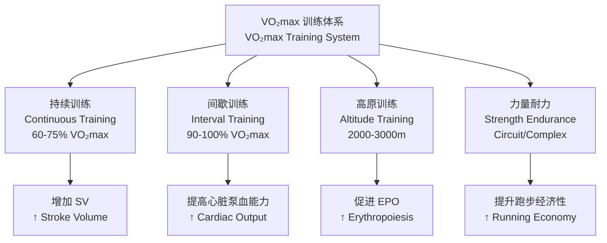

---
aliases: [最大摄氧量, VO2max, 有氧能力, 心肺耐力, Maximal Oxygen Uptake]
tags: [运动生理, 运动训练, 耐力运动, 运动医学, 体能测试, 心肺功能, 运动表现]
created: 2026-05-17
updated: 2026-05-17
---

# 最大摄氧量 (Maximal Oxygen Uptake, VO₂max)

## 概述 (Overview)

最大摄氧量（Maximal Oxygen Uptake, VO₂max）是指人体在**极限运动 (Maximal Exercise)** 状态下，**心血管系统 (Cardiovascular System)** 与**呼吸系统 (Respiratory System)** 向**工作肌 (Working Muscles)** 输送并利用氧气的最大能力，通常以**毫升/公斤/分钟 (mL·kg⁻¹·min⁻¹)** 表示，是评价**有氧耐力 (Aerobic Endurance)** 的**金标准 (Gold Standard)**。

$$
\dot{V}O_{2max} = Q_{max} \times (CaO_2 - CvO_2)_{max}
$$

Fick 公式（Fick Equation），其中：
- $Q_{max}$：最大心输出量（L/min）
- $CaO_2$：动脉血氧含量（mL O₂/L blood）
- $CvO_2$：混合静脉血氧含量（mL O₂/L blood）
- $(CaO_2 - CvO_2)_{max}$：最大动静脉氧差

## 决定因素 (Determinants)

### 中央因素 (Central Factors)

| 因素 (Factor) | 生理机制 (Mechanism) | 训练可塑性 (Trainability) |
|--------------|---------------------|--------------------------|
| 最大心输出量 ($Q_{max}$) | $Q = HR_{max} \times SV_{max}$ | 中（SV 可增 $20$–$40\%$） |
| 心率储备 (Heart Rate Reserve) | $HR_{max} \approx 220 - age$ | 低（遗传决定） |
| 每搏输出量 (Stroke Volume, SV) | 心室舒张末期容积↑，射血分数↑ | 高 |
| 血容量 (Blood Volume) | 血浆容量↑，红细胞总量↑ | 高 |
| 血红蛋白浓度 ([Hb]) | 携氧能力 | 中 |

最大心输出量：

$$
Q_{max} = HR_{max} \times SV_{max}
$$

训练有素耐力运动员：$HR_{max} \approx 180$–$200$ bpm，$SV_{max} \approx 170$–$220$ mL/beat，$Q_{max} \approx 30$–$40$ L/min。

### 外周因素 (Peripheral Factors)

| 因素 (Factor) | 机制 (Mechanism) | 训练可塑性 (Trainability) |
|--------------|-----------------|--------------------------|
| 肌纤维类型 (Muscle Fiber Type) | Ⅰ型（慢缩氧化）比例 | 低（遗传决定） |
| 线粒体密度 (Mitochondrial Density) | 氧化磷酸化能力 | 高（可增 $50$–$100\%$） |
| 毛细血管密度 (Capillary Density) | 氧扩散面积、交换时间 | 高（可增 $20$–$40\%$） |
| 肌红蛋白 (Myoglobin) | 肌内氧储备与转运 | 中 |
| 氧化酶活性 (Oxidative Enzymes) | SDH、COX 等活性 | 高 |

## 测量方法 (Measurement Methods)

### 直接测定法 (Direct Measurement)

**实验室递增负荷运动测试 (Graded Exercise Test, GXT)**：

| 设备 (Equipment) | 参数 (Parameters) | 标准 (Criteria) |
|-----------------|------------------|----------------|
| 跑台/功率车 | 速度/功率递增 | 每 $1$–$3$ min 增加 |
| 气体代谢分析仪 | 呼出气体 O₂、CO₂ | 逐次呼吸或混合室 |
| 心电图/心率带 | HR、ST 段 | 持续监测 |
| 血压计/指脉氧 | BP、SpO₂ | 安全监测 |

VO₂max 达成标准（≥2 项）：

1. 摄氧量平台（Plateau）：$\Delta \dot{V}O_2 < 150$ mL/min 负荷递增
2. 呼吸交换率（RER）：$RER \geq 1.10$
3. 心率：$HR \geq 90\% HR_{max}$ 或 $HR_{max}$ 平台
4. 血乳酸：$[La^-] \geq 8$ mmol/L
5. 主观疲劳度（RPE）：$\geq 18$（Borg 6–20 量表）

### 间接估测法 (Indirect Estimation)

| 测试 (Test) | 公式 (Equation) | 适用人群 (Population) | 误差 (Error) |
|------------|----------------|---------------------|-------------|
| Bruce 跑台 | $\dot{V}O_{2max} = 6.70 - 2.28 \times sex + 0.056 \times time$ | 成人通用 | $\pm 10$–$15\%$ |
| Åstrand-Ryhming | 功率车 + HR 推算 | 健康成人 | $\pm 10$–$20\%$ |
| Cooper 12min 跑 | $\dot{V}O_{2max} = (distance - 504.9) / 44.73$ | 健康成人 | $\pm 10\%$ |
| 1.5 英里跑 | $\dot{V}O_{2max} = 483 / time + 3.5$ | 军警体能 | $\pm 10\%$ |
| 20m 折返跑 (Léger) | 基于最后完成速度 | 儿童/青少年 | $\pm 10$–$15\%$ |

Bruce 协议跑台时间公式：

$$
\dot{V}O_{2max} \, (\text{mL·kg}^{-1}\text{·min}^{-1}) = 14.76 - (1.379 \times T) + (0.451 \times T^2) - (0.012 \times T^3)
$$

其中 $T$ 为 Bruce 协议持续分钟数。

## 参考值与分级 (Reference Values & Classification)

### 按年龄与性别分级 (Age- and Sex-Specific Norms)

| 等级 (Classification) | 男性 20–29 岁 | 男性 30–39 岁 | 女性 20–29 岁 | 女性 30–39 岁 |
|----------------------|--------------|--------------|--------------|--------------|
| 优秀 (Excellent) | ≥ 56 | ≥ 54 | ≥ 50 | ≥ 48 |
| 良好 (Good) | 50–55 | 48–53 | 44–49 | 42–47 |
| 高于平均 (Above Average) | 44–49 | 42–47 | 38–43 | 36–41 |
| 平均 (Average) | 38–43 | 36–41 | 32–37 | 30–35 |
| 低于平均 (Below Average) | 32–37 | 30–35 | 26–31 | 24–29 |
| 差 (Poor) | < 32 | < 30 | < 26 | < 24 |

### 精英运动员值 (Elite Athlete Values)

| 项目 (Sport) | 男性典型值 (Male, mL·kg⁻¹·min⁻¹) | 女性典型值 (Female, mL·kg⁻¹·min⁻¹) |
|-------------|--------------------------------|--------------------------------|
| 越野滑雪 (Cross-Country Skiing) | 80–94 | 65–78 |
| 自行车 (Cycling) | 75–90 | 60–75 |
| 长跑 (Distance Running) | 70–85 | 60–75 |
| 游泳 (Swimming) | 60–75 | 50–65 |
| 足球 (Soccer) | 55–70 | 45–60 |
| 力量项目 (Power Sports) | 40–55 | 35–50 |

## 训练提升 (Training Adaptations)

### 训练原则 (Training Principles)

### 经典间歇训练方案 (Classic Interval Protocols)

| 方案 (Protocol) | 工作/恢复比 | 强度 (%VO₂max) | 组数×次数 | 适用阶段 (Phase) |
|----------------|-----------|---------------|----------|----------------|
| Billat $4 \times 4$ | $4$ min / $3$ min | $90$–$95\%$ | $4$ 组 | 发展期 |
| $30/30$ | $30$ s / $30$ s | $100\%$ | $2$–$3$ 组×$10$–$15$ | 维持期 |
| $3$ min 间歇 | $3$ min / $3$ min | $95$–$100\%$ | $4$–$6$ 组 | 竞赛期 |
| 法特莱克 (Fartlek) | 变速自选 | 多变 | 持续 $30$–$60$ min | 基础期 |

### 训练适应的生理机制 (Physiological Adaptations)

| 适应 (Adaptation) | 时间进程 (Timeline) | 机制 (Mechanism) |
|------------------|-------------------|-----------------|
| 血浆容量增加 (Plasma Volume ↑) | $1$–$2$ 周 | 白蛋白合成↑、抗利尿激素调节 |
| 每搏输出量增加 (SV ↑) | $4$–$8$ 周 | 心室腔扩大、心肌收缩力↑ |
| 毛细血管密度增加 | $4$–$12$ 周 | 血管新生 (Angiogenesis) |
| 线粒体增生 (Mitochondrial Biogenesis) | $2$–$6$ 周 | PGC-1α 通路激活 |
| 氧化酶活性增加 | $2$–$8$ 周 | 蛋白合成、酶浓度↑ |
| 血红蛋白总量增加 | $4$–$12$ 周 | EPO 刺激红细胞生成 |

## 遗传与个体差异 (Genetics & Individual Differences)

### 遗传度 (Heritability)

VO₂max 遗传度：

$$
h^2 \approx 0.47 \text{–} 0.74
$$

即 $47$–$74\%$ 的 VO₂max 个体差异可归因于遗传因素。

### 训练反应性个体差异 (Individual Response Variability)

| 反应类型 (Responder Type) | 特征 (Characteristics) | 占比 (Prevalence) |
|--------------------------|----------------------|------------------|
| 高反应者 (High Responder) | VO₂max 增加 $> 15\%$ | ~15% |
| 正常反应者 (Normal Responder) | VO₂max 增加 $5$–$15\%$ | ~70% |
| 低反应者 (Low Responder) | VO₂max 增加 $< 5\%$ | ~15% |
| 无反应者 (Non-Responder) | VO₂max 无显著变化 | ~5% |

相关基因：

- **ACE**（血管紧张素转换酶）基因：I/D 多态性
- **ACTN3**（α-辅肌动蛋白-3）：R577X 多态性
- **PPARA**：脂肪酸氧化相关
- **EPOR**：促红细胞生成素受体

## 运动表现预测 (Performance Prediction)

### 耐力运动成绩预测 (Endurance Performance Prediction)

跑步成绩预测（基于 Daniels & Gilbert）：

$$
v = \frac{\dot{V}O_{2max}}{0.2989558 \cdot e^{-0.1932605t} + 0.1894393 \cdot e^{-0.012778t} + 0.8}
$$

其中 $v$ 为速度（m/min），$t$ 为持续时间（分钟）。

### 临界速度模型 (Critical Speed Model)

$$
D(t) = CS \cdot t + D'
$$

其中 $CS$ 为临界速度（Critical Speed），$D'$ 为无氧做功容量（Anaerobic Work Capacity）。

CS 与 VO₂max 关系：

$$
CS \approx 80\text{–}90\% \, v_{\dot{V}O_{2max}}
$$

## 临床应用 (Clinical Applications)

| 应用场景 (Application) | 意义 (Significance) | 临界值 (Cutoff) |
|----------------------|--------------------|----------------|
| 心血管风险评估 | 低 VO₂max = 高风险 | 男性 $< 35$，女性 $< 28$ |
| 术前评估 | 预测术后并发症 | $< 15$ mL·kg⁻¹·min⁻¹ 高风险 |
| 心肺康复 | 制定运动处方 | 基于 %VO₂max 或 %HRmax |
| 慢性病管理 | 糖尿病、高血压、肥胖 | 个体化目标 |
| 老年功能评估 | 预测跌倒、死亡率 | $< 18$ mL·kg⁻¹·min⁻¹ 功能受限 |

## 参考文献 (References)

1. Åstrand, P.-O., et al. (2003). *Textbook of Work Physiology* (4th ed.). Human Kinetics.
2. Bassett, D. R., & Howley, E. T. (2000). Limiting factors for maximum oxygen uptake. *Medicine & Science in Sports & Exercise*, 32(1), 70–84.
3. Joyner, M. J., & Coyle, E. F. (2008). Endurance exercise performance. *Journal of Physiology*, 586(1), 35–44.
4. Bouchard, C., et al. (2011). Genomic predictors of the maximal O₂ uptake response. *Journal of Applied Physiology*, 110(5), 1160–1170.
5. 邓树勋 等. (2015). 《运动生理学》. 高等教育出版社.

