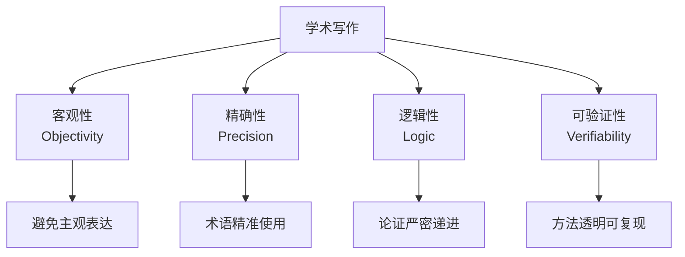
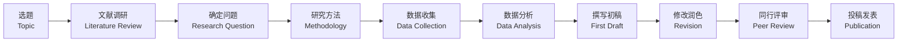

---
aliases: [AcademicWriting, 学术写作, 论文写作, 学术论文]
tags: ['13_Others', 'AcademicWriting', 'ResearchMethodology', 'ScholarlyCommunication']
created: 2026-05-17
updated: 2026-05-17
---

# 学术写作概论 Academic Writing Overview

> 学术写作（Academic Writing）是学者和研究者在学术界传播研究成果、交流学术思想的一种规范文体。其核心特征为客观性（Objectivity）、精确性（Precision）、逻辑性（Logic）和可验证性（Verifiability）。

## 学术写作的特征



| 特征 | 具体要求 | 常见误区 |
|:----:|:--------:|:--------:|
| 客观性 | 第三人称、非人称结构 | "I think"、"In my opinion" |
| 精确性 | 量化描述、避免模糊词 | "a lot of" → "significant proportion" |
| 逻辑性 | 因果链、递进关系清晰 | 跳跃式论证 |
| 正式性 | 避免口语、缩略词 | "don't" → "do not"、"kids" → "children" |
| 简洁性 | 表达精炼、避免冗余 | "due to the fact that" → "because" |

## 论文结构

### IMRaD 格式

这是自然科学和工程学中最常用的论文结构：

| 部分 | 功能 | 核心问题 | 篇幅比例 |
|:----:|:----:|:--------:|:--------:|
| Introduction | 背景与问题提出 | 为什么研究？ | 15–20% |
| Methods | 实验/研究设计 | 如何研究？ | 20–25% |
| Results | 数据呈现 | 发现了什么？ | 20–25% |
| Discussion | 结果解读与意义 | 意味着什么？ | 25–30% |
| Conclusion | 总结与展望 | 有何贡献？ | 5–10% |

### Introduction 的四步法

1. **建立领域背景**（Establish the field）：研究领域的重要性和现状
2. **指出研究空白**（Identify the gap）：前人工作中的不足或未解决问题
3. **提出研究问题**（State the research question）：论文要解决的具体问题
4. **概述研究方案**（Outline the approach）：简要说明方法和主要发现

## 学术风格

### 语言风格

**被动语态的使用**：

传统学术写作偏好被动语态以突出客观性：

$$
\text{"The experiment was conducted at 25°C."}
$$

现在越来越多的期刊接受主动语态：

$$
\text{"We conducted the experiment at 25°C."}
$$

**时态选择**：

| 内容 | 推荐时态 | 示例 |
|:----:|:--------:|:----:|
| 已知事实 | 一般现在时 | "Water boils at 100°C." |
| 本研究工作 | 一般过去时 | "We measured the temperature." |
| 结果呈现 | 一般现在时 | "Figure 3 shows a clear trend." |
| 文献引用 | 现在完成时/过去时 | "Smith et al. (2020) have shown..." |

### 学术词汇

**避免的词汇与替换建议**：

| 避免 | 推荐 |
|:----:|:----:|
| good / bad | beneficial / detrimental |
| big / small | substantial / negligible |
| prove | demonstrate / indicate / suggest |
| thing / stuff | factor / aspect / component |
| lots of | a significant number of |
| get | obtain / acquire / achieve |
| show | illustrate / demonstrate / reveal |

## 引文管理 Citation

### 主流引用格式

| 格式 | 适用学科 | 文中引用 | 参考文献示例 |
|:----:|:--------:|:--------:|:-----------:|
| APA 7th | 心理学、教育学、社会科学 | (Author, Year) | Author, A. (2020). *Title*. Publisher. |
| MLA 9th | 人文学科、语言文学 | (Author Page) | Author, A. *Title*. Publisher, 2020. |
| Chicago (Notes) | 历史学、艺术史 | 上标数字¹ | 1. Author, *Title* (Publisher, 2020), 45. |
| IEEE | 工程学、计算机 | [1] | [1] A. Author, *Title*, Publisher, 2020. |
| Vancouver | 医学、生物科学 | (1) | 1. Author A. Title. Publisher; 2020. |

### 引用原则

- **避免抄袭（Plagiarism）**：任何直接引用或改写都必须注明来源
- **优先引用一手文献（Primary Sources）**
- **引用范围要适当**：支持论点即可，不必过度引用
- **注意引用时效性**：优先近 5–10 年的文献

## 论证方法 Argumentation

### 论证结构

```
前提 1（Premise 1）： 所有 A 都是 B
前提 2（Premise 2）： 这是一个 A
结论（Conclusion）：  因此这是 B
```

### 论证类型

| 类型 | 定义 | 示例 |
|:----:|:----:|:----:|
| 演绎推理（Deduction） | 从一般到特殊 | 所有金属导电 → 铁是金属 → 铁导电 |
| 归纳推理（Induction） | 从特殊到一般 | 实验 1–100 次均支持 → 理论成立 |
| 溯因推理（Abduction） | 从结果到最佳解释 | 观察到 X → 最能解释 X 的假设是 Y |

### 常见的逻辑谬误

| 谬误 | 描述 | 示例 |
|:----:|:----:|:----:|
| 稻草人（Straw Man） | 曲解对方观点 | "你支持 A"（回应 B 而非 A） |
| 虚假因果（Post Hoc） | 将相关当因果 | "A 之后 B → A 导致 B" |
| 循环论证（Circular） | 结论隐含在前提 | "这是真的因为这是事实" |
| 以偏概全（Hasty Generalization） | 样本太小 | "三个人都同意 → 所有人都同意" |

## 写作流程



### 写作工具

| 工具类型 | 推荐工具 | 特点 |
|:--------:|:--------:|:----:|
| 文字处理 | Microsoft Word, LaTeX | 通用 vs 专业排版 |
| 参考文献管理 | Zotero, Mendeley, EndNote | 自动生成引用 |
| 语法检查 | Grammarly, ProWritingAid | 语言润色 |
| 协作平台 | Overleaf, Google Docs | 多人协同 |
| AI 辅助 | ChatGPT, Claude | 思路整理、润色（需注意伦理） |

### 时间管理

学术写作的典型时间分配：

| 阶段 | 建议时间占比 | 注意事项 |
|:----:|:-----------:|:--------:|
| 前期准备 | 30% | 文献调研、提纲设计 |
| 初稿撰写 | 25% | 先完成再完美 |
| 修改完善 | 30% | 结构、逻辑、语言三轮修改 |
| 格式与投稿 | 15% | 格式调整、撰写 Cover Letter |

## 学术发表 Publication

### 投稿流程

1. **选择目标期刊**：影响因子、读者群、审稿周期
2. **格式调整**：严格遵循期刊 Author Guidelines
3. **撰写 Cover Letter**：强调论文的创新性和重要性
4. **同行评审（Peer Review）**：应对审稿人意见
5. **修改与重投**：被拒（Reject）、大修（Major Revision）、小修（Minor Revision）、接收（Accept）

### 审稿标准

| 评价维度 | 审稿人关注点 |
|:--------:|:-----------:|
| 创新性（Novelty） | 是否提供了新的知识 |
| 方法论（Methodology） | 方法是否正确、严谨 |
| 结果（Results） | 数据是否支持结论 |
| 写作（Writing） | 表达是否清晰、逻辑是否连贯 |
| 文献（References） | 引用是否全面、准确 |

## 相关条目

- [[00_KnowledgeFramework/Methodology/Methodology|Methodology]]
- [[LiteratureReview]]
- [[APAFormat]]
- [[00_KnowledgeFramework/AcademicPapers/IMRaD|IMRaD]]
- [[00_KnowledgeFramework/NoteTaking/NoteTaking|NoteTaking]]
- [[ResearchEthics]]
- [[ScientificWriting]]
- [[ThesisWriting]]


