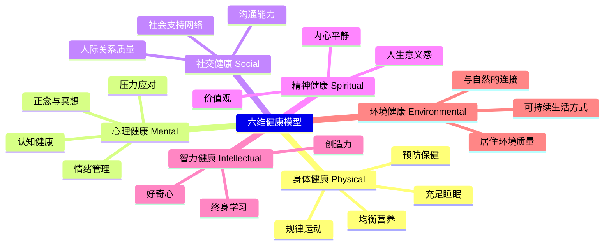

---
aliases: [健康与养生]
tags: ['Health', 'Wellness', 'Lifestyle', 'PreventiveMedicine']
---

# 健康与养生

健康与养生（Health and Wellness）是关于维持和提升身心健康的知识体系与实践方法。现代健康观念已从"不生病"的狭义定义扩展到涵盖身体、心理、社交、精神等多维度的整体健康（Holistic Health）。

## 健康的六维模型

## 营养与饮食

### 均衡营养原则

$$ \text{健康膳食} = \text{碳水化合物 45-65%} + \text{蛋白质 10-35%} + \text{脂肪 20-35%} + \text{膳食纤维 + 维生素 + 矿物质 + 水} $$

### 中国居民膳食指南核心建议

1. **食物多样，谷类为主**：每天摄入 12 种以上食物，每周 25 种以上
2. **吃动平衡，健康体重**：每周至少进行 5 天中等强度运动
3. **多吃蔬果、奶类、大豆**：每天蔬菜 300-500g，水果 200-350g
4. **适量吃鱼、禽、蛋、瘦肉**：每周鱼 280-525g，畜禽肉 280-525g
5. **少盐少油，控糖限酒**：盐 < 5g/天，油 25-30g/天
6. **杜绝浪费，兴新食尚**：按需备餐，分餐制

## 运动与健康

### 推荐运动量（WHO / ACSM 指南）

$$ \text{成年人: 每周 150-300 分钟中等强度有氧运动, 或 75-150 分钟高强度有氧运动} $$

### 运动类型与益处

| 运动类型 | 频率 | 主要益处 |
|---------|------|---------|
| 有氧运动（快走/跑步/游泳/骑行） | 每周 3-5 次 | 改善心肺功能、控制体重 |
| 力量训练（哑铃、器械、自重） | 每周 2-3 次 | 增加肌肉量、提高基础代谢 |
| 柔韧性训练（拉伸、瑜伽） | 每天/隔天 | 维持关节活动度、减少运动损伤 |
| 平衡训练（太极、单腿站立） | 每周 2-3 次（尤其老年人） | 预防跌倒 |

## 睡眠健康

### 各年龄段的推荐睡眠时长

$$ \text{青少年（14-17岁）: 8-10 小时} $$
$$ \text{成年人（18-64岁）: 7-9 小时} $$
$$ \text{老年人（65+）: 7-8 小时} $$

### 改善睡眠的实践策略

1. **规律作息**：固定就寝和起床时间（包括周末）
2. **环境优化**：卧室黑暗、安静、温度 18-22°C
3. **睡前 1 小时**：远离电子屏幕（蓝光抑制褪黑素分泌）
4. **避免在睡前进食、咖啡因和酒精**

## 中医养生理念

$$ \text{阴阳平衡: 阴平阳秘，精神乃治} $$
$$ \text{顺应四时: 春生夏长，秋收冬藏} $$
$$ \text{药食同源: 食物不仅是营养，也是调理} $$

### 四季养生要点

| 季节 | 应养脏腑 | 推荐活动 | 饮食原则 |
|------|---------|---------|---------|
| 春季 | 养肝 | 散步、踏青、舒展运动 | 少酸多甘，绿色蔬菜 |
| 夏季 | 养心 | 游泳、静坐、午休 | 清热解暑，多食苦味 |
| 秋季 | 养肺 | 慢跑、深呼吸、润肺 | 滋阴润燥，白色食物 |
| 冬季 | 养肾 | 室内温和运动、早睡 | 温补食材，黑色食物 |

## 心理健康

### 压力管理

$$ \text{压力} = \frac{\text{外部要求}}{\text{感知的应对能力}} $$

减压策略：
1. **正念冥想（Mindfulness）**：每天 10-20 分钟，专注于呼吸和当下
2. **4-7-8 呼吸法**：吸气 4 秒 → 屏气 7 秒 → 呼气 8 秒
3. **自然接触**：每周户外时间不少于 2 小时
4. **社交连接**：维持亲密的家庭和社交关系
5. **感恩练习**：每天写下 3 件感恩的事

### 常见心理问题的识别

| 问题 | 核心症状 | 建议措施 |
|------|---------|---------|
| 焦虑（Anxiety） | 过度担心、紧张、坐立不安、失眠 | 呼吸训练、心理咨询、必要时药物 |
| 抑郁（Depression） | 持续低落、兴趣丧失、精力不足 | 运动、社交、心理咨询、药物 |
| 倦怠（Burnout） | 情绪耗竭、工作疏离、效能降低 | 调整工作节奏、寻求支持、休息 |
| 睡眠障碍 | 入睡困难/早醒/睡眠质量差 | 睡眠卫生措施、认知行为疗法 |

## 体检与预防保健

### 基础体检项目（成年人每年）

- **血液检查**：血常规、血糖、血脂、肝肾功能
- **生命体征**：血压、心率、BMI
- **癌症筛查**：根据年龄和风险因素选择
- **视力/听力检查**：每 1-2 年一次
- **口腔检查**：每年洁牙一次

### 疫苗推荐

- 流感疫苗：每年一次（特别是老年人、儿童、慢性病患者）
- 肺炎疫苗：65 岁以上或高危人群
- HPV 疫苗：9-45 岁女性及 9-26 岁男性
- 带状疱疹疫苗：50 岁以上人群

## 相关条目

- [[09_MedicineAndHealth/Physiotherapy|Physiotherapy]]
- [[12_SportsScience/IntervalTraining|IntervalTraining]]
- [[12_SportsScience/GaitAnalysis|GaitAnalysis]]
- [[张三]]
- [[INDEX|当前目录索引]]

