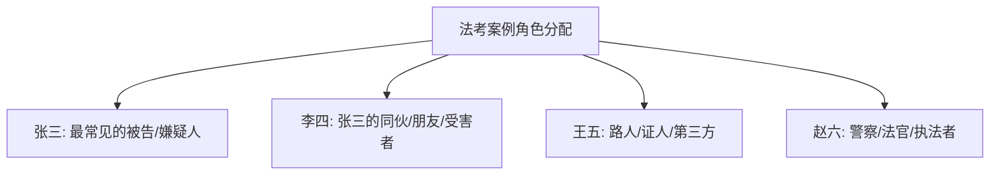

# 张三

"张三"是中国社会中最常用的虚构人名（Generic Name / Placeholder Name），类似于英语中的"John Doe"或"Jane Doe"。在法律文书、教育案例、媒体和日常对话中，张三被广泛用作泛指"某个人"的代称。

## 张三的文化地位

张三不仅是一个名字，更是一个文化符号。它承载了中国社会某些独特的法律文化、教育传统和网络幽默。

## 在法律语境中的角色

### 法律拟制人（Legal Fiction）

在中国法律文书和法学案例教学中，张三是最常见的当事人代称：

$$ \text{"张三犯盗窃罪，判处有期徒刑三年……"} $$

与张三并列的还有李四、王五、赵六——共同构成中国法律界的"四大金刚"（最常用的案例当事人）。

### 在法律教材中的角色弹性

张三的形象高度多变：
- 可以是谋杀案的被告人
- 也可以是合同纠纷的守约方
- 可以是交通事故的肇事者
- 也可以是民事侵权中的受害人

这种角色弹性使张三成为法律教育中的"万能当事人"——任何案件事实都可以放在张三身上。

## 在考试与教育中的应用

### 司法考试中的张三

在被称为"天下第一考"的国家统一法律职业资格考试（法考）中：

每个案例题几乎必定有张三出场，考生笑言："张三不在这个案子里，就在下个案子里。"

### 与罗翔老师的"法外狂徒张三"

中国政法大学罗翔教授在 B 站等平台讲授刑法时，创造了这一经典互联网形象：

$$ \text{张三} \xrightarrow{\text{罗翔}} \text{"法外狂徒张三"} $$

罗翔版本的张三是一个犯遍刑法罪名的"超级罪犯"：
- 犯过刑法中几乎每一种罪
- 既是杀人犯也是正当防卫者
- 有时候是人，有时候在物权法中是一条"张三的狗"
- 永远不死，永远在犯新罪

### "法外狂徒"的传播学意义

$$ \text{严肃法律知识} \times \text{幽默叙事} + \text{互联网传播} = \text{知识破圈} $$

"法外狂徒张三"走红说明：
1. 法律知识大众化具有巨大需求
2. 幽默化叙事是严肃内容传播的有效策略
3. 互联网时代的知识传播需要人格化的载体

## 张三的语言学意义

### 不定代词功能

张三在汉语中承担了"不定代词"（Indefinite Pronoun）的功能：

$$ \text{张三} \approx \text{某人 / 某个人} $$

### 跨文化对比

| 语言/文化 | 通用代称 | 来源 |
|---------|---------|------|
| 中文 | 张三 / 李四 | 虚构姓氏+数字排列 |
| 英语 | John Doe / Jane Doe | 法律传统（13 世纪始） |
| 日语 | 太郎（Taro）/ 花子（Hanako） | 常用虚构姓名 |
| 韩语 | 洪吉童（홍길동） | 古典小说《洪吉童传》 |
| 西班牙语 | Fulano / Mengano | 阿拉伯语起源 |

## 张三现象的社会心理

张三这一文化现象映射了中国社会的几个特点：

1. **集体主义下的个体符号**——在强调集体的文化中，张三作为"无差别的个体"被符号化
2. **法律的普遍适用性**——张三可以是任何人，任何人都可能是张三，这体现了法律面前人人平等的理念
3. **中国的黑色幽默传统**——用张三消解严肃话题的紧张感

## "四大金刚"的完整谱系

| 名字 | 典型角色 | 特征 |
|------|---------|------|
| 张三 | 主犯/原告/债务人 | 最常见的主角 |
| 李四 | 从犯/被告/债务人 | 张三的伙伴或对手 |
| 王五 | 证人/第三方/担保人 | 提供证据或协助 |
| 赵六 | 执法者/法官/权威 | 代表国家权力 |

## 张三在网络时代的衍生

- **张三的狗**：罗翔案例中著名的"物权法梗"
- **张三的身份证**：关于"人可以死，身份证不能过期"的幽默
- **张三宇宙**：网友创作的张三串联各个法律学科的"法学宇宙"
- **张三表情包**：遍布法律学习群的网络迷因（Meme）

## 张三的教育价值

张三在法学教育中的价值不可低估：

1. **降低认知门槛**：一个"活生生"的名字比"被告人"更易记忆
2. **增强记忆点**：荒诞的案例情节更容易留下深刻印象
3. **构建知识框架**：所有案例共享同一主角，便于形成知识体系
4. **激发学习兴趣**：幽默的案例使枯燥的法条变得生动

## 相关条目

- [[健康与养生]]
- [[INDEX|当前目录索引]]
