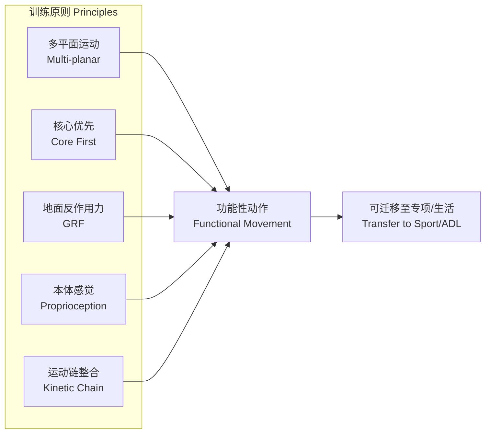
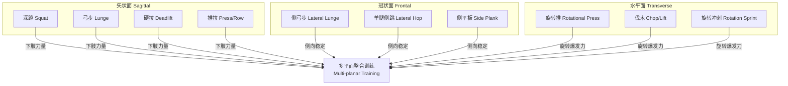

---
aliases: [FunctionalTraining, 功能性训练, FunctionalFitness, 功能性健身]
tags: ['13_Others', 'PhysicalEducation', 'Fitness', 'FunctionalTraining', 'SportPerformance']
created: 2026-05-17
updated: 2026-05-17
---

# 功能性训练 (Functional Training)

> 功能性训练是一种以运动专项和日常生活动作为导向的训练体系，强调多平面、多关节、本体感觉与核心稳定的整合，而非孤立的单关节肌肉训练。

## 核心理念 (Core Philosophy)

### 定义与起源
功能性训练（Functional Training）起源于物理治疗与运动康复领域，后被广泛引入竞技体育与大众健身。其核心理念是：**训练应具有可迁移性**（Transferability）——即训练效果应能直接改善运动表现或日常功能。

### 训练原则
- **多平面运动** (Multi-planar Movement) —— 矢状面、冠状面、水平面三平面整合
- **核心优先** (Core First) —— 近端稳定才能实现远端高效发力
- **地面反作用力** (Ground Reaction Force) —— 强调力从地面传导至发力部位
- **本体感觉与神经肌肉控制** (Proprioception & Neuromuscular Control)
- **运动链整合** (Kinetic Chain Integration) —— 下肢→核心→上肢的动力传递



---

## 功能性解剖与生物力学 (Functional Anatomy & Biomechanics)

### 核心稳定系统

| 系统 | 肌肉 | 功能 |
|------|------|------|
| 局部稳定系统 (Local Stabilizers) | 多裂肌 (Multifidus)、腹横肌 (Transversus Abdominis) | 节段性稳定、姿势控制 |
| 整体稳定系统 (Global Stabilizers) | 腹内/外斜肌 (Obliques)、竖脊肌 (Erector Spinae) | 抗旋转、抗侧屈 |
| 运动系统 (Movement System) | 背阔肌 (Latissimus Dorsi)、臀大肌 (Gluteus Maximus) | 产生力量与动作 |

### 运动链 (Kinetic Chain)

下肢发力遵循**后侧链优先**（Posterior Chain Dominance）原理：

$$
F_{ground} \rightarrow \text{踝 plantarflexion} \rightarrow \text{膝 extension} \rightarrow \text{髋 extension} \rightarrow \text{核心稳定} \rightarrow \text{肩传递} \rightarrow \text{手释放}
$$

功能性训练的目标是优化这一链条中的**能量传递效率**，减少能量泄漏（Energy Leak）。

---

## 功能性动作评估 (Functional Movement Assessment)

### FMS (Functional Movement Screen)

功能性动作筛查（FMS）是评估基础动作模式质量的工具，包含 7 项测试：

| 测试项目 | 评估维度 | 最低标准 |
|---------|---------|---------|
| 深蹲 (Deep Squat) | 下肢灵活性与核心稳定 | 臀部低于膝盖 |
| 跨栏步 (Hurdle Step) | 单腿稳定与髋关节活动度 | 躯干保持正直 |
| 直线弓步 (In-line Lunge) | 分腿姿态稳定性 | 后膝触前脚跟 |
| 肩部活动度 (Shoulder Mobility) | 肩关节复合体灵活性 | 双手距离<1.5 掌长 |
| 主动直腿抬高 (Active Straight Leg Raise) | 腘绳肌柔韧性 | 踝超过髂前上棘 |
| 躯干稳定俯卧撑 (Trunk Stability Push-up) | 核心前侧稳定 | 男：拇指同额；女：拇指同下颌 |
| 旋转稳定 (Rotary Stability) | 多平面稳定 | 同侧肢体抬举完成 |

### 功能动作分级

- **3 分**：完成动作无代偿
- **2 分**：完成动作有代偿但符合标准
- **1 分**：无法完成动作
- **0 分**：动作过程中出现疼痛

阈值：总分 < 14 分（满分 21 分）提示损伤风险显著升高。

---

## 训练方法学 (Training Methodology)

### 训练平面与动作分类



### 核心训练进阶 (Core Training Progression)

| 阶段 | 类型 | 示例动作 | 目标 |
|------|------|---------|------|
| 1 | 抗伸展 (Anti-extension) | 平板支撑、健腹轮 | 前侧核心稳定 |
| 2 | 抗侧屈 (Anti-lateral Flexion) | 侧平板、单侧农夫行走 | 冠状面稳定 |
| 3 | 抗旋转 (Anti-rotation) | Pallof 推、静态旋转对抗 | 水平面稳定 |
| 4 | 旋转发力 (Rotational Power) | 药球旋转投掷、砍树 | 爆发力输出 |

### 单侧训练 (Unilateral Training)

单侧训练是功能性训练的核心组成部分：

- **解决左右不对称** (Limb Asymmetry Correction)
- **核心激活更强** —— 单侧负重迫使核心抗侧屈
- **更贴近运动实际** —— 跑步、变向、踢腿均为单侧发力
- **常见动作**：保加利亚分腿蹲 (Bulgarian Split Squat)、单腿 RDL、单臂划船

---

## 专项运动的功能性训练 (Sport-Specific Functional Training)

### 足球 (Soccer/Football)
- 变向减速训练 (Cutting & Deceleration)
- 单腿落地稳定 (Single-leg Landing Stabilization)
- 敏捷性梯与锥桶训练

### 篮球 (Basketball)
- 垂直爆发力训练（深蹲跳、跳深）
- 多方向反应训练 (Multi-directional Reaction)
- 对抗条件下核心稳定训练

### 跑步 (Running)
- 单腿支撑稳定性
- 髋关节灵活性（屈髋、伸髋）
- 摆臂与躯干旋转协调性

### 健身/大众健康 (General Fitness / Health)
- 地面起立能力训练 (Floor-to-Stand)
- 搬物模式训练 (Lifting Mechanics)
- 平衡与防跌倒训练（老年人）

---

## 训练计划设计 (Program Design)

### 周期化模型

| 周期 | 时长 | 重点 | 动作选择 |
|------|------|------|---------|
| 基础稳定期 | 4-6 周 | 动作质量、核心稳定 | FMS 纠正练习、等长支撑 |
| 力量发展期 | 4-8 周 | 肌力与肌肥大 | 单侧负重、复合动作 |
| 爆发力期 | 3-5 周 | 发力速率 | 奥林匹克举变式、增强式训练 |
| 专项转化期 | 2-4 周 | 代谢适应、专项模拟 | 间歇训练、运动模式整合 |

### 训练变量调控

- **频率**：每周 2-4 次
- **强度**：RPE 6-9（Borg CR-10 量表）
- **组数**：3-5 组
- **休息**：力量训练 60-90s，爆发力训练 2-3min
- **动作速度**：向心快速（Explosive Concentric），离心控制（Controlled Eccentric）

---

## 常见误区 (Common Misconceptions)

1. **"功能性训练 = 不稳定平面训练"** —— BOSU 球、TRX 仅是工具之一，并非必需
2. **"不需要大重量"** —— 功能性训练同样需要渐进超负荷（Progressive Overload）
3. **"只适合运动员"** —— 对普通人群的日常生活功能同样有效
4. **"取代传统力量训练"** —— 二者应为互补关系，而非替代关系

---

## 功能性训练评估工具 (Assessment Tools)

### 功能动作筛查 (FMS)
- 用于识别基础动作模式中的代偿与不对称
- 总分 21 分，低于 14 分提示损伤风险显著升高
- 纠正顺序：灵活性 → 稳定性 → 动作模式 → 力量

### Y-Balance Test (YBT)
- 上肢 YBT：评估肩关节稳定性与活动度
- 下肢 YBT：评估单腿平衡与核心控制
- 双侧差异 > 4cm 提示损伤风险增加

### 跳跃测试 (Jump Testing)
- **CMJ** (Countermovement Jump)：评估下肢弹性能力
- **DJ** (Drop Jump)：评估反应力量与落地机制
- **单腿跳远** (Single-leg Hop for Distance)：评估左右对称性

### 运动控制测试
- **深蹲评估**：评估髋膝踝联动与核心稳定
- **单腿下蹲**：评估骨盆控制与膝关节动态稳定
- **俯卧撑评估**：评估肩胛骨稳定与核心前侧链

---

## 功能性训练与康复的衔接 (Fitness-Rehab Continuum)

训练与康复应视为连续谱系，而非割裂的独立阶段：

```
急性期康复 → 恢复期康复 → 功能性训练 → 专项力量 → 运动表现
  (保护)      (控制)      (重建模式)   (发展力量)    (转化)
```

- 康复末期融入功能性训练可显著降低再损伤率
- 要点：疼痛可控、动作质量达标后方可进阶
- 沟通协作：物理治疗师与体能教练之间建立反馈闭环

---

## 训练设备与工具 (Training Equipment)

| 工具 | 主要用途 | 功能性训练适配性 |
|------|---------|----------------|
| 壶铃 (Kettlebell) | 摆动、抓举、土耳其起立 | ★★★★★ —— 核心与爆发力 |
| 药球 (Medicine Ball) | 旋转投掷、爆发力训练 | ★★★★★ —— 三平面运动 |
| TRX / 吊索 | 核心稳定、上肢拉力 | ★★★★ —— 不稳定平面过载 |
| BOSU 球 | 平衡与本体感觉 | ★★★ —— 不能过度依赖 |
| 阻力带 (Resistance Band) | 侧向行走、激活训练 | ★★★★ —— 变阻力特性 |
| 六角杠铃 (Trap Bar) | 硬拉、农夫行走 | ★★★★★ —— 减少腰椎剪切力 |
| 沙袋 (Sandbag) | 不稳定负重搬运 | ★★★★ —— 重心不断变化 |
| 敏捷梯 (Agility Ladder) | 步伐与协调训练 | ★★★★ —— 神经肌肉效率 |

---

### 相关条目
- [[INDEX|Fitness 索引]]
- [[../../../12_SportsScience/SportsMedicine/SportsMedicine|运动医学]]
- [[../../../09_MedicineAndHealth/RehabilitationMedicine/RehabilitationMedicine|康复医学]]
- [[../../../02_NaturalSciences/Biology/Anatomy/Anatomy|人体解剖学]]
- [[../../../12_SportsScience/SportsScience|运动科学]]
- [[../../INDEX|TianshangKnowledgeBase 索引]]

