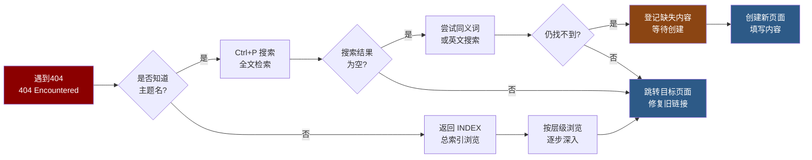

# 404 — 页面未找到 (Page Not Found)

> 你访问的页面在当前知识库中不存在。可能是链接指向了尚未创建的内容，或路径存在拼写错误。请使用以下方法定位目标内容。

## 一、可能原因 (Possible Causes)

| 原因 | 详细说明 | 解决方案 |
|------|----------|----------|
| 尚未创建 (Uncreated) | 链接指向计划中但未完成的内容节点 | 参考 [[INDEX\|总索引]] 查看已有条目，或在新标签页创建该页面 |
| 路径错误 (Path Error) | 文件名拼写或大小写不匹配（Obsidian 区分大小写） | 检查链接中的相对路径与实际文件名是否完全一致 |
| 移动/重命名 (Moved/Renamed) | 页面被移动位置或重命名但旧链接未更新 | 使用搜索工具（Ctrl+P）查找相关主题关键词 |
| 层级变更 (Restructured) | 目录结构重组导致路径失效 | 确认文件所在的最新目录路径，更新链接 |
| 特殊字符问题 (Special Characters) | 文件名含空格或中文字符编码问题 | 使用 Obsidian 的自动补全功能重新插入链接 |

## 二、知识库结构总览 (Knowledge Base Structure)

```mermaid
graph TD
  A["INDEX<br/>总索引"] --> B["01 K12<br/>基础教育"]
  A --> C["02 NaturalSciences<br/>自然科学"]
  A --> D["03 Humanities & Social Sci<br/>人文社会科学"]
  A --> E["04 Engineering & Tech<br/>工程与技术"]
  A --> F["05 Computer Science<br/>计算机科学"]
  A --> G["06 Medicine & Health<br/>医学与健康"]
  A --> H["07 Interdisciplinary Sciences<br/>交叉科学"]
  A --> I["08 Military Sciences<br/>军事科学"]
  A --> J["09 Management Sciences<br/>管理科学"]
  A --> K["10 Arts & Humanities<br/>艺术人文学科"]
  A --> L["11 Cross-Disciplinary K12<br/>跨学科基础教育"]
  B --> M["Mathematics<br/>数学"]
  B --> N["Chinese Language<br/>语文"]
  B --> O["English Language<br/>英语"]
  C --> P["Physics<br/>物理学"]
  C --> Q["Chemistry<br/>化学"]
  C --> R["Biology<br/>生物学"]
  C --> S["Earth Sciences<br/>地球科学"]
  E --> T["Mechanics & Materials<br/>力学与材料"]
  E --> U["Surveying & Mapping<br/>测绘科学与技术"]
  F --> V["Artificial Intelligence<br/>人工智能"]
  F --> W["Software Engineering<br/>软件工程"]
  F --> X["Data Science<br/>数据科学"]
  H --> Y["Cognitive Science<br/>认知科学"]
  H --> Z["Quantum Info Science<br/>量子信息科学"]
  H --> AA["Materials Informatics<br/>材料信息学"]
  H --> AB["Network Science<br/>网络科学"]
  H --> AC["Regional Studies<br/>区域与国别研究"]
  H --> AD["Systems Science<br/>系统科学"]
  P --> AE["Thermodynamics<br/>热力学"]
  P --> AF["Quantum Mechanics<br/>量子力学"]
  P --> AG["Electromagnetism<br/>电磁学"]
  style A fill:#2d5a87,color:#fff
  style C fill:#3a7bd5,color:#fff
  style F fill:#3a7bd5,color:#fff
  style H fill:#3a7bd5,color:#fff
  style P fill:#8b4513,color:#fff
```



## 三、导航帮助 (Navigation Help)

| 目的地 | 链接 | 说明 |
|-------|------|------|
| 总索引页 | [[INDEX\|返回总索引]] | 知识库所有顶级分类入口（10 大领域） |
| 关于本库 | [[README\|关于 TianshangKnowledgeBase]] | 知识库目标、使用方法和命名规范 |
| 所有标签 | 见侧边栏 Tags 面板 | 按标签过滤所有相关条目 |
| 搜索建议 | — | 使用全文搜索 (Ctrl+K / Cmd+K) 查找内容 |
| 最近修改 | — | 使用 Obsidian 的 Backlinks 面板查看最近修改 |
| 图谱视图 | — | 打开全局图谱 (Graph View) 探索关联条目 |
| 反馈记录 | — | 在页面下方记录缺失内容以便后续补充 |

## 四、缺失内容登记 (Missing Content Log)

如果你是通过内部 Wiki 链接 (Wiki-Link) 来到此页，请在下方记录缺失内容以便知识库维护者后续补充：

| 条目名称 | 发现日期 | 期望所属目录 | 期望主题说明 |
|----------|----------|--------------|--------------|
| (示例) 熵的统计解释 | 2026-05-17 | 02_NaturalSciences/Physics/Thermodynamics | 玻尔兹曼熵公式 |
| — | — | — | — |
| — | — | — | — |

**登记模板**：

```markdown
- **条目名称**：[待补充页面的标题]
- **发现日期**：[YYYY-MM-DD]
- **期望路径**：[期望所在的目录层级]
- **备注**：[补充说明或关键词]
```

## 五、常见搜索技巧 (Search Tips)

### 5.1 关键词组合搜索

| 搜索目标 | 关键词示例 | 说明 |
|----------|------------|------|
| 查找特定概念 | `熵 热力学 统计` | 使用主概念 + 所属领域 + 细化关键词 |
| 查找特定模型 | `Transformer 注意力 机制` | 模型名 + 核心机制 + 应用方向 |
| 查找特定公式 | `薛定谔 方程 量子` | 公式名称 + 所属领域 |
| 查找引用关系 | `-[[]]` 反向链接 | 在 Obsidian 中使用反链面板 |

### 5.2 高级搜索技巧

1. **标签过滤 (Tag Filtering)**：利用 frontmatter 中的 tags 字段过滤相关内容。例如搜索 `#QuantumComputing` 可找到所有量子计算相关条目
2. **目录浏览 (Directory Browsing)**：从 [[INDEX]] 出发按层级浏览，常能发现意外的关联内容
3. **反向链接面板 (Backlinks Panel)**：在 Obsidian 右侧打开 Backlinks 面板，查看当前页面的所有引用来源
4. **图谱视图 (Graph View)**：使用全局图谱或局部图谱可视化探索知识关联路径

### 5.3 目录结构导航法



## 六、常见缺失页面补救方法

### 6.1 检查别名 (Aliases)

页面 frontmatter 中的 aliases 字段可能存在替代名称。尝试搜索以下别名模式：

- 中英文混写变体（如 "机器学习" vs "Machine Learning"）
- 缩写形式（如 "AI" vs "Artificial Intelligence"）
- 简繁体差异

### 6.2 检查链接格式

Obsidian Wiki 链接的常见格式问题：

| 正例 | 反例 |
|------|------|
| `[[MyPage]]` | `[[MyPage\|显示名]]` 路径不对 |
| `[[Dir/Page]]` | `[[dir/page]]` 大小写不匹配 |
| `[[Dir/Page\|别名]]` | `[[Dir//Page]]` 多余路径分隔符 |
| `[[Dir/Page\|Alias]]` | `[[Dir/Page \| Alias]]` 多余空格 |

### 6.3 使用 Obsidian 的命令面板

按 `Ctrl+P`（Windows）或 `Cmd+P`（Mac）打开命令面板，输入关键词搜索所有已存在的文件，从搜索结果中直接跳转。

## 七、知识库维护建议 (Maintenance Tips)

| 建议 | 优先级 | 频次 |
|------|--------|------|
| 定期使用 `Unlinked files` 插件查找孤立文件 | 中 | 每月 |
| 使用 WikiLinks 插件检测断裂链接 | 高 | 每次编辑后 |
| 在修改文件路径后全局搜索旧链接并更新 | 高 | 重命名/移动时 |
| 为新页面添加完整的前置元数据（tags, aliases） | 高 | 创建新页面时 |
| 使用 MOC（Map of Content）页面管理重要主题 | 中 | 按需 |

### 7.1 使用 Dataview 插件自动检测断裂链接

在 Obsidian 中安装 Dataview 插件后，可使用以下查询检测断裂链接：

```dataview
TABLE file.link AS "源页面", outlinks AS "失效链接"
FROM ""
WHERE any(outlinks, (l) => !contains(meta(l).path, "/"))
  AND !contains(file.name, "INDEX")
  AND !contains(file.name, "404")
SORT file.name ASC
```

### 7.2 路径命名规范参考

| 目录层级 | 命名规则 | 示例 |
|----------|----------|------|
| 顶级分类 | 两位数字 + 英文名 | `02_NaturalSciences` |
| 子领域 | PascalCase 英文 | `QuantumMechanics` |
| 具体条目 | 有意义的英文/中文混合 | `DeepLearning` / `大地测量` |
| 索引页 | 全部大写 `INDEX` | `INDEX` |

## 九、页面创建模板

当你需要为缺失的链接创建新页面时，建议使用以下 frontmatter 模板：

```markdown
---
aliases: [别名1, 别名2]
tags: ['CategoryTag1', 'CategoryTag2', 'TopicTag']
created: {{date}}
---

# 页面标题

## 概述

简要描述页面的核心内容与定位。

---

## 正文

...
```

## 十、常见错误代码与排查指南

| 错误表现 | 可能原因 | 快速排查方法 |
|----------|----------|--------------|
| 链接不渲染 | 文件名含空格 | 检查路径中空格是否用 `%20` 或引号包裹 |
| 图片不显示 | 相对路径错误 | 确认图片存在并检查 `![[path]]` 格式 |
| 标签不生效 | 前值元数据格式错误 | 确认 tags 在 frontmatter 中（`---` 间） |
| 嵌入失败 | 循环嵌入或文件过大 | 使用 `![[page]]` 而非反复嵌套 |
| 公式不渲染 | LaTeX 语法错误 | 检查 `$...$` 或 `$$...$$` 是否匹配 |

## 相关条目 (Related Entries)

- [[INDEX\|TianshangKnowledgeBase 索引]]
- [[README]]
- [[02_NaturalSciences/Physics/Thermodynamics/INDEX\|热力学索引]]
- [[05_ComputerScience/ArtificialIntelligence/INDEX\|人工智能索引]]
- [[07_InterdisciplinarySciences/INDEX\|交叉科学索引]]
