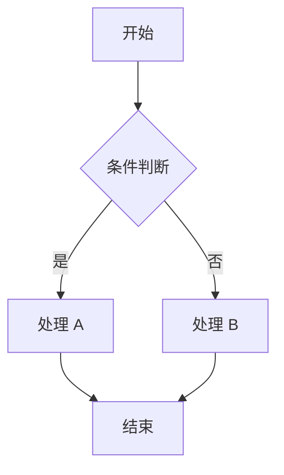
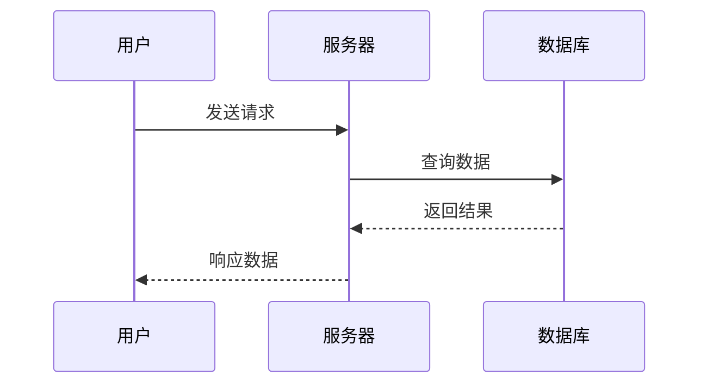
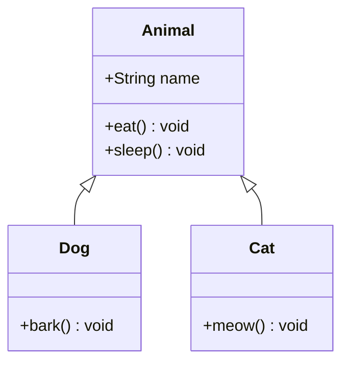

# 格式规范参考

> 本文档演示 TianshangKnowledgeBase 中使用的 Markdown 格式规范。
> 参考来源：Obsidian 官方文档 (https://help.obsidian.md)、CommonMark 规范及知识库维护约定。

## 一、YAML Frontmatter

每个 `.md` 文件必须以 `---` 包裹的 YAML frontmatter 开头：

```yaml
---
aliases: [文件名, 别名1, 别名2]
tags: ['分类1', '分类2', '具体标签']
created: 2026-05-19
updated: 2026-05-19
---
```

- `aliases` — 该文件的别名列表，Obsidian 可通过别名链接到此文件
- `tags` — 分类标签，用于 Dataview 查询和图谱过滤
- `created` / `updated` — 日期元数据，格式 `YYYY-MM-DD`

## 二、标题层级

标题使用 `#` 标记，一级标题对应文件名。层级递进不得跳级：

```markdown
# 一级标题（对应文件名）
## 二级标题（主要章节）
### 三级标题（子章节）
#### 四级标题（小节）
##### 五级标题
###### 六级标题
```

## 三、文本格式

```markdown
**粗体**   *斜体*   ~~删除线~~   ==高亮==   `行内代码`
H~2~O      X^2^     <u>下划线</u>
```

**粗体**   *斜体*   ~~删除线~~   ==高亮==   `行内代码`

上标和下标：H~2~O  X^2^

## 四、列表

### 无序列表

```markdown
- 条目一
  - 嵌套条目
    - 更深嵌套
- 条目二
```

### 有序列表

```markdown
1. 第一步
2. 第二步
   1. 子步骤 A
   2. 子步骤 B
```

### 任务列表

```markdown
- [x] 已完成任务
- [ ] 未完成任务
- [ ] 待办事项
```

## 五、LaTeX 数学公式

### 行内公式

使用单个美元符号包裹：`$E = mc^2$`

渲染效果：$E = mc^2$

### 块级公式

使用双美元符号包裹，**前后必须空行**以确保正确渲染：

$$
\iint_{\partial V} \mathbf{E} \cdot d\mathbf{A} = \frac{Q_{\text{enc}}}{\varepsilon_0}
$$

多行公式使用 `\begin{aligned}`：

$$
\begin{aligned}
\nabla \cdot \mathbf{E} &= \frac{\rho}{\varepsilon_0} \\
\nabla \cdot \mathbf{B} &= 0 \\
\nabla \times \mathbf{E} &= -\frac{\partial \mathbf{B}}{\partial t} \\
\nabla \times \mathbf{B} &= \mu_0 \mathbf{J} + \mu_0 \varepsilon_0 \frac{\partial \mathbf{E}}{\partial t}
\end{aligned}
$$

矩阵公式：

$$
\mathbf{H} = \begin{pmatrix}
H_{xx} & H_{xy} \\
H_{yx} & H_{yy}
\end{pmatrix}, \quad
\det(\mathbf{H} - \lambda \mathbf{I}) = 0
$$

## 六、表格

**前后必须空行**以确保 Obsidian 正确渲染表格：

| 语法元素 | 标记方式 | 说明 |
|:--------|:--------:|-----|
| 粗体 | `**text**` | 使用双星号包裹 |
| 斜体 | `*text*` | 使用单星号包裹 |
| 行内代码 | `` `code` `` | 使用反引号包裹 |
| LaTeX 公式 | `$...$` | 行内用单美元，块级用双美元 |
| 表格对齐 | `:---` / `:--:` / `---:` | 左对齐 / 居中 / 右对齐 |

表格内支持嵌套格式，但不支持列表和代码块：

| 学科 | 公式 | 描述 |
|:----|:----|:-----|
| 物理学 | $\Delta S \geq 0$ | 热力学第二定律 |
| 数学 | $e^{i\pi} + 1 = 0$ | 欧拉恒等式 |
| 统计学 | $\sigma = \sqrt{\frac{1}{N}\sum(x_i - \mu)^2}$ | 标准差 |

## 七、Mermaid 流程图

使用 fenced code block 包裹，语言标记为 `mermaid`：

### 流程图 (Flowchart)



### 时序图 (Sequence Diagram)



### 类图 (Class Diagram)



## 八、代码块

使用 fenced code block 包裹，指定语言以启用语法高亮：

```python
def fibonacci(n: int) -> int:
    """使用动态规划计算斐波那契数列第 n 项。"""
    if n <= 1:
        return n
    dp = [0] * (n + 1)
    dp[1] = 1
    for i in range(2, n + 1):
        dp[i] = dp[i - 1] + dp[i - 2]
    return dp[n]
```

```rust
fn quicksort<T: Ord>(arr: &mut [T]) {
    if arr.len() <= 1 {
        return;
    }
    let pivot = partition(arr);
    quicksort(&mut arr[..pivot]);
    quicksort(&mut arr[pivot + 1..]);
}
```

## 九、引用与 Callout

### 块引用

使用 `>` 前缀：

> 学而时习之，不亦说乎。
> 有朋自远方来，不亦乐乎。
>
> — 《论语·学而》

### Callout（Obsidian 特有）

Callout 是带标题和图标的高亮块，格式为 `> [!类型]`：

> [!note] 笔记类型 Callout
> 用于一般性的补充说明和注释。

> [!warning] 警告
> 提醒注意潜在问题或常见误区。

> [!tip] 提示
> 提供实用技巧或最佳实践。

> [!important] 重要
> 强调关键信息，不容忽视。

> [!caution] 注意
> 指出需要谨慎处理的环节。

## 十、分割线

使用三个或以上连字符（**前后空行**）：

---

## 十一、内部链接 (Wiki-link)

Obsidian 使用 `[[ ]]` 实现双向链接：

```markdown
[[FileName]]               — 链接到同目录下文件
[[Dir/Subdir/FileName]]    — 路径形式链接
[[FileName|显示名称]]       — 自定义显示名
[[FileName#章节]]          — 链接到文件内标题锚点
[[FileName#^block-id]]     — 链接到块引用
```

示例：[[INDEX]]、[[INDEX|返回总索引]]、[[10_MilitarySciences/MilitaryStrategy/StrategicTheory]]

## 十二、嵌入

使用 `![[ ]]` 嵌入其他文件或图片：

```markdown
![[Image.png]]                     — 嵌入图片
![[FileName]]                      — 嵌入文件内容
![[FileName#^block-id]]            — 嵌入特定块
```

## 十三、注释

使用 `%%` 包裹的内容仅在编辑模式下可见：

```markdown
%% 这是注释，预览模式下不可见 %%
```

## 十四、脚注

```markdown
这是一个带脚注的句子[^1]。

[^1]: 这是脚注的内容，位于文件末尾。
```

## 十五、空格与换行

- 标点符号后建议加空格
- 中英文之间建议加空格
- 列表、表格、代码块、块级公式前后**必须空行**
- 段落之间使用空行分隔
- 行尾两个空格表示强制换行（软换行）

## 十六、文件命名规范

- 英文文件名使用 **UpperCamelCase**（如 `MachineLearning.md`）
- 中文文件名使用中文（如 `摄影技法与后期.md`）
- 目录名与文件名风格一致
- 特殊文件名：`INDEX.md`、`README.md`、`LearningPath.md`

规范示例：

```
✅ SortingAlgorithms.md
✅ 摄影技法与后期.md
✅ INDEX.md
❌ sorting-algorithms.md
❌ sorting_algorithms.md
❌ 排序算法.md（英文目录下）
```

## 参考资料

- Obsidian Help: https://help.obsidian.md
- CommonMark Spec: https://spec.commonmark.org
- Mermaid Documentation: https://mermaid.js.org
- LaTeX Math: https://en.wikibooks.org/wiki/LaTeX/Mathematics

[^1]: 脚注示例——在预览模式下将鼠标悬浮于此处以查看。
